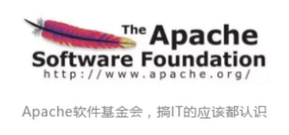
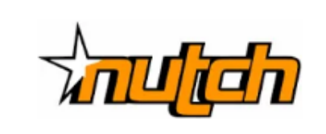
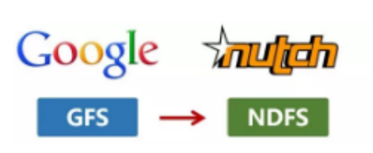
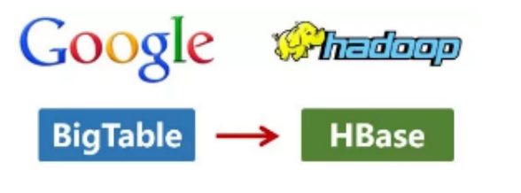
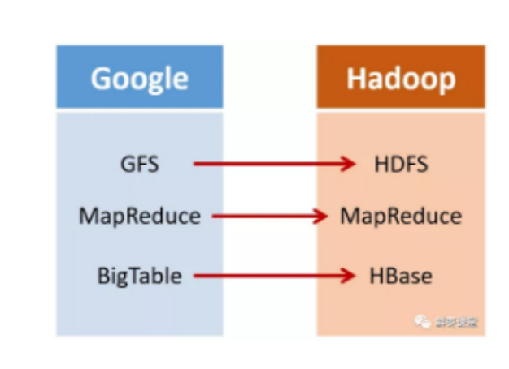
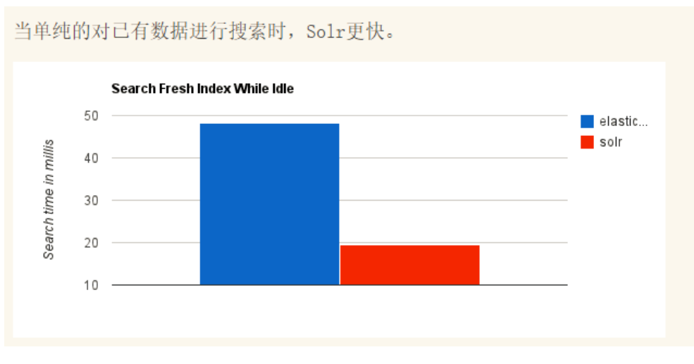
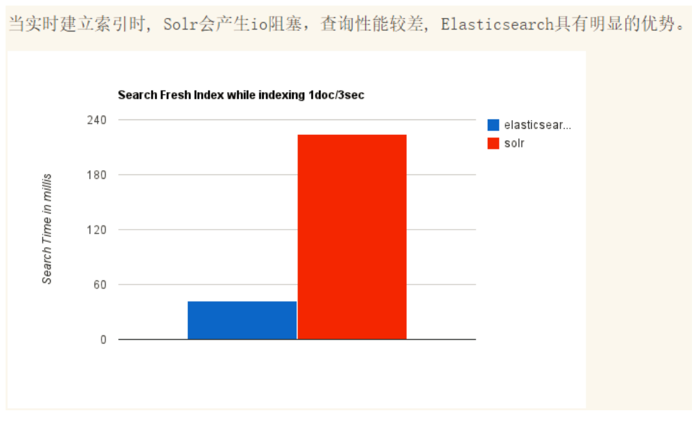
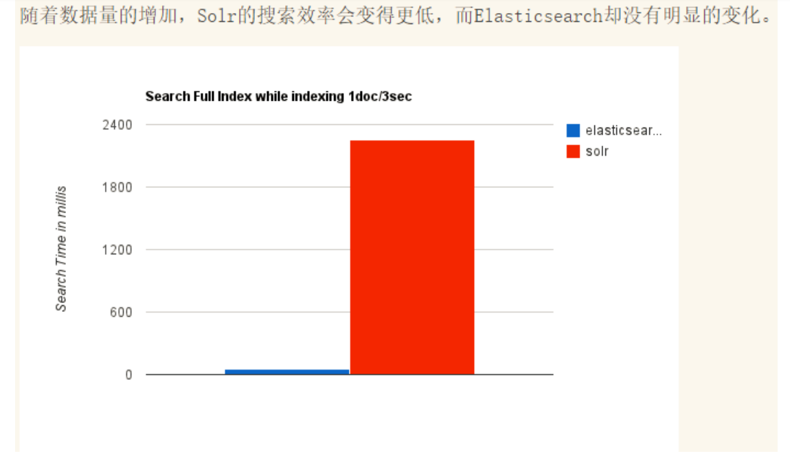

笔记来源于遇见狂神说：https://www.bilibili.com/video/BV17a4y1x7zq

#### 我们要学习什么呢？：

SQL ： like %狂神说%，如果是的大数据，就十分慢！索引！

ElasticSearch：搜索！（百度、github、淘宝电商！）

1、聊一个人

2、货比三家

3、安装

4、生态圈

5、分词器 ik

6、RestFul操作 ES

7、CRUD

8、SpringBoot 集成 ElasticSearch （从原理分析！）

9、爬虫爬取数据！

10、实战，模拟全文检索！

以后你只要，需要用到搜索，就可以使用ES！（大数据量的情况下使用！）

#### 聊聊Doug Cutting

1998年9月4日，Google公司在美国硅谷成立。正如大家所知，它是一家做搜索引擎起家的公司。

无独有偶，一位名叫**Doug Cutting**的美国工程师，也迷上了搜索引擎。他做了一个用于文本搜索的函

数库（姑且理解为软件的功能组件），命名为**Lucene**。

Lucene是用JAVA写成的，目标是为各种中小型应用软件加入全文检索功能。因为好用而且开源（代码公

开），非常受程序员们的欢迎。

早期的时候，这个项目被发布在Doug Cutting的个人网站和SourceForge（一个开源软件网站）。后

来，2001年底，Lucene成为**Apache软件基金会**jakarta项目的一个子项目。

2004年，Doug Cutting再接再励，在Lucene的基础上，和Apache开源伙伴Mike Cafarella合作，开发

了一款可以代替当时的主流搜索的开源搜索引擎，命名为**Nutch**。

Nutch是一个建立在Lucene核心之上的网页搜索应用程序，可以下载下来直接使用。它在Lucene的基础

上加了网络爬虫和一些网页相关的功能，目的就是从一个简单的站内检索推广到全球网络的搜索上，就

像Google一样。

Nutch在业界的影响力比Lucene更大。

大批网站采用了Nutch平台，大大降低了技术门槛，使低成本的普通计算机取代高价的Web服务器成为

可能。甚至有一段时间，在硅谷有了一股用Nutch低成本创业的潮流。（大数据！）

随着时间的推移，无论是Google还是Nutch，都面临搜索对象“体积”不断增大的问题。

尤其是Google，作为互联网搜索引擎，需要存储大量的网页，并不断优化自己的搜索算法，提升搜索效

率。

在这个过程中，Google确实找到了不少好办法，并且无私地分享了出来。

大数据就两个问题：存储 + 计算！

2003年，Google发表了一篇技术学术论文，公开介绍了自己的谷歌文件系统**GFS**（Google File

System）。这是Google公司为了**存储海量搜索数据**而设计的专用文件系统。

第二年，也就是2004年，Doug Cutting基于Google的GFS论文，实现了**分布式文件存储系统**，并将它

命名为**NDFS（Nutch Distributed File System）**。

还是2004年，Google又发表了一篇技术学术论文，介绍自己的**MapReduce编程模型**。这个编程模型，

用于大规模数据集（大于1TB）的并行分析运算。

第二年（2005年），Doug Cutting又基于MapReduce，在Nutch搜索引擎实现了该功能。

2006年，当时依然很厉害的**Yahoo（雅虎）公司**，招安了Doug Cutting。

加盟Yahoo之后，Doug Cutting将NDFS和MapReduce进行了升级改造，并重新命名为

**Hadoop**（NDFS也改名为HDFS，Hadoop Distributed File System）。

这个，就是后来大名鼎鼎的大数据框架系统——Hadoop的由来。而Doug Cutting，则被人们称为

**Hadoop之父**。

Hadoop这个名字，实际上是Doug Cutting他儿子的黄色玩具大象的名字。所以，Hadoop的Logo，就

是一只奔跑的黄色大象。

我们继续往下说。

还是2006年，Google又发论文了。

这次，它们介绍了自己的**BigTable**。这是一种分布式数据存储系统，一种用来处理海量数据的非关系型

数据库。

Doug Cutting当然没有放过，在自己的hadoop系统里面，引入了BigTable，并命名为**HBase**。

好吧，反正就是紧跟Google时代步伐，你出什么，我学什么。

所以，Hadoop的核心部分，基本上都有Google的影子。

2008年1月，Hadoop成功上位，正式成为Apache基金会的顶级项目。

同年2月，Yahoo宣布建成了一个拥有1万个内核的Hadoop集群，并将自己的搜索引擎产品部署在上

面。

7月，Hadoop打破世界纪录，成为最快排序1TB数据的系统，用时209秒。

Lucene 是一套信息检索工具包！ jar包！ 不包含 搜索引擎系统！

包含的：索引结构！ 读写索引的工具！排序，搜索规则.... 工具类！

**Lucene** **和** **ElasticSearch** **关系：**

ElasticSearch 是基于 Lucene 做了一些封装和增强（我们上手是十分简单！）

## ElasticSearch概述：

Elaticsearch，简称为es， es是一个开源的**高扩展**的**分布式全文检索引擎**，它可以近乎实时的存储、检

索数据；本身扩展性很好，可以扩展到上百台服务器，处理PB级别（大数据时代）的数据。es也使用

Java开发并使用Lucene作为其核心来实现所有索引和搜索的功能，但是它的目的是通过简单的RESTful

**API**来隐藏Lucene的复杂性，从而让全文搜索变得简单。

据国际权威的数据库产品评测机构DB Engines的统计，在2016年1月，ElasticSearch已超过Solr等，**成为排名第一的搜索引擎类应用。**

### 历史：

多年前，一个叫做Shay Banon的刚结婚不久的失业开发者，由于妻子要去伦敦学习厨师，他便跟着也去

了。在他找工作的过程中，为了给妻子构建一个食谱的搜索引擎，他开始构建一个早期版本的Lucene。

直接基于Lucene工作会比较困难，所以Shay开始抽象Lucene代码以便Java程序员可以在应用中添加搜

索功能。他发布了他的第一个开源项目，叫做“Compass”。

后来Shay找到一份工作，这份工作处在高性能和内存数据网格的分布式环境中，因此高性能的、实时

的、分布式的搜索引擎也是理所当然需要的。然后他决定重写Compass库使其成为一个独立的服务叫做

Elasticsearch。

第一个公开版本出现在2010年2月，在那之后Elasticsearch已经成为Github上最受欢迎的项目之一，代

码贡献者超过300人。一家主营Elasticsearch的公司就此成立，他们一边提供商业支持一边开发新功

能，不过Elasticsearch将永远开源且对所有人可用。

Shay的妻子依旧等待着她的食谱搜索……

现在我们就知道了 elasticsearch 重要性！

#### 谁在使用：

1、维基百科，类似百度百科，全文检索，高亮，搜索推荐/2 （权重，百度！）

2、The Guardian（国外新闻网站），类似搜狐新闻，用户行为日志（点击，浏览，收藏，评论）+社交

网络数据（对某某新闻的相关看法），数据分析，给到每篇新闻文章的作者，让他知道他的文章的公众

反馈（好，坏，热门，垃圾，鄙视，崇拜）

3、Stack Overflflow（国外的程序异常讨论论坛），IT问题，程序的报错，提交上去，有人会跟你讨论和

回答，全文检索，搜索相关问题和答案，程序报错了，就会将报错信息粘贴到里面去，搜索有没有对应

的答案

4、GitHub（开源代码管理），搜索上千亿行代码

5、电商网站，检索商品

6、日志数据分析，logstash采集日志，ES进行复杂的数据分析，ELK技术，

elasticsearch+logstash+kibana

7、商品价格监控网站，用户设定某商品的价格阈值，当低于该阈值的时候，发送通知消息给用户，比如

说订阅牙膏的监控，如果高露洁牙膏的家庭套装低于50块钱，就通知我，我就去买。

8、BI系统，商业智能，Business Intelligence。比如说有个大型商场集团，BI，分析一下某某区域最近

3年的用户消费金额的趋势以及用户群体的组成构成，产出相关的数张报表，区，最近3年，每年消费

金额呈现100%的增长，而且用户群体85%是高级白领，开一个新商场。ES执行数据分析和挖掘，Kibana进行数据可视化

9、国内：站内搜索（电商，招聘，门户，等等），IT系统搜索（OA，CRM，ERP，等等），数据分析（ES热门的一个使用场景）

### ES和solr的差别

架构选择！

### Elasticsearch简介

Elasticsearch是一个实时分布式搜索和分析引擎。它让你以前所未有的速度处理大数据成为可能。

它用于**全文搜索**、**结构化搜索**、**分析**以及将这三者混合使用：

维基百科使用Elasticsearch提供全文搜索并高亮关键字，以及输入实时搜索(search-asyou-type)和搜索

纠错(did-you-mean)等搜索建议功能。

英国卫报使用Elasticsearch结合用户日志和社交网络数据提供给他们的编辑以实时的反馈，以便及时了

解公众对新发表的文章的回应。

StackOverflflow结合全文搜索与地理位置查询，以及more-like-this功能来找到相关的问题和答案。

Github使用Elasticsearch检索1300亿行的代码。

但是Elasticsearch不仅用于大型企业，它还让像DataDog以及Klout这样的创业公司将最初的想法变成可

扩展的解决方案。

Elasticsearch可以在你的笔记本上运行，也可以在数以百计的服务器上处理PB级别的数据 。

Elasticsearch是一个基于Apache Lucene(TM)的开源搜索引擎。无论在开源还是专有领域，Lucene可以

被认为是迄今为止最先进、性能最好的、功能最全的搜索引擎库。

但是，Lucene只是一个库。想要使用它，你必须使用Java来作为开发语言并将其直接集成到你的应用

中，更糟糕的是，Lucene非常复杂，你需要深入了解检索的相关知识来理解它是如何工作的。

Elasticsearch也使用Java开发并使用Lucene作为其核心来实现所有索引和搜索的功能，但是它的目的是

通过简单的RESTful API来隐藏Lucene的复杂性，从而让全文搜索变得简单。

#### Solr简介

Solr 是Apache下的一个顶级开源项目，采用Java开发，它是基于Lucene的全文搜索服务器。Solr提供了

比Lucene更为丰富的查询语言，同时实现了可配置、可扩展，并对索引、搜索性能进行了优化

Solr可以独立运行，运行在Jetty、Tomcat等这些Servlet容器中，Solr 索引的实现方法很简单，用 POST

方法向 Solr 服务器发送一个描述 Field 及其内容的 XML 文档，Solr根据xml文档添加、删除、更新索引

。Solr 搜索只需要发送 HTTP GET 请求，然后对 Solr 返回Xml、json等格式的查询结果进行解析，组织

页面布局。Solr不提供构建UI的功能，Solr提供了一个管理界面，通过管理界面可以查询Solr的配置和运

行情况。

solr是基于lucene开发企业级搜索服务器，实际上就是封装了lucene。

Solr是一个独立的企业级搜索应用服务器，它对外提供类似于Web-service的API接口。用户可以通过

http请求，向搜索引擎服务器提交一定格式的文件，生成索引；也可以通过提出查找请求，并得到返回

结果。

### Lucene简介

Lucene是apache软件基金会4 jakarta项目组的一个子项目，是一个开放源代码的全文检索引擎工具

包，但它不是一个完整的全文检索引擎，而是一个全文检索引擎的架构，提供了完整的查询引擎和索引

引擎，部分文本分析引擎（英文与德文两种西方语言）。Lucene的目的是为软件开发人员提供一个简单

易用的工具包，以方便的在目标系统中实现全文检索的功能，或者是以此为基础建立起完整的全文检索

引擎。Lucene是一套用于全文检索和搜寻的开源程式库，由Apache软件基金会支持和提供。Lucene提

供了一个简单却强大的应用程式接口，能够做全文索引和搜寻。在Java开发环境里Lucene是一个成熟的

免费开源工具。就其本身而言，Lucene是当前以及最近几年最受欢迎的免费Java信息检索程序库。人们

经常提到信息检索程序库，虽然与搜索引擎有关，但不应该将信息检索程序库与搜索引擎相混淆。

Lucene是一个全文检索引擎的架构。那什么是全文搜索引擎？

全文搜索引擎是名副其实的搜索引擎，国外具代表性的有Google、Fast/AllTheWeb、AltaVista、

Inktomi、Teoma、WiseNut等，国内著名的有百度（Baidu）。它们都是通过从互联网上提取的各个网

站的信息（以网页文字为主）而建立的数据库中，检索与用户查询条件匹配的相关记录，然后按一定的

排列顺序将结果返回给用户，因此他们是真正的搜索引擎。

从搜索结果来源的角度，全文搜索引擎又可细分为两种，一种是拥有自己的检索程序（Indexer），俗称

“蜘蛛”（Spider）程序或“机器人”（Robot）程序，并自建网页数据库，搜索结果直接从自身的数据库中

调用，如上面提到的7家引擎；另一种则是租用其他引擎的数据库，并按自定的格式排列搜索结果，如

Lycos引擎。

### Elasticsearch和Solr比较

#### ElasticSearch vs Solr 总结：

1、es基本是开箱即用（解压就可以用 ! ），非常简单。Solr安装略微复杂一丢丢！

2、Solr 利用 Zookeeper 进行分布式管理，而 Elasticsearch 自身带有分布式协调管理功能。

3、Solr 支持更多格式的数据，比如JSON、XML、CSV，而 Elasticsearch 仅支持json文件格式。

4、Solr 官方提供的功能更多，而 Elasticsearch 本身更注重于核心功能，高级功能多有第三方插件提

供，例如图形化界面需要kibana友好支撑~!

5、Solr 查询快，但更新索引时慢（即插入删除慢），用于电商等查询多的应用；

ES建立索引快（即查询慢），即实时性查询快，用于facebook新浪等搜索。

Solr 是传统搜索应用的有力解决方案，但 Elasticsearch 更适用于新兴的实时搜索应用。

6、Solr比较成熟，有一个更大，更成熟的用户、开发和贡献者社区，而 Elasticsearch相对开发维护者

较少，更新太快，学习使用成本较高。（趋势！）

