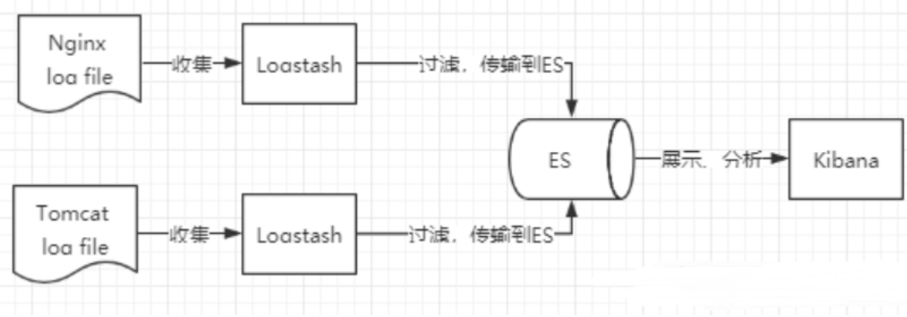
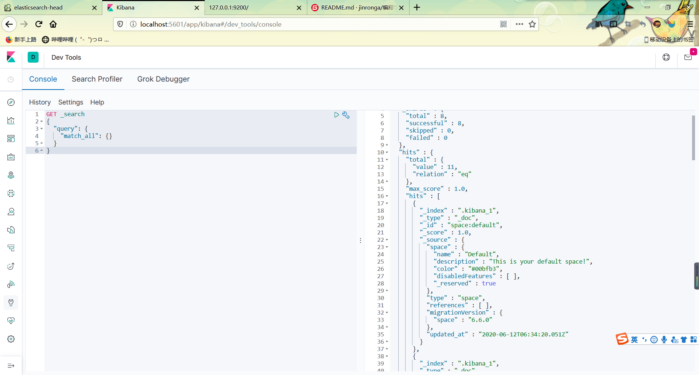

## ElasticSearch安装

声明：JDK1.8 ，最低要求！ ElasticSearch 客户端，界面工具！

Java开发，ElasticSearch 的版本和我们之后对应的 Java 的核心jar包！ 版本对应！JDK 环境是正常！


下载地址：https://www.elastic.co/cn/downloads/elasticsearch

官网下载巨慢，翻墙，网盘中下载即可！

我们学习的话 Window 和 Linux 都可以学习！

我们这里现在Window下学习！

ELK 三剑客，解压即用！（web项目！前端环境！）


#### Window下安装！

##### 1、解压就可以使用了！


##### 2、目录解释

```
bin 启动文件 

config 配置文件 

log4j2 日志配置文件 

jvm.options java 虚拟机相关的配置 

elasticsearch.yml elasticsearch 的配置文件！ 默认 9200 端口！ 跨域！ 

lib 相关jar包 

logs 日志！ 

modules 功能模块 

plugins 插件！
```

```
npm install
npm run start
```


##### 3、启动，访问9200；


4.访问：http://127.0.0.1:9200/


安装可视化界面：

安装es ---head插件：(基于前端)


启动：


解决跨域问题在ELasticSearch配置文件elasticsearch.yml添加：


```yml
http.cors.enabled: true
http.cors.allow-origin: "*"
```

访问： http://localhost:9100


成功！

就把es当成一个数据库，每个索引是一个数据库：


我们后面所有的查询，Kibana！


### 了解ELK:

ELK是Elasticsearch、Logstash、Kibana三大开源框架首字母大写简称。市面上也被成为ElasticStack。其中Elasticsearch是一个基于Lucene、分布式、通过Restful方式进行交互的近实时搜索平台框架。像类似百度、谷歌这种大数据全文搜索引擎的场景都可以使用Elasticsearch作为底层支持框架，可

见Elasticsearch提供的搜索能力确实强大,市面上很多时候我们简称Elasticsearch为es。Logstash是ELK的中央数据流引擎，用于从不同目标（文件/数据存储/MQ）收集的不同格式数据，经过过滤后支持输出到不同目的地（件/MQ/redis/elasticsearch/kafka等）。Kibana可以将elasticsearch的数据通过友好的页面展示出来，提供实时分析的功能。

市面上很多开发只要提到ELK能够一致说出它是一个日志分析架构技术栈总称，但实际上ELK不仅仅适用于日志分析，它还可以支持其它任何数据分析和收集的场景，日志分析和收集只是更具有代表性。并非唯一性。



##### 安装Kibana：

Kibana是一个针对Elasticsearch的开源分析及可视化平台，用来搜索、查看交互存储在Elasticsearch索

引中的数据。使用Kibana，可以通过各种图表进行高级数据分析及展示。Kibana让海量数据更容易理

解。它操作简单，基于浏览器的用户界面可以快速创建仪表板（dashboard）实时显示Elasticsearch查

询动态。设置Kibana非常简单。无需编码或者额外的基础架构，几分钟内就可以完成Kibana安装并启动

Elasticsearch索引监测。

官网：https://www.elastic.co/cn/kibana

Kibana 版本要和 Es 一致！


好处：ELK 基本上都是拆箱即用！


启动：


访问：http://localhost:5601


开发工具！（POST、curl、head、谷歌浏览器插件测试！）




改为中文：己修改kibana配置即可！ zh-CN！

i18n.locale: "zh-CN"


ok

