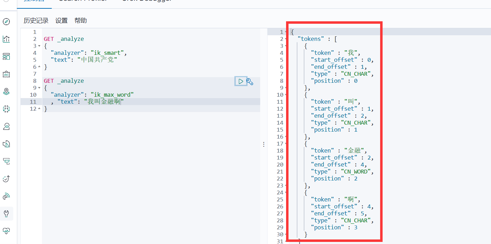
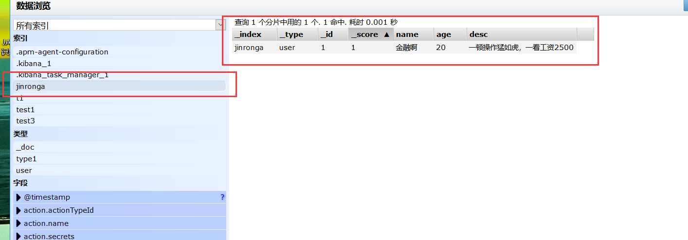

## ES核心概念

1、索引

2、字段类型（mapping） 

3、文档（documents）

#### 概述：

在前面的学习中，我们已经掌握了es是什么，同时也把es的服务已经安装启动，那么es是如何去存储数

据，数据结构是什么，又是如何实现搜索的呢？我们先来聊聊ElasticSearch的相关概念吧！

集群，节点，索引，类型，文档，分片，映射是什么？

elasticsearch是面向文档，关系行数据库 和 elasticsearch 客观的对比！一切都是JSON！


elasticsearch(集群)中可以包含多个索引(数据库)，每个索引中可以包含多个类型(表)，每个类型下又包

含多 个文档(行)，每个文档中又包含多个字段(列)。

**物理设计：**

elasticsearch 在后台把每个**索引划分成多个分片**，每分分片可以在集群中的不同服务器间迁移

一个人就是一个集群！默认的集群名称就是 elaticsearh


##### 逻辑设计：

一个索引类型中，包含多个文档，比如说文档1，文档2。 当我们索引一篇文档时，可以通过这样的一各

顺序找到 它: 索引 ▷ 类型 ▷ 文档ID ，通过这个组合我们就能索引到某个具体的文档。 注意:ID不必是整数，实际上它是个字 符串。

#### 文档：

就是我们的一条条数据

```
user 
1 zhangsan 18
2 kuangshen 3
```

之前说elasticsearch是面向文档的，那么就意味着索引和搜索数据的最小单位是文档，elasticsearch

中，文档有几个 重要属性 :

- 自我包含，一篇文档同时包含字段和对应的值，也就是同时包含 key:value！
- 可以是层次型的，一个文档中包含自文档，复杂的逻辑实体就是这么来的！ {就是一个json对象！fastjson进行自动转换！}
- 灵活的结构，文档不依赖预先定义的模式，我们知道关系型数据库中，要提前定义字段才能使用，在elasticsearch中，对于字段是非常灵活的，有时候，我们可以忽略该字段，或者动态的添加一个

新的字段。

尽管我们可以随意的新增或者忽略某个字段，但是，每个字段的类型非常重要，比如一个年龄字段类

型，可以是字符 串也可以是整形。因为elasticsearch会保存字段和类型之间的映射及其他的设置。这种

映射具体到每个映射的每种类型，这也是为什么在elasticsearch中，类型有时候也称为映射类型。


##### 类型：


类型是文档的逻辑容器，就像关系型数据库一样，表格是行的容器。 类型中对于字段的定义称为映射，比如 name 映 射为字符串类型。 我们说文档是无模式的，它们不需要拥有映射中所定义的所有字段，比如新增一个字段，那么elasticsearch是怎么做的呢?elasticsearch会自动的将新字段加入映射，但是这个字段的不确定它是什么类型，elasticsearch就开始猜，如果这个值是18，那么elasticsearch会认为它是整形。 但是elasticsearch也可能猜不对， 所以最安全的方式就是提前定义好所需要的映射，这点跟关系型数据库殊途同归了，先定义好字段，然后再使用，别 整什么幺蛾子。

##### 索引：

就是数据库！

索引是映射类型的容器，elasticsearch中的索引是一个非常大的文档集合。索引存储了映射类型的字段

和其他设置。 然后它们被存储到了各个分片上了。 我们来研究下分片是如何工作的。

**物理设计 ：节点和分片 如何工作**


一个集群至少有一个节点，而一个节点就是一个elasricsearch进程，节点可以有多个索引默认的，如果你创建索引，那么索引将会有个5个分片 ( primary shard ,又称主分片 ) 构成的，每一个主分片会有一个副本 ( replica shard ,又称复制分片 )


上图是一个有3个节点的集群，可以看到主分片和对应的复制分片都不会在同一个节点内，这样有利于某个节点挂掉 了，数据也不至于丢失。 实际上，一个分片是一个Lucene索引，一个包含倒排索引的文件目录，倒排索引的结构使 得elasticsearch在不扫描全部文档的情况下，就能告诉你哪些文档包含特定的关键字。 不过，等等，倒排索引是什 么鬼

#### 倒排索引

elasticsearch使用的是一种称为倒排索引的结构，采用Lucene倒排索作为底层。这种结构适用于快速的全文搜索， 一个索引由文档中所有不重复的列表构成，对于每一个词，都有一个包含它的文档列表。 例如，现在有两个文档， 每个文档包含如下内容：

```
Study every day, good good up to forever # 文档1包含的内容 
To forever, study every day, good good up # 文档2包含的内容
```

为了创建倒排索引，我们首先要将每个文档拆分成独立的词(或称为词条或者tokens)，然后创建一个包含所有不重 复的词条的排序列表，然后列出每个词条出现在哪个文档 :


两个文档都匹配，但是第一个文档比第二个匹配程度更高。如果没有别的条件，现在，这两个包含关键

字的文档都将返回。

再来看一个示例，比如我们通过博客标签来搜索博客文章。那么倒排索引列表就是这样的一个结构 :


如果要搜索含有 python 标签的文章，那相对于查找所有原始数据而言，查找倒排索引后的数据将会快的多。只需要 查看标签这一栏，然后获取相关的文章ID即可。完全过滤掉无关的所有数据，提高效率！elasticsearch的索引和Lucene的索引对比在elasticsearch中， 索引 （库）这个词被频繁使用，这就是术语的使用。 在elasticsearch中，索引被分为多个分片，每份 分片是一个Lucene的索引。所以一个elasticsearch索引是由多个Lucene索引组成的。别问为什么，谁让elasticsearch使用Lucene作为底层呢! 如无特指，说起索引都是指elasticsearch的索引。

接下来的一切操作都在kibana中Dev Tools下的Console里完成。基础操作！


### IK分词器插件

分词：即把一段中文或者别的划分成一个个的关键字，我们在搜索时候会把自己的信息进行分词，会把

数据库中或者索引库中的数据进行分词，然后进行一个匹配操作，默认的中文分词是将每个字看成一个

词，比如 “我爱狂神” 会被分为"我","爱","狂","神"，这显然是不符合要求的，所以我们需要安装中文分词

器ik来解决这个问题。

如果要使用中文，建议使用ik分词器！

IK提供了两个分词算法：ik_smart 和 ik_max_word，其中 ik_smart 为最少切分，ik_max_word为最细粒度划分！一会我们测试！

**安装：**

1、https://github.com/medcl/elasticsearch-analysis-ik

2、下载完毕之后，放入到我们的elasticsearch 插件即可！


3、重启观察ES，可以看到ik分词器被加载了！


4、elasticsearch-plugin 可以通过这个命令来查看加载进来的插件


5、使用kibana测试！

其中 ik_smart 为最少切分


ik_max_word为最细粒度划分！穷尽词库的可能！字典！


搜索：我会好好学习java的：



有被拆开的

这种自己需要的词，需要自己加到我们的分词器的字典中！

##### ik 分词器增加自己的配置！


```xml
<?xml version="1.0" encoding="UTF-8"?>
<!DOCTYPE properties SYSTEM "http://java.sun.com/dtd/properties.dtd">
<properties>
	<comment>IK Analyzer 扩展配置</comment>
	<!--用户可以在这里配置自己的扩展字典 -->
	<entry key="ext_dict">jinronga.dic</entry>
	 <!--用户可以在这里配置自己的扩展停止词字典-->
	<entry key="ext_stopwords"></entry>
	<!--用户可以在这里配置远程扩展字典 -->
	<!-- <entry key="remote_ext_dict">words_location</entry> -->
	<!--用户可以在这里配置远程扩展停止词字典-->
	<!-- <entry key="remote_ext_stopwords">words_location</entry> -->
</properties>
```


**Rest风格说明**

一种软件架构风格，而不是标准，只是提供了一组设计原则和约束条件。它主要用于客户端和服务器交

互类的软件。基于这个风格设计的软件可以更简洁，更有层次，更易于实现缓存等机制。

基本Rest命令说明：


**关于索引的基本操作** 

1、创建一个索引！

```
PUT /索引名/~类型名~/文档id 
{请求体}
```


完成了自动增加了索引！数据也成功的添加了，这就是我说大家在初期可以把它当做数据库学习的原因！


3、那么 name 这个字段用不用指定类型呢。毕竟我们关系型数据库 是需要指定类型的啊 !

字符串类型

text 、 keyword

数值类型

long, integer, short, byte, double, flfloat, half_flfloat, scaled_flfloat

日期类型

date

PUT /索引名/~类型名~/文档id 

{请求体}te布尔值类型

boolean

二进制类型

binary

等等......

4、指定字段的类型


获得这个规则！ 可以通过 GET 请求获取具体的信息！


5、查看默认的信息


如果自己的文档字段没有指定，那么es 就会给我们默认配置字段类型！

扩展： 通过命令 elasticsearch 索引情况！ 通过get _cat/ 可以获得es的当前的很多信息！


修改 提交还是使用PUT 即可！ 然后覆盖！最新办法！

曾经！


现在的方法！


删除索引！

通过DELETE 命令实现删除、 根据你的请求来判断是删除索引还是删除文档记录！

使用RESTFUL 风格是我们ES推荐大家使用的！

**关于文档的基本操作（重点）**

##### 基本操作：


**1、添加数据**

```
PUT /jinronga/user/1
{
  "name": "金融啊",
  "age": 20,
  "desc": "一顿操作猛如虎，一看工资2500",
  "tags": ["技术宅","爱音乐","喜欢吉他"]
}
```




2、获取数据：


**3、更新数据 put**


**4、Post   _update,推荐使用这种方式更新：**


简单的搜索！

```
GET /jinronga/user/1
```

简单的条件查询，可以根据默认的映射规则，产生基本的查询！


**复杂的搜索查询 select （排序，分页，高亮，模糊查询，精准查询）**


输出的结果不需要怎么多！


我们之后使用Java操作es ，所有的方法和对象就是这里面的 key！

##### 排序：


##### **分页查询**


##### 布尔值查询：

must （and），所有的条件都要符合 where id = 1 and name = xxx


should（or），所有的条件都要符合 where id = 1 or name = xxx


must_not （not）


##### 过滤器filter


- gt 大于
- gte 大于等于
- lt 小于
- lte 小于等于！


##### 匹配多条件：


##### 精准查询：

term 查询是直接通过倒排索引指定的词条进程精确查找的！

**关于分词：**

- term ，直接查询精确的
- match，会使用分词器解析！（先分析文档，然后在通过分析的文档进行查询！）

##### 两个类型text keyword


##### 多个值匹配精准查询


##### 高亮查询！


自定义高亮显示：


这些其实MySQL 也可以做，只是MySQL 效率比较低！

- 匹配
- 按照条件匹配
- 精确匹配
- 区间范围匹配
- 匹配字段过滤
- 多条件查询
- 高亮查询


