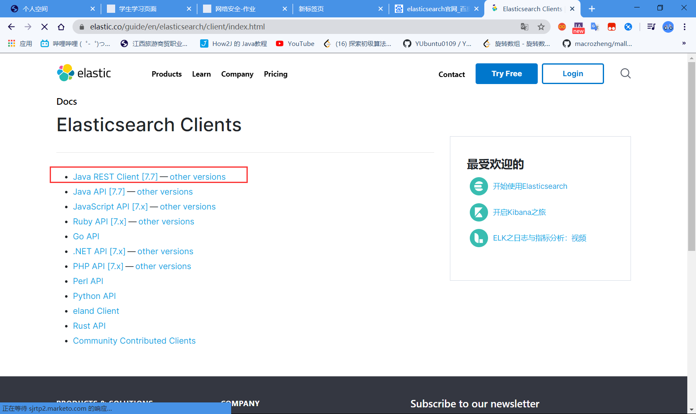

## SpringBoot集成Elasticsearch

##### 打开官方文档：




推荐 使用java rest client


```
<dependency>
    <groupId>org.elasticsearch.client</groupId>
    <artifactId>elasticsearch-rest-high-level-client</artifactId>
    <version>7.6.2</version>
</dependency>
```

找对象：


分析这个类的方法：

配置项目：


手动修改es默认的版本号：

```xml
   <properties>
        <java.version>1.8</java.version>
<!--        自定义es 版本依赖，保证和本地的一致-->
        <elasticsearch.version>7.6.1</elasticsearch.version>
    </properties>
```


编写es客户端配置类：

```
/1、找对象
//3、放到spring容器中待用
@Configuration
public class ElasticSearchClietConfig {

    @Bean
    public RestHighLevelClient restHighLevelClient(){
        RestHighLevelClient client = new RestHighLevelClient(
                RestClient.builder(
                        new HttpHost("127.0.0.1", 9200, "http"),
                        new HttpHost("localhost", 9201, "http")));
           return client;
    }
}
```

分析客户端源码：

```java
/*

\* Copyright 2012-2019 the original author or authors. 

*

\* Licensed under the Apache License, Version 2.0 (the "License"); 

\* you may not use this file except in compliance with the License. 

\* You may obtain a copy of the License at 

*

\* https://www.apache.org/licenses/LICENSE-2.0 

*

\* Unless required by applicable law or agreed to in writing, software 

\* distributed under the License is distributed on an "AS IS" BASIS, 

\* WITHOUT WARRANTIES OR CONDITIONS OF ANY KIND, either express or implied. 

\* See the License for the specific language governing permissions and 

\* limitations under the License. 

*/ 

package org.springframework.boot.autoconfigure.elasticsearch.rest; 

import java.time.Duration;import org.apache.http.HttpHost; 

import org.apache.http.auth.AuthScope; 

import org.apache.http.auth.Credentials; 

import org.apache.http.auth.UsernamePasswordCredentials; 

import org.apache.http.client.CredentialsProvider; 

import org.apache.http.impl.client.BasicCredentialsProvider; 

import org.elasticsearch.client.RestClient; 

import org.elasticsearch.client.RestClientBuilder; 

import org.elasticsearch.client.RestHighLevelClient; 

import org.springframework.beans.factory.ObjectProvider; 

import org.springframework.boot.autoconfigure.condition.ConditionalOnClass; 

import 

org.springframework.boot.autoconfigure.condition.ConditionalOnMissingBean; 

import org.springframework.boot.context.properties.PropertyMapper; 

import org.springframework.context.annotation.Bean; 

import org.springframework.context.annotation.Configuration; 

/**

\* Elasticsearch rest client infrastructure configurations. 

*

\* @author Brian Clozel 

\* @author Stephane Nicoll 

*/ 

class RestClientConfigurations { 

@Configuration(proxyBeanMethods = false) 

static class RestClientBuilderConfiguration { 

// RestClientBuilder 

@Bean 

@ConditionalOnMissingBean 

RestClientBuilder elasticsearchRestClientBuilder(RestClientProperties 

properties, 

ObjectProvider<RestClientBuilderCustomizer> builderCustomizers) { 

HttpHost[] hosts = 

properties.getUris().stream().map(HttpHost::create).toArray(HttpHost[]::new); 

RestClientBuilder builder = RestClient.builder(hosts); 

PropertyMapper map = PropertyMapper.get(); 

map.from(properties::getUsername).whenHasText().to((username) -> { 

CredentialsProvider credentialsProvider = new 

BasicCredentialsProvider(); 

Credentials credentials = new 

UsernamePasswordCredentials(properties.getUsername(), 

properties.getPassword()); 

credentialsProvider.setCredentials(AuthScope.ANY, credentials); 

builder.setHttpClientConfigCallback( 

(httpClientBuilder) -> 

httpClientBuilder.setDefaultCredentialsProvider(credentialsProvider)); 

}); 

builder.setRequestConfigCallback((requestConfigBuilder) -> { 

map.from(properties::getConnectionTimeout).whenNonNull().asInt(Duration::toMill 

is) 

.to(requestConfigBuilder::setConnectTimeout); 

map.from(properties::getReadTimeout).whenNonNull().asInt(Duration::toMillis) 

.to(requestConfigBuilder::setSocketTimeout);return requestConfigBuilder; 

}); 

builderCustomizers.orderedStream().forEach((customizer) -> 

customizer.customize(builder)); 

return builder; 

} 

}

@Configuration(proxyBeanMethods = false) 

@ConditionalOnClass(RestHighLevelClient.class) 

static class RestHighLevelClientConfiguration { 

// RestHighLevelClient 高级客户端，也是我们这里要讲，后面项目会用到的客户端 

@Bean 

@ConditionalOnMissingBean 

RestHighLevelClient elasticsearchRestHighLevelClient(RestClientBuilder 

restClientBuilder) { 

return new RestHighLevelClient(restClientBuilder); 

}

@Bean 

@ConditionalOnMissingBean 

RestClient elasticsearchRestClient(RestClientBuilder builder, 

ObjectProvider<RestHighLevelClient> restHighLevelClient) { 

RestHighLevelClient client = restHighLevelClient.getIfUnique(); 

if (client != null) { 

return client.getLowLevelClient(); 

}

return builder.build(); 

} 
}

@Configuration(proxyBeanMethods = false) 

static class RestClientFallbackConfiguration { 

// RestClient 普通的客户端！ 

@Bean 

@ConditionalOnMissingBean 

RestClient elasticsearchRestClient(RestClientBuilder builder) { 

return builder.build(); 

} 
} 
}
```

具体的API测试：

1、创建索引

```java
@SpringBootTest
class SpringbootEsApplicationTests {

    //利用面向对象来操作
    @Autowired
    @Qualifier("restHighLevelClient")
    RestHighLevelClient client;

    //索引的创建  Request PUT jinronga
    @Test
    void contextLoads() throws IOException {
        //1、创建索引的请求
        CreateIndexRequest request = new CreateIndexRequest("jinronga_index");
        //2、客户端执行的请求 IndecesClient，请求后获得响应
        CreateIndexResponse createIndexResponse = client.indices().create(request, RequestOptions.DEFAULT);
        System.out.println(createIndexResponse);

    }
}
```


2、判断索引是否存在

```java
@SpringBootTest
class SpringbootEsApplicationTests {

    //利用面向对象来操作
    @Autowired
    @Qualifier("restHighLevelClient")
    RestHighLevelClient client;

    //判断索引是否存在
    @Test
    void testExistIndex() throws IOException {
        //创建获取索引请求
        GetIndexRequest request = new GetIndexRequest("jinronga_index");

        //客户端执行请求
        boolean exists = client.indices().exists(request, RequestOptions.DEFAULT);
        System.out.println(exists);
    }
}
```


3、删除索引

```java
@SpringBootTest
class SpringbootEsApplicationTests {

    //利用面向对象来操作
    @Autowired
    @Qualifier("restHighLevelClient")
    RestHighLevelClient client;

    //删除索引
    void testDeleteIndex() throws IOException {
        DeleteIndexRequest request=new DeleteIndexRequest("jinronga_index1");
        //删除
        AcknowledgedResponse delete = client.indices().delete(request, RequestOptions.DEFAULT);
        System.out.println(delete.isAcknowledged());//判断是否删除成功！
    }
}
```


4、添加文档

```java
@SpringBootTest
class SpringbootEsApplicationTests {

    //利用面向对象来操作
    @Autowired
    @Qualifier("restHighLevelClient")
    RestHighLevelClient client;
    //添加文档
    @Test
    void testAddDocument() throws IOException {
       //创建对象
        User user = new User("金融啊", 20);

        //创建请求
        IndexRequest request = new IndexRequest("jinronga_index");

        //规则put jinronga_index/_doc/1
        request.id("1");
        request.timeout(TimeValue.timeValueSeconds(1));
        request.timeout("1s");

        //将我的数据放入请求以json的方式
        request.source(JSON.toJSONString(user), XContentType.JSON);

        //客户端发送请求，响应结果
        IndexResponse indexResponse = client.index(request, RequestOptions.DEFAULT);

        System.out.println(indexResponse.toString());
        System.out.println(indexResponse.status());//对应我们命令返回状态CREATED
    }
}

```


5、crud文档！

判断文档是否存在：

```java
@SpringBootTest
class SpringbootEsApplicationTests {

    //利用面向对象来操作
    @Autowired
    @Qualifier("restHighLevelClient")
    RestHighLevelClient client;
     //获取文档 判断文档是否存在 get /index/doc/1
    @Test
    void testIsExists() throws IOException {
        GetRequest request = new GetRequest("jinronga_index", "1");
        //不获取赶回的_source的上下文
        request.fetchSourceContext(new FetchSourceContext(false));
        request.storedFields("_none_");

        boolean exists = client.exists(request, RequestOptions.DEFAULT);
        System.out.println(exists);
    }
}

```

获取文档的内容：

```java
@SpringBootTest
class SpringbootEsApplicationTests {

    //利用面向对象来操作
    @Autowired
    @Qualifier("restHighLevelClient")
    RestHighLevelClient client;
    
    //获取文档内容：
    @Test
    void testGetDocument() throws IOException {

        GetRequest request = new GetRequest("jinronga_index", "1");
        GetResponse documentFields = client.get(request, RequestOptions.DEFAULT);
        System.out.println("文档内容："+documentFields.getSourceAsString());//打印文档内容
        System.out.println(documentFields);//返回的全部内容和命令方式一样的

    }
}

```

更新文档信息：

```java
@SpringBootTest
class SpringbootEsApplicationTests {

    //利用面向对象来操作
    @Autowired
    @Qualifier("restHighLevelClient")
    RestHighLevelClient client;

//更新文档的信息
    @Test
    void testUpdateDocument() throws IOException {
        UpdateRequest updateRequest=new UpdateRequest("jinronga_index","1");

        updateRequest.timeout("1s");
        User user = new User("金融啊一号", 20);
        updateRequest.doc(JSON.toJSONString(user),XContentType.JSON);

        UpdateResponse updateResponse = client.update(updateRequest, RequestOptions.DEFAULT);
        System.out.println(updateResponse.status());//查看转态
    }
```

删除文档：

```java
@SpringBootTest
class SpringbootEsApplicationTests {
        //利用面向对象来操作
    @Autowired
    @Qualifier("restHighLevelClient")
    RestHighLevelClient client;
//删除文档
    @Test
    void testDeleteRequest() throws IOException {
        DeleteRequest request = new DeleteRequest("jinronga_index", "1");
        request.timeout("1s");

        DeleteResponse delete = client.delete(request, RequestOptions.DEFAULT);
        System.out.println(delete.status());//查看状态
    }
}

```

批量插入数据:

```java
@SpringBootTest
class SpringbootEsApplicationTests {
        //利用面向对象来操作
    @Autowired
    @Qualifier("restHighLevelClient")
    RestHighLevelClient client;
    
    //批量插入数据
    @Test
    void testBulkRequest() throws IOException {
        BulkRequest request = new BulkRequest();
        request.timeout("10s");

        ArrayList<User> userList =new ArrayList<>();
       userList.add(new User("金融啊1号",20));
       userList.add(new User("金融啊2号",20));
       userList.add(new User("金融啊3号",20));
       userList.add(new User("金融啊4号",20));
       userList.add(new User("金融啊5号",20));
       userList.add(new User("金融啊5号",20));

       //批处理请求
        for (int i=0;i<userList.size();i++){
            request.add(new IndexRequest("jinronga_index").id(""+(i+1))
                    .source(JSON.toJSONString(userList.get(i)),XContentType.JSON));

        }


        BulkResponse bulk = client.bulk(request, RequestOptions.DEFAULT);
        System.out.println(bulk.hasFailures());//是否成功失败

    }
}

```

查询：

```java
// 查询 

// SearchRequest 搜索请求 

// SearchSourceBuilder 条件构造 

// HighlightBuilder 构建高亮 

// TermQueryBuilder 精确查询 

// MatchAllQueryBuilder 

// xxx QueryBuilder 对应我们刚才看到的命令！ 

@Test 

void testSearch() throws IOException { 

SearchRequest searchRequest = new SearchRequest("kuang_index"); 

// 构建搜索条件 

SearchSourceBuilder sourceBuilder = new SearchSourceBuilder(); 

sourceBuilder.highlighter() 

// 查询条件，我们可以使用 QueryBuilders 工具来实现 

// QueryBuilders.termQuery 精确 

// QueryBuilders.matchAllQuery() 匹配所有 

TermQueryBuilder termQueryBuilder = QueryBuilders.termQuery("name", 

"qinjiang1"); 

// MatchAllQueryBuilder matchAllQueryBuilder = 

QueryBuilders.matchAllQuery(); 

sourceBuilder.query(termQueryBuilder); 

sourceBuilder.timeout(new TimeValue(60,TimeUnit.SECONDS)); 

searchRequest.source(sourceBuilder); 

SearchResponse searchResponse = client.search(searchRequest, 

RequestOptions.DEFAULT); 

System.out.println(JSON.toJSONString(searchResponse.getHits())); 

System.out.println("================================="); 

for (SearchHit documentFields : searchResponse.getHits().getHits()) { 

System.out.println(documentFields.getSourceAsMap()); 

} 

} 

}
```


