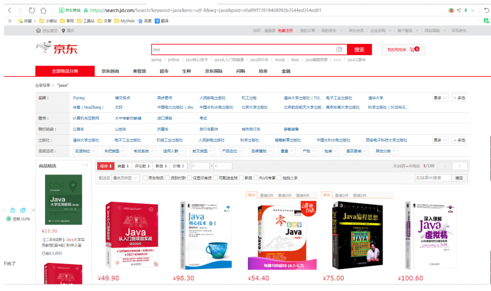
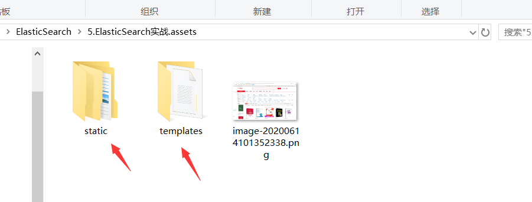
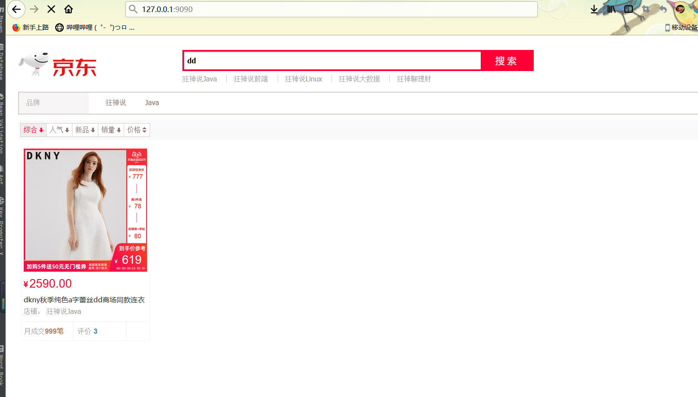
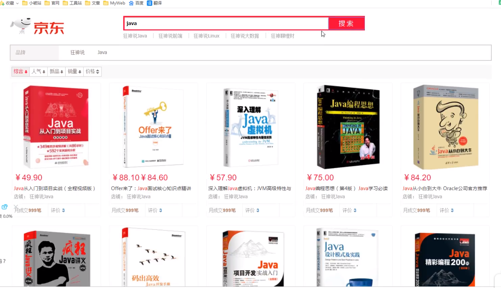

## ElasticSearch实战

本项目来自遇见狂神说：https://www.bilibili.com/video/BV1Nk4y1R7Hf

感谢狂神！

### 源码地址：https://gitee.com/jinronga/ElasticSearch-jd

#### 效果：



#### 步骤：

首先创建Springboot项目：导入素材（素材在图片的文件夹）





application.yml：

```yml
server:
  port: 9090
spring:
  thymeleaf:
    mode: LEGACYHTML5
    cache: false
    suffix: .html
```

控制器：

```java
@Controller
public class IndexController {

     @GetMapping({"/","/index"})
    public String index(){

        return "index";
    }
}
```

访问：http://127.0.0.1:9090



#### 爬虫：

爬取数据：（获取请求返回的页面信息，帅选我们需要的数据就可以了！）

导入：jsoup包

```xml
<!--      解析网页jsoup-->
      <dependency>
         <groupId>org.jsoup</groupId>
         <artifactId>jsoup</artifactId>
         <version>1.10.2</version>
      </dependency>
```

##### 爬取数据：

```java
public class HtmlParseUtil {

    public static void main(String[] args) throws IOException {
        //获取请求 https://search.jd.com/Search?keyword=java
        //需要联网：
        String url="https://search.jd.com/Search?keyword=java";
        //解析网页(Jsoup返回Document就是document对象)
        Document parse = Jsoup.parse(new URL(url), 30000);
        //所有js的方法这里都能使用
        //获取页面中标签id为：shortcut-2014页面信息
        Element elementById = parse.getElementById("shortcut-2014");
        //打印标签的id为shortcut-2014内容
//        System.out.println(elementById.html());

        Elements li = parse.getElementsByTag("li");
      //获取页面里的信息

        for (Element en: li) {
            String img = en.getElementsByTag("img").eq(0).attr("src");
            String price = en.getElementsByClass("p-price").eq(0).text();
            String name = en.getElementsByClass("p-name").eq(0).text();
            System.out.println("=================================");
            System.out.println(img);
            System.out.println(name);
            System.out.println(price);
        }
    }
}
```

##### 改造：实现动态搜索数据

parseID("")中传入关键字就可以了：

```java

@Component
public class HtmlParseUtil {

    public static void main(String[] args) throws IOException {

           new HtmlParseUtil().parseID("vue").forEach(System.out::println);

    }

    public List<Contert> parseID(String keywords) throws IOException {
        //获取请求 https://search.jd.com/Search?keyword=???
        //需要联网：
                //如果中文搜索不了就用
//        String url = "https://search.jd.com/Search?keyword=" + keyWords +"&enc=utf-8";
        String url="https://search.jd.com/Search?keyword="+keywords;
        //解析网页(Jsoup返回Document就是document对象)
        Document parse = Jsoup.parse(new URL(url), 30000);
        //所有js的方法这里都能使用
        //获取页面中标签id为：shortcut-2014页面信息
        Element elementById = parse.getElementById("shortcut-2014");
        //打印标签的id为shortcut-2014内容
//        System.out.println(elementById.html());

        Elements li = parse.getElementsByTag("li");
        //获取页面里的信息

        ArrayList<Contert> products=new ArrayList();


        for (Element en: li) {
            Contert contert=new Contert();
            String img = en.getElementsByTag("img").eq(0).attr("src");
//            String price = en.getElementsByClass("p-price").eq(0).text();
            String price = en.select("div.p-price> strong").eq(0).text();
            String name = en.getElementsByClass("p-name").eq(0).text();
            String shop = en.getElementsByClass("p-shop").eq(0).text();

            //因为有些标签店铺的class不为p-shop
            if (shop.isEmpty()){
                shop=en.getElementsByClass("p-shopnum").eq(0).text();
            }
            contert.setImg(img);
            contert.setName(name);
            contert.setPrice(price);
            contert.setShop(shop);
           products.add(contert);
        }
       return products;
    }
}

```

业务编写：

springboot整合es：

```xml
		<dependency>
			<groupId>org.springframework.boot</groupId>
			<artifactId>spring-boot-starter-data-elasticsearch</artifactId>
		</dependency>
		
		=============================
		根据本地的es版本动态默认的es版本
			<properties>
		<java.version>1.8</java.version>
		<!--        自定义es 版本依赖，保证和本地的一致-->
		<elasticsearch.version>7.6.1</elasticsearch.version>
	</properties>
```


整合配置类：

```java
//1、找对象
//3、放到spring容器中待用
@Configuration
public class ElasticSearchClientConfig {

    @Bean
    public RestHighLevelClient restHighLevelClient(){
        RestHighLevelClient client = new RestHighLevelClient(
                RestClient.builder(
                        new HttpHost("127.0.0.1", 9200, "http"),
                        new HttpHost("localhost", 9201, "http")));
           return client;
    }
}
```

实体类：

```java
@Data
public class Contert {
    private String name;//商品名称
    private String price;//价格
    private  String img;//图片地址
    private  String shop;//店铺
}
```

service：

##### 将数据插入到es：

##### 高亮搜索的实现：

##### 将配置类装配到业务层：

```java
//业务编写
@Service
public class ContertService {

    @Autowired
    @Qualifier("restHighLevelClient")
    private RestHighLevelClient client;

    /**
     * 如果需要查询中文
     * 手动用PostMan建立了一下中文分词ES索引，http://127.0.0.1:9200/jd_goods   PUT
     * {
     * 	"settings":{
     * 		"number_of_shards":"5",
     * 		"number_of_replicas":"1"
     *        },
     * 	"mappings":{
     * 			"properties":{
     * 				"img":{
     * 					"type":"text",
     * 					"analyzer": "ik_max_word"
     *                },
     * 				"title":{
     * 					"type":"text",
     * 					"analyzer": "ik_max_word"
     *                },
     * 				"price":{
     * 					"type":"text",
     * 					"analyzer": "ik_max_word"
     *                },
     * 				"shop":{
     * 					"type":"text",
     * 					"analyzer": "ik_max_word"
     *                }
     *
     *            }
     *
     *    }
     * }
     *
     *
     *
     */

    //批量插入数据
    public Boolean parseContent(String keyword) throws IOException {

        //查出来的数据放进集合中去
        List<Contert> contertList = new HtmlParseUtil().parseID(keyword);
        //创建插入数据请求
        BulkRequest bulkRequest = new BulkRequest();
        bulkRequest.timeout("2m");
   //移除对象字段为：""
   Contert contert = new Contert();
        contert.setImg("");

        contert.setName("");
        contert.setPrice("");
        contert.setShop("");

        List<Contert> list2 = new ArrayList<>();
        list2.add(contert);

        contertList.removeAll(list2);

        contert.setImg("http");
        /**
         * 将查出来的数据序列化成json批量放进es索引中
         */

        for (int i = 0; i <contertList.size(); i++) {
            System.out.println(JSON.toJSONString(contertList.get(i)));
            //批量更新和批量
          bulkRequest.add(new IndexRequest("jd_goods")
                  .source(JSON.toJSONString(contertList.get(i)), XContentType.JSON));
        }
        BulkResponse bulk = client.bulk(bulkRequest, RequestOptions.DEFAULT);

        return  !bulk.hasFailures();
    }
    //获取数据实现搜索功能
    public  List<Map<String,Object>> searchPage(String keyword,int pageNo,int pageSize) throws IOException {

        if (pageNo<=1){
            pageNo=1;
        }

        SearchRequest searchRequest=new SearchRequest("jd_goods");

        //条件搜索
        SearchSourceBuilder searchSourceBuilder = new SearchSourceBuilder();
        //分页
        searchSourceBuilder.from(pageNo);//开始索引
        searchSourceBuilder.size(pageSize);//每页显示多少数据

        //精准匹配
        TermQueryBuilder termQueryBuilder = QueryBuilders.termQuery("title", keyword);
        searchSourceBuilder.query(termQueryBuilder);
        searchSourceBuilder.timeout(new TimeValue(60, TimeUnit.SECONDS));


        //执行搜索
        searchRequest.source(searchSourceBuilder);
        SearchResponse search = client.search(searchRequest, RequestOptions.DEFAULT);

        //解析结果
        ArrayList<Map<String,Object>> lists = new ArrayList<>();

        for (SearchHit documentFields:search.getHits().getHits()){

            lists.add(documentFields.getSourceAsMap());
        }

        return lists;
    }

    //获取数据实现高亮功能
//获取数据实现高亮功能
    public List<Map<String,Object>> searchPageHighlightBuilder(String keyword,int pageNo,int pageSize) throws IOException {
        if (pageNo <= 1){
            pageNo = 1;
        }

        keyword= URLDecoder.decode(keyword, "UTF-8");

        //条件搜索
        SearchRequest searchRequest = new SearchRequest("jd_goods");
        SearchSourceBuilder searchSourceBuilder = new SearchSourceBuilder();

        //分页
        searchSourceBuilder.from(pageNo);
        searchSourceBuilder.size(pageSize);

        //精准匹配
        TermQueryBuilder termQueryBuilder = QueryBuilders.termQuery("title", keyword);
        searchSourceBuilder.query(termQueryBuilder);
        searchSourceBuilder.timeout(new TimeValue(60, TimeUnit.SECONDS));

        //高亮
        HighlightBuilder highlightBuilder = new HighlightBuilder();
        highlightBuilder.field("title");
        highlightBuilder.requireFieldMatch(true);//多个高亮显示
        highlightBuilder.preTags("<span style='color:red'>");
        highlightBuilder.postTags("</span>");
        searchSourceBuilder.highlighter(highlightBuilder);

        //执行搜索
        searchRequest.source(searchSourceBuilder);
        SearchResponse search = client.search(searchRequest, RequestOptions.DEFAULT);

        //解析结果
        ArrayList<Map<String,Object>> list = new ArrayList<>();
        for (SearchHit documentFields : search.getHits().getHits()) {

            //解析高亮的字段
            Map<String, HighlightField> highlightFields = documentFields.getHighlightFields();
            HighlightField title = highlightFields.get("title");
            Map<String, Object> sourceAsMap = documentFields.getSourceAsMap();
            if (title != null){
                Text[] fragments = title.fragments();
                String n_title = "";
                for (Text text : fragments) {
                    n_title += text;
                }
                sourceAsMap.put("title",n_title);
            }
            list.add(sourceAsMap);
        }
        return list;
    }

}

```


控制器：

```java
//请求编写
@RestController
public class ContertConlltroller {

    @Autowired
    private ContertService contertService;

    //添加数据到es
    @RequestMapping("parse/{keyword}")
    public Boolean parse(@PathVariable("keyword") String keyword) throws IOException {

      return contertService.parseContent(keyword);

    }
    //获取数据实现搜索功能
    @GetMapping("/search/{keyword}/{pageNo}/{pageSize}")
    public List<Map<String,Object>> search(@PathVariable ("keyword")String keyword,
                                           @PathVariable ("pageNo")int pageNo,
                                           @PathVariable("pageSize") int pageSize) throws Exception {
        List<Map<String, Object>> maps = contertService.searchPage(keyword, pageNo, pageSize);

        contertService.parseContent(keyword);
//        return contertService.searchPage(keyword,pageNo,pageSize);
        //实现高亮搜索
        return contertService.searchPageHighlightBuilder(keyword,pageNo,pageSize);
    }

}

```


##### 前后端分离：

前端代码：

```html
<!DOCTYPE html>
<html xmlns:th="http://www.thymeleaf.org">

<head>
    <meta charset="utf-8"/>
    <title>狂神说Java-ES仿京东实战</title>
    <link rel="stylesheet" th:href="@{/css/style.css}"/>
</head>

<body class="pg">
<div class="page" id="app">
    <div id="mallPage" class=" mallist tmall- page-not-market ">

        <!-- 头部搜索 -->
        <div id="header" class=" header-list-app">
            <div class="headerLayout">
                <div class="headerCon ">
                    <!-- Logo-->
                    <h1 id="mallLogo">
                        
                    </h1>

                    <div class="header-extra" style="width: 600px">
                        <!--搜索-->
                        <div id="mallSearch" class="mall-search" >
                            <form name="searchTop" class="mallSearch-form clearfix">
                                <fieldset>
                                    <div class="mallSearch-input clearfix">
                                        <div class="s-combobox" id="s-combobox-685">
                                            <div class="s-combobox-input-wrap">
                                                <input v-model="keyword" type="text" autocomplete="off" value="dd" id="mq"
                                                       class="s-combobox-input" aria-haspopup="true">
                                            </div>
                                        </div>
                                        <button type="submit" @click.prevent="searchKey()" id="searchbtn">搜索</button>
                                    </div>
                                </fieldset>
                            </form>

                            <ul class="relKeyTop">
                                <li><a>狂神说Java</a></li>
                                <li><a>狂神说前端</a></li>
                                <li><a>狂神说Linux</a></li>
                                <li><a>狂神说大数据</a></li>
                                <li><a>狂神聊理财</a></li>
                            </ul>
                        </div>

                    </div>
                    <!--                            爬取数据-->
                    <div style="float: right;margin-top: -45px">
                        <form >
                            <input v-model="keyword1" type="text" autocomplete="off"  >
                            <button type="submit" @click.prevent="scrapyKey()" >爬取</button>
                        </form>
                    </div>

                </div>
            </div>
        </div>

        <!-- 商品详情页面 -->
        <div id="content">
            <div class="main">
                <!-- 品牌分类 -->
                <form class="navAttrsForm">
                    <div class="attrs j_NavAttrs" style="display:block">
                        <div class="brandAttr j_nav_brand">
                            <div class="j_Brand attr">
                                <div class="attrKey">
                                    品牌
                                </div>
                                <div class="attrValues">
                                    <ul class="av-collapse row-2">
                                        <li><a href="#"> 狂神说 </a></li>
                                        <li><a href="#"> Java </a></li>
                                    </ul>
                                </div>
                            </div>
                        </div>
                    </div>
                </form>

                <!-- 排序规则 -->
                <div class="filter clearfix">
                    <a class="fSort fSort-cur">综合<i class="f-ico-arrow-d"></i></a>
                    <a class="fSort">人气<i class="f-ico-arrow-d"></i></a>
                    <a class="fSort">新品<i class="f-ico-arrow-d"></i></a>
                    <a class="fSort">销量<i class="f-ico-arrow-d"></i></a>
                    <a class="fSort">价格<i class="f-ico-triangle-mt"></i><i class="f-ico-triangle-mb"></i></a>
                </div>

                <!-- 商品详情 -->
                <div class="view grid-nosku">

                    <div class="product" v-for="result in results">
                        <div class="product-iWrap">
                            <!--商品封面-->
                            <div class="productImg-wrap">
                                <a class="productImg">
                                    
                                </a>
                            </div>
                            <!--价格-->
                            <p class="productPrice">
                                <em>{{result.price}}</em>
                            </p>
                            <!--标题-->
                            <p class="productTitle">
                                <a v-html="result.title"></a>
                            </p>
                            <!-- 店铺名 -->
                            <div class="productShop">
                                <span>{{result.shop}} </span>
                            </div>
                            <!-- 成交信息 -->
                            <p class="productStatus">
                                <span>月成交<em>999笔</em></span>
                                <span>评价 <a>3</a></span>
                            </p>
                        </div>
                    </div>
                </div>
            </div>
        </div>
    </div>
</div>

<script th:src="@{/js/axios.min.js}"></script>
<script th:src="@{/js/vue.min.js}"></script>

<script>
    new Vue({
        el: '#app',
        data: {
            keyword: '',
            keyword1: '',
            results: []
        },
        methods: {
            searchKey(){
                let keyword = this.keyword;
                console.log(keyword);
    //或者：http://127.0.0.1:9090/search/+keyword+"/1/30"
                axios.get('search/'+keyword+"/1/30").then(response=>{
                    console.log(response);
                    this.results = response.data;
                })
            },
            scrapyKey(){
                let keyword1 = this.keyword1;
                // console.log(keyword);
                //或者：http://127.0.0.1:9090/parse/+keyword1
                axios.get('parse/'+keyword1).then(response=>{
                    location.reload();
                })
            }

        }
    })
</script>

</body>
</html>
```


##### 最终效果：



完美撒花，感谢相遇！