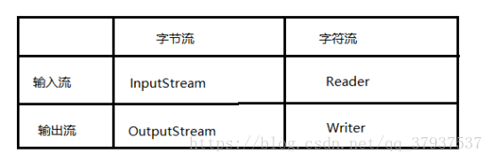
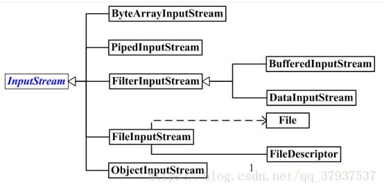
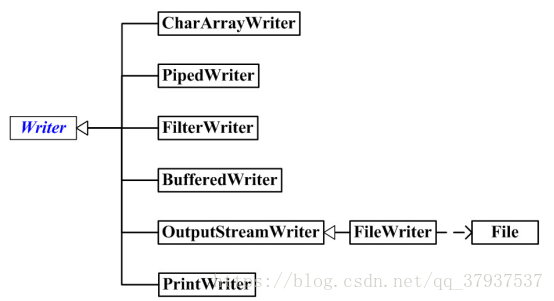

Java Io原理

IO流用来处理设备之间的数据传输，Java程序中，对于数据的输入/输出操作 都是以“流”的方式进行的。java.io包下提供了各种“流”类的接口，用以获取不同种类的数据，并通过标准的方法输入或输出数据。

对于计算机来说，数据都是以二进制形式读出或写入的。我们可以把文件想象为一个桶，我们可以通过管道将桶里的水抽出来。这里的管道也就相当于Java中的流。流的本质是一种有序的数据集合，有数据源和目的地。
流的分类

按照流的方向（输出输入都是站在程序所在内存的角度划分的）
    输入流：只能从中读数据
    输出流：只能向文件中写数据 




输入：读取外部数据（磁盘、光盘等存储设备的数据）到程序（内存）中。

输出：将程序（内存）数据输出到磁盘、光盘等存储设备中

1. ***\**\*按照流的操作单元\*\**\***

1. 字节流

​    InputStream   OutputStream



   将数据解释为原始的二进制数据  

​     读写均为字节数据

​     二进制数据不需要编码和解码，比文本Io效率更高

​     可移植（与主句编码方式无关）

  2，字符流

​      Reader Writer



   字符流将原始数据解析成一种字符

​    文本数据存储 依赖文件编码方式，它输入输出需要编码解码

   3，节点流 

​            从具体介质读写数据的类

​       4，处理流

​           对节点流进行包装进行特定的处理

字节与字符的区别

   A,读写单位不同，字节流以字节为单位（一个字节为8bit位），字符流以字符为单位

   B,操作对象不同，字节流可以处理任何数据   字符流只能处理字符相关类型数据

字节转换为字符方法：编码表（建立字符与字节的映射关系） ASCII（借助一个字 节存储数据，一个字节的7个bit位）

   GBK：主要处理中文，借助两个字节存储数据) utf-8(对Unicode编码格式的优 化，一个字节存储

​    Unicode：2个字节，但不是处理中文的

解码、编码类

​     charSet 

​     URLEncode,URLDecode 网页交互相关编码解码类

**3，按照角色划分**

​     节点流: 程序直接连接到实际的数据源 InputStream

​     处理流: 对一个已存在的流进行封装 BufferInputStream

案例:

```java
public class FileInputOutputStreamTest {

    //使用字节流FileInputStream处理文件，可能出现乱码
    @Test
    public void testFileInputStream(){
        FileInputStream fis=null;

        try {
            //1.造文件
            File file=new File("test.text");

            //2.造流
            fis=new FileInputStream(file);

            //3.读数据
            byte [] buffer =new byte[5];
            int len;//每次读取记录读取字节的个数
            while ((len=fis.read(buffer))!=-1){
                String str=new String(buffer,0,len);
                System.out.println(str);
            }

        } catch (FileNotFoundException e) {
            e.printStackTrace();
        } catch (IOException e) {
            e.printStackTrace();
        }finally {
            if (fis !=null){
                try {
                    fis.close();
                } catch (IOException e) {
                    e.printStackTrace();
                }
            }
        }
    }
}
```


```java
public class FileReaderWriterTest {
    public static void main(String[] args) {
        File file =new File("hello.text");//相对于当前工程
        System.out.println(file.getAbsolutePath());

        File file1=new File("javaSE/hello.text");
        System.out.println(file1.getAbsolutePath());


    }
    @Test
    public void test() throws IOException {

        FileReader fileReader=null;

        try {
            //1.先指定需要操作的文件
            File file=new File("test.text");//相当于当前的model
            //2.提供具体的流
            fileReader=new FileReader(file);


/*
     方式一：
    //数据文件的读入
            //read():返回读入的一个字符，如果达到末尾，返回-1
            int read = fileReader.read();

            while (read !=-1){
                System.out.print((char)read);

                read=fileReader.read();//这样才能遍历所有的字符相当于i++
            }*/

            //方式二：
            int data;
            while ((data=fileReader.read()) != -1){
                System.out.print((char) data);
            }

        } catch (FileNotFoundException e) {
            e.printStackTrace();
        } catch (IOException e) {
            e.printStackTrace();
        }finally {
            if (fileReader !=null){
                fileReader.close();//释放资源
            }
        }
    }

    //read的升级操作
    @Test
    public void testFileReader1() throws IOException {
        //1.File类的实例化
        //2.FileReader流的实例化
        //3.读入操作
        //资源关闭
        FileReader fileReader=null;

        try {
            //1.先指定需要操作的文件
            File file=new File("test.text");//相当于当前的model
            //2.提供具体的流
            fileReader=new FileReader(file);


            char [] cbuf=new char[5];
            int len;

            while ((len=fileReader.read(cbuf)) !=-1){

                //方式一：
                //错误的写法
//                for(int i = 0;i < cbuf.length;i++){
//                    System.out.print(cbuf[i]);
//                }
                //正确的写法
//                for(int i = 0;i < len;i++){
//                    System.out.print(cbuf[i]);
//                }
                //方式二：
                //错误的写法,对应着方式一的错误的写法
//                String str = new String(cbuf);
//                System.out.print(str);
                //正确的写法
                String str = new String(cbuf,0,len);
                System.out.print(str);
            }


        } catch (FileNotFoundException e) {
            e.printStackTrace();
        } catch (IOException e) {
            e.printStackTrace();
        }finally {
            if (fileReader !=null){
                fileReader.close();//释放资源
            }
        }
    }

    /*
    把内存中的数据写入硬盘里。
    说明：
    1.输出操作：对应的file可以不存在，并不会报异常
    2.File对应硬盘中文件如果不存在，在输出过程中，会自动创建这个文件
       对应硬盘中文件如果存在：
      如果流使用的构造器是：FileWriter(file,false) / FileWriter(file):对原有文件的覆盖
      如果流使用的构造器是：FileWriter(file,true):不会对原有文件覆盖，而是在原有文件基础上追加内容
     */

    @Test
    public void testFileWriter(){
        FileWriter fileWrite=null;

        try {
            //1.提供file类的对象，指定写出到文件
            File file=new File("test.text");
            //2.提供FileWriter对象，用户数据的写出
            fileWrite=new  FileWriter(file);

            //3.写出操作
            fileWrite.write("你好啊");
            fileWrite.write("很搞笑！");
        } catch (IOException e) {
            e.printStackTrace();
        }finally {
            if(fileWrite !=null){
                try {
                    fileWrite.close();
                } catch (IOException e) {
                    e.printStackTrace();
                }
            }
        }
    }

    @Test
    public void testFileReaderFileWriter(){

        FileReader fr = null;
        FileWriter fw = null;
        try {
            //1.创建File类的对象，指明读入和写出的文件
            File srcFile = new File("test.text");
            File destFile = new File("test2.text");

            //不能使用字符流来处理图片等字节数据
//            File srcFile = new File("手机.jpg");
//            File destFile = new File("手机1.jpg");


            //2.创建输入流和输出流的对象
            fr = new FileReader(srcFile);
            fw = new FileWriter(destFile);


            //3.数据的读入和写出操作
            char[] cbuf = new char[5];
            int len;//记录每次读入到cbuf数组中的字符的个数
            while((len = fr.read(cbuf)) != -1){
                //每次写出len个字符
                fw.write(cbuf,0,len);

            }
        } catch (IOException e) {
            e.printStackTrace();
        } finally {
            //4.关闭流资源
            //方式一：
//            try {
//                if(fw != null)
//                    fw.close();
//            } catch (IOException e) {
//                e.printStackTrace();
//            }finally{
//                try {
//                    if(fr != null)
//                        fr.close();
//                } catch (IOException e) {
//                    e.printStackTrace();
//                }
//            }
            //方式二：
            try {
                if(fw != null)
                    fw.close();
            } catch (IOException e) {
                e.printStackTrace();
            }

            try {
                if(fr != null)
                    fr.close();
            } catch (IOException e) {
                e.printStackTrace();
            }

        }
    }

}
```

#### 处理流之一：缓存流的使用:


```java
/**
 * Created with IntelliJ IDEA.
 * User: 郭金荣
 * Date: 2020/5/12 0012
 * Time: 09:21
 * E-mail:1460595002@qq.com
 * 类说明:
 *
 * 处理流之一：缓存流的使用
 * 1.缓存流：
 * BufferedInputStream
 * BufferedOutputStream
 * BufferedReader
 * BufferedWriter
 * 2.作用：提供流的读取，写入的速度
 *    提高读写的速度的原因：内部提供了一个缓存区
 *    3.处理流，就是”套接“在已有的流的基础上
 */
public class BufferedTest {

//    实现非文本复制
    @Test
    public void BufferedStreamTest(){
        BufferedInputStream bis=null;

        BufferedOutputStream bos=null;

        try {
            //1.造文件
            File srcFile=new File("手机.jpg");
            File destFile=new File("手机3.jpg");
            //2.造流
            //2.1造节点流
            FileInputStream fis=new FileInputStream((srcFile));
            FileOutputStream fos=new FileOutputStream((destFile));
            //2.2造缓存流
            bis=new BufferedInputStream(fis);
            bos=new BufferedOutputStream(fos);

            //3.复制的细节：读取、写入
            byte[] buffer=new byte[10];
            int len;//记录长度
            while ((len=bis.read(buffer))!=-1){

                bos.write(buffer,0,len);

                bos.flush();//刷新缓存区
            }
        } catch (FileNotFoundException e) {
            e.printStackTrace();
        } catch (IOException e) {
            e.printStackTrace();
        }finally {
            //资源关闭
            //先关外层流，在关闭内层流
            if (bos !=null){
                try {
                    bos.close();
                } catch (IOException e) {
                    e.printStackTrace();
                }
            }

            if (bis !=null){
                try {
                    bis.close();
                } catch (IOException e) {
                    e.printStackTrace();
                }
            }
        }
        //说明：关闭外层流的同时，内层流也会自动的进行关闭。关于内层流的关闭，我们可以省略.
//        fos.close();
//        fis.close();
    }


    //    使用BuffereReader 和BufferedWriter实现文本文件的赋值

    @Test
    public void testBufferedReaderBufferedWriter(){
        BufferedReader br=null;
        BufferedWriter bw=null;

        try {
            //创建文件和相应的流
            br=new BufferedReader(new FileReader("dbcp.txt"));
            bw=new BufferedWriter(new FileWriter("dbcp1.txt"));

            char [] buffer= new char[1024];
            int len;
            while ((len=br.read(buffer)) != -1){
                bw.write(buffer);
            }

        } catch (FileNotFoundException e) {
            e.printStackTrace();
        } catch (IOException e) {
            e.printStackTrace();
        }finally {
            //关闭资源吧
            if (br !=null){
                try {
                    br.close();
                } catch (IOException e) {
                    e.printStackTrace();
                }
                if (bw !=null){
                    try {
                        bw.close();
                    } catch (IOException e) {
                        e.printStackTrace();
                    }
                }
            }
        }
    }
}
```

#### 处理流之二：转换流的使用

```java
/**
 * 处理流之二：转换流的使用
 * 1.转换流：属于字符流
 *   InputStreamReader：将一个字节的输入流转换为字符的输入流
 *   OutputStreamWriter：将一个字符的输出流转换为字节的输出流
 *
 * 2.作用：提供字节流与字符流之间的转换
 *
 * 3. 解码：字节、字节数组  --->字符数组、字符串
 *    编码：字符数组、字符串 ---> 字节、字节数组
 *
 *
 * 4.字符集
 *ASCII：美国标准信息交换码。
 用一个字节的7位可以表示。
 ISO8859-1：拉丁码表。欧洲码表
 用一个字节的8位表示。
 GB2312：中国的中文编码表。最多两个字节编码所有字符
 GBK：中国的中文编码表升级，融合了更多的中文文字符号。最多两个字节编码
 Unicode：国际标准码，融合了目前人类使用的所有字符。为每个字符分配唯一的字符码。所有的文字都用两个字节来表示。
 UTF-8：变长的编码方式，可用1-4个字节来表示一个字符。
 *
 * */
public class InputStreamReaderTest {

    /*
        此时处理异常的话，仍然应该使用try-catch-finally
    InputStreamReader的使用，实现字节的输入流到字符的输入流的转换
     */

    @Test
    public void test1() throws IOException {

        FileInputStream fis=new FileInputStream("dbcp.txt");
//        InputStreamReader isr=new InputStreamReader(fis);//使用系统默认的字符集
        InputStreamReader isr=new InputStreamReader(fis,"UTF-8");//使用系统默认的字符集

       char [] buffer=new char[10];
       int len;
       while ((len=isr.read(buffer))!=-1){
           String sr=new String(buffer,0,len);
           System.out.println(sr);
       }

       isr.close();
    }

        /*
    此时处理异常的话，仍然应该使用try-catch-finally

    综合使用InputStreamReader和OutputStreamWriter
     */

    @Test
    public void test2() throws IOException {
        //1.造文件、造流
        File file1=new File("dbcp.txt");
        File file2=new File("dbcp_gbk.txt");

        FileInputStream fis=new FileInputStream(file1);
        FileOutputStream fos=new FileOutputStream(file2);

        InputStreamReader isr = new InputStreamReader(fis, "UTF-8");
        OutputStreamWriter osw=new OutputStreamWriter(fos,"UTF-8");

        //2.读写过程
        char [] buffer=new char[10];
        int len;
        while ((len=isr.read(buffer)) !=-1){
            osw.write(buffer,0,len);
        }

        //3.关闭资源
        isr.close();
        osw.close();
    }
}
```

System.in:标准的输入流，默认从键盘输入
System.out:标准的输出流，默认从控制台输出

```java
public class OtherStreamTest {

        /*
    1.标准的输入、输出流
    1.1
    System.in:标准的输入流，默认从键盘输入
    System.out:标准的输出流，默认从控制台输出
    1.2
    System类的setIn(InputStream is) / setOut(PrintStream ps)方式重新指定输入和输出的流。

    1.3练习：
    从键盘输入字符串，要求将读取到的整行字符串转成大写输出。然后继续进行输入操作，
    直至当输入“e”或者“exit”时，退出程序。

    方法一：使用Scanner实现，调用next()返回一个字符串
    方法二：使用System.in实现。System.in  --->  转换流 ---> BufferedReader的readLine()

     */

    @Test
    public void test1(){
        BufferedReader br=null;
        try {
            InputStreamReader isr=new InputStreamReader(System.in);
            br=new BufferedReader(isr);
            while (true){
                System.out.println("请输入字符串：");
               String  data=br.readLine();
                if ("e".equalsIgnoreCase(data) || "exit".equalsIgnoreCase(data)) {
                    System.out.println("程序结束");
                    break;
                }

                String upperCase = data.toUpperCase();
                System.out.println(upperCase);

            }
        } catch (IOException e) {
            e.printStackTrace();
        }
    }


    /*
    2. 打印流：PrintStream 和PrintWriter

    2.1 提供了一系列重载的print() 和 println()
    2.2 练习：


     */

    @Test
    public void test2() {
        PrintStream ps = null;
        try {
            FileOutputStream fos = new FileOutputStream(new File("D:\\IO\\text.txt"));
            // 创建打印输出流,设置为自动刷新模式(写入换行符或字节 '\n' 时都会刷新输出缓冲区)
            ps = new PrintStream(fos, true);
            if (ps != null) {// 把标准输出流(控制台输出)改成文件
                System.setOut(ps);
            }


            for (int i = 0; i <= 255; i++) { // 输出ASCII字符
                System.out.print((char) i);
                if (i % 50 == 0) { // 每50个数据一行
                    System.out.println(); // 换行
                }
            }


        } catch (FileNotFoundException e) {
            e.printStackTrace();
        } finally {
            if (ps != null) {
                ps.close();
            }
        }

    }

    /*
    3. 数据流
    3.1 DataInputStream 和 DataOutputStream
    3.2 作用：用于读取或写出基本数据类型的变量或字符串

    练习：将内存中的字符串、基本数据类型的变量写出到文件中。

    注意：处理异常的话，仍然应该使用try-catch-finally.
     */
    @Test
    public void test3() throws IOException {
        //1.
        DataOutputStream dos = new DataOutputStream(new FileOutputStream("data.txt"));
        //2.
        dos.writeUTF("刘建辰");
        dos.flush();//刷新操作，将内存中的数据写入文件
        dos.writeInt(23);
        dos.flush();
        dos.writeBoolean(true);
        dos.flush();
        //3.
        dos.close();


    }
    /*
    将文件中存储的基本数据类型变量和字符串读取到内存中，保存在变量中。

    注意点：读取不同类型的数据的顺序要与当初写入文件时，保存的数据的顺序一致！

     */
    @Test
    public void test4() throws IOException {
        //1.
        DataInputStream dis = new DataInputStream(new FileInputStream("data.txt"));
        //2.
        String name = dis.readUTF();
        int age = dis.readInt();
        boolean isMale = dis.readBoolean();

        System.out.println("name = " + name);
        System.out.println("age = " + age);
        System.out.println("isMale = " + isMale);

        //3.
        dis.close();

    }

}
```

#### 对象流的使用：

1.ObjectInputStream 和 ObjectOutputStream

2.作用：用于存储和读取基本数据类型数据或对象的处理流。它的强大之处就是可以把Java中的对象写入到数据源中，也能把对象从数据源中还原回来。

3.要想一个java对象是可序列化的，需要：

1. ​      需要实现接口：Serializable
2. ​      当前类提供一个全局常量：serialVersionUID
3. ​       除了当前Person类需要实现Serializable接口之外，还必须保证其内部所有属性， 也必须是可序列化的。（默认情况下，基本数据类型可序列化）


 **补充：**ObjectOutputStream和ObjectInputStream不能序列化static和transient修饰的成员变量

```java
//需要实现接口：Serializable
public class Person implements Serializable {

    public static final long serialVersionUID = 475463534532L;

    private String name;
    private int age;
    private int id;
    private Accout accout;

    public Person(String name, int age, int id, Accout accout) {
        this.name = name;
        this.age = age;
        this.id = id;
        this.accout = accout;
    }
}

class Accout implements Serializable{

    public static final long serialVersionUID = 475463534532L;
    private double balance;

    @Override
    public String toString() {
        return "Accout{" +
                "balance=" + balance +
                '}';
    }

    public static long getSerialVersionUID() {
        return serialVersionUID;
    }

    public double getBalance() {
        return balance;
    }

    public void setBalance(double balance) {
        this.balance = balance;
    }
}
```

#### 随机存取文件流:


**1、什么是 随机访问文件流 RandomAccessFile?**

　　该类的实例支持读取和写入随机访问文件。 随机访问文件的行为类似于存储在文件系统中的大量字节。  有一种游标，或索引到隐含的数组，称为文件指针 ; 输入操作读取从文件指针开始的字节，并使文件指针超过读取的字节。  如果在读/写模式下创建随机访问文件，则输出操作也可用; 输出操作从文件指针开始写入字节，并将文件指针提前到写入的字节。  写入隐式数组的当前端的输出操作会导致扩展数组。 文件指针可以通过读取getFilePointer方法和由设置seek方法。

　　通俗来讲：我们以前讲的 IO 字节流，包装流等都是按照文件内容的顺序来读取和写入的。而这个随机访问文件流我们可以再文件的任意地方写入数据，也可以读取任意地方的字节。

 

我们查看 底层源码，可以看到：

```java
public class RandomAccessFile implements DataOutput, DataInput, Closeable {
```

　实现了 DataOutput类，DataInput类，那么这两个类是什么呢？

**2、数据流：DataOutput,DataInput**

　　①、DataOutput:提供将数据从任何Java基本类型转换为一系列字节，并将这些字节写入二进制流。 还有一种将`String`转换为modified UTF-8格式(这种格式会在写入的数据之前默认增加两个字节的长度)并编写结果字节系列的功能。

　　②、DataInput:提供从二进制流读取字节并从其中重建任何Java原语类型的数据。 还有，为了重建设施String从数据modified UTF-8格式。 

下面我们以其典型实现：DataOutputSteam、DataInputStream 来看看它的用法：

```java
//数据输出流
        File file = new File("io"+File.separator+"a.txt");
        DataOutputStream dop = new DataOutputStream(new FileOutputStream(file));
        //写入三种类型的数据
        dop.write(65);
        dop.writeChar('哥');
        dop.writeUTF("帅锅");
        dop.close();
         
        //数据输入流
        DataInputStream dis = new DataInputStream(new FileInputStream(file));
        System.out.println(dis.read());  //65
        System.out.println(dis.readChar()); //哥
        System.out.println(dis.readUTF());  //帅锅
        dis.close();
```

**RandomAccessFile随机存取数据案例：**

```java
/**
 * RandomAccessFile的使用
 * 1.RandomAccessFile直接继承于java.lang.Object类，实现了DataInput和DataOutput接口
 * 2.RandomAccessFile既可以作为一个输入流，又可以作为一个输出流
 *
 * 3.如果RandomAccessFile作为输出流时，写出到的文件如果不存在，则在执行过程中自动创建。
 *   如果写出到的文件存在，则会对原有文件内容进行覆盖。（默认情况下，从头覆盖）
 *
 * 4. 可以通过相关的操作，实现RandomAccessFile“插入”数据的效果
 *
 */
public class RandomAccessFileTest {
    @Test
    public void test1(){
        RandomAccessFile raf1=null;
        RandomAccessFile raf2=null;
     //r:输入   rw：输出
        try {
            raf1=new RandomAccessFile(new File("行李箱.jpg"),"r");
            raf2=new RandomAccessFile(new File("行李箱3.jpg"),"rw");

            //2.
            byte[] buffer=new byte[1024];
            int len;
            while ((len=raf1.read(buffer))!=-1){
                raf2.write(buffer,0,len);
            }

        } catch (FileNotFoundException e) {
            e.printStackTrace();
        } catch (IOException e) {
            e.printStackTrace();
        }finally {
            if (raf1 !=null){
                try {
                    raf1.close();
                } catch (IOException e) {
                    e.printStackTrace();
                }
            }

            if (raf2!=null){
                try {
                    raf2.close();
                } catch (IOException e) {
                    e.printStackTrace();
                }
            }
        }
    }

    //使用RandomAccessFile实现文件内容替换
    @Test
    public void test2() throws IOException {
        RandomAccessFile raf1=new RandomAccessFile("dbcp.txt","rw");
        raf1.seek(3);//将指针调到角标为3的位置
        raf1.write("jinronga".getBytes());
        raf1.close();
    }
    /*
    使用RandomAccessFile实现数据的插入效果
     */

    @Test
    public void test() throws IOException {
        RandomAccessFile raf1=new RandomAccessFile("data.txt","rw");
        raf1.seek(3);//将指针调到角标为3的位置
        //保存指针3后面的所有数据到StringBuilder中
        StringBuilder builder=new StringBuilder((int) new File("dbcp_gbk.txt").length());
        byte[] buffer=new byte[20];
        int len;
        while ((len=raf1.read(buffer))!=-1){
            builder.append(new String(buffer,0,len));
        }
        //调回指针，写入“xyz”
        raf1.seek(3);
        raf1.write("xyz".getBytes());

        //将StringBuilder中的数据写入到文件中
        raf1.write(builder.toString().getBytes());
        raf1.close();
    }
}
```

NIO2：常用使用方法：

```java
import org.junit.Test;

import java.io.File;
import java.nio.file.Path;
import java.nio.file.Paths;

/**
 * 1. jdk 7.0 时，引入了 Path、Paths、Files三个类。
 * 2.此三个类声明在：java.nio.file包下。
 * 3.Path可以看做是java.io.File类的升级版本。也可以表示文件或文件目录，与平台无关
 * <p>
 * 4.如何实例化Path:使用Paths.
 * static Path get(String first, String … more) : 用于将多个字符串串连成路径
 * static Path get(URI uri): 返回指定uri对应的Path路径
 *
 */
public class PathTest {

    //如何使用Paths实例化Path
    @Test
    public void test1() {
        Path path1 = Paths.get("d:\\nio\\hello.txt");//new File(String filepath)

        Path path2 = Paths.get("d:\\", "nio\\hello.txt");//new File(String parent,String filename);

        System.out.println(path1);
        System.out.println(path2);

        Path path3 = Paths.get("d:\\", "nio");
        System.out.println(path3);
    }

    //Path中的常用方法
    @Test
    public void test2() {
        Path path1 = Paths.get("d:\\", "nio\\nio1\\nio2\\hello.txt");
        Path path2 = Paths.get("hello.txt");

//		String toString() ： 返回调用 Path 对象的字符串表示形式
        System.out.println(path1);

//		boolean startsWith(String path) : 判断是否以 path 路径开始
        System.out.println(path1.startsWith("d:\\nio"));
//		boolean endsWith(String path) : 判断是否以 path 路径结束
        System.out.println(path1.endsWith("hello.txt"));
//		boolean isAbsolute() : 判断是否是绝对路径
        System.out.println(path1.isAbsolute() + "~");
        System.out.println(path2.isAbsolute() + "~");
//		Path getParent() ：返回Path对象包含整个路径，不包含 Path 对象指定的文件路径
        System.out.println(path1.getParent());
        System.out.println(path2.getParent());
//		Path getRoot() ：返回调用 Path 对象的根路径
        System.out.println(path1.getRoot());
        System.out.println(path2.getRoot());
//		Path getFileName() : 返回与调用 Path 对象关联的文件名
        System.out.println(path1.getFileName() + "~");
        System.out.println(path2.getFileName() + "~");
//		int getNameCount() : 返回Path 根目录后面元素的数量
//		Path getName(int idx) : 返回指定索引位置 idx 的路径名称
        for (int i = 0; i < path1.getNameCount(); i++) {
            System.out.println(path1.getName(i) + "*****");
        }

//		Path toAbsolutePath() : 作为绝对路径返回调用 Path 对象
        System.out.println(path1.toAbsolutePath());
        System.out.println(path2.toAbsolutePath());
//		Path resolve(Path p) :合并两个路径，返回合并后的路径对应的Path对象
        Path path3 = Paths.get("d:\\", "nio");
        Path path4 = Paths.get("nioo\\hi.txt");
        path3 = path3.resolve(path4);
        System.out.println(path3);

//		File toFile(): 将Path转化为File类的对象
        File file = path1.toFile();//Path--->File的转换

        Path newPath = file.toPath();//File--->Path的转换
    }
}
```

