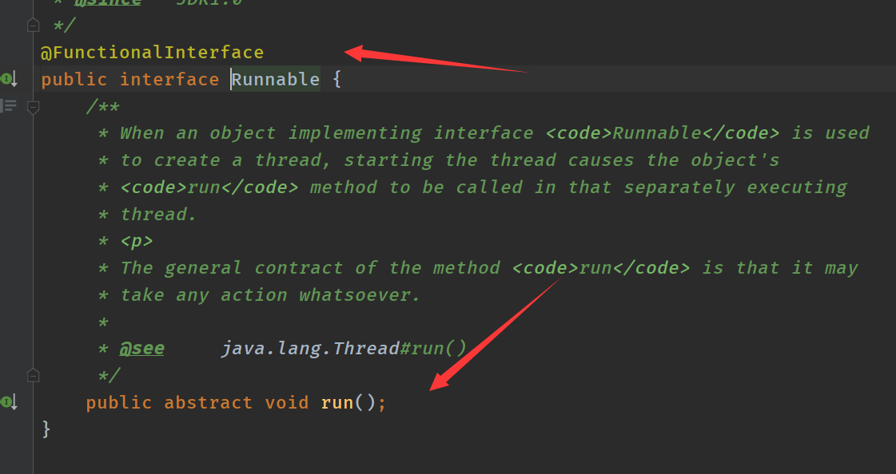

## 函数式接口

Java 8  引入的一个核心概念是函数式接口（Functional  Interfaces）。通过在接口里面添加一个抽象方法，这些方法可以直接从接口中运行。如果一个接口定义个唯一一个抽象方法，那么这个接口就成为函数式接口。同时，引入了一个新的注解：@FunctionalInterface。可以把他它放在一个接口前，表示这个接口是一个函数式接口。这个注解是非必须的，只要接口只包含一个方法的接口，虚拟机会自动判断，不过最好在接口上使用注解 @FunctionalInterface 进行声明。在接口中添加了 @FunctionalInterface  的接口，只允许有一个抽象方法，否则编译器也会报错。

java.lang.Runnable 就是一个函数式接口。

```java
@FunctionalInterface
public interface Runnable {
public abstract void run();
}
```

## Lambda 表达式

函数式接口的重要属性是：我们能够使用 Lambda 实例化它们，Lambda  表达式让你能够将函数作为方法参数，或者将代码作为数据对待。Lambda 表达式的引入给开发者带来了不少优点：在 Java 8  之前，匿名内部类，监听器和事件处理器的使用都显得很冗长，代码可读性很差，Lambda 表达式的应用则使代码变得更加紧凑，可读性增强；Lambda 表达式使并行操作大集合变得很方便，可以充分发挥多核 CPU 的优势，更易于为多核处理器编写代码；

**Lambda表达式的本质：**作为函数式接口的实例

**Lambda 表达式由三个部分组成：第一部分为一个括号内用逗号分隔的形式参数，参数是函数式接口里面方法的参数；第二部分为一个箭头符号：->；第三部分为方法体，可以是表达式和代码块。语法如下：**

1. 方法体为表达式，该表达式的值作为返回值返回。

```java
(parameters) -> expression
```

2. 方法体为代码块，必须用 {} 来包裹起来，且需要一个 return 返回值，但若函数式接口里面方法返回值是 void，则无需返回值。

   -> : lambda操作符 或者 箭头操作符

   ->:左边：lambda形参列表（就是抽象方法的参数列表）

   ->:右边：lambda体应该使用一对{}包裹；如果lambda体只有一条执行语句（可能是return语句），省略这一对{}和return关键字

```java
(parameters) -> { statements; }``例如，下面是使用匿名内部类和 Lambda 表达式的代码比较。
```

下面是用匿名内部类的代码：

```java
button.addActionListener(new ActionListener() {
@Override
public void actionPerformed(ActionEvent e) {
System.out.print("Helllo Lambda in actionPerformed");
}
});
下面是使用 Lambda 表达式后：
button.addActionListener(
\\actionPerformed 有一个参数 e 传入，所以用 (ActionEvent e)
(ActionEvent e)-> 
System.out.print("Helllo Lambda in actionPerformed")
);
```

上面是方法体包含了参数传入 (ActionEvent e)，如果没有参数则只需 ( )，例如 Thread 中的 run 方法就没有参数传入，当它使用 Lambda 表达式后：

```java
Thread t = new Thread(
\\run 没有参数传入，所以用 (), 后面用 {} 包起方法体
() -> {
 System.out.println("Hello from a thread in run");
}
);
通过上面两个代码的比较可以发现使用 Lambda 表达式可以简化代码，并提高代码的可读性。
为了进一步简化 Lambda 表达式，可以使用方法引用。例如，下面三种分别是使用内部类，使用 Lambda 表示式和使用方法引用方式的比较：
//1. 使用内部类
Function<Integer, String> f = new Function<Integer,String>(){
@Override
public String apply(Integer t) {
return null;
}
};
//2. 使用 Lambda 表达式
Function<Integer, String> f2 = (t)->String.valueOf(t); 
//3. 使用方法引用的方式
Function<Integer, String> f1 = String::valueOf
```

再举一个列子：

```java
public class LambdaTest {

    @Test
    public void test1(){
        Runnable r1=new Runnable() {
            @Override
            public void run() {
                System.out.println("我爱你中国！");
            }
        };
        r1.run();

        System.out.println("============");
        //Lambda表达式的写法
        Runnable r2=()-> {System.out.println("我爱你我的国家！");}
        r2.run();
    }

    @Test
    public void test2(){
        Comparator<Integer> com1 = new Comparator<Integer>() {
            @Override
            public int compare(Integer o1, Integer o2) {
                return Integer.compare(o1,o2);
            }
        };
        int compare = com1.compare(12, 21);
        System.out.println(compare);

        System.out.println("===========");
        //Lambda表达式的写法
        Comparator<Integer> com2 =(o1,o2)->Integer.compare(o1,o2);
        int compare1 = com1.compare(89, 56);
        System.out.println(compare1);
        System.out.println("===========");
        //方法引用
        Comparator<Integer> com3=Integer::compareTo;
        int compare2 = com3.compare(56, 89);
        System.out.println(compare2);
    }
}
```

语法格式四：Lambda表达式抽象方法只有一个参数时候，小括号可以省略的：

```java
@Test
public void test4(){
    Consumer<String> con =(s)->{
        System.out.println(s);
    };
    con.accept("测试==语法格式四");

   Consumer con1 =s->{
       System.out.println(s);
   };
   con1.accept("我会好好学java的");
}
```

Lambda表达式两个或者两个以上参数，多条件语句并且，可以有返回值：

```java
@Test
public void test5(){
    Comparator<Integer> com =new Comparator<Integer>() {
        @Override
        public int compare(Integer o1, Integer o2) {
            System.out.println(o1);
            System.out.println(o2);
            return o1.compareTo(o2);
        }
    };

    System.out.println("比较一："+ com.compare(12,6));
    //使用Lambda表达式：
    Comparator<Integer> com1=(o1, o2) ->{
        System.out.println(o1);
        System.out.println(o2);
        return o1.compareTo(o2);
    } ;

    System.out.println("比较2:"+ com1.compare(65,99));
}
```

 Lambda 体只有一条语句时，return 与大括号若有，都可以省略

```java
// Lambda 体只有一条语句时，return 与大括号若有，都可以省略
@Test
public void test6(){
   Comparator<Integer> com =(o1,o2)->{
     return o1.compareTo(o2);
   };

    System.out.println( com.compare(89,87));

    Comparator<Integer> com2=(o1,o2)->o1.compareTo(o2);
    System.out.println(com2.compare(845, 98));
}
```

如果一个接口中，只声明了一个抽象方法，则此接口就称为函数式接口。我们可以在一个接口上使用 @FunctionalInterface 注解，这样做可以检查它是否是一个函数式接口。



也可以声明自定义函数接口例如：

```java
@FunctionalInterface
public interface MyInterface {

    void method1();

//    void method2();
}
```


**java内置的4大核心函数式接口**

 * **消费型接口** Consumer<T>     void accept(T t) :将 T 作为输入，不返回任何内容，表示在单个参数上的操作。
 * **供给型接口** Supplier<T>     T get()
 * **函数型接口** Function<T,R>   R apply(T t)    :将 T 作为输入，返回 R 作为输出，他还包含了和其他函数组合的默认方法。
 * **断定型接口** Predicate<T>    boolean test(T t):将 T 作为输入，返回一个布尔值作为输出，该接口包含多种默认方法来将 Predicate 组合成其他复杂的逻辑（与、或、非）。

```java
public class LambdaTest2 {
    @Test
    public void test1(){
    happyTime(400, new Consumer<Double>() {
        @Override
        public void accept(Double aDouble) {
            System.out.println("学习好累我去买一箱留个核桃补补脑价格："+aDouble);
        }
    });

        System.out.println("============");

        happyTime(600,money-> System.out.println("学习好累我去买一箱留个核桃补补脑价格2"+money));

    }
    public void happyTime(double money, Consumer<Double> consumer){
        consumer.accept(money);
    }

    @Test
    public void test2(){

        List<String> list = Arrays.asList("北京","南京","天津","东京","西京","普京");
      List<String> filterStrs=fiterString(list, new Predicate<String>() {
          @Override
          public boolean test(String s) {
              return s.contains("京");
          }
      });
        System.out.println(filterStrs);

      //Lambda表达式
        List<String> stringList = fiterString(list, s -> s.contains("京"));
        System.out.println(stringList);
    }

    //根据给定的规则，过滤集合中的字符串。此规则由Predicate的方法决定的
    public List<String> fiterString(List<String> list, Predicate<String> pre){

        ArrayList<String> fiterList =new ArrayList<>();
        for (String s:list) {
            if (pre.test(s)){
                fiterList.add(s);
            }
        }
        return fiterList;
    }
}
```

#### **方法引用：**

方法引用通过方法的名字来指向一个方法。

方法引用可以使语言的构造更紧凑简洁，减少冗余代码。

方法引用使用一对冒号 :: 。

1.使用情境：当要传递给Lambda体的操作，已经有实现的方法了，可以使用方法引用！

2.方法引用，本质上就是Lambda表达式，而Lambda表达式作为函数式接口的实例。所以 方法引用，也是函数式接口的实例。

**三种使用情况：**

情况一：对象::实例方法名

情况二：类::静态方法名

情况三：类::实例方法名

**注意：**方法引用使用的要求：要求接口中的抽象方法的形参列表和返回值类型与方法引用的方法的形参列表和返回值类型相同！（针对于情况1和情况2）

情况一：

```java
//情况一：对象::实例方法
//Consumer中的void accept(T t)
//PrintStream中的void println(T t)
@Test
public void test1(){
    Consumer con=(str)-> System.out.println(str);
    con.accept("江西赣州");
    System.out.println("===============");
    //方法引用：
    PrintStream ps = System.out;
    Consumer<String> con2 = ps::println;
    con2.accept("江西南昌");
}
//Supplier中的T get()
//Employee中的String getName()
@Test
public void test2(){
    Employee emp=new Employee(1001,"Tom",23,5600);
    Supplier<String> sup=()->emp.getName();
    System.out.println(sup.get());

    Supplier<String> sup2=emp::getName;
    System.out.println(sup2.get());
}
```

情况二：

```java
//情况二:  类::静态方法
    //Comparator中的int compare(T t1,T t2)
    //Integer中的int compare(T t1,T t2)
     @Test
    public void test3(){
         Comparator<Integer> com1=(Integer t1,Integer t2)->Integer.compare(t1,t2);
         System.out.println(com1.compare(78, 96));

         //方法引用：
         Comparator<Integer> com2=Integer::compare;
         System.out.println(com2.compare(98, 98));
     }
//Function中的R apply(T t)
    //Math中的Long round(Double d)
    @Test
    public void test4(){
        Function<Double,Long> function=new Function<Double, Long>() {
            @Override
            public Long apply(Double aDouble) {
                return Math.round(aDouble);
            }
        };
        System.out.println(function.apply(12.5));

        System.out.println("==============");
        Function<Double,Long> function1=Math::round;
        System.out.println(function1.apply(12.6));
    }
```

情况三：

```java
 //情况三：类::实例方法(有难度)
    // Comparator中的int comapre(T t1,T t2)
    // String中的int t1.compareTo(t2)
  @Test
    public void test5(){
        Comparator<String> com=(s1,s2)-> s1.compareTo(s2);
      System.out.println(com.compare("cdcd", "abc"));
      System.out.println("=============");

      Comparator<String> com2=String::compareTo;
      System.out.println(com2.compare("sdfdf", "dsfsdf"));

  }
//BiPredicate中的boolean test(T t1, T t2);
    //String中的boolean t1.equals(t2)
    @Test
    public void test6(){
        BiPredicate<String,String> pre1=(s1,s2)->s1.equals(s2);
        System.out.println(pre1.test("adfd", "dfsda"));

        System.out.println("=============");
        BiPredicate<String,String> pre2=String::equals;
        System.out.println(pre2.test("dfdf", "dfdf"));
    }

// Function中的R apply(T t)
	// Employee中的String getName();
	@Test
	public void test7() {
		Employee employee = new Employee(1001, "Jerry", 23, 6000);


		Function<Employee,String> func1 = e -> e.getName();
		System.out.println(func1.apply(employee));

		System.out.println("*******************");


		Function<Employee,String> func2 = Employee::getName;
		System.out.println(func2.apply(employee));


	}
```

#### 构造器引用

一、构造器引用

和方法引用类似，函数式接口的抽象方法的形参列表和构造器的形参列表一致。抽象方法的返回值类型即为构造器所属的类的类型

 


```java
//构造器引用
//Supplier中的T get()
//Employee的空参构造器：Employee()
@Test
public void test1(){

    Supplier<Employee> supplier=new Supplier<Employee>() {
        @Override
        public Employee get() {
            return new Employee();
        }
    };
    System.out.println(supplier.get());
    System.out.println("===========");

    //Lambda表達式
    Supplier<Employee> supplier1=()->new Employee();
    System.out.println(supplier1.get());
    System.out.println("===========");
    //方法引用
    Supplier<Employee> supplier2=Employee::new;
    System.out.println(supplier2.get());
}

@Test
public void test2(){
    Function<Integer ,Employee> function=id->new Employee(id);
    Employee apply = function.apply(1001);
    System.out.println(apply);


    System.out.println("==============");

    Function <Integer,Employee> function1=Employee::new;
    System.out.println(function1.apply(1002));
}
//BiFunction中的R apply(T t,U u)
@Test
public void test3(){
    BiFunction<Integer,String,Employee>function=(id,name)->new Employee(id,name);
    System.out.println(function.apply(1005,"java"));

    BiFunction<Integer,String,Employee> function1=Employee::new;
    System.out.println(function1.apply(1005, "Tommm"));
}
```


#### 数组引用：

```java
//数组引用
//Function中的R apply(T t)
@Test
public void test4(){
    Function<Integer,String[]> function=length->new String[length];
    String[] apply = function.apply(5);
    System.out.println(Arrays.toString(apply));

    System.out.println("=========");

    Function<Integer,String[]> function1=String[] ::new;
    System.out.println(function1.apply(9));
}
```

## 集合之流式操作

Stream关注的是对数据的运算。与cpu进行打交道，集合关注的是存储跟内存进行打交道

Java 8  引入了流式操作（Stream），通过该操作可以实现对集合（Collection）的并行处理和函数式操作。根据操作返回的结果不同，流式操作分为中间操作和最终操作两种。最终操作返回一特定类型的结果，而中间操作返回流本身，这样就可以将多个操作依次串联起来。根据流的并发性，流又可以分为串行和并行两种。流式操作实现了集合的过滤、排序、映射等功能。

Stream 和 Collection 集合的区别：Collection 是一种静态的内存数据结构，而 Stream 是有关计算的。前者是主要面向内存，存储在内存中，后者主要是面向 CPU，通过 CPU 实现计算。

### 串行和并行的流

流有串行和并行两种，串行流上的操作是在一个线程中依次完成，而并行流则是在多个线程上同时执行。并行与串行的流可以相互切换：通过 stream.sequential() 返回串行的流，通过 stream.parallel()  返回并行的流。相比较串行的流，并行的流可以很大程度上提高程序的执行效率。

**创建Stream方式一：通过集合**

```java
//创建Stream方式一：通过集合
@Test
public void test1(){
    List<Employee> employees= EmployeeData.getEmployees();
    //        default Stream<E> stream() : 返回一个顺序流
    Stream<Employee> stream = employees.stream();

    //        default Stream<E> parallelStream() : 返回一个并行流
    Stream<Employee> employeeStream = employees.parallelStream();
}
```

**创建Stream方式二：通过数组**

```java
//创建 Stream方式二：通过数组
    @Test
    public void test2(){
        int[] arr=new int[]{1,2,4,5,8,8};
        //调用Arrays类的static <T> Stream<T> stream(T[] array): 返回一个流
        IntStream stream = Arrays.stream(arr);

        Employee e1 =new Employee();
        Employee e2 =new Employee();
        Employee [] arre1=new Employee[]{e1,e2};
        Stream<Employee> stream1 = Arrays.stream(arre1);

    }
```

**创建Stream方式三：通过Stream的of()**

```java
 //创建 Stream方式三：通过Stream的of()
 @Test
    public void test3(){
     Stream<Integer> integerStream = Stream.of(1, 4, 85, 47, 9);
 }
    //创建 Stream方式四：创建无限流
    @Test
    public void test4(){
        //迭代
        //      迭代
//      public static<T> Stream<T> iterate(final T seed, final UnaryOperator<T> f)
        //遍历前10个偶数
        Stream.iterate(0, t -> t + 2).limit(10).forEach(System.out::println);


//      生成
//      public static<T> Stream<T> generate(Supplier<T> s)
        Stream.generate(Math::random).limit(10).forEach(System.out::println);

    }
```

### 中间操作

该操作会保持 stream 处于中间状态，允许做进一步的操作。它返回的还是的 Stream，允许更多的链式操作。常见的中间操作有：

filter()：对元素进行过滤；

sorted()：对元素排序；

map()：元素的映射；

distinct()：去除重复元素；

subStream()：获取子 Stream 等。

例如，下面是对一个字符串集合进行过滤，返回以“s”开头的字符串集合，并将该集合依次打印出来：

```java
list.stream()
.filter((s) -> s.startsWith("s"))
.forEach(System.out::println);
```

这里的 filter(...) 就是一个中间操作，该中间操作可以链式地应用其他 Stream 操作。

### 终止操作

该操作必须是流的最后一个操作，一旦被调用，Stream 就到了一个终止状态，而且不能再使用了。常见的终止操作有：

forEach()：对每个元素做处理；

toArray()：把元素导出到数组；

findFirst()：返回第一个匹配的元素；

anyMatch()：是否有匹配的元素等。

例如，下面是对一个字符串集合进行过滤，返回以“s”开头的字符串集合，并将该集合依次打印出来：

```java
list.stream() //获取列表的 stream 操作对象
.filter((s) -> s.startsWith("s"))//对这个流做过滤操作
.forEach(System.out::println);
```

这里的 forEach(...) 就是一个终止操作，该操作之后不能再链式的添加其他操作了。

```java
 //1-筛选与切片
    @Test
    public void test1(){
        List<Employee> list= EmployeeData.getEmployees();
        //        filter(Predicate p)——接收 Lambda ， 从流中排除某些元素。
        Stream<Employee> stream = list.stream();
        //练习：查询员工表中薪资大于7000的员工信息
        stream.filter(employee -> employee.getSalary()>7000).forEach(System.out::println);
        System.out.println("=========");

        //  limit(n)——截断流，使其元素不超过给定数量。
        list.stream().limit(4).forEach(System.out::println);
        System.out.println("=========");
        //        skip(n) —— 跳过元素，返回一个扔掉了前 n 个元素的流。若流中元素不足 n 个，则返回一个空流。与 limit(n) 互补
        list.stream().skip(3).forEach(System.out::println);
        System.out.println("========");
        // distinct（）返回由该流的不同元素组成的流。distinct（）是Stream接口的方法。distinct（）使用hashCode（）和equals（）方法来获取不同的元素。
        list.stream().distinct().forEach(System.out::println);

    }

    //映射
    @Test
    public void test2(){
//        map(Function f)——接收一个函数作为参数，将元素转换成其他形式或提取信息，该函数会被应用到每个元素上，并将其映射成一个新的元素。
             List<String> list= Arrays.asList("aa","bb","cc","dd");
             list.stream().map(str->str.toUpperCase()).forEach(System.out::println);

    }
    //排序
    @Test
    public void test3(){
        //sorted--自然排序
        List<Integer> list=Arrays.asList(12,43,65,34,87);
        list.stream().sorted().forEach(System.out::println);
        //抛异常，原因:Employee没有实现Comparable接口
//        List<Employee> employees = EmployeeData.getEmployees();
//        employees.stream().sorted().forEach(System.out::println);


        //        sorted(Comparator com)——定制排序

        List<Employee> employees=EmployeeData.getEmployees();
        employees.stream().sorted((e1,e2)->{
            int ageValue = Integer.compare(e1.getAge(),e2.getAge());
            if(ageValue != 0){
                return ageValue;
            }else{
                return -Double.compare(e1.getSalary(),e2.getSalary());
            }
        }).forEach(System.out::println);

    }
```

## 注解的更新

对于注解，Java 8 主要有两点改进：类型注解和重复注解。

Java 8  的类型注解扩展了注解使用的范围。在该版本之前，注解只能是在声明的地方使用。现在几乎可以为任何东西添加注解：局部变量、类与接口，就连方法的异常也能添加注解。新增的两个注释的程序元素类型 ElementType.TYPE_USE 和 ElementType.TYPE_PARAMETER  用来描述注解的新场合。ElementType.TYPE_PARAMETER 表示该注解能写在类型变量的声明语句中。而  ElementType.TYPE_USE 表示该注解能写在使用类型的任何语句中（例如声明语句、泛型和强制转换语句中的类型）。

对类型注解的支持，增强了通过静态分析工具发现错误的能力。原先只能在运行时发现的问题可以提前在编译的时候被排查出来。Java 8 本身虽然没有自带类型检测的框架，但可以通过使用 Checker Framework  这样的第三方工具，自动检查和确认软件的缺陷，提高生产效率。

例如，下面的代码可以通过编译，但是运行时会报 NullPointerException 的异常。

```java
public class TestAnno {
public static void main(String[] args) {
Object obj = null;
obj.toString();
}
}
```

为了能在编译期间就自动检查出这类异常，可以通过类型注解结合 Checker Framework 提前排查出来：

```java
import org.checkerframework.checker.nullness.qual.NonNull;
public class TestAnno {
public static void main(String[] args) {
@NonNull Object obj = null;
obj.toString();
}
}
```

编译时自动检测结果如下：

```java
C:\workspace\TestJava8\src\TestAnno.java:4: Warning:`` ``(assignment.type.incompatible) $$ 2 $$ null $$ @UnknownInitialization @NonNull Object $$ ( 152, 156 )`` ``$$ incompatible types in assignment.``@NonNull Object obj = null;`` ``^`` ``found : null`` ``required: @UnknownInitialization @NonNull Object
```

## 安全性

现今，互联网环境中存在各种各种潜在的威胁，对于 Java 平台来说，安全显得特别重要。为了保证新版本具有更高的安全性，Java 8 在安全性上对许多方面进行了增强，也为此推迟了它的发布日期。下面例举其中几个关于安全性的更新：

支持更强的基于密码的加密算法。基于 AES 的加密算法，例如 PBEWithSHA256AndAES_128 和 PBEWithSHA512AndAES_256，已经被加入进来。

在客户端，TLS1.1 和 TLS1.2 被设为默认启动。并且可以通过新的系统属性包 jdk.tls.client.protocols 来对它进行配置。

Keystore 的增强，包含新的 Keystore 类型 java.security.DomainLoadStoreParameter 和为 Keytool  这个安全钥匙和证书的管理工具添加新的命令行选项-importpassword。同时，添加和更新了一些关于安全性的 API 来支持  KeyStore 的更新。

支持安全的随机数发生器。如果随机数来源于随机性不高的种子，那么那些用随机数来产生密钥或者散列敏感信息的系统就更易受攻击。SecureRandom 这个类的 getInstanceStrong 方法如今可以获取各个平台最强的随机数对象实例，通过这个实例生成像 RSA  私钥和公钥这样具有较高熵的随机数。

JSSE（Java(TM) Secure Socket Extension）服务器端开始支持  SSL/TLS 服务器名字识别 SNI（Server Name Indication）扩展。SNI 扩展目的是 SSL/TLS 协议可以通过  SNI 扩展来识别客户端试图通过握手协议连接的服务器名字。在 Java 7 中只在客户端默认启动 SNI 扩展。如今，在 JSSE  服务器端也开始支持 SNI 扩展了。

安全性比较差的加密方法被默认禁用。默认不支持 DES 相关的 Kerberos 5  加密方法。如果一定要使用这类弱加密方法需要在 krb5.conf 文件中添加  allow_weak_crypto=true。考虑到这类加密方法安全性极差，开发者应该尽量避免使用它。