### java网络编程：

---

我们知道计算机之间的通信要经过一系列复杂的过程，计算机之间通过传输介质、通信设施和网络通信协议互联，实现资源共享和数据传输。而我们的网络编程就是使用程序使互联网的两个（或多个）计算机之间进行数据传输。当然java语言，为了实现两个计算机之间的数据传输，提供了一系列的接口，使得开发人员可以方便的实现。

二 、网络体系结构

计算机之间的通信要经过一系列复杂的过程，必须将这两台计算机的物理逻辑和通信逻辑好好的规划好。为此我们先看看计算机网络的层次模型。然后再进行分析。

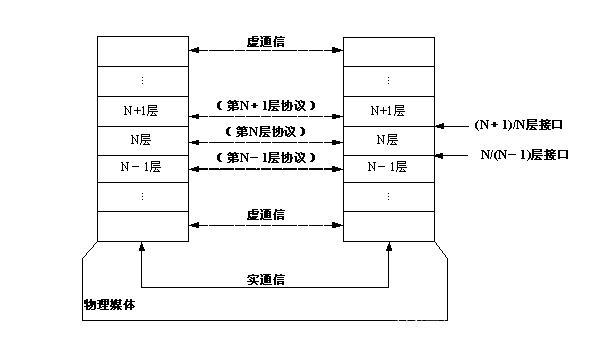

从上面这张图我们对计算机之间的通信特点进行整理一下：

（1）计算机之间的网络通信被分解为多个层，层与层之间用接口连接。

（2）通信的双方具有相同的层次，层次实现的功能由协议数据单元（PDU）来描述。

（3）不同系统中的同一层构成对等层，对等层之间通过对等层协议进行通信。

（4）在通信的时候数据必须由一层依次传递到下一层，不能跨级传输。

为了促进计算机网络的发展，国际标准化组织ISO在现有网络的基础上，提出了不基于具体机型、操作系统或公司的网络体系结构，称为开放系统互连参考模型，即OSI/RM。但是ISO制定的OSI参考模型过于庞大、复杂招致了许多批评。因此美国国防部提出了TCP/IP协议栈参考模型，简化了OSI参考模型，获得了广泛的应用。

1、OSI参考模型

这里首先介绍OSI参考模型，是国际标准化组织ISO提出的，把网络通信的工作分为7层，分别是物理层、数据链路层、网络层、传输层、会话层、表示层和应用层。也是我们在大学计算机网络课程中认识的那样。下面一张图来看看。

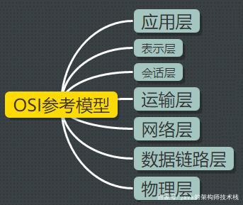

（1）物理层处于OSI的最底层，是开放系统的基础，它的功能主要是为计算机提供传送数据的通路以及传输数据。

（2）数据链路层的主要任务是实现计算机网络中相邻节点之间的可靠传输，把原始的、有差错的物理传输数据加上数据链路协议以后，构成逻辑上可靠的数据链路。

（3）网络层主要完成的功能主要包括路由选择、网络寻址、流量控制、拥塞控制、网络互连等。实现两个计算机节点之间的数据传输。

（4）传输层涉及源端节点到目的端节点之间可靠的信息传输。也就是说是采用TCP/IP还是采用UDP协议。他需要三次握手四次挥手。　　

（5）会话层的主要功能是负责应用程序之间建立、维持和中断会话，提供单工、半双工和全双工3种不同的通信方式，使系统和服务之间有序地进行通信。

（6）表示层关心所传输数据信息的格式定义，其主要功能是把应用层提供的信息变换为能够共同理解的形式，提供字符代码、数据格式、控制信息格式、加密等的统一表示。

（7）应用层是直接为应用进程提供服务的。其作用是多个系统应用进程相互通信的同时，完成一系列业务处理所需的服务。

2 、TCP/IP参考模型

TCP/IP参考模型采用4层的层级结构，每一层都呼叫它的下一层所提供的协议来完成自己的需求，这4个层次分别是：网络接口层、网络层（IP层）、传输层（TCP层）、应用层。

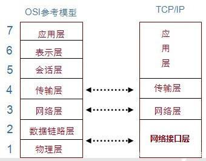

（1）网络接口层：对应着OSI参考模型的物理层和数据链路层

（2）网络层（IP层）：是整个TCP/IP协议栈的核心。它的功能是把分组数据发往目标网络或主机。可以完成将不同类型的网络（异构网）互连的任务。除此之外，还需要完成拥塞控制的功能。

（3）传输层（TCP层）：传输层负责在应用进程之间建立端到端的连接和可靠通信。TCP层涉及两个协议，TCP和UDP。TCP协议提供面向连接的服务，提供按字节流的有序、可靠传输，可以实现连接管理、差错控制、流量控制、拥塞控制等。也就是可靠传输。UDP协议提供无连接的服务，用于不需要或无法实现面向连接的网络应用中。也就是不可靠传输。

（4）应用层：为各种网络应用提供服务。

3、网络协议

OSI参考模型和TCP/IP模型在不同的层次中有许多不同的网络协议，如图所示：

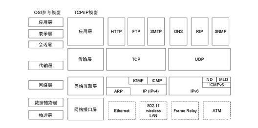

网络协议之间的关系图如下：

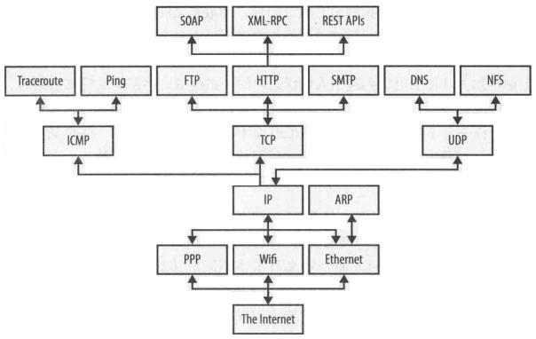

下面我们抽出来一些重要的协议看一下。其他的协议用到的时候再说。

（1）IP协议

IP协议的作用在于把各种数据包准备无误的传递给对方。由于IP地址是稀有资源，不可能每个人都拥有一个IP地址，所以我们通常的IP地址是路由器给我们生成的IP地址，路由器里面会记录我们的MAC地址。而MAC地址是全球唯一的。举例，IP地址就如同是我们居住小区的地址，而MAC地址就是我们住的那栋楼那个房间那个人。

（2）TCP协议

TCP层是位于IP层之上，应用层之下的中间层。有可靠的、像管道一样的TCP连接，还有不可靠的包交换的UDP链接。那tcp协议之间的通信数据格式是什么样子的呢？也就是什么样的数据在传输，下面一张图来看一下：

TCP报文段包括协议首部和数据两部分，协议首部的固定部分是20个字节，首部的固定部分后面是选项部分。

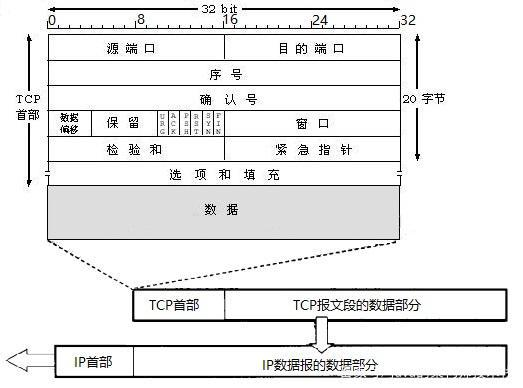

下面是报文段首部各个字段的含义，也是《计算机网络》书中的说明：

源端口号以及目的端口号：各占2个字节，端口是传输层和应用层的服务接口，用于寻找发送端和接收端的进程，一般来讲，通过端口号和IP地址，可以唯一确定一个TCP连接，在网络编程中，通常被称为一个socket接口。序号：Seq序号，占4个字节、32位。用来标识从TCP发送端向TCP接收端发送的数据字节流。发起方发送数据时对此进行标记。确认序号：Ack序号，占4个字节、32位。包含发送确认的一端所期望收到的下一个序号。只有ACK标记位为1时，确认序号字段才有效，因此，确认序号应该是上次已经成功收到数据字节序号加1，即Ack=Seq + 1。数据偏移：占4个字节，用于指出TCP首部长度，若不存在选项，则这个值为20字节，数据偏移的最大值为60字节。保留字段占6位，暂时可忽略，值全为0。标志位，6个URG(紧急)：为1时表明紧急指针字段有效ACK(确认)：为1时表明确认号字段有效PSH(推送)：为1时接收方应尽快将这个报文段交给应用层RST(复位)：为1时表明TCP连接出现故障必须重建连接SYN(同步)：在连接建立时用来同步序号FIN(终止)：为1时表明发送端数据发送完毕要求释放连接接收窗口：占2个字节，用于流量控制和拥塞控制，表示当前接收缓冲区的大小。在计算机网络中，通常是用接收方的接收能力的大小来控制发送方的数据发送量。TCP连接的一端根据缓冲区大小确定自己的接收窗口值，告诉对方，使对方可以确定发送数据的字节数。校验和：占2个字节，范围包括首部和数据两部分。选项是可选的，默认情况是不选。三次握手与四次挥手（超级重要。面试必问）

TCP是面向连接的协议，因此每个TCP连接都有3个阶段：连接建立、数据传送和连接释放。连接建立经历三个步骤，通常称为“三次握手”。

TCP三次握手过程如下：

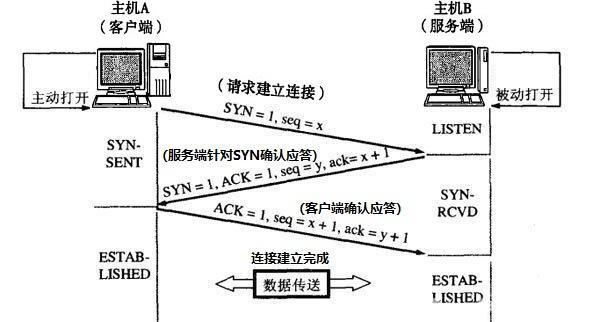

\1. 第一次握手（客户端发送请求）

男孩：“咱俩处对象吧”，并等待对方回复确认。

\2. 第二次握手（服务端回传确认）

女孩：告诉男孩说“可以”，

\3. 第三次握手（客户端回传确认）

男孩说：“那就在一块吧”，于是俩人有了情侣链接关系了。

注意：握手过程中传送的包里不包含数据，三次握手完毕后，客户端与服务器才正式开始传送数据。

TCP四次挥手过程如下：

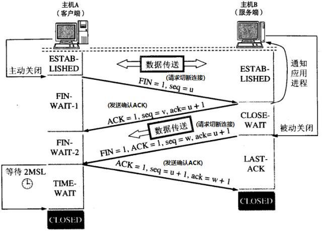

由于TCP连接是全双工的，因此每个方向都必须单独进行关闭。这原则是当一方完成它的数据发送任务后就能发送一个FIN来终止这个方向的连接。收到一个FIN只意味着这一方向上没有数据流动，一个TCP连接在收到一个FIN后仍能发送数据。首先进行关闭的一方将执行主动关闭，而另一方执行被动关闭。

\1. 女孩：要和男孩分手，并等待男孩回应

\2. 男孩：回复女孩，先同意分手，不过还是又考虑了一段时间。

\3. 男孩思考了一段时间，还是选择了分手。

\4. 女孩收到消息，于是俩人正式分手。

注意：为什么连接的时候是三次握手，关闭的时候却是四次挥手？

因为当服务端收到客户端的SYN连接请求报文后，可以直接发送SYN+ACK报文。其中ACK报文是用来应答的，SYN报文是用来同步的。但是关闭连接时，当服务端收到FIN报文时，很可能并不会立即关闭socket，所以只能先回复一个ACK报文，告诉客户端，“你发的FIN报文，我收到了”。只有等到服务端所有的报文都发送完了，我才能发送FIN报文，因此不能一起发送，故需要四步挥手。

（3）UDP协议

UDP，用户数据报协议，它是TCP/IP协议簇中无连接的运输层协议。

UDP是一个非连接的协议，传输数据之前源端和终端不建立连接，当它想传送时就简单地去抓取来自应用程序的数据，并尽可能快地把它扔到网络上。由于传输数据不建立连接，因此也就不需要维护连接状态，包括收发状态等，因此一台服务器可同时向多个客户端传输相同的消息。UDP信息包的标题很短，只有8个字节，相对于TCP的20个字节信息包的额外开销很小。吞吐量不受拥挤控制算法的调节，只受应用软件生成数据的速率、传输带宽、源端和终端主机性能的限制。UDP使用尽量最大努力交付，即不保证可靠交付，因此主机不需要维持复杂的链接状态表。UDP是面向报文的。发送方的UDP对应用程序交下来的报文，在添加首部受就向下交付给IP层。既不拆分，也不合并，而是保留这些报文的边界，因此，应用程序需要选择合适的报文大小。 2.2.3.1 UDP协议格式

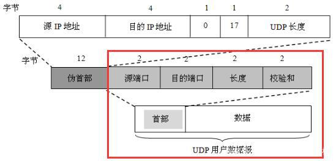

UDP协议由两部分组成：首部和数据。其中，首部仅有8个字节，包括源端口和目的端口、长度（UDP用于数据报的长度）、校验和。

（4） TCP与UDP的区别

TCP基于连接，UDP是无连接的；对系统资源的要求，TCP较多，UDP较少；UDP程序结构较简单；TCP是流模式，而UDP是数据报模式；TCP保证数据正确性，而UDP可能丢包；TCP保证数据顺序，而UDP不保证；（5）HTTP协议

HTTP，超文本传输协议，它是互联网上应用最为广泛的一种网络协议。HTTP是一种应用层协议，它是基于TCP协议之上的请求/响应式的协议。

对于从客户端到服务器的每一个请求，都有4个步骤：

默认情况下，客户端在端口80打开与服务器的一个TCP连接，URL中还可以指定其他端口。客户端向服务器发送消息，请求指定路径上的资源。这个资源包括一个首部，可选地（取决于请求的性质）还可以有一个空行，后面是这个请求的数据。服务器向客户端发送响应。响应以响应码开头，后面是包含数据的首部、一个空行以及所请求的文档或错误消息。服务器关闭连接。HTTP报文

HTTP协议是基于TCP协议之上的请求/响应式协议，下面主要介绍HTTP报文的格式，HTTP报文主要有请求报文和响应报文两种。

首先看HTTP请求报文的格式：

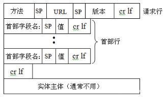

下图是谷歌浏览器内访问服务器查看的HTTP请求例子：

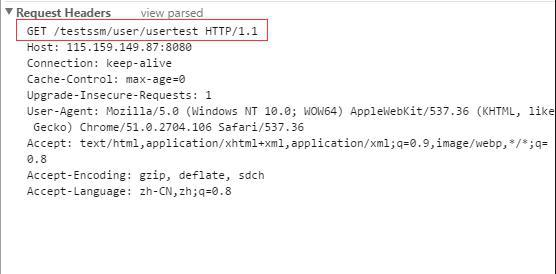

HTTP响应报文格式：

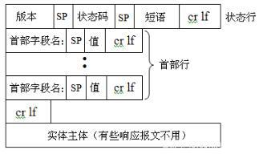

HTTP请求方法和响应状态码

在上面的HTTP请求报文例子中，我们可以看到请求方法是GET，这表示请求读取由URL所标志的信息，除了GET，还有其他几种常用的方法。

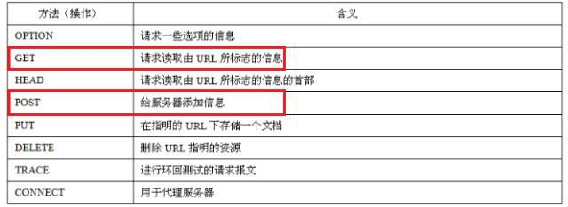

在HTTP响应报文的例子中，我们可以看到状态码是200，表示响应成功。下表是其他状态码，总共5大类，33种。

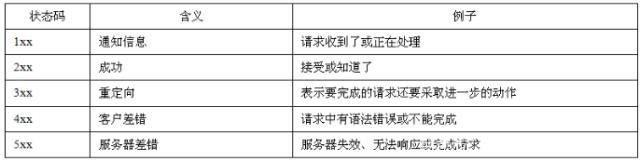

HTTP和HTTPS的区别

HTTP协议被用于在Web浏览器和网站服务器之间传递信息。HTTP协议以明文方式发送内容，不提供任何方式的数据加密，如果攻击者截取了Web浏览器和网站服务器之间的传输报文，就可以直接读懂其中的信息，因此HTTP协议不适合传输一些敏感信息，比如信用开号、密码等。

为了解决HTTP协议的这一缺陷，需要使用另一种协议：安全套接字层超文本传输协议HTTPS。为了数据传输的安全，HTTPS在HTTP的基础上加入了SSL协议，SSL依靠证书来验证服务器的身份，并为浏览器和服务器之间的通信加密。

HTTPS和HTTP的区别主要为以下四点：

https协议需要到ca申请证书，一般免费证书很少，需要缴费。http是超文本传输协议，信息是明文传输，https则是具有安全性的ssl加密传输协议。http和https使用的是完全不同的连接方式，用的端口也不一样，前者是80，后者是443。http的连接很简单，是无状态的；https协议是有ssl+http协议构建的可进行加密传输、身份认证的网络协议，比http协议安全。