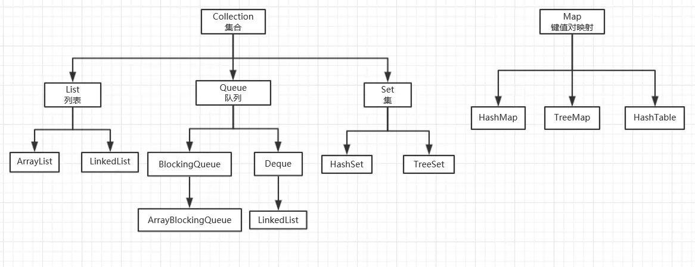

### java集合：

---

作为一个开发者，Java集合类是我们在工作中运用最多的、最频繁的类。相比于数组(Array)来说，集合类的长度可变，更加适合于现代开发需求；

Java集合就像一个容器，可以存储任何类型的数据，也可以结合泛型来存储具体的类型对象。在程序运行时，Java集合可以动态的进行扩展，随着元素的增加而扩大。在Java中，集合类通常存在于java.util包中。

Java集合主要由2大体系构成，分别是Collection体系和Map体系，其中Collection和Map分别是2大体系中的顶层接口。

Collection主要有三个子接口，分别为List（列表），Queue（队列），Set（集）。其中，List，Queue中的元素有序课重复，而Set中元素无序不可重复；

List主要有ArrayList、LinkedList两个实习类组成，Set则是由HashSet实现类；而Queue是在JDK1.5后才出现的新集合，主要以数组和链表两种形式存在。

Map同属于java.util包中，是集合的一部分，但与Collection是相互独立的，没有任何关系。Map中都是以key-value的形式存在，其中key必须唯一，主要有HashMap、HashTable、TreeMap三个实现类。

### 1、List

在Collection中，List集合是有序的，开发者可对其中的每个元素的插入位置进行精确地控制，可以通过索引来访问元素，遍历元素。

在List集合中，我们常用ArrayList和LinkedList两个类。

其中，ArrayList底层通过数组实现的，随着元素的增加而动态扩容。而LinkedList底层链表实现，随着元素的增加不断向链表后端增加节点。

ArrayList是Java集合框架中使用最多的一个类，是一个数组队列，线程不安全集合。

它继承于AbstractList，实现了List, RandomAccess, Cloneable, Serializable接口。
 (1)ArrayList实现List，得到了List集合框架基础功能；
 (2)ArrayList实现RandomAccess，获得了快速随机访问存储元素的功能，RandomAccess是一个标记接口，没有任何方法；

(3)ArrayList实现Cloneable，得到了clone()方法，可以实现克隆功能；
 (4)ArrayList实现Serializable，表示可以被序列化，通过序列化去传输，典型的应用就是hessian协议。

它具有如下特点：

- 容量不固定，随着容量的增加而动态扩容（阈值基本不会达到）
- 有序集合（插入的顺序==输出的顺序）
- 插入的元素可以为null
- 增删改查效率更高（相对于LinkedList来说）
- 线程不安全

