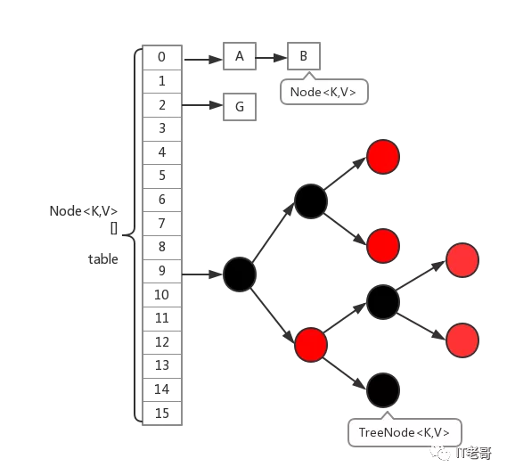
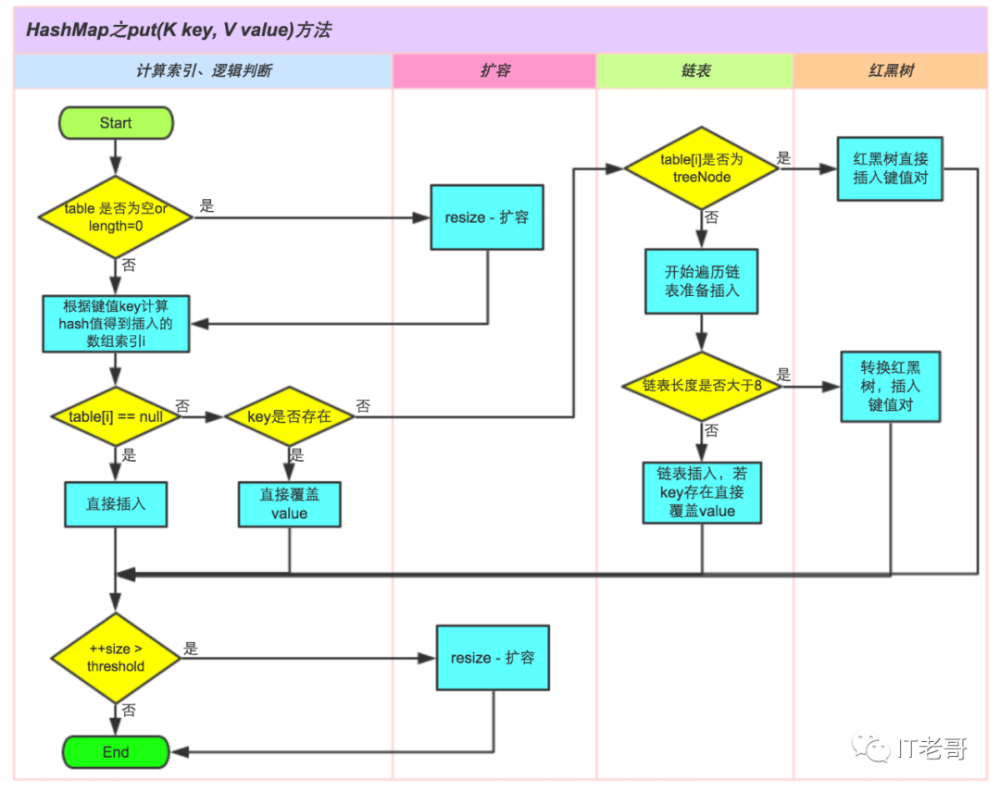
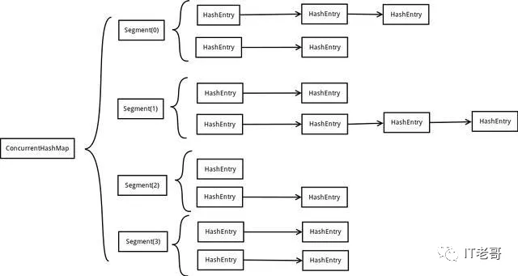

**第一题.    谈一下HashMap的特性？**

1.**HashMap**存储键值对实现快速存取，允许为null。key值不可重复，若key值重复则覆盖。

2.非同步，线程不安全。

3.底层是hash表，不保证有序

 

第二题.谈一下HashMap的JDK7和JDK8底层结构是什么？

JDK7采用的是数组+链表

JDK8采用的数组+链表+红黑树

 

第三题、链表的作用是什么？为什么JDK8引入了红黑树？

链表主要是为了解决数组中的key发生hash冲突时，将发生碰撞的key存到链表中

**红黑树主要是为了解决链表过长，的查询速度太慢问题，链表查询时间复杂度为O(n)**

当链表长度大于等于8时，就会转变成红黑树，时间复杂度为O(logn)

**当链表长度小于等于6时，由红黑树转变回链表，因为链表过短时引入红黑树反而会降低查询速度**

**第四题、那什么是hash冲突呢？**

**当两个不同的输入值，根据同一散列函数计算出相同的散列值的现象，我们就把它叫做碰撞（哈希碰撞）。**

 

**第五题、那有什么办法减少hash冲突吗**

**1.** **使用链地址法（使用散列表）来链接拥有相同hash**值的数据，就是我们上面说的链表；

**2.** 使用2次扰动函数（hash函数）来降低哈希冲突的概率，使得数据分布更平均；

**3.** **引入红黑树进一步降低遍历的时间复杂度，使得遍历更快；**

 

**第六题、说一说HashMap什么时候会进行扩容？扩容多大**

**HashMap有个参数叫负载因子，其实就是一个小数值0.75，也可以理解成75%**

**比如map的默认大小是16，当填满了75%的空间大小时就该扩容了**

16乘以0.75等于12，也就是说集合里存到12个了，就该进行提前扩容了，要不然过一会没地方存了，扩容成原来大小的2倍

 

**下面给大家看一张HashMap插入数据的全过程流程图**

 

**好，我们开始讲CocurrentHashMap****面试题**

**HashMap****是在单线程场景中用到的**

**而CocurrentHashMap****是在多线程环境下用到的**

 

**第七题：ConcurrentHashMap1.7****和1.8****的区别；**

**jdk1.7****：分段锁Segment****来进行实现的，Segment****继承了ReentrantLock****锁；**

**jdk1.8****：放弃了Segment****臃肿的设计，采用volatile+Node+CAS+Synchronized****来保证线程安全；**

 

**第八题：JDK1.7版本的CurrentHashMap的实现原理**

ConcurrentHashMap中采用了分段锁保证了线程安全

**分段锁称为Segment，它即类似于HashMap的结构，即内部拥有一个Entry数组，**

**数组中的每个元素又是一个链表,****同时又是一个ReentrantLock

**因为Segment****继承了ReentrantLock。

**ReentrantLock****就是实现多线程锁的关键

**所谓的分段锁就是将数据分成一段一段的存储，**

**然后给每一段数据配一把锁，**

**当一个线程占用锁访问其中一个段数据的时候，**

**其他段的数据也能被其他线程访问，能够实现真正的并发访问。**

**下面给大家展示他的结构图**

 

**第九题：JDK1.8版本的CurrentHashMap的实现原理**

**CocurrentHashMap?抛弃了原有的 Segment 分段锁，**

**采用了volatile+CAS+ synchronized****来保证并发安全性**

 

**下面面试官肯定会问volatile、CAS和synchronized的知识点**

**这些属于多线程知识的范畴，我在这里先简单讲一下，等讲多线程的时候会重点讲**

**volatile****是一个关键字，它保证了内存的可见性，**

**简单来说就是多个线程在运行过程中，当某一个线程对共享的变量作出修改后，**

**其他线程能不能看到该变量是否已经被改变的现象**

**synchronized****大家都比较熟悉，通过 synchronized** **关键字修饰后的方法或者代码块，**

**在多线程访问的时候，同一时刻只能有一个线程能够拿到这个锁**

**CAS****是英文单词Compare and Swap****的缩写，翻译过来就是比较并替换。是一种乐观锁**

**CAS****机制中使用了3****个基本操作数：内存地址V****，旧的预期值A****，要修改的新值B****。**

**当V****和A****一样时，更新成B**

**CAS****也存在一些问题：**

**1.ABA*问题**

**2.    循环时间开销大**

**3.**  **只能保证一个共享变量的原子操作**

**具体的等我们到了多线程的时候在仔细讲解**

### 10、HashTable

- 数组 + 链表方式存储
- 默认容量：11（质数为宜）
- put操作：首先进行索引计算 （key.hashCode() & 0x7FFFFFFF）% table.length；若在链表中找到了，则替换旧值，若未找到则继续；当总元素个数超过 容量 * 加载因子 时，扩容为原来 2 倍并重新散列；将新元素加到链表头部
- 对修改 Hashtable 内部共享数据的方法添加了 synchronized，保证线程安全

### 11、HashMap 与 HashTable 区别

- **默认容量不同，扩容不同**
- **线程安全性：HashTable 安全**
- **效率不同：HashTable 要慢，因为加锁**

### 12、可以使用 CocurrentHashMap 来代替 Hashtable 吗？

- 我们知道 Hashtable 是 synchronized 的，但是 ConcurrentHashMap 同步性能更好，因为它仅仅根据同步级别对 map 的一部分进行上锁
- ConcurrentHashMap 当然可以代替 HashTable，但是 HashTable 提供更强的线程安全性
- 它们都可以用于多线程的环境，但是当 Hashtable 的大小增加到一定的时候，性能会急剧下降，因为迭代时需要被锁定很长的时间。由于 ConcurrentHashMap 引入了分割（segmentation），不论它变得多么大，仅仅需要锁定 Map 的某个部分，其它的线程不需要等到迭代完成才能访问 Map。简而言之，在迭代的过程中，ConcurrentHashMap 仅仅锁定 Map 的某个部分，而 Hashtable 则会锁定整个 Map

### 13、说说你对红黑树的见解？

每个节点非红即黑

根节点总是黑色的

如果节点是红色的，则它的子节点必须是黑色的（反之不一定）

每个叶子节点都是黑色的空节点（NIL节点）

从根节点到叶节点或空子节点的每条路径，必须包含相同数目的黑色节点（即相同的黑色高度）、

### 14、链表过深问题为什么不用二叉查找树代替，而选择红黑树？为什么不一直使用红黑树？

之所以选择红黑树是为了解决二叉查找树的缺陷，二叉查找树在特殊情况下会变成一条线性结构（这就跟原来使用链表结构一样了，造成很深的问题），遍历查找会非常慢。

而红黑树在插入新数据后可能需要通过左旋，右旋、变色这些操作来保持平衡，引入红黑树就是为了查找数据快，解决链表查询深度的问题

我们知道红黑树属于平衡二叉树，但是为了保持“平衡”是需要付出代价的，但是该代价所损耗的资源要比遍历线性链表要少

所以当长度大于8的时候，会使用红黑树，如果链表长度很短的话，根本不需要引入红黑树，引入反而会慢。

