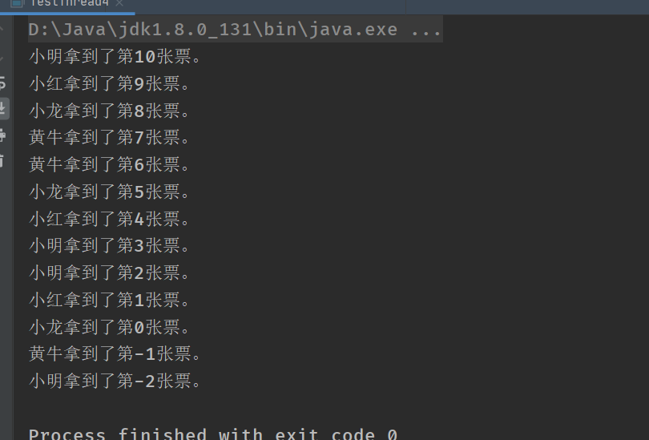

### 创建线程方式一：继承Thread

##### 1、同时执行，cpu决定交替执行


```java
//创建线程方式一：继承Thread类，重写run方法，调用start开启线程
public class TestThread1 extends Thread{

    @Override
    public void run() {
        //run方法线程体
        for (int i = 0; i <200 ; i++) {
            System.out.println("我在学习java呢！"+i);
        }
    }

    public static void main(String[] args) {
        //main线程主线程
        //创建一个线程对象
        TestThread1 testThread1 = new TestThread1();
        //调用start()方法开启线程
        testThread1.start();

        for (int i = 0; i <1000 ; i++) {
            System.out.println("我在看p站呢哈哈哈哈哈"+i);
        }
    }
}

```

##### 2、练习Thread，实现多线程同步下载图片

```java
//练习Thread，实现多线程同步下载图片
public class TestThread2 extends Thread{

    private String url;
    private String name;

    public  TestThread2(String url,String name){
        this.url=url;
        this.name=name;
    }

    @Override
    public void run() {
        WebDownLoader webDownLoader = new WebDownLoader();
        webDownLoader.downloader(url,name);
        System.out.println("下载的文件名："+name);
    }

    public static void main(String[] args) {
        TestThread2 t1 = new TestThread2("http://www.zto56.com/images/page/recruit-xuanjiang.png", "1.jpg");
        TestThread2 t2 = new TestThread2("http://www.zto56.com/images/page/recruit-xuanjiang.png", "2.jpg");
        TestThread2 t3= new TestThread2("http://www.zto56.com/images/page/recruit-xuanjiang.png", "3.jpg");

        t1.start();
        t2.start();
        t3.start();
    }
}

//下载器
class WebDownLoader{

    //下载方法
    public void downloader(String url,String name){

        try {
            //将url链接变成一个文件
            FileUtils.copyURLToFile(new URL(url),new File(name));
        } catch (IOException e) {
            e.printStackTrace();
            System.out.println("IO异常，downloader方法出现问题！");
        }
    }
}
```


### 创建线程方式二：实现Runnable接口：

```java
//创建线程方式2：实现Runnable接口，重写run方法，执行线程需要丢入Thread中
public class TestThread3 implements Runnable{
    @Override
    public void run() {
        for (int i = 0; i <200 ; i++) {
            System.out.println("我在学习java呢"+i);
        }
    }

    public static void main(String[] args) {


        TestThread3 t1 = new TestThread3();
        //执行线程
        new Thread(t1).start();


        for (int i = 0; i <1000 ; i++) {
            System.out.println("我在看bilibili呢"+i);
        }
    }
}
```

**总结：**

继承Thread类：

子类继承Thread类具备多线程能力

启动线程：子类对象.start()

**不建议使用：**避免OOP单继承的局限性


实现Runnable接口：

实现接口Runnble具备多线程的能力

启动线程：传入目标对象+Thread对象.start()

**推荐使用：**避免了单继承的局限性，灵活方便，方便同一个对象多个线程使用

##### 初始并发问题：

```java
//多个线程同时操作同一个对象
//抢火车票的例子
public class TestThread4 implements Runnable{

    //票数
    private int ticketNums=10;


    @Override
    public void run() {
        while (true){
            if (ticketNums<=0){
                break;
            }
            //模拟演示
            try {
                Thread.sleep(200);
            } catch (InterruptedException e) {
                e.printStackTrace();
            }

            System.out.println(Thread.currentThread().getName()+"拿到了第"+ticketNums--+"张票。");
        }


    }

    public static void main(String[] args) {
        TestThread4 t1=new TestThread4();

        new Thread(t1,"小明").start();
        new Thread(t1,"小红").start();
        new Thread(t1,"小龙").start();
        new Thread(t1,"黄牛").start();
    }
}

```

发现问题：多个线程操作同一个对象下，线程不安全，数据紊乱数据被破坏！




模拟龟兔赛跑：兔子走十步就停下休息，乌龟不休息

胜利者乌龟!

```java
//模拟龟兔赛跑
public class Race implements Runnable{

    private static String winner;//胜利者


    @Override
    public void run() {
        for (int i = 0; i <= 100; i++) {
            //模拟兔子休息
            if (Thread.currentThread().getName().equals("兔子")&&i%10==0){

                try {
                    Thread.sleep(200);
                } catch (InterruptedException e) {
                    e.printStackTrace();
                }
            }

            //判断比赛是否结束
            boolean flag=gameOver(i);
            if (flag){
                break;
            }

            System.out.println(Thread.currentThread().getName()+"跑了"+i+"步");
        }
    }

    //判断是否完成比赛
    private boolean gameOver(int steps){
        //判断是否有胜利者
        if (winner !=null){
            return true;
        }else {
            if (steps>=100){
                winner=Thread.currentThread().getName();
                System.out.println("winner is"+winner);
            return true;
            }
        }
        return false;
    }

    public static void main(String[] args) {
        Race race = new Race();

        new Thread(race,"兔子").start();
        new Thread(race,"乌龟").start();
    }

}

```

##### 创建线程方式三：实现Callable接口（了解即可）：

```java
public class TestCallable implements Callable {
    private  String name;
    private String url;

    public TestCallable(String name ,String url){
        this.name=name;
        this.url=url;
    }

    @Override
    public Boolean call() {
        WebDownLoader webDownLoader = new WebDownLoader();
        webDownLoader.downloader(url,name);

        System.out.println("文件下载中"+name);
        return true;
    }

    public static void main(String[] args) throws ExecutionException, InterruptedException {
        TestThread2 t1 = new TestThread2("7.jpg", "http://www.zto56.com/images/page/recruit-xuanjiang.png");
        TestThread2 t2 = new TestThread2("8.jpg", "http://www.zto56.com/images/page/recruit-xuanjiang.png");
        TestThread2 t3 = new TestThread2("9.jpg", "http://www.zto56.com/images/page/recruit-xuanjiang.png");


        //创建执行服务
        ExecutorService ser = Executors.newFixedThreadPool(3);

        //执行代码
        Future<Boolean> r1 = (Future<Boolean>) ser.submit(t1);
        Future<Boolean> r2 = (Future<Boolean>) ser.submit(t2);
        Future<Boolean> r3 = (Future<Boolean>) ser.submit(t3);

        //获取结果
        Boolean rs1 = r1.get();
        Boolean rs2 = r2.get();
        Boolean rs3 = r3.get();

        //关闭服务
        ser.shutdown();


    }
}

//下载器
class WebDownLoader1{

    //下载方法
    public void downloader(String url,String name){

        try {
            FileUtils.copyURLToFile(new URL(url),new File(name));
        } catch (IOException e) {
            e.printStackTrace();
            System.out.println("IO异常，downloader出错了！");
        }
    }
}
```


