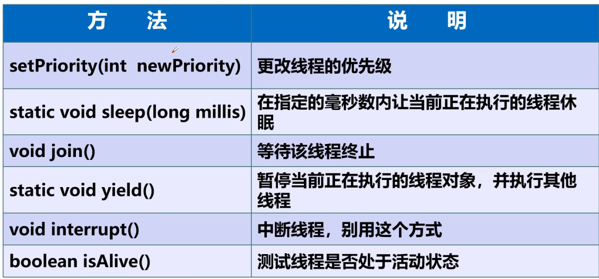
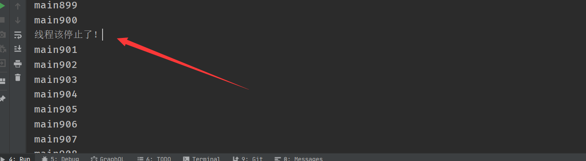
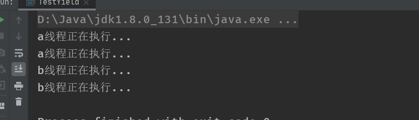
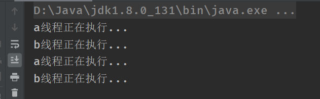

#### 线程方法：



##### 停止线程：

- 不推荐使用JDK提供的stop()、destroy()方法（已经废弃）
- 推荐线程自己停下来
- 建议使用一个标识位进行终止变量当flag=false，则终止线程运行。

```java
//测试stop
//1.建议现场正常停止---->利用次数，不建议以死循环
//2.建议使用标识位--->设置一个标识位置
//3.不使用stop或者destroy等过时方法或者jdk不建议的方法
public class TestStop implements Runnable{

    private  volatile Boolean flag =true;
    @Override
    public void run() {
         int i=0;
         while (flag){
             System.out.println("run...Thread"+i++);
         }
    }

    //2.设置一个公开的线程停止。转换标志位
    public void stop(){
        this.flag=false;
    }

    public static void main(String[] args) {
        TestStop stop = new TestStop();

        new Thread(stop).start();

        for (int i = 0; i < 1000; i++) {
            System.out.println("main"+i);
            if (i==900){
                stop.stop();
                System.out.println("线程该停止了！");
            }
        }

    }
}

```



##### 线程休眠：

- sleep（时间）指定当前线程阻塞的毫秒数
- sleep存在异常InterruptedException;
- sleep时间达到后现场进行就绪状态；
- sleep可以模拟网络延时，倒计时等
- **每个对象都有一个锁，sleep不会释放锁的。**

模拟网络延时方法问题的发生性：

```java
//模拟网络延时方法问题的发生性
public class TestSleep implements Runnable {
    //票数
    private int ticketNums=10;


    @Override
    public void run() {
        while (true){
            if (ticketNums<=0){
                break;
            }
            //模拟演示
            try {
                Thread.sleep(200);
            } catch (InterruptedException e) {
                e.printStackTrace();
            }

            System.out.println(Thread.currentThread().getName()+"拿到了第"+ticketNums--+"张票。");
        }


    }

    public static void main(String[] args) {
        TestSleep t1=new TestSleep();

        new Thread(t1,"小明").start();
        new Thread(t1,"小红").start();
        new Thread(t1,"小龙").start();
        new Thread(t1,"黄牛").start();
    }

}
```

模拟倒计时：

```java
//模拟网络延时
public class TestSleep2 {

    public static void main(String[] args) {
        try {
            tenDown();
        } catch (InterruptedException e) {
            e.printStackTrace();
        }
    }

    //模拟倒计时
    public static void tenDown() throws InterruptedException {
        int num=10;

        while (true){
            Thread.sleep(1000);//每一秒执行一下
            System.out.println(num--);

            if (num==0){ //num等于0结束
                break;
            }
        }
    }
}
```

打印时间：

```
//模拟网络延时
public class TestSleep2 {

    public static void main(String[] args) throws InterruptedException {
        //打印当前的系统时间
        Date date = new Date(System.currentTimeMillis());
        int num=10;
        while (true){
            try {
                Thread.sleep(1000);
                System.out.println(new SimpleDateFormat("HH:mm:ss").format(date));
                date = new Date(System.currentTimeMillis());//更新当前时间
            } catch (InterruptedException e) {
                e.printStackTrace();
            }
            num--;
            if (num==0){
             break;
            }
        }


    }

    //模拟倒计时
    public static void tenDown() throws InterruptedException {
        int num=10;

        while (true){
            Thread.sleep(1000);//每一秒执行一下
            System.out.println(num--);

            if (num==0){ //num等于0结束
                break;
            }
        }
    }
}
```

##### 线程礼让：

- 礼让线程，让当前的线程正在执行暂停，但不阻塞
- 将线程从运行状态转为就绪状态
- 让cpu重新调度，礼让不一定成功！看cpu心情！

```java
//测试礼让的线程
//礼让不一定成功，看cpu心情
public class TestYield {
    public static void main(String[] args) {

        MyYield myYield = new MyYield();

        new Thread(myYield,"a线程").start();
        new Thread(myYield,"b线程").start();
    }

}

class MyYield implements Runnable{

    @Override
    public void run() {
        System.out.println(Thread.currentThread().getName()+"正在执行...");
        Thread.yield();//礼让
        System.out.println(Thread.currentThread().getName()+"正在执行...");

    }
}
```

如果不加        Thread.yield();//礼让



加上礼让：


##### join：

- Join合并线程，待此线程执行完成后，在执行其他，其他线程阻塞
- 可以想象成为插队。

i=200时候，vip线程插队

```java
//测试join方法 可以想象为插队
public class TestJoin implements Runnable {
    @Override
    public void run() {
        for (int i = 0; i <50 ; i++) {
            System.out.println("vip来了！"+i);
        }
    }


    public static void main(String[] args) {
        TestJoin join = new TestJoin();
        Thread vip = new Thread(join, "我们是vip");
        vip.start();

        for (int i = 0; i <500 ; i++) {
            //当i为500的时候vip的线程插队

           if (i==200){
               try {
                   vip.join();//插队
               } catch (InterruptedException e) {
                   e.printStackTrace();
               }
           }
            System.out.println("main"+i);

        }

    }
}
```

线程状态：

```java
//线程状态
public class TestState {

    public static void main(String[] args) {
        Thread thread = new Thread(()->{

            for (int i = 0; i < 5; i++) {
                try {
                    Thread.sleep(1000);
                } catch (InterruptedException e) {
                    e.printStackTrace();
                }

            }
            System.out.println("................");
        });

        //观察状态
        Thread.State state = thread.getState();
        System.out.println(state);

        //观察启动后
        thread.start();//启动线程
        state = thread.getState();
        System.out.println(state);//输出状态


        while (state !=Thread.State.TERMINATED){//只要线程不停止，就一直输出

            try {
                Thread.sleep(100);
            } catch (InterruptedException e) {
                e.printStackTrace();
            }

            state = thread.getState();//更新线程的状态
            System.out.println(state);//输出状态

        }
    }
}

```

#### 线程优先级

1.Java提供一个线程调度器来监控程序中启动后进 入就绪状态的所有线程，线程调度器按照优先级决定应该调度哪个线程来执行。

2.线程的优先级用数字表示，范围从1~10.


```
Thread.MIN_PRIORITY=1;
Thread.MAX_PRIORITY=10;
Thread.NORM_PRIORITY=5;
```

**使用以下方式改变或获取优先级：**

getPriority()   setPriority(int xxx)

```java
//测试线程的优先级
public class TestPriority{
    public static void main(String[] args) {
        //主线程默认优先级
        System.out.println(Thread.currentThread().getName()+"--==--"+Thread.currentThread().getPriority());

        Mypriority mypriority = new Mypriority();

        Thread t1 = new Thread(mypriority);
        Thread t2 = new Thread(mypriority);
        Thread t3 = new Thread(mypriority);
        Thread t4 = new Thread(mypriority);
        Thread t5 = new Thread(mypriority);
        Thread t6 = new Thread(mypriority);

        //设置优先级，在启动
        t1.start();
        t2.setPriority(1);
        t2.start();

        t3.setPriority(4);
        t3.start();
        t4.setPriority(Thread.MAX_PRIORITY);
        t4.start();
    }

}

class Mypriority implements Runnable{

    @Override
    public void run() {
        System.out.println(Thread.currentThread().getName()+"--===--"+Thread.currentThread().getPriority());
    }
}
```

##### 守护线程（daemon）线程：

线程分为用户线程和守护线程

虚拟机必须确保用户线程执行完毕

虚拟机不用等待守护线程执行完毕

如，后台记录操作日志，监控内存，垃圾回收等待。。。

```java
//测试守护线程
//上帝守护着你
public class TestDaemon {

    public static void main(String[] args) {
        You you = new You();
        God god = new God();

        Thread thread = new Thread(god);
         thread.setDaemon(true);//设置守护线程，默认为false
        thread.start();//守护线程启动
        new Thread(you).start();//你用户线程启动

    }
}

//你
class You implements Runnable{

    @Override
    public void run() {
        for (int i = 0; i <36500 ; i++) {
            System.out.println("你开心的活着！");
        }
        System.out.println("-==========goodbyworld--==============");

    }
}

//上帝
class God implements Runnable{
    @Override
    public void run() {

        while (true){
            System.out.println("上帝守护着你！！！");
        }

    }
}
```

## 线程同步：

### 什么是线程同步和互斥

同步就是协同步调，按预定的先后次序进行运行。如：你说完，我再说。这里的同步千万不要理解成那个同时进行，应是指协同、协助、互相配合。线程同步是指多线程通过特定的设置（如互斥量，事件对象，临界区）来控制线程之间的执行顺序（即所谓的同步）也可以说是在线程之间通过同步建立起执行顺序的关系，如果没有同步，那线程之间是各自运行各自的！

线程互斥是指对于共享的进程系统资源，在各单个线程访问时的排它性。当有若干个线程都要使用某一共享资源时，任何时刻最多只允许一个线程去使用，其它要使用该资源的线程必须等待，直到占用资源者释放该资源。线程互斥可以看成是一种特殊的线程同步（下文统称为同步）。