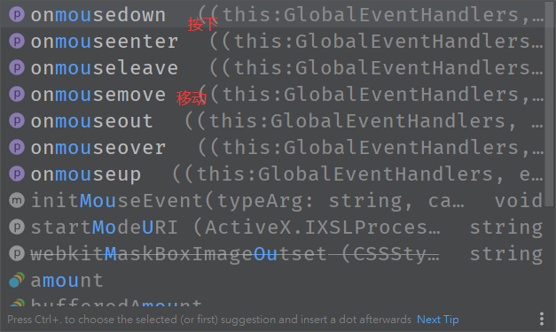

JavaScript

jQuery学习的API:   http://jquery.cuishifeng.cn/

### jQuery库，里面存在大量的JavaScript函数

> 获取jquery

引入：

```HTML
<!DOCTYPE html>
<html lang="en">
<head>
    <meta charset="UTF-8">
    <title>Title</title>
<!--    cdn引入-->
   <script src="http://lib.sinaapp.com/js/jquery/2.0.2/jquery-2.0.2.min.js"></script>

<!--    本地引入-->
   
</head>
<body>

</body>
</html>
```

#### **公式：**

公式:$(selector).action() ---$符号选择器，标签要做的事件

```html
<!DOCTYPE html>
<html lang="en">
<head>
    <meta charset="UTF-8">
    <title>Title</title>
<!--    cdn引入-->
  <script src="http://lib.sinaapp.com/js/jquery/2.0.2/jquery-2.0.2.min.js">
    </script>
<!--    本地引入-->

</head>
<body>
<!--
 公式:$(selector).action()
-->
<a href="" id="jquery-id">点我</a>


<script>


    //使用jQery后
    //选择器就是css中的选择器
    $('#jquery-id').click(function () {
       alert('你好jQuery!')
    });

</script>
</body>
</html>
```

> 选择器

#### 原生的js选择器少，麻烦不容易记住

**原生：**

```JavaScript
        //原生js，选择器少，麻烦不容易记住
        //标签选择器
        document.getElementsByTagName();
        //id选择器
        document.getElementById();
        //类选择器
        document.getElementsByClassName();
```

**jQuery：**

```JavaScript
   //jQuery css中的选择器它全部都能使用
         $('p').click();//标签选择器
        $('#id').click();//id选择器
        $('.class1').click();//class类选择器
```

文档工具站：  http://jquery.cuishifeng.cn/

> 事件

鼠标事件，键盘事件，其他事件



**事件：**

```html
<!DOCTYPE html>
<html lang="en">
<head>
    <meta charset="UTF-8">
    <title>Title</title>
    <script src="https://how2j.cn/study/jquery.min.js"></script>


    <style>
        #divMove{
            width: 500px;
            height: 500px;
            border: 1px solid aquamarine;
        }
    </style>
</head>
<body>


<!--获取鼠标当前一个坐标-->
mouse:   <span id="mouseMove"></span>

<div id="divMove">在这里点击鼠标试一试</div>


<script>
         //当页面元素加载完毕之后，响应事件
    $(function () {

       $('#divMove').mousemove(function (event) {
              $('#mouseMove').text('x:'+event.pageX+'y'+event.pageY);

       })
    });
</script>


</body>
</html>
```

#### 操作DOM

```JavaScript
 $('#test-ul li[name=python]').text(); //获得值
  $('#test-ul li[name=python]').text('设置值'); //设置值
  $('#test-ul').html();//获得值
  $('#test-ul').html('<strong>设置值</strong>');//设置值
```

#### css的操作

```javascript
 $('#test-ul li[name=python]').css({"color","red"})
 
```

元素的显示和隐藏：本地**dispiay : none**;

```javascript
 $('#test-ul li[name=python]').show()
 $('#test-ul li[name=python]').hide()
```

娱乐测试：

```javascript
$(window).width()
$(window).height()

```

后面的Ajax：

```javascript
$('#form').ajax()

$.ajax({ url: "test.html", context: document.body, success: function(){
    $(this).addClass("done");
}});
```


> 小技巧

1.如何巩固js(看jQuery源码，看游戏源码！)

2.巩固HTML。css（扒网站。全部dwon下来，然后对应修改看效果~）


Layer弹窗组件