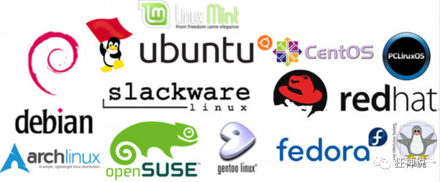

### 入门概述

---

linux诞生了这么多年，以前还喊着如何能取代windows系统，现在这个口号已经小多了，任何事物发展都有其局限性都有其天花板。就如同在国内再搞一个社交软件取代腾讯一样，想想而已基本不可能，因为用户已经习惯于使用微信交流，不是说技术上实现不了解而是老百姓已经习惯了，想让他们不用，即使他们自己不用亲戚朋友还是要用，没有办法的事情。

用习惯了windows操作系统，再让大家切换到别的操作系统基本上是不可能的事情，改变一个人已经养成的习惯太难。没有办法深入到普通老百姓的生活中，并不意味着linux就没有用武之地了。在服务器端，在开发领域linux倒是越来越受欢迎，很多程序员都觉得不懂点linux都觉得不好意思，linux在开源社区的地位依然岿然不动。

尤其是作为一个后端程序员，是必须要掌握Linux的，因为这都成为了你找工作的基础门槛了，所以不得不学习！

#### Linux简介：

Linux 的发行版说简单点就是将 Linux 内核与应用软件做一个打包。


目前市面上较知名的发行版有：Ubuntu、RedHat、CentOS、Debian、Fedora、SuSE、OpenSUSE、Arch Linux、SolusOS 等。



#### Linux 应用领域

今天各种场合都有使用各种 Linux 发行版，从嵌入式设备到超级计算机，并且在服务器领域确定了地位，通常服务器使用 LAMP（Linux + Apache + MySQL + PHP）或 LNMP（Linux + Nginx+ MySQL + PHP）组合。

目前 Linux 不仅在家庭与企业中使用，并且在政府中也很受欢迎。

- 巴西联邦政府由于支持 Linux 而世界闻名。
- 有新闻报道俄罗斯军队自己制造的 Linux 发布版的，做为 G.H.ost 项目已经取得成果。
- 印度的 Kerala 联邦计划在向全联邦的高中推广使用 Linux。
- 中华人民共和国为取得技术独立，在龙芯处理器中排他性地使用 Linux。
- 在西班牙的一些地区开发了自己的 Linux 发布版，并且在政府与教育领域广泛使用，如 Extremadura 地区的 gnuLinEx 和 Andalusia 地区的 Guadalinex。
- 葡萄牙同样使用自己的 Linux 发布版 Caixa Mágica，用于 Magalh?es 笔记本电脑和 e-escola 政府软件。
- 法国和德国同样开始逐步采用 Linux。


#### 环境搭建：

Linux 的安装，安装步骤比较繁琐，现在其实云服务器挺普遍的，价格也便宜，如果直接不想搭建，也可以直接买一台学习用用！

##### 安装CentOS（虚拟机安装，耗资源）

1、可以通过镜像进行安装！

2、可以使用我已经制作好的镜像！视频中讲解了该种方式！

3、安装 VMware 虚拟机软件，然后打开我们的镜像即可使用！

## 走近Linux系统

##### 开机登录

开机会启动许多程序。它们在Windows叫做"服务"（service），在Linux就叫做"守护进程"（daemon）。

开机成功后，它会显示一个文本登录界面，这个界面就是我们经常看到的登录界面，在这个登录界面中会提示用户输入用户名，而用户输入的用户将作为参数传给login程序来验证用户的身份，密码是不显示的，输完回车即可！

一般来说，用户的登录方式有三种：

- 命令行登录
- ssh登录
- 图形界面登录

最高权限账户为 root，可以操作一切！

##### 关机：

在linux领域内大多用在服务器上，很少遇到关机的操作。毕竟服务器上跑一个服务是永无止境的，除非特殊情况下，不得已才会关机。

关机指令为：shutdown ；

```
sync # 将数据由内存同步到硬盘中。

shutdown # 关机指令，你可以man shutdown 来看一下帮助文档。例如你可以运行如下命令关机：

shutdown –h 10 # 这个命令告诉大家，计算机将在10分钟后关机

shutdown –h now # 立马关机

shutdown –h 20:25 # 系统会在今天20:25关机

shutdown –h +10 # 十分钟后关机

shutdown –r now # 系统立马重启

shutdown –r +10 # 系统十分钟后重启

reboot # 就是重启，等同于 shutdown –r now

halt # 关闭系统，等同于shutdown –h now 和 poweroff
```

最后总结一下，不管是重启系统还是关闭系统，首先要运行 **sync** 命令，把内存中的数据写到磁盘中。

##### 系统目录结构：

登录系统后，在当前命令窗口下输入命令：

```
ls
```


树状目录结构：（Linux的一切资源都挂载在这个 / 根节点下）


**以下是对这些目录的解释：**

- **/bin**：bin是Binary的缩写, 这个目录存放着最经常使用的命令。
- **/boot：** 这里存放的是启动Linux时使用的一些核心文件，包括一些连接文件以及镜像文件。
- **/dev ：** dev是Device(设备)的缩写, 存放的是Linux的外部设备，在Linux中访问设备的方式和访问文件的方式是相同的。
- **/etc：** 这个目录用来存放所有的系统管理所需要的配置文件和子目录。
- **/home**：用户的主目录，在Linux中，每个用户都有一个自己的目录，一般该目录名是以用户的账号命名的。
- **/lib**：这个目录里存放着系统最基本的动态连接共享库，其作用类似于Windows里的DLL文件。
- **/lost+found**：这个目录一般情况下是空的，当系统非法关机后，这里就存放了一些文件。
- **/media**：linux系统会自动识别一些设备，例如U盘、光驱等等，当识别后，linux会把识别的设备挂载到这个目录下。
- **/mnt**：系统提供该目录是为了让用户临时挂载别的文件系统的，我们可以将光驱挂载在/mnt/上，然后进入该目录就可以查看光驱里的内容了。
- **/opt**：这是给主机额外安装软件所摆放的目录。比如你安装一个ORACLE数据库则就可以放到这个目录下。默认是空的。
- **/proc**：这个目录是一个虚拟的目录，它是系统内存的映射，我们可以通过直接访问这个目录来获取系统信息。
- **/root**：该目录为系统管理员，也称作超级权限者的用户主目录。
- **/sbin**：s就是Super User的意思，这里存放的是系统管理员使用的系统管理程序。
- **/srv**：该目录存放一些服务启动之后需要提取的数据。
- **/sys**：这是linux2.6内核的一个很大的变化。该目录下安装了2.6内核中新出现的一个文件系统 sysfs 。
- **/tmp**：这个目录是用来存放一些临时文件的。
- **/usr**：这是一个非常重要的目录，用户的很多应用程序和文件都放在这个目录下，类似于windows下的program files目录。
- **/usr/bin：** 系统用户使用的应用程序。
- **/usr/sbin：** 超级用户使用的比较高级的管理程序和系统守护程序。
- **/usr/src：** 内核源代码默认的放置目录。
- **/var**：这个目录中存放着在不断扩充着的东西，我们习惯将那些经常被修改的目录放在这个目录下。包括各种日志文件。
- **/run**：是一个临时文件系统，存储系统启动以来的信息。当系统重启时，这个目录下的文件应该被删掉或清除。

#### 常用的Linux命令：

平时一定要多使用这些基础的命令！

1）、cd : 改变目录。

2）、cd . . 回退到上一个目录，直接cd进入默认目录

3）、pwd : 显示当前所在的目录路径。

4）、ls(ll):  都是列出当前目录中的所有文件，只不过ll(两个ll)列出的内容更为详细。

5）、touch : 新建一个文件 如 touch index.js 就会在当前目录下新建一个index.js文件。

6）、rm:  删除一个文件, rm index.js 就会把index.js文件删除。

7）、mkdir:  新建一个目录,就是新建一个文件夹。

8）、rm -r :  删除一个文件夹, rm -r src 删除src目录

```
rm -rf / 切勿在Linux中尝试！删除电脑中全部文件！
```

9）、mv 移动文件, mv index.html src index.html 是我们要移动的文件, src 是目标文件夹,当然, 这样写,必须保证文件和目标文件夹在同一目录下。

10）、reset 重新初始化终端/清屏。

11）、clear 清屏。

12）、history 查看命令历史。

13）、help 帮助。

14）、exit 退出。

15）、#表示注释