# MybatisPlus笔记

##### MyBatisPlus概述：

是什么？ MyBatis 本来就是简化 JDBC 操作的！

官网：https://mp.baomidou.com/ MyBatis Plus，简化 MyBatis ！

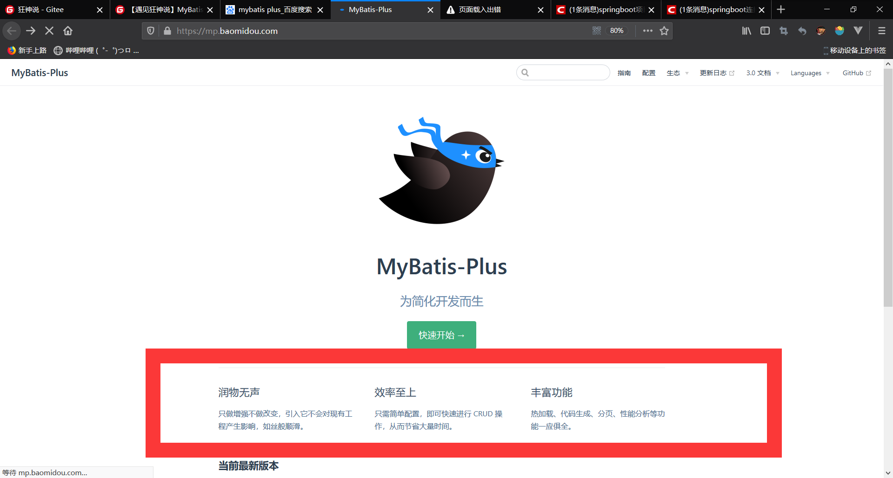

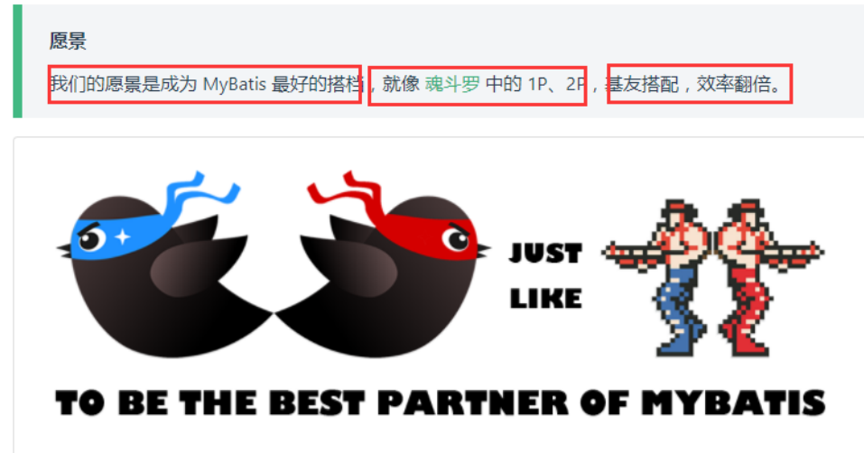

#### 特性

- **无侵入**：只做增强不做改变，引入它不会对现有工程产生影响，如丝般顺滑
- **损耗小**：启动即会自动注入基本 CURD，性能基本无损耗，直接面向对象操作
- **强大的 CRUD 操作**：内置通用 Mapper、通用 Service，仅仅通过少量配置即可实现单表大部分 CRUD 操作，更有强大的条件构造器，满足各类使用需求
- **支持 Lambda 形式调用**：通过 Lambda 表达式，方便的编写各类查询条件，无需再担心字段写错
- **支持主键自动生成**：支持多达 4 种主键策略（内含分布式唯一 ID 生成器 - Sequence），可自由配置，完美解决主键问题
- **支持 ActiveRecord 模式**：支持 ActiveRecord 形式调用，实体类只需继承 Model 类即可进行强大的 CRUD 操作
- **支持自定义全局通用操作**：支持全局通用方法注入（ Write once, use anywhere ）
- **内置代码生成器**：采用代码或者 Maven 插件可快速生成 Mapper 、 Model 、 Service 、 Controller 层代码，支持模板引擎，更有超多自定义配置等您来使用
- **内置分页插件**：基于 MyBatis 物理分页，开发者无需关心具体操作，配置好插件之后，写分页等同于普通 List 查询
- **分页插件支持多种数据库**：支持 MySQL、MariaDB、Oracle、DB2、H2、HSQL、SQLite、Postgre、SQLServer 等多种数据库
- **内置性能分析插件**：可输出 Sql 语句以及其执行时间，建议开发测试时启用该功能，能快速揪出慢查询
- **内置全局拦截插件**：提供全表 delete 、 update 操作智能分析阻断，也可自定义拦截规则，预防误操作

#### 支持数据库

- mysql 、 mariadb  、  oracle  、  db2  、  h2  、  hsql  、  sqlite  、  postgresql  、  sqlserver 、 presto
- 达梦数据库  、 虚谷数据库  、  人大金仓数据库

#### 入门：

地址：https://mp.baomidou.com/guide/quick-start.html#初始化工程

使用第三方组件：

1、导入对应的依赖

2、研究依赖如何配置

3、代码如何编写

4、提高扩展技术能力！

##### 案例：

1、创建数据库 mybatis_plus 

2、创建user表 

```sql
DROP TABLE IF EXISTS user; CREATE TABLE user ( 
id BIGINT(20) NOT NULL COMMENT '主键ID',
name VARCHAR(30) NULL DEFAULT NULL COMMENT '姓名', 
age INT(11) NULL DEFAULT NULL COMMENT '年龄', 
email VARCHAR(50) NULL DEFAULT NULL COMMENT '邮箱', 
PRIMARY KEY (id) );
INSERT INTO user (id, name, age, email) VALUES (1, 'Jone', 18, 'test1@baomidou.com'), (2, 'Jack', 20, 'test2@baomidou.com'), (3, 'Tom', 28, 'test3@baomidou.com'), (4, 'Sandy', 21, 'test4@baomidou.com'), (5, 'Billie', 24, 'test5@baomidou.com'); -- 真实开发中，version（乐观锁）、deleted（逻辑删除）、gmt_create、gmt_modified
```

3、编写项目，初始化项目！使用SpringBoot初始化！

4、导入依赖

```xml
        <dependency>
            <groupId>org.springframework.boot</groupId>
            <artifactId>spring-boot-starter-web</artifactId>
        </dependency>
        <!-- 数据库驱动 -->
        <dependency>
            <groupId>mysql</groupId>
            <artifactId>mysql-connector-java</artifactId>
        </dependency>
        <!-- lombok -->
        <dependency>
            <groupId>org.projectlombok</groupId>
            <artifactId>lombok</artifactId>
        </dependency>
        <!-- mybatis-plus -->
        <!-- mybatis-plus 是自己开发，并非官方的！ -->
        <dependency> <groupId>com.baomidou</groupId>
            <artifactId>mybatis-plus-boot-starter</artifactId>
            <version>3.0.5</version>
    </dependency>
```

说明：我们使用 mybatis-plus 可以节省我们大量的代码，尽量不要同时导入 mybatis 和 mybatis-plus！版本的差异！

5、连接数据库！这一步和 mybatis 相同！

```properties
# mysql 5 驱动不同 com.mysql.jdbc.Driver
# mysql 8 驱动不同com.mysql.cj.jdbc.Driver、需要增加时区的配置 serverTimezone=GMT%2B8
spring.datasource.username=root
spring.datasource.password=1460595002
spring.datasource.url=jdbc:mysql://localhost:3306/mybatis-plus?useSSL=false&useUnicode=true&characterEncoding=utf-8&serverTimezone=GMT%2B8
spring.datasource.driver-class-name=com.mysql.cj.jdbc.Driver
# 配置日志
mybatis-plus.configuration.log-impl=org.apache.ibatis.logging.stdout.StdOutImpl
```

6、传统方式pojo-dao（连接mybatis，配置mapper.xml文件）-service-controller

使用了mybatis-plus 之后

pojo：

```java
@Data
@AllArgsConstructor
@NoArgsConstructor
public class User {
    private Long id;
    private String name;
    private Integer age;
    private String email;
}
```

mapper接口：

```java
// 在对应的Mapper上面继承基本的类 BaseMapper
public interface UserMapper  extends BaseMapper<User> {
// 所有的CRUD操作都已经编写完成了
// 你不需要像以前的配置一大堆文件了！
}
```

注意点，我们需要在主启动类上去扫描我们的mapper包下的所有接口

**@MapperScan("cn.jinronga.mapper")**

测试：

```java
    // 继承了BaseMapper，所有的方法都来自己的父类
    // 我们也可以编写自己的扩展方法！
    @Autowired
    private UserMapper userMapper;
    @Test
    void contextLoads() {
        // 参数是一个 Wrapper ，条件构造器，这里我们先不用 null 
        // 查询全部用户
        List<User> users = userMapper.selectList(null);
        users.forEach(System.out::println);
    }
```

结果：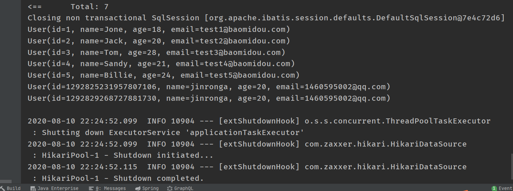


注：

1、SQL谁帮我们写的 ? MyBatis-Plus 都写好了

2、方法哪里来的？ MyBatis-Plus 都写好了


##### MybatisPlus配置日志：

我们所有的sql现在是不可见的，我们希望知道它是怎么执行的，所以我们必须要看日志！

```properties
# 配置日志 
mybatis-plus.configuration.logimpl=org.apache.ibatis.logging.stdout.StdOutImpl
```


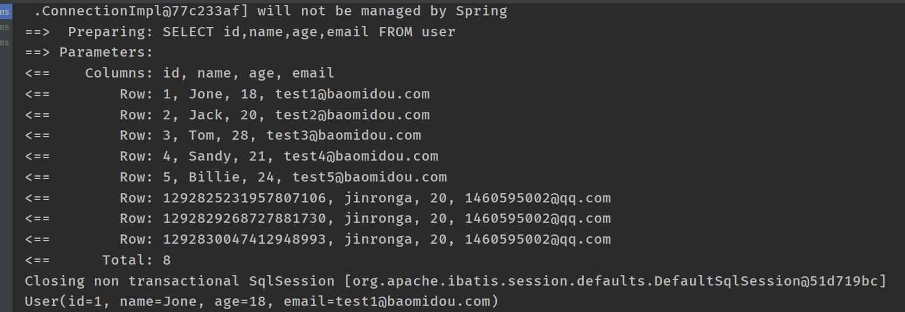


#### CRUD:

> Insert插入：


```java
@Test
void insertTest() {
    User user = new User();
    user.setName("jinronga");
    user.setAge(20);
    user.setEmail("1460595002@qq.com");
    //INSERT INTO user ( name, age, email, create_time, update_time ) VALUES ( ?, ?, ?, ?, ? ) 
    int insert = userMapper.insert(user);// 帮我们自动生成id
    System.out.println(user); // 发现，id会自动回填
    System.out.println(insert);// 受影响的行数

}
```

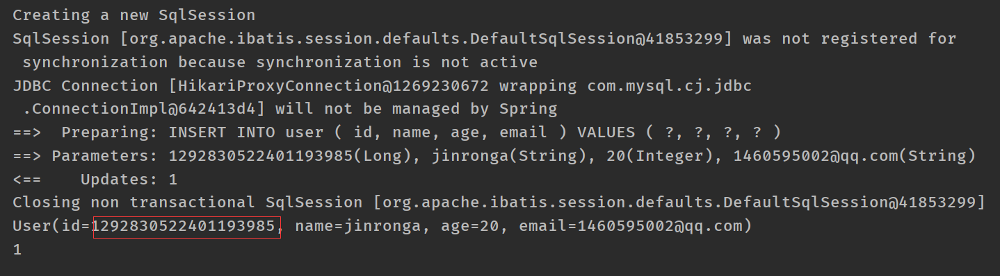

数据库插入的id的默认值为：全局的唯一id

默认 ID_WORKER 全局唯一id

分布式系统唯一id生成：https://www.cnblogs.com/haoxinyue/p/5208136.html

**雪花算法：**

snowflflake是Twitter开源的分布式ID生成算法，结果是一个long型的ID。其核心思想是：使用41bit作为

毫秒数，10bit作为机器的ID（5个bit是数据中心，5个bit的机器ID），12bit作为毫秒内的流水号（意味

着每个节点在每毫秒可以产生 4096 个 ID），最后还有一个符号位，永远是0。可以保证几乎全球唯

一！

##### 主键自增

我们需要配置主键自增：

1、实体类字段上 **@TableId(type = IdType.AUTO)** 

2、数据库字段一定要是自增！

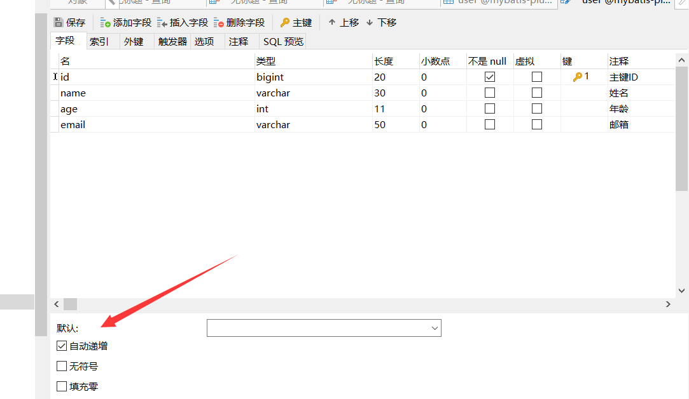

3、再次测试插入即可！


##### IdType源码解释：

```java
public enum IdType {
    AUTO(0), //数据库id自增
    NONE(1),//未设置主键
    INPUT(2),//手动写入
       /* 以下3种类型、只有当插入对象ID 为空，才自动填充。 */
    ID_WORKER(3),//默认全局唯一的id
    UUID(4),//全局唯一id uuid
    ID_WORKER_STR(5);//ID_WORKER 字符串表示法

    private int key;

    private IdType(int key) {
        this.key = key;
    }

    public int getKey() {
        return this.key;
    }
}
```

#### Update：

```java
@Test
void testUpdate(){
    User user = new User();
    // 通过条件自动拼接动态sql
    user.setId(1292830522401193987L);
    user.setName("学习");
    user.setEmail("1460595002@edfd");

    //updateById是对象
    int i = userMapper.updateById(user);
    System.out.println(i);
}
```

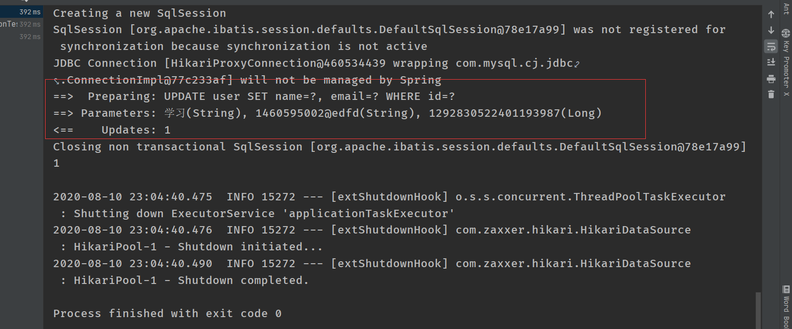


#### 自动填充：

创建时间、修改时间！这些个操作一遍都是自动化完成的，我们不希望手动更新！

阿里巴巴开发手册：所有的数据库表：gmt_create、gmt_modifified几乎所有的表都要配置上！而且需要自动化！

##### 方式一：数据库级别（工作中不允许你修改数据库）

1、在表中新增字段 create_time, update_time

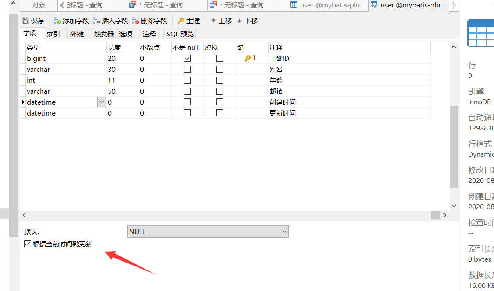


2、再次测试插入方法，我们需要先把实体类同步！

```java
private Date createTime;
private Date updateTime;
```


3、再次更新查看结果即可


方式二：代码级别\

1、删除数据库的默认值、更新操作！

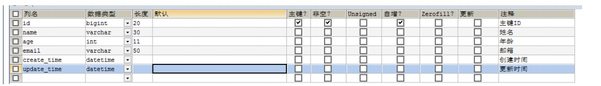

2、实体类字段属性上需要增加注解

```java
// 字段添加填充内容 
@TableField(fill = FieldFill.INSERT) 
private Date createTime;
@TableField(fill = FieldFill.INSERT_UPDATE) 
private Date updateTime;
```

3、编写处理器来处理这个注解即可！

```java
@Slf4j
@Component //一定不要忘记把处理器加到IOC容器中
public class MyMetaObjectHandler implements MetaObjectHandler {
    //插入填充策略
    @Override
    public void insertFill(MetaObject metaObject) {
      log.info("start insert fill。。。");
        // setFieldValByName(String fieldName, Object fieldVal, MetaObject metaObject
        this.setFieldValByName("createTime",new Date(),metaObject);
        this.setFieldValByName("updateTime",new Date(),metaObject);
    }
    // 更新时的填充策略
    @Override
    public void updateFill(MetaObject metaObject) {
        log.info("start update fill.....");
        this.setFieldValByName("updateTime",new Date(),metaObject);

    }
}
```


4、测试插入

5、测试更新、观察时间即可！


#### 乐观锁:

##### 乐观锁(Optimistic Lock)

顾名思义，就是很乐观，每次去拿数据的时候都认为别人不会修改，所以不会上锁，但是在更新的时候会判断一下在此期间别人有没有去更新这个数据，可以使用版本号等机制。乐观锁适用于多读的应用类型，这样可以提高吞吐量，像数据库如果提供类似于write_condition机制的其实都是提供的乐观锁。


##### 悲观锁(Pessimistic Lock)

顾名思义，就是很悲观，每次去拿数据的时候都认为别人会修改，所以每次在拿数据的时候都会上锁，这样别人想拿这个数据就会block直到它拿到锁。传统的关系型数据库里边就用到了很多这种锁机制，比如行锁，表锁等，读锁，写锁等，都是在做操作之前先上锁。它指的是对数据被外界（包括本系统当前的其他事务，以及来自外部系统的事务处理）修改持保守态度，因此，在整个数据处理过程中，将数据处于锁定状态。悲观锁的实现，往往依靠数据库提供的锁机制（也只有数据库层提供的锁机制才能真正保证数据访问的排他性，否则，即使在本系统中实现了加锁机制，也无法保证外部系统不会修改数据）。


两种锁各有优缺点，不可认为一种好于另一种，像乐观锁适用于写比较少的情况下，即冲突真的很少发生的时候，这样可以省去了锁的开销，加大了系统的整个吞吐量。但如果经常产生冲突，上层应用会不断的进行retry，这样反倒是降低了性能，所以这种情况下用悲观锁就比较合适。本质上，数据库的乐观锁做法和悲观锁做法主要就是解决下面假设的场景，避免丢失更新问题：

##### 乐观锁实现方式：

- 取出记录时，获取当前 version
- 更新时，带上这个version
- 执行更新时， set version = newVersion where version = oldVersion
- 如果version不对，就更新失败

```sql
乐观锁：1、先查询，获得版本号 version = 1
-- A 
update user set name = "kuangshen", version = version + 1 where id = 2 and version = 1
-- B 
线程抢先完成，这个时候 version = 2，会导致 A 修改失败！
update user set name = "kuangshen", version = version + 1 where id = 2 and version = 1
```

##### 测试一下MP的乐观锁插件

1、给数据库中增加version字段！


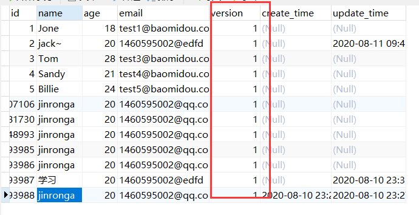

2、我们实体类加对应的字段

```java
@Version 
//乐观锁Version注解
private Integer version;
```

3、注册组件

```java
//扫描我们的mapper文件夹
@MapperScan("cn.jinronga.mapper")
@EnableTransactionManagement
@Configuration//配置类
public class MyBatisPlusConfig {


    //注册乐观锁插件
    // 注册乐观锁插件
    @Bean
    public OptimisticLockerInterceptor optimisticLockerInterceptor() {
        return new OptimisticLockerInterceptor();
    }
}
```


测试：

```java
@Test
void testOptimisticLocker(){
    //1、查询用户信息
    User user = new User();
    //2、修改用户信息
    user.setId(2L);
    user.setName("jack~");
    user.setEmail("1460595002@edfd");
   //3、执行更新操作
   userMapper.updateById(user);

}

// 测试乐观锁失败！多线程下
    @Test
    void testOptimisticLocker2(){
        //线程1
        User user = userMapper.selectById(2L);
        user.setName("jack~~");
        user.setAge(20);
        userMapper.updateById(user);

       // 模拟另外一个线程执行了插队操作
        User user1 = userMapper.selectById(2L);
        user1.setName("jinrongaa");
        user1.setAge(20);
         userMapper.updateById(user1);

        // 自旋锁来多次尝试提交！
        userMapper.updateById(user);// 如果没有乐观锁就会覆盖插队线程的值！
    }
```


##### SELECT:

```java
    //测试查询
   @Test
    void testSelectById(){
       User user = userMapper.selectById(1L);
       System.out.println(user);
   }
   //测试批量查询
   @Test
    void testSelectByBatchId(){

       List<User> users = userMapper.selectBatchIds(Arrays.asList(1, 2, 3, 4));
     users.forEach(System.out::println);

   }

    // 按条件查询之一使用map操作
    @Test
    public void testSelectByBatchIds(){
        HashMap<String, Object> map = new HashMap<>();
        map.put("name","jinrongaa");
        map.put("email","1460595002@edfd");
        List<User> users = userMapper.selectByMap(map);
        users.forEach(System.out::println);
    }
```

**分页查询**

1、原始的 limit 进行分页

2、pageHelper 第三方插件

3、Mybatis-Plus 其实也内置了分页插件

**使用：**

1、配置拦截器组件即可

```java
// 分页插件
@Bean
public PaginationInterceptor paginationInterceptor() {
    return new PaginationInterceptor();
}
```

2、直接使用Page对象即可！

```java
//测试分页查询
@Test
void testPage(){
    //参数一：当前页
    //参数二：页面大小
    // 使用了分页插件之后，所有的分页操作也变得简单的！
    Page<User> page = new Page<>(2,5);
   userMapper.selectPage(page,null);

   page.getRecords().forEach(System.out::println);
    System.out.println(page.getTotal());//记录总数

}
```

##### DELETE:

 

```java
//测试删除
@Test
void testDeleteById(){
    //DELETE FROM user WHERE id=?
    userMapper.deleteById(1292830522401193988L);
}

//通过id批量删除
@Test
void testDeleteBatchId(){

  // DELETE FROM user WHERE id IN ( ? , ? , ? )  userMapper.deleteBatchIds(Arrays.asList(1292830522401193987L,1292830522401193986l,1292830522401193985L));

}

//通过map删除
@Test
void testDeleteMap(){
    //sql:DELETE FROM user WHERE name = ? AND email = ?
    HashMap<String, Object> map = new HashMap<>();
    map.put("name","jinronga");
    map.put("email","1460595002@qq.com");
    userMapper.deleteByMap(map);
}
```


#### 逻辑删除：

**物理删除：**从数据库中直接移出

**逻辑删除：**再数据库中没有被移除，而是通过一个变量来让他失效！ deleted = 0 => deleted = 1

管理员可以查看被删除的记录！防止数据的丢失，类似于回收站

测试：

1、在数据表中增加一个 deleted 字段

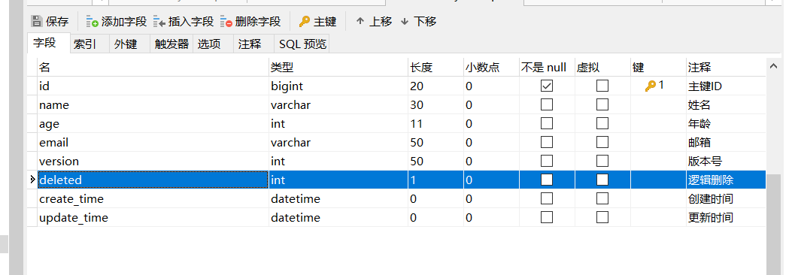

2、实体类中增加属性

```java
    @TableLogic//逻辑删除
    private Integer deleted;
```

3、配置

```java
// 逻辑删除组件！
@Bean
public ISqlInjector sqlInjector() { 
    return new LogicSqlInjector(); 
}
```

```properties
#配置逻辑删除
#逻辑未删除的值0
mybatis-plus.global-config.db-config.logic-not-delete-value=0
#逻辑已经删除的值1
mybatis-plus.global-config.db-config.logic-delete-value=1
```


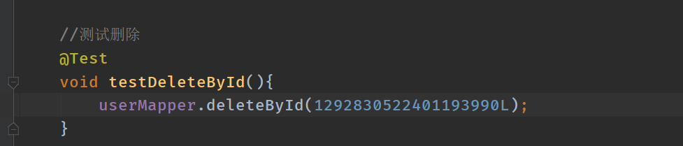

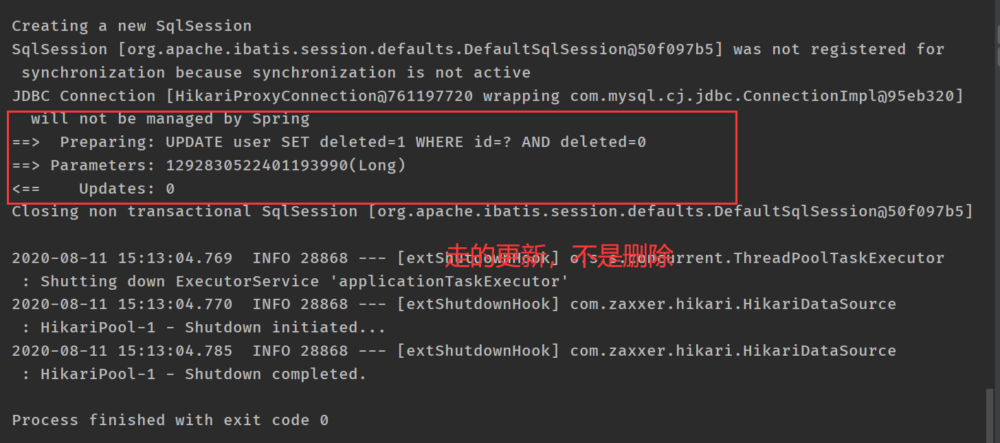

数据库：

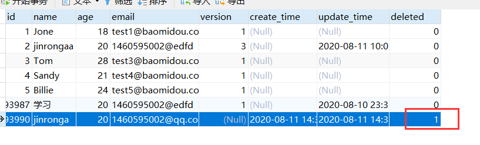

记录依旧在数据库，但是值确已经变化了！

在测试查询所有

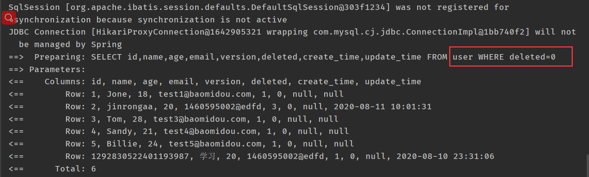

查询的时候过滤只查询deleted为“0”的字段，1的代表逻辑删除了


#### 条件构造器：

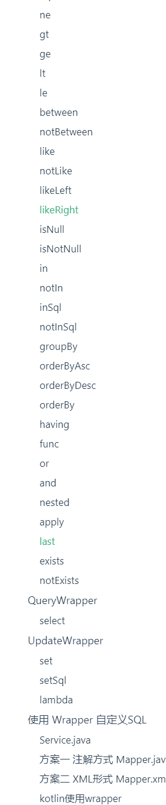


地址：https://mp.baomidou.com/guide/wrapper.html


1、测试一: 查询name不为空的用户，并且邮箱不为空的用户，年龄大于12

```java
    @Test
    void contextLoadWrapper() {
        //查询name不为空的用户，并且邮箱不为空的用户，年龄大于12
        QueryWrapper<User> wrapper = new QueryWrapper<>();
        wrapper.isNotNull("name")
                .isNotNull("email")
                //ge:大于等于 >=
                .ge("age",12);
        List<User> users = userMapper.selectList(wrapper);

        users.forEach(System.out::println);

    }
```

2、测试二：

查询名字jinrongaa

```java
@Test
void test(){
    //查询名字jinrongaa

    QueryWrapper<User> wrapper = new QueryWrapper<>();

    wrapper.eq("name","jinrongaa");
    List<User> users = userMapper.selectList(wrapper);
    users.forEach(System.out::println);
}
```

3、测试三：

查询年龄20-30岁用户

```java
@Test
    void test1(){
        //查询年龄20-30岁用户
        QueryWrapper<User> wrapper= new QueryWrapper<>();
        wrapper.between("age",20,30);

        List<User> users = userMapper.selectList(wrapper);
        users.forEach(System.out::println);
    }
```

4、测试四：模糊查询、

```java
@Test
void test2(){
    //模糊查询
    QueryWrapper<User> wrapper = new QueryWrapper<>();

    //左和右
    wrapper.notLike("name","e")
            .likeRight("email","t");


    List<Map<String, Object>> maps = userMapper.selectMaps(wrapper);
    maps.forEach(System.out::println);

}
```

5.测试五：模糊查询

id在子查询中查出来


```java
@Test
void test4(){
    QueryWrapper<User> wrapper = new QueryWrapper<>();

    //id在子查询中查出来
    //SELECT id,name,age,email,version,deleted,create_time,update_time FROM user WHERE deleted=0 AND id IN (select id from user where id<3) 
    wrapper.inSql("id","select id from user where id<3");

    List<User> users = userMapper.selectList(wrapper);
    users.forEach(System.out::println);
}
```

6.测试六：通过id进行排序

```java
    @Test
    void test3(){
        //通过id进行排序
        QueryWrapper<User> wrapper = new QueryWrapper<>();
       // SELECT id,name,age,email,version,deleted,create_time,update_time FROM user WHERE deleted=0 ORDER BY id ASC   
        //升序
        wrapper.orderByAsc("id");

        List<User> users = userMapper.selectList(wrapper);
        users.forEach(System.out::println);
    }
```


#### 代码生成器：

```java
// 演示例子，执行 main 方法控制台输入模块表名回车自动生成对应项目目录中
public class CodeGenerator {

    /**
     * <p>
     * 读取控制台内容
     * </p>
     */
    public static String scanner(String tip) {
        Scanner scanner = new Scanner(System.in);
        StringBuilder help = new StringBuilder();
        help.append("请输入" + tip + "：");
        System.out.println(help.toString());
        if (scanner.hasNext()) {
            String ipt = scanner.next();
            if (StringUtils.isNotEmpty(ipt)) {
                return ipt;
            }
        }
        throw new MybatisPlusException("请输入正确的" + tip + "！");
    }

    public static void main(String[] args) {
        // 代码生成器
        AutoGenerator mpg = new AutoGenerator();

        // 全局配置
        GlobalConfig gc = new GlobalConfig();
        String projectPath = System.getProperty("user.dir");
        gc.setOutputDir(projectPath + "/src/main/java");
        gc.setAuthor("jobob");
        gc.setOpen(false);
        // gc.setSwagger2(true); 实体属性 Swagger2 注解
        mpg.setGlobalConfig(gc);

        // 数据源配置
        DataSourceConfig dsc = new DataSourceConfig();
        dsc.setUrl("jdbc:mysql://localhost:3306/gulimall_sms?useUnicode=true&useSSL=false&characterEncoding=utf8&serverTimezone=GMT%2B8");
        // dsc.setSchemaName("public");
        dsc.setDriverName("com.mysql.cj.jdbc.Driver");
        dsc.setUsername("root");
        dsc.setPassword("123456");
        mpg.setDataSource(dsc);

        // 包配置
        PackageConfig pc = new PackageConfig();
        pc.setModuleName(scanner("gulimall"));
        pc.setParent("cn.jinronga");
        mpg.setPackageInfo(pc);

        // 自定义配置
        InjectionConfig cfg = new InjectionConfig() {
            @Override
            public void initMap() {
                // to do nothing
            }
        };

        // 如果模板引擎是 freemarker
        String templatePath = "/templates/mapper.xml.ftl";
        // 如果模板引擎是 velocity
        // String templatePath = "/templates/mapper.xml.vm";

        // 自定义输出配置
        List<FileOutConfig> focList = new ArrayList<>();
        // 自定义配置会被优先输出
        focList.add(new FileOutConfig(templatePath) {
            @Override
            public String outputFile(TableInfo tableInfo) {
                // 自定义输出文件名 ， 如果你 Entity 设置了前后缀、此处注意 xml 的名称会跟着发生变化！！
                return projectPath + "/src/main/resources/mapper/" + pc.getModuleName()
                        + "/" + tableInfo.getEntityName() + "Mapper" + StringPool.DOT_XML;
            }
        });
        /*
        cfg.setFileCreate(new IFileCreate() {
            @Override
            public boolean isCreate(ConfigBuilder configBuilder, FileType fileType, String filePath) {
                // 判断自定义文件夹是否需要创建
                checkDir("调用默认方法创建的目录，自定义目录用");
                if (fileType == FileType.MAPPER) {
                    // 已经生成 mapper 文件判断存在，不想重新生成返回 false
                    return !new File(filePath).exists();
                }
                // 允许生成模板文件
                return true;
            }
        });
        */
        cfg.setFileOutConfigList(focList);
        mpg.setCfg(cfg);

        // 配置模板
        TemplateConfig templateConfig = new TemplateConfig();

        // 配置自定义输出模板
        //指定自定义模板路径，注意不要带上.ftl/.vm, 会根据使用的模板引擎自动识别
        // templateConfig.setEntity("templates/entity2.java");
        // templateConfig.setService();
        // templateConfig.setController();

        templateConfig.setXml(null);
        mpg.setTemplate(templateConfig);

        // 策略配置
        StrategyConfig strategy = new StrategyConfig();
        strategy.setNaming(NamingStrategy.underline_to_camel);
        strategy.setColumnNaming(NamingStrategy.underline_to_camel);
//        strategy.setSuperEntityClass("你自己的父类实体,没有就不用设置!");
        strategy.setEntityLombokModel(true);
        strategy.setRestControllerStyle(true);
        // 公共父类
//        strategy.setSuperControllerClass("你自己的父类控制器,没有就不用设置!");
        // 写于父类中的公共字段
        strategy.setSuperEntityColumns("id");
        //数据库中的表，多个表 ','隔开
        strategy.setInclude(scanner("sms_coupon,sms_coupon_history,sms_coupon_spu_category_relation,sms_coupon_spu_relation,sms_home_adv").split(","));
        strategy.setControllerMappingHyphenStyle(true);
        strategy.setTablePrefix(pc.getModuleName() + "_");
        mpg.setStrategy(strategy);
        mpg.setTemplateEngine(new FreemarkerTemplateEngine());
        mpg.execute();
    }

}
```

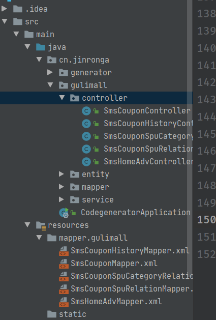