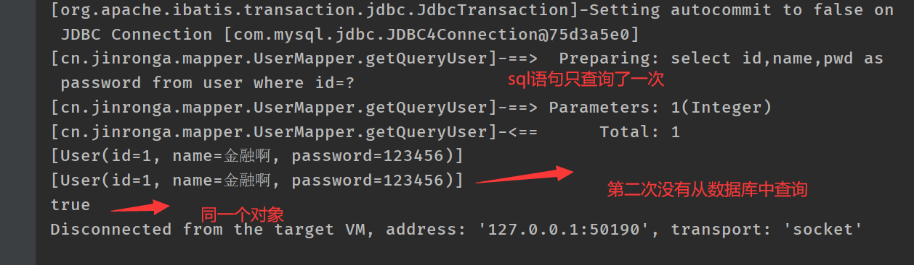
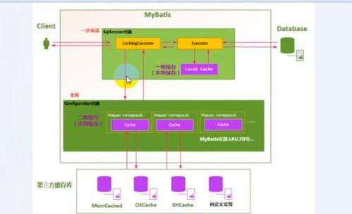

### Mybatis缓存：

----

#### 简介：

1、什么是缓存[Cache]?

存储在内存中的临时数据。

将用户经常查询的数据放在缓存（内存）中，用户去查询数据就不用从关系型数据库（磁盘上）查询，从缓存中查询，从提高查询的效率，解决高并发系统性能的问题。

2、为什么需要缓存？

减少和数据库的交互次数，减少系统的开销，提高系统效率

3、什么样的数据能使用缓存？

经常查询的数据并且不经常改变的数据。

#### 缓存：

Mybatis包含一个非常强大的查询缓存特性：它可以非常方便的定制和配置缓存。缓存可以极大的提高查询效率。

Mybatis系统中定义了两级缓存：**一级缓存**和**二级缓存**。

- 默认情况下，只有一级缓存开启。（Sqlsession级别的缓存，也称为本地缓存）
- 二级缓存需要手动配置，他是基于namespace级别的缓存。
- 为了提高拓展性，Mybatis定义了缓存接口Cache。我们可以通过实现Cache接口自定义二级缓存

#### 一级缓存：

一级缓存也叫本地缓存：

- 与数据库同一次会话期间查询到的数据放到本地缓存中。
- 以后如果需要获取相同的数据，直接从缓存中拿，没必要在去查询数据库。


测试：

User 实体类：

```java
@Data
public class User {

    private int id;

    private String name;

    private String password;

}
```

UserMapper接口：

```java 
public interface UserMapper {

    List<User> getQueryUser(@Param("id") int id);
}
```

UserMapper.xml

```xml
<?xml version="1.0" encoding="UTF-8" ?>
<!DOCTYPE mapper
        PUBLIC "-//mybatis.org//DTD Mapper 3.0//EN"
        "http://mybatis.org/dtd/mybatis-3-mapper.dtd">
<mapper namespace="cn.jinronga.mapper.UserMapper">
    <select id="getQueryUser" parameterType="int" resultType="user">
        select id,name,password from user where id=#{id}
    </select>
</mapper>
```

测试Test:

```java 
  @org.junit.Test
    public void getQueryUser(){
        SqlSession session = MybatisUtils.getSession();
        UserMapper mapper = session.getMapper(UserMapper.class);
        List<User> queryUser = mapper.getQueryUser(1);
        System.out.println(queryUser);
        List<User> queryUser1 = mapper.getQueryUser(1);
        System.out.println(queryUser1);

        System.out.println(queryUser==queryUser1);
       session.close();
    }
```

结果分析：



##### 一级缓存失效的种情况：

一级缓存是SqlSession级别的缓存，是一直开启的，我们关闭不了它；

一级缓存失效情况：没有使用到当前的一级缓存，效果就是，还需要再向数据库中发起一次查询请求！

 1、sqlSession不同 

```java
@Test
public void testQueryUserById(){
   SqlSession session = MybatisUtils.getSession();
   SqlSession session2 = MybatisUtils.getSession();
   UserMapper mapper = session.getMapper(UserMapper.class);
   UserMapper mapper2 = session2.getMapper(UserMapper.class);

   User user = mapper.queryUserById(1);
   System.out.println(user);
   User user2 = mapper2.queryUserById(1);
   System.out.println(user2);
   System.out.println(user==user2);

   session.close();
   session2.close();
}
```

 观察结果：发现发送了两条SQL语句！ 

 结论：**每个sqlSession中的缓存相互独立** 

 2、sqlSession相同，查询条件不同 

```java 

    @org.junit.Test
    public void getQueryUser(){
        SqlSession session = MybatisUtils.getSession();
        UserMapper mapper = session.getMapper(UserMapper.class);
        UserMapper mapper2 = session.getMapper(UserMapper.class);
        List<User> queryUser = mapper.getQueryUser(1);
        System.out.println(queryUser);
        List<User> queryUser2 = mapper2.getQueryUser(2);
        System.out.println(queryUser2);

        System.out.println(queryUser==queryUser2);
                session.close();
    }
}
```

 观察结果：发现发送了两条SQL语句！

 结论：**当前缓存中，不存在这个数据** 

3、sqlSession相同，两次查询之间执行了增删改操作！

UserMapper接口：

```java
//修改用户
 int updateUser(Map map);
```

UserMapper.xml

```xml
    <update id="updateUser" parameterType="map">
        update user as password set name=#{name}, password=#{password} where id =#{id}
    </update>
```

Test测试：

```java
    @org.junit.Test
    public void updateUser(){
        SqlSession session = MybatisUtils.getSession();
        UserMapper mapper = session.getMapper(UserMapper.class);
        UserMapper mapper2 = session.getMapper(UserMapper.class);
        List<User> queryUser = mapper.getQueryUser(1);
        System.out.println(queryUser);
        Map<String,Object> map=new HashMap<>();
         map.put("name","周傑倫");
         map.put("password","1235456");
         map.put("id","6");
        mapper.updateUser(map);
        List<User> queryUser2 = mapper2.getQueryUser(2);
        System.out.println(queryUser2);
        System.out.println(queryUser==queryUser2);
        
        
        session.commit();
       session.close();
    }
```

 一级缓存就是一个map 

#### 二级缓存：

- 二级缓存也叫全局缓存，一级缓存作用域太低了，所以诞生了二级缓存
-  基于namespace级别的缓存，一个名称空间，对应一个二级缓存； 

#####  工作机制 

- 一个会话查询一条数据，这个数据会被放在当前会话的一级缓存中；
- 如果当前会话关闭了，这个会话对应的一级缓存就没了；但是我们想要是关闭会话，一级缓存中的数据被保存在二级缓存中。
- 新建会话查询信息，就可以从二级缓存中获取数据
- 不同的mapper查询的数据会放在自己对应的缓存（map）中；

##### 使用：

1、开启全局缓存在mybatis核心配置文件打开

```xml
<!--        开启全局缓存-->
        <setting name="cacheEnabled" value="true"/>
```

2、去每个mapper.xml中配置

```xml
//开启二级缓存
<cache/>
```

也可以自定义参数:

```xml
官方示例=====>查看官方文档
<cache
 eviction="FIFO"
 flushInterval="60000"
 size="512"
 readOnly="true"/>
这个更高级的配置创建了一个 FIFO 缓存，每隔 60 秒刷新，最多可以存储结果对象或列表的 512 个引用，而且返回的对象被认为是只读的，因此对它们进行修改可能会在不同线程中的调用者产生冲突。
```

序列化实体类不然会报：Caused by: java.io.NotSerializableException: com.kuang.pojo.User

```java
@Data

public class User implements Serializable {

    private int id;

    private String name;

    private String password;

}
```

Test测试：

```java 
    @org.junit.Test
    public void getQueryUser(){
        SqlSession session = MybatisUtils.getSession();
        SqlSession session1 = MybatisUtils.getSession();
        UserMapper mapper = session.getMapper(UserMapper.class);
        UserMapper mapper2 = session1.getMapper(UserMapper.class);

        List<User> queryUser = mapper.getQueryUser(1);
        System.out.println(queryUser);

        session.close();

        List<User> queryUser2 = mapper2.getQueryUser(1);
        System.out.println(queryUser2);
        System.out.println(queryUser==queryUser2);
    session1.close();
    }
```

小结：

- 只要开启了二级缓存，在同一个Mapper下就有效
- 所有的数据都会先放在一级缓存中；
- 只有当会话提交，或者关闭的时候，才会提交到二级缓冲中！

#### 缓存原理：

1）一级缓存: 基于 PerpetualCache 的 HashMap 本地缓存，其存储作用域为 Session，当 Session flush 或 close 之后，该 Session 中的所有 Cache 就将清空，默认打开一级缓存。

2）二级缓存与一级缓存其机制相同，默认也是采用 PerpetualCache，HashMap 存储，不同在于其存储作用域为 Mapper(Namespace)，并且可自定义存储源，如 Ehcache。默认不打开二级缓存，要开启二级缓存，使用二级缓存属性类需要实现Serializable序列化接口(可用来保存对象的状态),可在它的映射文件中配置<cache/> ；

3）对于缓存数据更新机制，当某一个作用域(一级缓存 Session/二级缓存Namespaces)的进行了C/U/D 操作后，默认该作用域下所有 select 中的缓存将被 clear 掉并重新更新，如果开启了二级缓存，则只根据配置判断是否刷新。

缓存原理图


 


####  自定义缓存EhCache  

 Ehcache是一种广泛使用的java分布式缓存，用于通用缓存； 

 要在应用程序中使用Ehcache，需要引入依赖的jar包 

```xml
<!-- https://mvnrepository.com/artifact/org.mybatis.caches/mybatis-ehcache -->
<dependency>
   <groupId>org.mybatis.caches</groupId>
   <artifactId>mybatis-ehcache</artifactId>
   <version>1.1.0</version>
</dependency>
```

 在mapper.xml中使用对应的缓存即可 

```xml
<mapper namespace = “org.acme.FooMapper” > 
   <cache type = “org.mybatis.caches.ehcache.EhcacheCache” /> 
</mapper>
```

 编写ehcache.xml文件，如果在加载时未找到/ehcache.xml资源或出现问题，则将使用默认配置。 

```xml
<!-- https://mvnrepository.com/artifact/org.mybatis.caches/mybatis-ehcache -->
<dependency>
   <groupId>org.mybatis.caches</groupId>
   <artifactId>mybatis-ehcache</artifactId>
   <version>1.1.0</version>
</dependency>
在mapper.xml中使用对应的缓存即可

<mapper namespace = “org.acme.FooMapper” > 
   <cache type = “org.mybatis.caches.ehcache.EhcacheCache” /> 
</mapper>
编写ehcache.xml文件，如果在加载时未找到/ehcache.xml资源或出现问题，则将使用默认配置。
<?xml version="1.0" encoding="UTF-8"?>
<ehcache xmlns:xsi="http://www.w3.org/2001/XMLSchema-instance"
        xsi:noNamespaceSchemaLocation="http://ehcache.org/ehcache.xsd"
        updateCheck="false">
   <!--
      diskStore：为缓存路径，ehcache分为内存和磁盘两级，此属性定义磁盘的缓存位置。参数解释如下：
      user.home – 用户主目录
      user.dir – 用户当前工作目录
      java.io.tmpdir – 默认临时文件路径
    -->
   <diskStore path="./tmpdir/Tmp_EhCache"/>
   
   <defaultCache
           eternal="false"
           maxElementsInMemory="10000"
           overflowToDisk="false"
           diskPersistent="false"
           timeToIdleSeconds="1800"
           timeToLiveSeconds="259200"
           memoryStoreEvictionPolicy="LRU"/>

   <cache
           name="cloud_user"
           eternal="false"
           maxElementsInMemory="5000"
           overflowToDisk="false"
           diskPersistent="false"
           timeToIdleSeconds="1800"
           timeToLiveSeconds="1800"
           memoryStoreEvictionPolicy="LRU"/>
   <!--
      defaultCache：默认缓存策略，当ehcache找不到定义的缓存时，则使用这个缓存策略。只能定义一个。
    -->
   <!--
     name:缓存名称。
     maxElementsInMemory:缓存最大数目
     maxElementsOnDisk：硬盘最大缓存个数。
     eternal:对象是否永久有效，一但设置了，timeout将不起作用。
     overflowToDisk:是否保存到磁盘，当系统当机时
     timeToIdleSeconds:设置对象在失效前的允许闲置时间（单位：秒）。仅当eternal=false对象不是永久有效时使用，可选属性，默认值是0，也就是可闲置时间无穷大。
     timeToLiveSeconds:设置对象在失效前允许存活时间（单位：秒）。最大时间介于创建时间和失效时间之间。仅当eternal=false对象不是永久有效时使用，默认是0.，也就是对象存活时间无穷大。
     diskPersistent：是否缓存虚拟机重启期数据 Whether the disk store persists between restarts of the Virtual Machine. The default value is false.
     diskSpoolBufferSizeMB：这个参数设置DiskStore（磁盘缓存）的缓存区大小。默认是30MB。每个Cache都应该有自己的一个缓冲区。
     diskExpiryThreadIntervalSeconds：磁盘失效线程运行时间间隔，默认是120秒。
     memoryStoreEvictionPolicy：当达到maxElementsInMemory限制时，Ehcache将会根据指定的策略去清理内存。默认策略是LRU（最近最少使用）。你可以设置为FIFO（先进先出）或是LFU（较少使用）。
     clearOnFlush：内存数量最大时是否清除。
     memoryStoreEvictionPolicy:可选策略有：LRU（最近最少使用，默认策略）、FIFO（先进先出）、LFU（最少访问次数）。
     FIFO，first in first out，这个是大家最熟的，先进先出。
     LFU， Less Frequently Used，就是上面例子中使用的策略，直白一点就是讲一直以来最少被使用的。如上面所讲，缓存的元素有一个hit属性，hit值最小的将会被清出缓存。
     LRU，Least Recently Used，最近最少使用的，缓存的元素有一个时间戳，当缓存容量满了，而又需要腾出地方来缓存新的元素的时候，那么现有缓存元素中时间戳离当前时间最远的元素将被清出缓存。
  -->

</ehcache>
```

