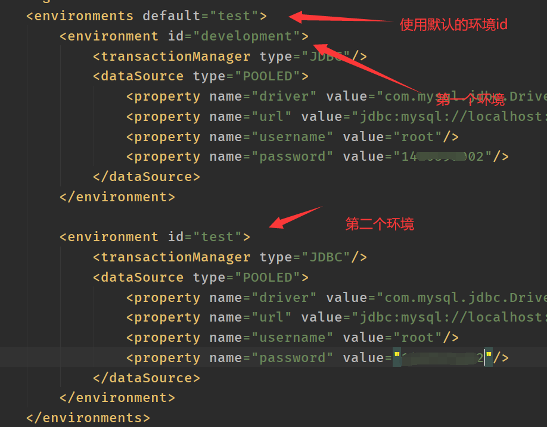
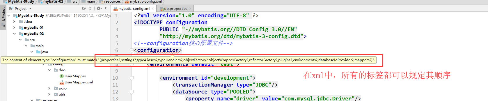
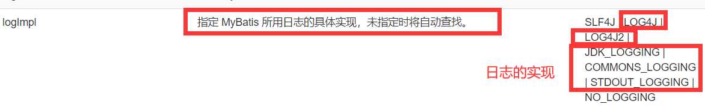
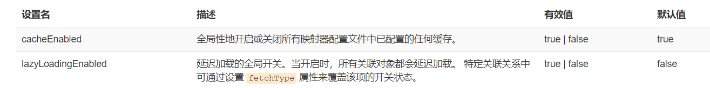
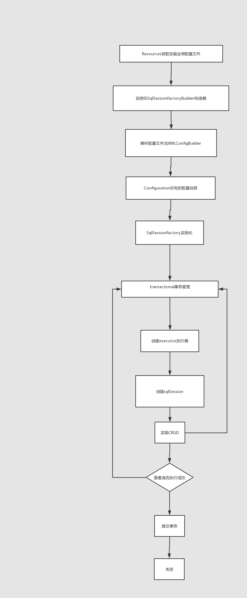

### Mybatis配置解析

----

#### 1.核心配置文件

- mybatis-config.xml

- MyBatis 的配置文件包含了会深深影响 MyBatis 行为的设置和属性信息。 

```
configuration（配置）
properties（属性）
settings（设置）
typeAliases（类型别名）
typeHandlers（类型处理器）
objectFactory（对象工厂）
plugins（插件）
environments（环境配置）
environment（环境变量）
transactionManager（事务管理器）
dataSource（数据源）
databaseIdProvider（数据库厂商标识）
mappers（映射器）
```

#### 2、环境配置（environments）

 MyBatis 可以配置成适应多种环境

 **不过要记住：尽管可以配置多个环境，但每个 SqlSessionFactory 实例只能选择一种环境。** 



Mybatis默认的事务管理器是jdbc，连接池：POOLED

#### 3、属性（properties）

我们可以通过properties属性来实现引用配置文件

这些属性都是可外部配置且可动态替换的，既可以在典型的 Java 属性文件中配置，亦可通过 properties 元素的子元素来传递。【db.properties】



编写一个配置文件

db.properties:

```properties
driver=com.mysql.jdbc.Driver
url=jdbc:mysql://localhost:3306/mybatis?useSSL=false&useUnicode=true&characterEncoding=UTF-8
username=root
password=123456
```

核心文件：mybatis-config.xml

```xml
<!--引入外部文件-->
<properties resource="db.properties"/>

    <environments default="development">
        <environment id="development">
            <transactionManager type="JDBC"/>
            <dataSource type="POOLED">
                <property name="driver" value="${driver}"/>
                <property name="url" value="${url}"/>
                <property name="username" value="${username}"/>
                <property name="password" value="${password}"/>
            </dataSource>
        </environment>
```

- 可以直接引入外部文件
- 可以在其中增加一些属性配置
- 如果两个文件有同一个字段，优先使用外部配置文件的！

#### 4、类型别名（typeAliases）

- 类型别名是为 Java 类型设置一个短的名字。
- 存在的意义仅在于用来减少类完全限定名的冗余。

```xml
<!--       可以给实体类区别名-->
    <typeAliases>
        <typeAlias type="cn.jinronga.pojo.User" alias="User"/>
    </typeAliases>
```

也可以指定一个包名，MyBatis 会在包名下面搜索需要的 Java Bean，比如：

扫描实体类的包，它的默认别名就为这个类的 类名，首字母小写！**就是实体类的java名建议小写**

```xml
   <typeAliases>
        <package name="cn.jinronga.pojo"/>
    </typeAliases>
```


在实体类比较少的时候，使用第一种方式。

如果实体类十分多，建议使用第二种。

**区别：**

第一种可以自定义别名（DIY)别名，第二种不行，如果第二种想要别名在实体类中加注解：

```
@Alias("user")
public class User {}
```

#### 5.设置

这是 MyBatis 中极为重要的调整设置，它们会改变 MyBatis 的运行时行为。 






- 设置（settings）相关 => 查看帮助文档

- - 懒加载
  - 日志实现
  - 缓存开启关闭

- 一个配置完整的 settings 元素的示例如下：

  ```xml
  <settings>
   <setting name="cacheEnabled" value="true"/>
   <setting name="lazyLoadingEnabled" value="true"/>
   <setting name="multipleResultSetsEnabled" value="true"/>
   <setting name="useColumnLabel" value="true"/>
   <setting name="useGeneratedKeys" value="false"/>
   <setting name="autoMappingBehavior" value="PARTIAL"/>
   <setting name="autoMappingUnknownColumnBehavior" value="WARNING"/>
   <setting name="defaultExecutorType" value="SIMPLE"/>
   <setting name="defaultStatementTimeout" value="25"/>
   <setting name="defaultFetchSize" value="100"/>
   <setting name="safeRowBoundsEnabled" value="false"/>
   <setting name="mapUnderscoreToCamelCase" value="false"/>
   <setting name="localCacheScope" value="SESSION"/>
   <setting name="jdbcTypeForNull" value="OTHER"/>
   <setting name="lazyLoadTriggerMethods" value="equals,clone,hashCode,toString"/>
  ```

  **类型处理器**

  - 无论是 MyBatis 在预处理语句（PreparedStatement）中设置一个参数时，还是从结果集中取出一个值时， 都会用类型处理器将获取的值以合适的方式转换成 Java 类型。
  - 你可以重写类型处理器或创建你自己的类型处理器来处理不支持的或非标准的类型。【了解即可】

  **对象工厂**

  - MyBatis 每次创建结果对象的新实例时，它都会使用一个对象工厂（ObjectFactory）实例来完成。
  - 默认的对象工厂需要做的仅仅是实例化目标类，要么通过默认构造方法，要么在参数映射存在的时候通过有参构造方法来实例化。
  - 如果想覆盖对象工厂的默认行为，则可以通过创建自己的对象工厂来实现。【了解即可】

#### 6.其他配置

- [typeHandlers（类型处理器）](https://mybatis.org/mybatis-3/zh/configuration.html#typeHandlers)
- [objectFactory（对象工厂）](https://mybatis.org/mybatis-3/zh/configuration.html#objectFactory)
- plugins插件
  - mybatis-generator-core //让mybatis使用效率更高
  - mybatis-plus
  - 通用mapper

#### 7、映射器（mappers）

MapperRegistry：注册绑定我们的Mapper文件；

方式一: 【推荐使用】

```xml
   <!--每一个Mapper.XML都需要在Mybatis核心配置文件中注册！-->
   <mappers>
        <mapper resource="cn/jinronga/dao/userMapper.xml"/>
    </mappers>
```

方式二：使用class文件进行绑定注册

```xml
<!--每一个Mapper接口都需要在Mybatis核心配置文件中注册！-->
<mappers>
    <mapper class="com.jinronga.dao.UserMapper"/>
</mappers>
```
方式三：使用包的方式最简便：
```xml
<!--   包下面的所有类注册-->
    <mappers>
    <package name="cn.jinronga.mapper"/>
    </mappers>
```

注意点：

- 接口和他的Mapper配置文件必须同名！
- 接口和他的Mapper配置文件必须在同一个包下！

#### mybatis执行原理：



