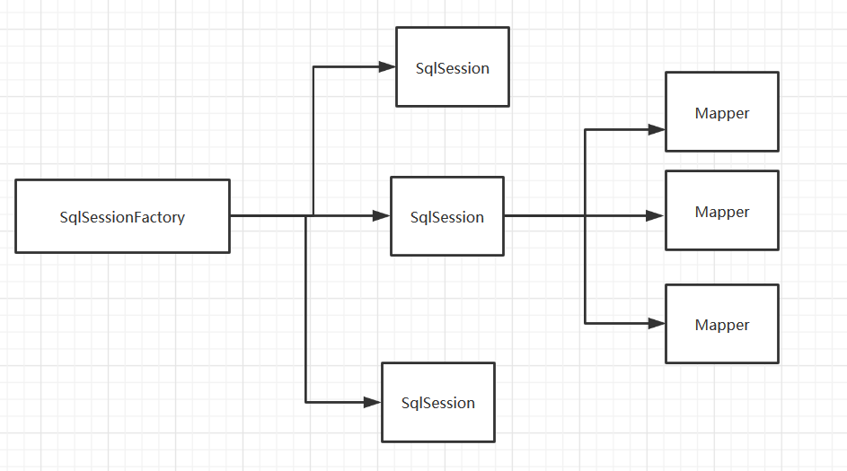

### 生命周期日志：

---

#### 1.生命周期和作用域


生命周期，作用域是至关重要的，因为错误的使用会导致很严重的**并发问题**

**SqlSessionFactoryBuilder：**

-  SqlSessionFactoryBuilder 的作用在于创建 SqlSessionFactory，创建成功后，SqlSessionFactoryBuilder 就失去了作用，所以它只能存在于创建 SqlSessionFactory 的方法中，而不要让其长期存在。因此 **SqlSessionFactoryBuilder 实例的最佳作用域是方法作用域**（也就是局部方法变量） 

**SqlSessionFactory：**

- 可以想象成一个数据库连接池
- SqlSessionFactory 一旦被创建就应该在应用的运行期间一直存在，**没有任何理由丢弃它或重新创建另一个实例。**
-  由于 SqlSessionFactory 是一个对数据库的连接池，所以它占据着数据库的连接资源。如果创建多个 SqlSessionFactory，那么就存在多个数据库连接池，这样不利于对数据库资源的控制，也会导致数据库连接资源被消耗光，出现系统宕机等情况，所以尽量避免发生这样的情况。 
- 因此 SqlSessionFactory 的最佳作用域是应用作用域。 
- 最简单的就是使用**单例模式**或者静态单例模式。

**SqlSession**

连接到连接池的一个请求！

SqlSession的实例不是线程安全的，因此是不能被线程共享的，所以它的最佳的作用域是**请求**或**方法作用域问题**。

用完之后需要赶紧关闭，否则资源被占用！



这里面的每一个Mapper，就代表一个具体的业务！

#### 2.解决属性名跟数据库字段名不一致的问题

数据库的字段：


实体类属性名：


测试出现的问题：


userMapper.xml的方法：

```xml
<!--   使用map 用户名和密码查询用户-->
    <select id="getUserMap" parameterType="map" resultType="cn.jinronga.pojo.User">
        select id,name,pwd from user where name=#{name} and pwd=#{pwd}
    </select>
```

解决办法：

**取别名**

```xml
<!--   使用map 用户名和密码查询用户-->
    <select id="getUserMap" parameterType="map" resultType="cn.jinronga.pojo.User">
        select id,name,pwd AS password from user where name=#{name} and pwd=#{pwd}
    </select>
```


#### 3.resultMap:

结果集映射：

```
id   name   pwd
id   name   password
```

```xml
  <!--column对应数据库字段，property对应实体类的属性-->
   <resultMap id="userMap" type="User">
       <result column="id" property="id"/>
       <result column="name" property="name"/>
       <result column="pwd" property="password"/>
   </resultMap>

    <select id="selectUser" resultMap="userMap">
   select * from user
  </select>
```

`resultMap` 元素是 MyBatis 中最重要最强大的元素 它可以让你从 90% 的 JDBC  

ResultMap 的设计思想是，对于简单的语句根本不需要配置显式的结果映射，而对于复杂一点的语句只需要描述它们的关系就行了。

 简单映射语句的示例 ， 但并没有显式指定 `resultMap`。比如： 

```xml
<select id="selectUserById" resultType="map">
select id , name , pwd
  from user
  where id = #{id}
</select>
```

上述语句只是简单地将所有的列映射到 `HashMap` 的键上，这由 `resultType` 属性指定。虽然在大部分情况下都够用，但是 HashMap 不是一个很好的模型。你的程序更可能会使用 JavaBean 或 POJO（Plain Old Java Objects，普通老式 Java 对象）作为模型。

`ResultMap` 最优秀的地方在于，虽然你已经对它相当了解了，但是根本就不需要显式地用到他们。


### 日志：

Mybatis内置的日志工厂提供日志功能，具体的日志实现有以下几种工具：

- SLF4J
- Apache Commons Logging
- Log4j 2
- Log4j
- JDK logging

**标准日志实现**

指定 MyBatis 应该使用哪个日志记录实现。如果此设置不存在，则会自动发现日志记录实现。

```xml
<settings>
       <setting name="logImpl" value="STDOUT_LOGGING"/>
</settings>
```

 测试，可以看到控制台有大量的输出！我们可以通过这些输出来判断程序到底哪里出了Bug 

#### Log4j:

**简介：**

- Log4j是Apache的一个开源项目
- 通过使用Log4j，我们可以控制日志信息输送的目的地：控制台，文本，GUI组件....
- 我们也可以控制每一条日志的输出格式；
- 通过定义每一条日志信息的级别，我们能够更加细致地控制日志的生成过程。最令人感兴趣的就是，这些可以通过一个配置文件来灵活地进行配置，而不需要修改应用的代码

使用步骤：

1、导入log4j的依赖

```xml
<!--  Log4j日志-->
    <dependency>
      <groupId>log4j</groupId>
      <artifactId>log4j</artifactId>
      <version>1.2.17</version>
    </dependency>
```

2、配置文件的编写：

```properties
#将等级为DEBUG的日志信息输出到console和file这两个目的地，console和file的定义在下面的代码
log4j.rootLogger=DEBUG,console,file

#控制台输出的相关设置
log4j.appender.console = org.apache.log4j.ConsoleAppender
log4j.appender.console.Target = System.out
log4j.appender.console.Threshold=DEBUG
log4j.appender.console.layout = org.apache.log4j.PatternLayout
log4j.appender.console.layout.ConversionPattern=[%c]-%m%n

#文件输出的相关设置
log4j.appender.file = org.apache.log4j.RollingFileAppender
#日志信息的路径
log4j.appender.file.File=./log/jinrong.log
log4j.appender.file.MaxFileSize=10mb
log4j.appender.file.Threshold=DEBUG
log4j.appender.file.layout=org.apache.log4j.PatternLayout
log4j.appender.file.layout.ConversionPattern=[%p][%d{yy-MM-dd}][%c]%m%n

#日志输出级别
log4j.logger.org.mybatis=DEBUG
log4j.logger.java.sql=DEBUG
log4j.logger.java.sql.Statement=DEBUG
log4j.logger.java.sql.ResultSet=DEBUG
log4j.logger.java.sql.PreparedStatement=DEBUG
```

3、设置实现Log4j日志：

```xml
<!--    配置日志-->
    <settings>
        <setting name="logImpl" value="LOG4J"/>
    </settings>
```

4、在程序中使用Log4j进行输出！ 

```java
//注意导包：org.apache.log4j.Logger
static Logger logger= Logger.getLogger(Test.class);
    //查询所有的用户
    @org.junit.Test
    public void selectUser(){
        //记录debug级别的信息
        logger.info("info:进入selectUser方法");
        // 记录info级别的信息
        logger.debug("debug:进入selectUser方法");
        // 记录error级别的信息
        logger.error("error:进入selectUser方法");
        SqlSession session = MybatisUtils.getSession();
        UserMapper mapper = session.getMapper(UserMapper.class);
        List<User> users = mapper.selectUser();
        for (User user: users){
            System.out.println(user);
        }
        session.close();

    }
```

