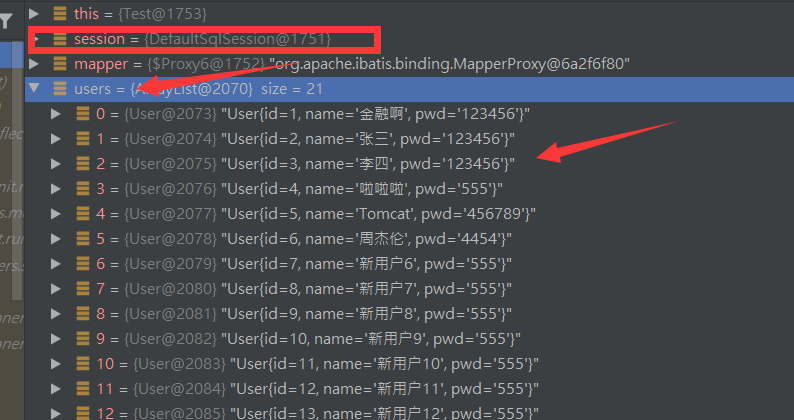
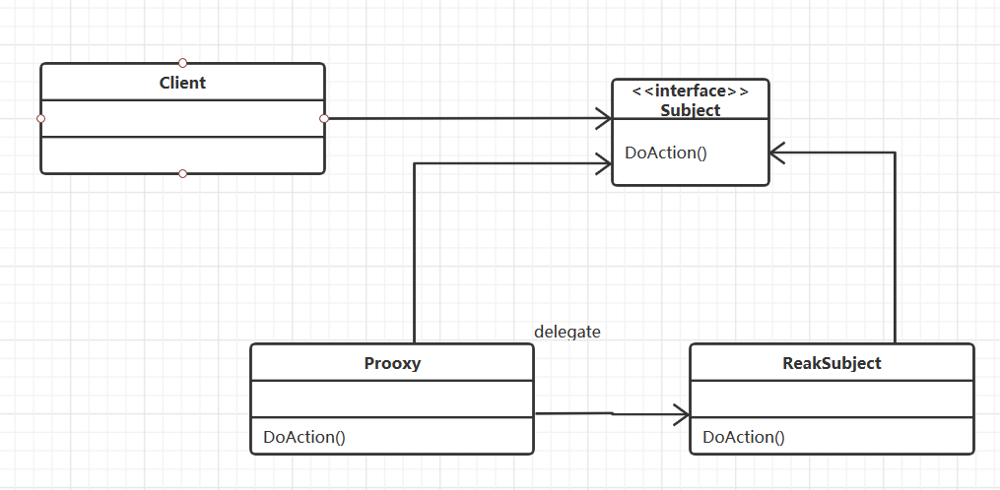

### Mybatis注解开发：

---

#### 面向接口编程：

- 学过面向对象编程，也学习过接口，但在真正的开发中，很多时候我们会选择面向接口编程
- **根本原因 :  解耦 , 可拓展 , 提高复用 , 分层开发中 , 上层不用管具体的实现 , 大家都遵守共同的标准 , 使得开发变得容易 , 规范性更好**
- 在一个面向对象的系统中，系统的各种功能是由许许多多的不同对象协作完成的。在这种情况下，各个对象内部是如何实现自己的,对系统设计人员来讲就不那么重要了；
- 而各个对象之间的协作关系则成为系统设计的关键。小到不同类之间的通信，大到各模块之间的交互，在系统设计之初都是要着重考虑的，这也是系统设计的主要工作内容。面向接口编程就是指按照这种思想来编程。

#### 关于接口的理解

- 接口从更深层次的理解，应是定义（规范，约束）与实现（名实分离的原则）的分离。

- 接口的本身反映了系统设计人员对系统的抽象理解。

- 接口应有两类：

- - 第一类是对一个个体的抽象，它可对应为一个抽象体(abstract class)；
  - 第二类是对一个个体某一方面的抽象，即形成一个抽象面（interface）；

- 一个体有可能有多个抽象面。抽象体与抽象面是有区别的。


**三个面向区别**

- 面向对象是指，我们考虑问题时，以对象为单位，考虑它的属性及方法 .
- 面向过程是指，我们考虑问题时，以一个具体的流程（事务过程）为单位，考虑它的实现 .
- 接口设计与非接口设计是针对复用技术而言的，与面向对象（过程）不是一个问题.更多的体现就是对系统整体的架构

####  注解开发：

-  **mybatis最初配置信息是基于 XML ,映射语句(SQL)也是定义在 XML 中的。而到MyBatis 3提供了新的基于注解的配置。不幸的是，Java 注解的的表达力和灵活性十分有限。最强大的 MyBatis 映射并不能用注解来构建。**

  #### sql类型分为：

  - - @select ()
    - @update ()
    - @Insert ()
    - @delete ()

 **注意：**利用注解开发就不需要mapper.xml映射文件了 。

#### @select ()

查询全部用户

1、在接口中添加注解

UserMapper接口：

```java
   //查询所有的用户
    @Select("select * from user")
    List<User> selectUser();
```

 2、在mybatis的核心配置文件中注入 

```xml
<!--使用class注册绑定接口-->  
<mappers>
         <mapper class="cn.jinronga.dao.UserMapper"/>
     </mappers>
```

Test 查询

```java
//查询所有的用户
    @org.junit.Test
    public void selectUser(){
        SqlSession session = MybatisUtils.getSession();
           //本质上利用了jvm的动态代理机制 反射
        UserMapper mapper = session.getMapper(UserMapper.class);
        List<User> users = mapper.selectUser();
        for (User user: users){
            System.out.println(user);
        }
        session.close();

    }
```

利用Debug本质：



本质是利用了JVM的动态代理机制




根据id查询用户

UserMapper接口：

```java
    //根据id查询用户
    @Select("select * from user where id=#{id}")
    User getUserById(int id);
```

Test：

```java
 //根据id获取用户
    @org.junit.Test
    public void getUserById(){
        SqlSession session = MybatisUtils.getSession();
        UserMapper mapper = session.getMapper(UserMapper.class);
        User userById = mapper.getUserById(1);
        System.out.println(userById);
        session.close();
    }
```

**注意：**增删改一定要提交事务，不然数据库数据操作不会成功！

#### @Insert ()

UserMapper接口：

```java
   //添加用户
    @Insert("insert into user (id,name,pwd)values(#{id},#{name},#{pwd})")
    int addUser(User user);
```

测试Test：

```java
    //添加用户
    @org.junit.Test
    public void addUser(){
        SqlSession session = MybatisUtils.getSession();
        UserMapper mapper = session.getMapper(UserMapper.class);
        int i = mapper.addUser(new User(22, "注解开发", "1454"));

        //提交事务
        session.commit();
        session.close();
    }
```

#### @update ()

接口：

```java
   //更新
    @Update("update user  set name=#{name},pwd=#{pwd} where id =#{id}")
    int updateUser(User user);
```


Test测试：

```java
 //删除  
 @org.junit.Test
    public void updateUser(){
        SqlSession session = MybatisUtils.getSession();
        UserMapper mapper = session.getMapper(UserMapper.class);
      mapper.updateUser(new User(6, "周杰伦", "4454"));
      //提交事务
      session.commit();
      session.close();
    }
```

#### @delete ()

接口：

```java
   //删除
    @Delete("delete from user where id=#{id}")
    int deleteUser(int id);
```

Test：测试

```java
    @org.junit.Test
    public void deleteUser(){
        SqlSession session = MybatisUtils.getSession();
        UserMapper mapper = session.getMapper(UserMapper.class);
        mapper.deleteUser(20);
       //提交事务
        session.commit();
        session.close();
    }
```

 【**注意点：**增删改一定记得对事务的处理】 

####  关于@Param 

 @Param注解用于给**方法参数起一个名字**。以下是总结的使用原则： 

- 基本类型的参数或者String类型，需要加上
- 引用类型不需要加
- 如果只有一个基本类型的话，可以忽略，但是建议大家都加上！
- 我们在SQL中引用的就是我们这里的 @Param() 中设定的属性名！

####  \#与$的区别 

 \#{} 的作用主要是替换预编译语句(PrepareStatement)中的占位符? 【**推荐使用可以防止sql注入**】 

 ${} 的作用是直接进行字符串替换 【不推荐使用不安全】

