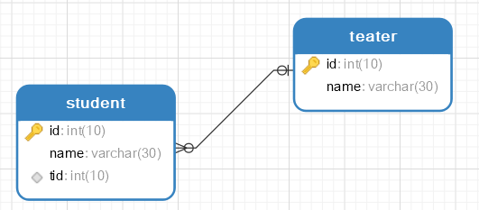

### Mybatis多对一和一对多

---

#### 多对一：


对于多对一的理解：

- 多个学生对应一个老师，对于学生而言**关联**多个学生，关联一个老师（多对一）
- 对于老师而言，**集合**，一个老师，有很多学生（一对多）

数据库设计：



```sql
--教师表
CREATE TABLE `teater`(
 `id` INT(10) NOT NULL,
  `name` VARCHAR(30) DEFAULT NULL,
	PRIMARY KEY(`id`)
	)ENGINE =INNODB DEFAULT CHARSET=utf8
	
	--学生表
	CREATE TABLE `student`(
	`id` INT(10) NOT NULL,
	`name`VARCHAR(30) DEFAULT NULL,
	`tid` INT(10) DEFAULT NULL,
	PRIMARY KEY(`id`),
	KEY `fktid`(`tid`),
	CONSTRAINT `fktid` FOREIGN KEY (`tid`) REFERENCES `teater`(`id`)
	)ENGINE=INNODB DEFAULT CHARSET=utf8
	
	INSERT INTO teater(`id`, `name`) VALUES (1, '秦老师');
	
	
insert into `student` (`id`,`name`,`tid`)VALUES(1,'小明',1);
INSERT INTO `student` (`id`, `name`, `tid`) VALUES ('2', '小红', '1');
INSERT INTO `student` (`id`, `name`, `tid`) VALUES ('3', '小张', '1');
INSERT INTO `student` (`id`, `name`, `tid`) VALUES ('4', '小李', '1');
INSERT INTO `student` (`id`, `name`, `tid`) VALUES ('5', '小王', '1');
```

环境: 

StudentMapper接口：

```java
 //获取所有的学生以及对应老师的信息
    List<Student> getStudentsAndTeacher();
```

#### 方式一：按照查询嵌套处理

studentMapper.xml

```xml
<?xml version="1.0" encoding="UTF-8" ?>
<!DOCTYPE mapper
        PUBLIC "-//mybatis.org//DTD Mapper 3.0//EN"
        "http://mybatis.org/dtd/mybatis-3-mapper.dtd">
<mapper namespace="cn.jinronga.mapper.StudentMapper">

    <!--
         获取所有的学生以及对应老师的信息
         思路：
         1.查询所有学生信息
         2.根据查询出来的学生tid，寻找对应的老师 子查询
    
        查看官网找到：association – 一个复杂类型的关联；使用它来处理关联查询
    -->

    <select id="getStudentsAndTeacher" resultMap="StudentTeacher">
        select * from student
    </select>

    <resultMap id="StudentTeacher" type="student">
        <!--   复杂的属性，我们需要单独处理 对象用association：多对一，一对一 集合用  collection
              property属性名 javaType实体类属性类型 column在多的一方的数据库表中的列名
          -->
        <association property="teacher" column="tid" javaType="Teacher" select="getTeacher" />
    </resultMap>

    <select id="getTeacher" parameterType="teacher" resultType="teacher">
        select * from teater where id=#{tid}
    </select>
</mapper>
```

mybatis-config.xml核心文件注册Mapper.xml

```xml
     <mappers>
         <mapper resource="cn/jinronga/mapper/StudentMapper.xml"/>
         <mapper resource="cn/jinronga/mapper/TeacherMapper.xml"/>
     </mappers>
```

测试Test：

```java
    @org.junit.Test
    public void getTeacher(){
        SqlSession session = MybatisUtils.getSession();
        StudentMapper mapper = session.getMapper(StudentMapper.class);
        List<Student> studentsAndTeacher = mapper.getStudentsAndTeacher();

        for (Student student: studentsAndTeacher){
            System.out.println("学生姓名："+student.getName()+" "+"教师姓名："+student.getTeacher().getName());
        }

    }
```

#### 方式二：按照结果嵌套处理

studentMapper.xml

```xml
<!--
    按查询结果嵌套处理
    思路：
       1. 直接查询出结果，进行结果集的映射
       需要取别名
    -->
    <resultMap id="StudentTeacher2" type="Student">
        <result column="sid" property="id"/>
        <result column="sname" property="name"/>
        <!--关联对象property 关联对象在Student实体类中的属性-->
        <association property="teacher"  javaType="Teacher">
                 <result property="name" column="tname"/>
        </association>
    </resultMap>
<!--    -->
    <select id="getStudentsAndTeacher2" resultMap="StudentTeacher2">
       SELECT s.id as sid,s.name as sname,t.name as tname
        from student as s , teater as t WHERE tid=t.id
    </select>

```

按照查询进行嵌套处理就像SQL中的子查询

按照结果进行嵌套处理就像SQL中的联表查询

#### 一对多：

一个老师有多个学生，所以老师这边是一对多的现象，老师这边有一群学生（集合）！

TeacherMapper接口：

```java
public interface TeacherMapper {
    //指定老师，获取老师下的所有的学生
    Teacher getTeacher(@Param("tid") int tid);
}
```

teacherMapper.xml

#### 方式一： 按结果嵌套处理 

```xml
<?xml version="1.0" encoding="UTF-8" ?>
<!DOCTYPE mapper
        PUBLIC "-//mybatis.org//DTD Mapper 3.0//EN"
        "http://mybatis.org/dtd/mybatis-3-mapper.dtd">
<mapper namespace="cn.jinronga.mapper.TeacherMapper">

<!--    查询老师下面的所有的学生
   思路：
   1.从学生表和老师表查出学生的id，学生姓名，老师姓名
   2.对查询出来的操作做结果映射：
   集合的话用collection！
   JavaType和ofType都是用来指定对象类型的
   JavaType是用来指定pojo中属性的类型
   ofType指定的是映射到list集合属性中pojo的类型。集合中的泛型信息，我们使用ofType获取。
 -->
    <select id="getTeacher" resultMap="teacherOrStudents">
        select t.id as tid, s.id as sid, t.name as tname , s.name as sname
        FROM  teater as t,student as s WHERE s.tid=tid and tid = #{tid}
    </select>

    <resultMap id="teacherOrStudents" type="Teacher">
        <result column="tid" property="id"/>
        <result column="tname" property="name"/>

        <collection property="students" javaType="ArrayList" ofType="Student" >
             <result property="id" column="sid"/>
            <result property="name" column="sname"/>
            <result property="tid" column="tid"/>
        </collection>
    </resultMap>
<!--
当表中的字段名相同时怎么办？多表联查？

					注意：Mybatis中做多表联查的时候，不管是
					一对一、一对多、一对多对多：多对多：
					都不能有字段重名的情况：不管是主键还是普通字段。
					一旦字段重名的话，就会造成数据少自动赋值，或者覆盖，甚至重复赋值！
					规避和解决此类问题的方法：
						1.尽量不要表间重名，mybatis里处理起来很麻烦！id和普通字段都是。
						但是在表多的时候，很难不会出现字段重名的情况。主键id最容易重名！
						那么就要用以下的办法了！

						2.在mybatis中写原生SQL进行查询的时候，查的字段尽可能的少，这
						也影响速率，强烈禁止使用*，用多少查多少！这样也能及时发现字段重
						名的情况！

						3.最后如果真的需要查出重名的字段，并且修改数据库字段名造成的更改
						过大，这里推荐的方式是给字段取别名，在写resultMap映射的时候，其
						中的column属性就填写SQL语句中查出字段取的别名，这样就能解决重复
						问题了！
-->
</mapper>
```


将Mepper中xml注册到核心文件

```xml
     <mappers>
         <mapper resource="cn/jinronga/mapper/TeacherMapper.xml"/>
     </mappers>
```

测试Test:

```java
    @org.junit.Test
    public void getTeacher(){
        SqlSession session = MybatisUtils.getSession();
        TeacherMapper mapper = session.getMapper(TeacherMapper.class);
        Teacher teacher = mapper.getTeacher(1);
        System.out.println(teacher.getName()+"老师下的学生："+teacher.getStudents());
        
    }
```

#### 方式二：查询嵌套处理

TeacherMapper接口：

```java
//方式二：指定老师，获取老师下的所有的学生
Teacher getTeacher2(@Param("tid") int tid);
```

teacherMapper.xml

```xml
    <select id="getTeacher2" resultMap="TeacherOrStudent">
     select  id ,name
     from teater where id=#{tid}
    </select>

         <resultMap id="TeacherOrStudent" type="teacher" >
            <!-- <result column="id" property="id" />
             <result column="name" property="name"/>-->
              <!--column是一对多的外键 , 写的是一的主键的列名  
 集合中的泛型信息，我们使用ofType获取。  
            -->
             <collection property="students" column="id" javaType="ArrayList" ofType="Student" select="getStudent">
                 <result property="id" column="id"/>
                 <result property="name" column="name" />
                 <result property="tid" column="tid" />
             </collection>
         </resultMap>

    <select id="getStudent" resultType="student">
      select id ,name,tid from student
    </select>
```

Test测试：

```java
    @org.junit.Test
    public void getTeacher2(){
        SqlSession session = MybatisUtils.getSession();
        TeacherMapper mapper = session.getMapper(TeacherMapper.class);
        Teacher teacher = mapper.getTeacher2(1);
        System.out.println(teacher.getName()+"老师下的学生："+teacher.getStudents());

    }
```

#### 小结：

1、关联-association

2、集合-collection

3、所以association是用于一对一和多对一，而collection是用于一对多的关系

4、JavaType和ofType都是用来指定对象类型的

- JavaType是用来指定pojo中属性的类型
- ofType指定的是映射到list集合属性中pojo的类型。（集合的泛型）

**注意说明：**

1、保证SQL的可读性，尽量通俗易懂

2、根据实际要求，尽量编写性能更高的SQL语句

3、注意属性名和字段不一致的问题

4、注意一对多和多对一 中：字段和属性对应的问题

5、尽量使用Log4j，通过日志来查看自己的错误

