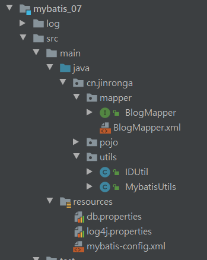

### Mybatis动态sql

---

### 动态SQL:

 什么是动态SQL：**动态SQL指的是根据不同的查询条件 , 生成不同的Sql语句.** 

官方描述：

```java
官网描述：
MyBatis 的强大特性之一便是它的动态 SQL。如果你有使用 JDBC 或其它类似框架的经验，你就能体会到根据不同条件拼接 SQL 语句的痛苦。例如拼接时要确保不能忘记添加必要的空格，还要注意去掉列表最后一个列名的逗号。利用动态 SQL 这一特性可以彻底摆脱这种痛苦。
虽然在以前使用动态 SQL 并非一件易事，但正是 MyBatis 提供了可以被用在任意 SQL 映射语句中的强大的动态 SQL 语言得以改进这种情形。
动态 SQL 元素和 JSTL 或基于类似 XML 的文本处理器相似。在 MyBatis 之前的版本中，有很多元素需要花时间了解。MyBatis 3 大大精简了元素种类，现在只需学习原来一半的元素便可。MyBatis 采用功能强大的基于 OGNL 的表达式来淘汰其它大部分元素。

  -------------------------------
  - if
  - choose (when, otherwise)
  - trim (where, set)
  - foreach
  -------------------------------
```

如果有比较复杂的业务，我们需要写复杂的 SQL 语句，往往需要拼接，而拼接 SQL ，稍微不注意，由于引号，空格等缺失可能都会导致错误。

那么怎么去解决这个问题呢？这就要使用 mybatis 动态SQL，通过 if, choose, when, otherwise, trim, where, set, foreach等标签，可组合成非常灵活的SQL语句，从而在提高 SQL 语句的准确性的同时，也大大提高了开发人员的效率。

#### 搭建环境：

新建一个数据库表：blog

 字段：id，title，author，create_time，views 

```sql
 CREATE TABLE `blog`(
 `id` VARCHAR(50) NOT NULL COMMENT'博客id',
  `title` VARCHAR(100) NOT NULL  COMMENT '博客标题',
	`author` VARCHAR(30) NOT NULL COMMENT '博客作者',
	`create_time` datetime NOT NULL COMMENT '创建时间',
	`views` int(30) NOT NULL COMMENT '浏览量'
	)ENGINE=INNODB DEFAULT CHARSET=utf8
```

 1、创建Mybatis基础工程 



 2、IDutil工具类 (用于生成随机id不通过数据库的自增长的方式)

```java
//生成随机id 不用让数据库生成随机的id
public class IDUtil {
    public static String genId(){
        //将生成的随机数中的-去掉
        return UUID.randomUUID().toString().replace("-","");
    }
}
```

MybatisUtils工具类：

```java
public class MybatisUtils {

    private static SqlSessionFactory sqlSessionFactory;

    static {
        try {
            //使用Mybatis第一步：获取sqlSessionFactory对象
            String resource = "mybatis-config.xml";
            InputStream inputStream = Resources.getResourceAsStream(resource);
            sqlSessionFactory = new SqlSessionFactoryBuilder().build(inputStream);
        } catch (IOException e) {
            e.printStackTrace();
        }
    }
    //既然有了 SqlSessionFactory，顾名思义，我们就可以从中获得 SqlSession 的实例了。
    // SqlSession 完全包含了面向数据库执行 SQL 命令所需的所有方法。
    //获取SqlSession连接
    public static SqlSession getSession(){
        return sqlSessionFactory.openSession();
    }

}
```

实体类：Blog

```java
@Data
public class Blog {
     private String id;
     private String title;
     private String author;
     private Date createTime;
     private int views;
}
```

BlogMapper接口：

```java
public interface BlogMapper {
    //添加一个博客
    int addBlog(Blog blog);
}
```

BlogMapper.xml

```xml
<?xml version="1.0" encoding="UTF-8" ?>
<!DOCTYPE mapper
        PUBLIC "-//mybatis.org//DTD Mapper 3.0//EN"
        "http://mybatis.org/dtd/mybatis-3-mapper.dtd">
<mapper namespace="cn.jinronga.mapper.BlogMapper">

<!--    添加一个博客-->
   <insert id="addBlog" parameterType="blog">
       insert into blog(id,title,author,create_time,views)
       values (#{id},#{title},#{author},#{createTime},#{views})
   </insert>
</mapper>
```

 mybatis核心配置文件，下划线驼峰自动转换 

```xml
    <settings>
        <setting name="logImpl" value="LOG4J"/>
<!--        开启自动驼峰命名规则-->
        <setting name="mapUnderscoreToCamelCase" value="true"/>
    </settings>
<!--注册mapper中xml-->
  <mappers>
         <mapper class="cn.jinronga.mapper.BlogMapper"/>
     </mappers>
```

Test测试：

```Java

   @org.junit.Test
    public void addBlog(){
       SqlSession session = MybatisUtils.getSession();
       BlogMapper mapper = session.getMapper(BlogMapper.class);

       Blog blog=new Blog();
       blog.setId(IDUtil.genId());
       blog.setTitle("Mybatis学习心得");
       blog.setAuthor("金融融融融果果");
       blog.setCreateTime(new Date());
       blog.setViews(9999);

       mapper.addBlog(blog);

       blog.setId(IDUtil.genId());
       blog.setTitle("Java学习心得");
      blog.setAuthor("金融融融融果果");
      blog.setCreateTime(new Date());
      blog.setViews(9999);
       mapper.addBlog(blog);

       blog.setId(IDUtil.genId());
       blog.setTitle("初识Spring");
      blog.setAuthor("金融融融融果果");
      blog.setCreateTime(new Date());
      blog.setViews(9999);
       mapper.addBlog(blog);

       blog.setId(IDUtil.genId());
       blog.setTitle("接触微服务");
      blog.setAuthor("金融融融融果果");
      blog.setCreateTime(new Date());
      blog.setViews(9999);
       mapper.addBlog(blog);
       //提交事务
      session.commit();
       session.close();

   }
```

 初始化数据完毕！ 

#### if 语句：

**需求：**根据作者名字和博客名字来查询博客！如果作者名字为空，那么只根据博客名字查询，反之，则根据作者名字查询 

SQL语句：

```xml
<!--
  需求1：
根据作者名字和博客名字来查询博客！
如果作者名字为空，那么只根据博客名字查询，反之，则根据作者名来查询
select * from blog where title = #{title} and author = #{author}
  -->
    <select id="queryBlogIf" parameterType="map" resultType="blog">
        	SELECT * FROM blog
        	WHERE
        	<if test="title !=null">
                title=#{title}
            </if>
            <if test="author !=null">
              and author=#{author}
            </if>
    </select>
```

Test测试:

```java
 @org.junit.Test
    public  void queryBlogIf(){
        SqlSession session = MybatisUtils.getSession();
        BlogMapper mapper = session.getMapper(BlogMapper.class);

        Blog blog=new Blog();
        blog.setAuthor("金融融融融果果");
        blog.setTitle("Mybatis学习心得");
        List<Blog> blogs = mapper.queryBlogIf(blog);
        System.out.println(blogs);

    }

```

 这样写我们可以看到，如果 author 等于 null，那么查询语句为 select * from user where title=#{title},但是如果title为空呢？那么查询语句为 select * from user where and author=#{author}，这是错误的 SQL 语句，如何解决呢？请看下面的 where 语句！ 

#### where语句：

修改上面的语句：

```xml
    <select id="queryBlogIf" parameterType="map" resultType="blog">
        	SELECT * FROM blog
        	<where>
        	<if test="title !=null">
                title=#{title}
            </if>
            <if test="author !=null">
              and author=#{author}
            </if>
            </where>
    </select>
```

#### choose (when, otherwise)

有时候，我们不想使用所有的条件，而只是想从多个条件中选择一个使用。针对这种情况，MyBatis 提供了 choose 元素，它有点像 Java 中的 switch 语句。

还是上面的例子，但是策略变为：传入了 “title” 就按 “title” 查找，传入了 “author” 就按 “author”  查找的情形。若两者都没有传入，就返回标记为 views 的 BLOG（这可能是管理员认为，与其返回大量的无意义随机  Blog，还不如返回一些由管理员挑选的 Blog）。

```xml
    <select id="queryBlogChoose" parameterType="map" resultType="blog">
        SELECT * FROM blog
        <where>
            <choose>
                <when test="title !=null">
                    title=#{title}
                </when>
                <when test="author !=null">
                  and  author=#{author}
                </when>
                <otherwise>
                    and views=#{views}
                </otherwise>
            </choose>
        </where>
    </select>
```

#### trim (where,set)

#### where：

如果 *where* 元素与你期望的不太一样，你也可以通过自定义 trim 元素来定制 *where* 元素的功能。比如，和 *where* 元素等价的自定义 trim 元素为：

```xml
<trim prefix="WHERE" prefixOverrides="AND |OR ">
  ...
</trim>
```

*prefixOverrides* **属性会忽略通过管道符分隔的文本序列**（注意此例中的空格是必要的）。上述例子会移除所有 *prefixOverrides* 属性中**指定的内容，并且插入 *prefix* 属性中指定的内容。**

#### set：

用于动态更新语句的类似解决方案叫做 *set*。*set* 元素可以用于动态包含需要更新的列，忽略其它不更新的列。比如：

```xml
<!--注意set是用的逗号隔开-->
<update id="updateAuthorIfNecessary">
  update Author
    <set>
      <if test="username != null">username=#{username},</if>
      <if test="password != null">password=#{password},</if>
      <if test="email != null">email=#{email},</if>
      <if test="bio != null">bio=#{bio}</if>
    </set>
  where id=#{id}
</update>
```

这个例子中，*set* 元素会动态地在行首插入 SET 关键字，并会删掉额外的逗号（这些逗号是在使用条件语句给列赋值时引入的）。

来看看与 *set* 元素等价的自定义 *trim* 元素吧：

```
<trim prefix="SET" suffixOverrides=",">
  ...
</trim>
```

注意，我们覆盖了后缀值设置，并且自定义了前缀值。

**所谓的动态SQL，本质还是SQL语句 ， 只是我们可以在SQL层面，去执行一个逻辑代码**

#### SQL片段:

 有时候可能某个 sql 语句我们用的特别多，为了增加代码的重用性，简化代码，我们需要将这些代码抽取出来，然后使用时直接调用。 

 **提取SQL片段：** 

```xml
<sql id="if-title-author">
   <if test="title != null">
      title = #{title}
   </if>
   <if test="author != null">
      and author = #{author}
   </if>
</sql>
```

 **引用SQL片段：** 

```xml
<select id="queryBlogIf" parameterType="map" resultType="blog">
  select * from blog
   <where>
       <!-- 引用 sql 片段，如果refid 指定的不在本文件中，那么需要在前面加上 namespace -->
       <include refid="if-title-author"></include>
       <!-- 在这里还可以引用其他的 sql 片段 -->
   </where>
</select>
```

注意：

①、最好基于 单表来定义 sql 片段，提高片段的可重用性

②、在 sql 片段中不要包括 where

#### Foreach：

将数据库中前三个数据的id修改为1,2,3；

需求：我们需要查询 blog 表中 id 分别为1,2,3的博客信息

接口：

```java
List<Blog> queryBlogForeach(Map map);
```

xml：

```xml
<!--
        select * from mybatis.blog where 1=1 and (id=1 or id = 2 or id=3)

        我们现在传递一个万能的map ， 这map中可以存在一个集合！
-->
<select id="queryBlogForeach" parameterType="map" resultType="blog">
        select * from blog
        <where>
            <!--
                  collection:指定输入对象中的集合属性
                  item:每次遍历生成的对象
                  open:开始遍历时的拼接字符串
                  close:结束时拼接的字符串
                  separator:遍历对象之间需要拼接的字符串
                  select * from blog where 1=1 and (id=1 or id=2 or id=3)
                -->
            <foreach collection="ids" item="id" open="and (" close=")" separator="or">
                id=#{id}
            </foreach>
        </where>
    </select>
```

测试Test:

```java
    @org.junit.Test
    public void queryBlogForeach() {
        SqlSession session = MybatisUtils.getSession();
        BlogMapper mapper = session.getMapper(BlogMapper.class);

        HashMap map = new HashMap();
        List<Integer> ids = new ArrayList<Integer>();
        ids.add(1);
        ids.add(2);
        ids.add(3);
        map.put("ids", ids);

        List<Blog> blogs = mapper.queryBlogForeach(map);
        System.out.println(blogs);
    }
```

####  小结：

其实动态 sql 语句的编写往往就是一个拼接的问题，为了保证拼接准确，我们最好首先要写原生的 sql 语句出来，然后在通过 mybatis 动态sql 对照着改 