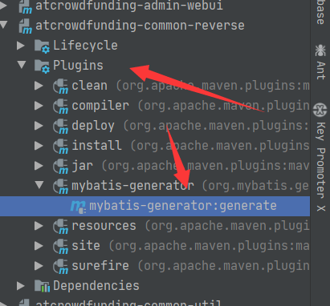
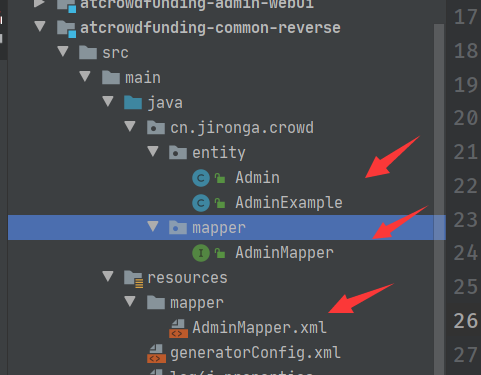

# Mybatis逆向工程编写

依赖：pom.xml

```xml
  <dependencies>        
<dependency>
            <groupId>org.mybatis</groupId>
            <artifactId>mybatis</artifactId>
            <version>3.2.3</version>
        </dependency>
        <dependency>
            <groupId>mysql</groupId>
            <artifactId>mysql-connector-java</artifactId>
            <version>6.0.6</version>
        </dependency>
        <dependency>
            <groupId>org.mybatis.generator</groupId>
            <artifactId>mybatis-generator-core</artifactId>
            <version>1.3.6</version>
        </dependency>
    </dependencies>

    <build>
        <plugins>
            <!-- mybatis-generator自动生成代码插件 -->
            <plugin>
                <groupId>org.mybatis.generator</groupId>
                <artifactId>mybatis-generator-maven-plugin</artifactId>
                <version>1.3.1</version>
                <configuration>
                    <verbose>true</verbose>
                    <overwrite>true</overwrite>
                </configuration>
                <executions>
                    <execution>
                        <id>Generate MyBatis Artifacts</id>
                        <goals>
                            <goal>generate</goal>
                        </goals>
                    </execution>
                </executions>
            </plugin>
        </plugins>
    </build>
```

generatorConfig.xml

```xml
<?xml version="1.0" encoding="UTF-8"?>
<!DOCTYPE generatorConfiguration
        PUBLIC "-//mybatis.org//DTD MyBatis Generator Configuration 1.0//EN"
        "http://mybatis.org/dtd/mybatis-generator-config_1_0.dtd">

<generatorConfiguration>
    <!--    <classPathEntry location="/Program Files/IBM/SQLLIB/java/db2java.zip" />-->
    <classPathEntry
            location="D:\guge\repository\mysql\mysql-connector-java\5.1.47\mysql-connector-java-5.1.47.jar"/>

    <context id="Mybatis3Context" targetRuntime="MyBatis3">
        <property name="javaFileEncoding" value="UTF-8"/>
        <commentGenerator>
            <property name="suppressDate" value="false"/>
            <!-- 是否去除自动生成的注释 true:是;false:否 -->
            <property name="suppressAllComments" value="true"/>
        </commentGenerator>
        <!--数据库连接的信息：驱动类、连接地址、用户名、密码 -->
        <jdbcConnection driverClass="com.mysql.jdbc.Driver"
                        connectionURL="jdbc:mysql://127.0.0.1:3306/project_crowd?serverTimezone=UTC&amp;characterEncoding=UTF-8&amp;useSSL=false"
                        userId="root"
                        password="123456">
        </jdbcConnection>

        <!-- 默认 false，把 JDBC DECIMAL 和 NUMERIC 类型解析为 Integer，为 true 时把 JDBC DECIMAL和 NUMERIC 类型解析为 java.math.BigDecimal -->
        <javaTypeResolver>
            <property name="forceBigDecimals" value="false"/>
        </javaTypeResolver>
        <!-- targetProject:生成 Entity 类的路径 -->
        <javaModelGenerator targetPackage="cn.jironga.crowd.entity"
                            targetProject="src\main\java">
            <property name="enableSubPackages" value="true"/>
            <property name="trimStrings" value="true"/>
        </javaModelGenerator>

        <sqlMapGenerator targetPackage="mapper"
                         targetProject="src\main\resources">

            <property name="enableSubPackages" value="true"/>
        </sqlMapGenerator>
        <!-- targetPackage：Mapper 接口生成的位置 -->
        <javaClientGenerator type="XMLMAPPER"
                             targetPackage="cn.jironga.crowd.mapper"
                             targetProject="src\main\java">
            <property name="enableSubPackages" value="true"/>
        </javaClientGenerator>
        <!-- 数据库表名字和我们的 entity 类对应的映射指定 -->
        <table tableName="t_admin" domainObjectName="Admin" enableCountByExample="false"
               enableDeleteByExample="false" enableUpdateByExample="false" enableSelectByExample="false">
        </table>

    </context>
</generatorConfiguration>
```

双击：



即可生成！

同时需要AdminExample

```xml
<!DOCTYPE generatorConfiguration PUBLIC "-//mybatis.org//DTD MyBatis Generator Configuration 1.0//EN" "http://mybatis.org/dtd/mybatis-generator-config_1_0.dtd">
<generatorConfiguration>
    <classPathEntry
            location="D:\guge\repository\mysql\mysql-connector-java\5.1.47\mysql-connector-java-5.1.47.jar"/>

    <!-- mybatis-generator:generate -->
    <context id="atguiguTables" targetRuntime="MyBatis3">
        <commentGenerator> <!-- 是否去除自动生成的注释 true:是;false:否 -->
            <property name="suppressAllComments" value="true" />
        </commentGenerator>
        <!--数据库连接的信息：驱动类、连接地址、用户名、密码 -->
        <jdbcConnection driverClass="com.mysql.jdbc.Driver" connectionURL="jdbc:mysql://localhost:3306/project_crowd" userId="root" password="123456">
        </jdbcConnection>
        <!-- 默认 false，把 JDBC DECIMAL 和 NUMERIC 类型解析为 Integer，为 true 时把 JDBC DECIMAL和 NUMERIC 类型解析为 java.math.BigDecimal -->
        <javaTypeResolver>
            <property name="forceBigDecimals" value="false" />
        </javaTypeResolver>
        <!-- targetProject:生成 Entity 类的路径 -->
        <javaModelGenerator targetProject=".\src\main\java"

                            targetPackage="cn.jironga.crowd.entity">
            <!-- enableSubPackages:是否让 schema 作为包的后缀 -->
            <property name="enableSubPackages" value="false" />
            <!-- 从数据库返回的值被清理前后的空格 -->
            <property name="trimStrings" value="true" />
        </javaModelGenerator>
        <!-- targetProject:XxxMapper.xml 映射文件生成的路径 -->
        <sqlMapGenerator targetProject=".\src\main\resources" targetPackage="mapper">
            <!-- enableSubPackages:是否让 schema 作为包的后缀 -->
            <property name="enableSubPackages" value="false" />
        </sqlMapGenerator> <!-- targetPackage：Mapper 接口生成的位置 -->
        <javaClientGenerator type="XMLMAPPER" targetProject=".\src\main\java" targetPackage="cn.jironga.crowd.mapper">
            <!-- enableSubPackages:是否让 schema 作为包的后缀 -->
            <property name="enableSubPackages" value="false" />
        </javaClientGenerator>
        <!-- 数据库表名字和我们的 entity 类对应的映射指定 -->
        <table tableName="t_admin" domainObjectName="Admin" />
    </context>
</generatorConfiguration>
```

