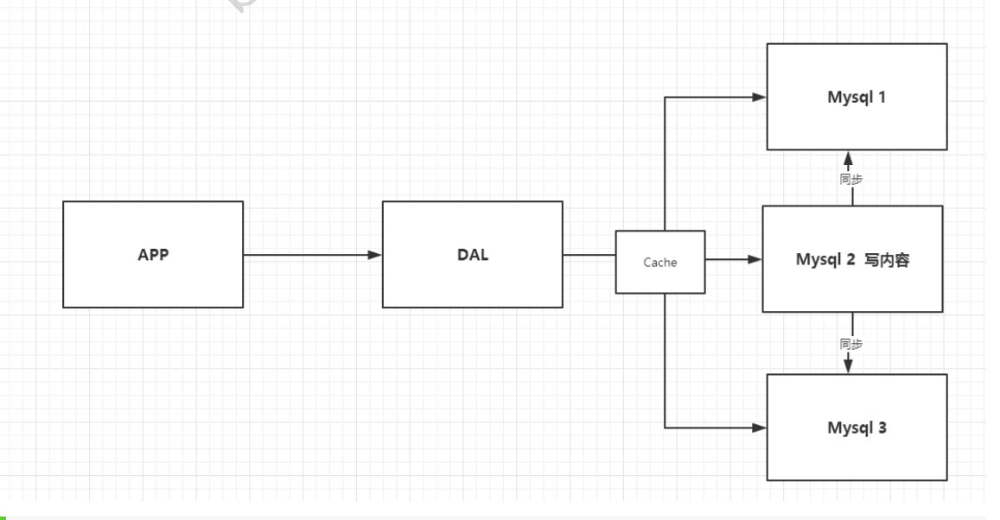
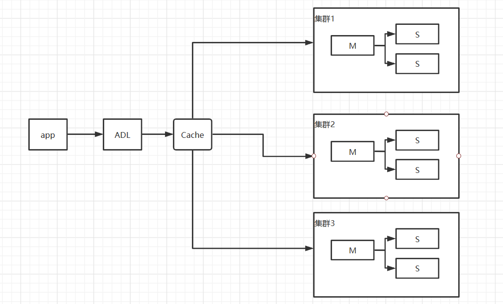
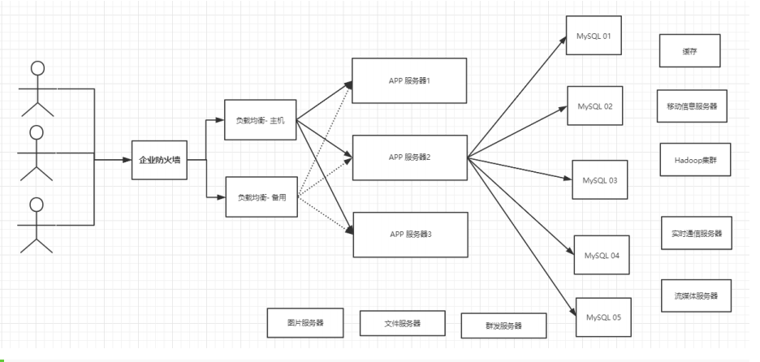
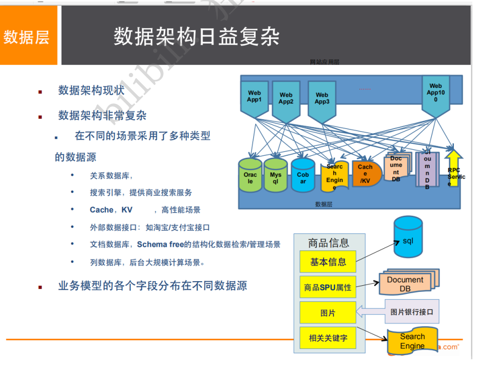
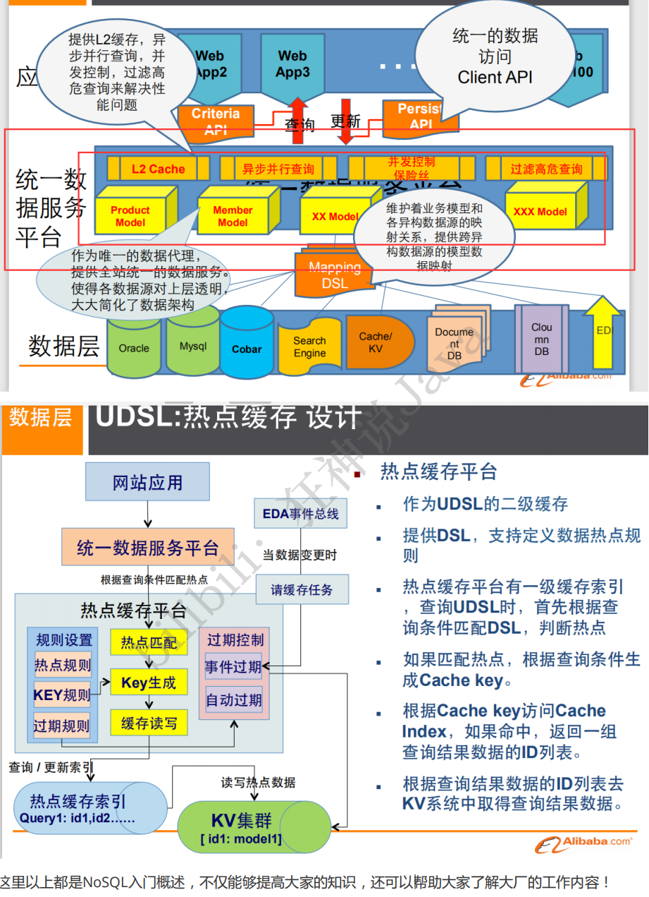
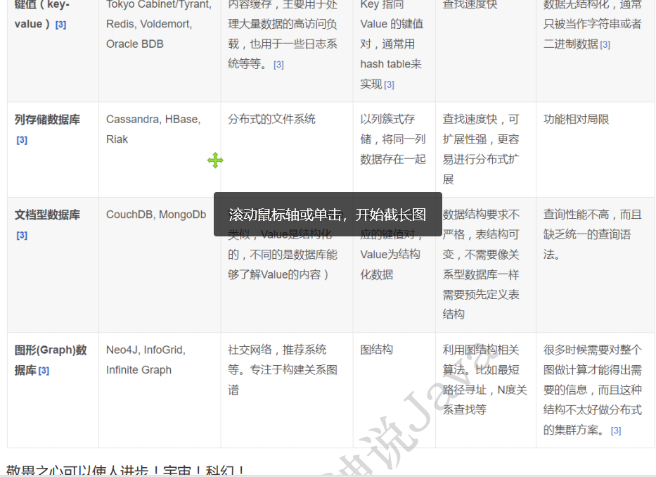

## Redis

以下笔记来自--遇见狂神说：https://www.bilibili.com/video/BV1S54y1R7SB

##### Redis课程安排

- nosql 讲解
- 阿里巴巴架构演进
- nosql 数据模型
- Nosql 四大分类
- CAP
- BASE
- Redis 入门

**Redis安装（Window & Linux服务器）**

五大基本数据类型

- String
- List
- Set
- Hash
- Zset

**三种特殊数据类型**

geo

hyperloglog

bitmap

**Redis 配置详解**

Redis 配置详解

**Redis 持久化**

- RDB
- AOF

**Redis 事务操作**

**Redis 实现订阅发布**

**Redis 主从复制**

**Redis 哨兵模式（现在公司中所有的集群都用哨兵模式）**

**缓存穿透及解决方案** 

**缓存击穿及解决方案**

**缓存雪崩及解决方案**

**基础API 之 Jedis 详解**

**SpringBoot 集成 Redis 操作**

**Redis 的实践分析**


### NoSql概述：

##### 为什么要用NoSql

##### 1、单击MySql的年代！


90年代，一个基本的网站访问量一般不会太大，单个数据库完全足够！

那个时候，更多的去使用静态网页 Html ~ 服务器根本没有太大的压力！

思考一下，这种情况下：整个网站的瓶颈是什么？

1、数据量如果太大、一个机器放不下了！

2、数据的索引 （B+ Tree），一个机器内存也放不下

3、访问量（读写混合），一个服务器承受不了~

只要你开始出现以上的三种情况之一，那么你就必须要晋级！

##### 2、Memcached（缓存） + MySQL + 垂直拆分 （读写分离）

网站80%的情况都是在读，每次都要去查询数据库的话就十分的麻烦！所以说我们希望减轻数据的压

力，我们可以使用缓存来保证效率！

发展过程： 优化数据结构和索引--> 文件缓存（IO）---> Memcached（当时最热门的技术！）




##### 3、分库分表 + 水平拆分 + MySQL集群

技术和业务在发展的同时，对人的要求也越来越高！

**本质：数据库（读，写）**

早些年MyISAM： 表锁，十分影响效率！高并发下就会出现严重的锁问题

转战Innodb：行锁

慢慢的就开始使用分库分表来解决写的压力！ MySQL 在哪个年代推出 了表分区！这个并没有多少公司

使用！

MySQL 的 集群，很好满足哪个年代的所有需求！



##### 4、如今最近的年代

2010--2020 十年之间，世界已经发生了翻天覆地的变化；（定位，也是一种数据，音乐，热榜！）

MySQL 等关系型数据库就不够用了！数据量很多，变化很快~！

MySQL 有的使用它来存储一些比较大的文件，博客，图片！数据库表很大，效率就低了！如果有一种数

据库来专门处理这种数据,

MySQL压力就变得十分小（研究如何处理这些问题！）大数据的IO压力下，表几乎没法更大！

##### 目前一个基本的互联网项目！




##### 为什么要用NoSQL！

用户的个人信息，社交网络，地理位置。用户自己产生的数据，用户日志等等爆发式增长！这个时候我们就需要使用NoSQL数据库的，NoSQL可以很好的处理以上的情况！

#### 什么是NoSQL:

NoSQL = Not Only SQL （不仅仅是SQL）

关系型数据库：表格 ，行 ，列

泛指非关系型数据库的，随着web2.0互联网的诞生！传统的关系型数据库很难对付web2.0时代！尤其

是超大规模的高并发的社区！ 暴露出来很多难以克服的问题，NoSQL在当今大数据环境下发展的十分迅

速，Redis是发展最快的，而且是我们当下必须要掌握的一个技术！

很多的数据类型用户的个人信息，社交网络，地理位置。这些数据类型的存储不需要一个固定的格式！

不需要多月的操作就可以横向扩展的 ！ Map<String,Object> 使用键值对来控制！

##### NoSQL特点：

解耦！

1、方便扩展（数据之间没有关系，很好扩展！）

2、大数据量高性能（Redis 一秒写8万次，读取11万，NoSQL的缓存记录级，是一种细粒度的缓存，性

能会比较高！）

3、数据类型是多样型的！（不需要事先设计数据库！随取随用！如果是数据量十分大的表，很多人就无

法设计了！）

4、传统 RDBMS 和 NoSQL

```
传统的 RDBMS
- 结构化组织 
- SQL - 数据和关系都存在单独的表中 row col 
- 操作操作，数据定义语言 
- 严格的一致性
- 基础的事务
- .....
```

```
Nosql - 不仅仅是数据
- 没有固定的查询语言
- 键值对存储，列存储，文档存储，图形数据库（社交关系） 
- 最终一致性， - CAP定理和BASE （异地多活） 初级架构师！
- 高性能，高可用，高可扩
- ....
```

##### 了解：3V+3高

大数据时代的3V：主要是描述问题的

1. 海量Volume

2. 多样Variety

3. 实时Velocity

大数据时代的3高：主要是对程序的要求

1. 高并发

2. 高可用

3. 高性能

真正在公司中的实践：NoSQL + RDBMS 一起使用才是最强的，阿里巴巴的架构演进！

技术没有高低之分，就看你如何去使用！（提升内功，思维的提高！）

**阿里巴巴演进分析**

思考问题：这么多东西难道都是在一个数据库中的吗? 


随着这样的竞争，业务是越来越完善，然后对于开发者的要求也是越来越高！



如果你未来相当一个架构师： 没有什么是加一层解决不了的！

```
# 1、商品的基本信息 
   名称、价格、商家信息； 
   关系型数据库就可以解决了！ MySQL / Oracle （淘宝早年就去IOE了！- 王坚：推荐文章：阿里云 的这群疯子：40分钟重要！） 
   淘宝内部的 MySQL 不是大家用的 MySQL
# 2、商品的描述、评论（文字比较多） 文档型数据库中，MongoDB 
# 3、图片 分布式文件系统 FastDFS 
    - 淘宝自己的 TFS 
    - Gooale的 GFS
    - Hadoop HDFS
    - 阿里云的 oss
# 4、商品的关键字 （搜索）
    - 搜索引擎 solr elasticsearch - ISerach：多隆（多去了解一下这些技术大佬！） 所有牛逼的人都有一段苦逼的岁月！但是你只要像SB一样的去坚持，终将牛逼！ 
# 5、商品热门的波段信息 
    - 内存数据库 
    - Redis Tair、Memache... 
# 6、商品的交易，外部的支付接口
    - 三方应用
```

大型互联网应用问题：

数据类型太多了！

数据源繁多，经常重构！

数据要改造，大面积改造?

**解决问题：**



这里以上都是NoSQL入门概述，不仅能够提高大家的知识，还可以帮助大家了解大厂的工作内容！


#### NoSQL的四大分类

**KV键值对**

- 新浪：**Redis**
- 美团：Redis + Tair
- 阿里、百度：Redis + memecache

**文档型数据库（bson格式 和json一样）：**

##### **1.MongoDB** （一般必须要掌握）

MongoDB 是一个基于分布式文件存储的数据库，C++ 编写，主要用来处理大量的文档！

MongoDB 是一个介于关系型数据库和非关系型数据中中间的产品！MongoDB 是非关系型数据库中功能最丰富，最像关系型数据库的！

##### **2.ConthDB**：

**列存储数据库**

**HBase**

分布式文件系统

##### 3.图数据库

他不是存图形，放的是关系，比如：朋友圈社交网络，广告推荐！

**Neo4j**，InfoGrid；


#### 四者对比：

