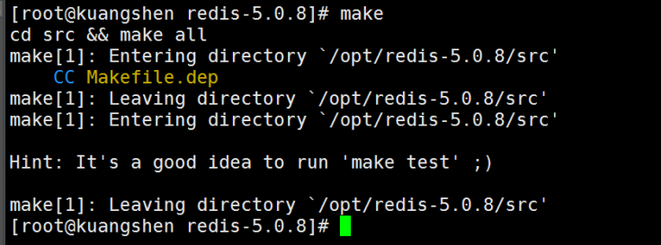

## redis入门

#### 概述：

**redis是什么?**

Redis（Remote Dictionary Server )，即远程字典服务 !

是一个开源的使用ANSI C语言编写、支持网络、可基于内存亦可持久化的日志型、Key-Value数据库，并提供多种语言的API。 

redis会周期性的把更新的数据写入磁盘或者把修改操作写入追加的记录文件，并且在此基础上实现了

master-slave(主从)同步。

免费和开源！是当下最热门的 NoSQL 技术之一！也被人们称之为结构化数据库！

##### Redis 能干嘛？

1、内存存储、持久化，内存中是断电即失、所以说持久化很重要（rdb、aof） 

2、效率高，可以用于高速缓存

3、发布订阅系统

4、地图信息分析

5、计时器、计数器（浏览量！）

6、........

##### 特性

1、多样的数据类型

2、持久化

3、集群

4、事务

**准备工作：**

中文网：http://www.redis.cn/

官方命令手册：http://www.redis.cn/commands.html

4、下载地址：通过官网下载即可！

windows启动：双击redis-server.exe


启动redis客户端redis-cli.exe


windows确实简单，但是redis官方推荐我们去linux开发使用


#### Linux安装

下载安装包：**redis-5.0.5.tar.gz**

解压**redis-5.0.5.tar.gz**：tar  -zxvf  redis-5.0.5.tar.gz

解压完成后进入文件夹：redis.conf配置


基本的环境安装：

```
yum install gcc-c++

make 

make install
```




redis的默认安装路径 : /usr/local/bin


将redis配置文件。复制到我们当前目录下(就是安装包下的redis.conf文件)


redis默认不是后台启动的，修改配置文件！


启动Redis服务！redis-server redis.conf


使用redis-cli 进行连接测试！

方式一：redis-cli -p 6379  方式二：redis-cli


查看redis的进程是否开启！--  ps -ef | grep redis


如何关闭Redis服务呢？ shutdown


后面我们会使用单机多Redis启动集群测试！

#### **测试性能** 

**redis-benchmark** 是一个压力测试工具！官方自带的性能测试工具！redis-benchmark 命令参数

redis 性能测试工具可选参数如下所示：

| 序号 | 选项      | 描述                                       | 默认值    |
| ---- | --------- | ------------------------------------------ | --------- |
| 1    | **-h**    | 指定服务器主机名                           | 127.0.0.1 |
| 2    | **-p**    | 指定服务器端口                             | 6379      |
| 3    | **-s**    | 指定服务器 socket                          |           |
| 4    | **-c**    | 指定并发连接数                             | 50        |
| 5    | **-n**    | 指定请求数                                 | 10000     |
| 6    | **-d**    | 以字节的形式指定 SET/GET 值的数据大小      | 2         |
| 7    | **-k**    | 1=keep alive 0=reconnect                   | 1         |
| 8    | **-r**    | SET/GET/INCR 使用随机 key, SADD 使用随机值 |           |
| 9    | **-P**    | 通过管道传输 <numreq> 请求                 | 1         |
| 10   | **-q**    | 强制退出 redis。仅显示 query/sec 值        |           |
| 11   | **--csv** | 以 CSV 格式输出                            |           |
| 12   | **-l**    | 生成循环，永久执行测试                     |           |
| 13   | **-t**    | 仅运行以逗号分隔的测试命令列表。           |           |
| 14   | **-I**    | Idle 模式。仅打开 N 个 idle 连接并等待。   |           |

案例·：

```
# 测试：100个并发连接 100000请求 
redis-benchmark -h localhost -p 6379 -c 100 -n 100000
```


### 基础知识：

redis默认有16个数据库，默认使用第0个，可以使用select进行切换数据库

```
#切换数据库
127.0.0.1:6379> select 3
OK
127.0.0.1:6379[3]> DBSIZE #查看DB大小
(integer) 0
127.0.0.1:6379[1]> keys *
1) "name
```

清除当前数据库 **flushdb**

清除全部数据库的内容 **FLUSHALL** 

```
127.0.0.1:6379[1]> flushdb
OK
127.0.0.1:6379[1]> keys *
(empty list or set)
```


##### Redis是单线程的

明白Redis是很快的，官方表示，Redis是基于内存操作，CPU不是Redis性能瓶颈，Redis的瓶颈是根据

机器的内存和网络带宽，既然可以使用单线程来实现，就使用单线程了！所有就使用了单线程了！

Redis 是C 语言写的，官方提供的数据为 100000+ 的QPS，完全不比同样是使用 key-vale的

Memecache差！

**Redis** **为什么单线程还这么快？**

1、误区1：高性能的服务器一定是多线程的？

2、误区2：多线程（CPU上下文会切换！）一定比单线程效率高！

先去CPU>内存>硬盘的速度要有所了解！

核心：redis 是将所有的数据全部放在内存中的，所以说使用单线程去操作效率就是最高的，多线程

（CPU上下文会切换：耗时的操作！！！），对于内存系统来说，如果没有上下文切换效率就是最高

的！多次读写都是在一个CPU上的，在内存情况下，这个就是最佳的方案！