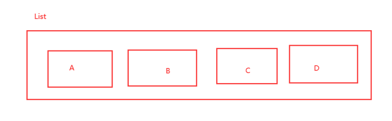

### redis五大数据类型

---

Redis 是一个开源（BSD许可）的，内存中的数据结构存储系统，它可以用作数据库、缓存和消息中间件MQ。 它支持多种类型的数据结构，如 字符串（strings）， 散列（hashes）， 列表（lists）， 集合（sets）， 有序集合（sorted sets） 与范围查询， bitmaps， hyperloglogs 和 地理空间（geospatial） 索引半径查询。 Redis 内置了 复制（replication），LUA脚本（Lua scripting）， LRU驱动事件（LRU eviction），事务（transactions） 和不同级别的 磁盘持久化（persistence）， 并通过Redis哨兵（Sentinel）和自动 分区（Cluster）提供高可用性（high availability）。

**下面的所有命令都要记住！**

#### Key：

```
127.0.0.1:6379> keys * # 查看所有的key
(empty list or set) 
127.0.0.1:6379> set name kuangshen # set key 
OK
127.0.0.1:6379>
keys * 
1) "name" 
127.0.0.1:6379> set age 1 
OK
127.0.0.1:6379> keys * 
1) "age" 
2) "name" 
127.0.0.1:6379> EXISTS name # 判断当前的key是否存在
(integer) 1
127.0.0.1:6379> EXISTS name1
(integer) 0 
127.0.0.1:6379> move name 1 # 移除当前的key 
(integer) 1 
127.0.0.1:6379> keys * 1) "age" 
127.0.0.1:6379> set name qinjiang
OK
127.0.0.1:6379> keys * 
1) "age"
2) "name" 
127.0.0.1:6379> clear 
127.0.0.1:6379> keys * 
1) "age" 
2) "name" 
127.0.0.1:6379> get name "qinjiang" 
127.0.0.1:6379> EXPIRE name 10 # 设置key的过期时间，单位是秒
(integer) 1 
127.0.0.1:6379> ttl name # 查看当前key的剩余时间
(integer) 4 
127.0.0.1:6379> ttl name
(integer) 3 
127.0.0.1:6379> ttl name
(integer) 2 
127.0.0.1:6379> ttl name 
(integer) 1 
127.0.0.1:6379> ttl name 
(integer) -2 
127.0.0.1:6379> get name
(nil) 
127.0.0.1:6379> type name # 查看当前key的一个类型！
string 127.0.0.1:6379> type age 
string
```

redis命令大全官方文档：http://www.redis.cn/commands.html

#### String(字符串)：

90% 的 java程序员使用 redis 只会使用一个String类型！

```shell
127.0.0.1:6379> set key1 v1 # 设置值
OK
127.0.0.1:6379> get key1   #获得值
"v1"
127.0.0.1:6379> keys * #获得所有的key
1) "key1"
2) "name"
127.0.0.1:6379> EXISTS key1 #判断某一个key是否存在
(integer) 1
127.0.0.1:6379> APPEND key1 "hello" # 追加字符串，如果当前key不存在，就相当于setkey
(integer) 7
127.0.0.1:6379> get key1 
"v1hello"
127.0.0.1:6379> strlen key1 #获得字符串的长度
(integer) 7
127.0.0.1:6379> APPEND key1 ",jinronga"
(integer) 16
127.0.0.1:6379> get key1
"v1hello,jinronga"
127.0.0.1:6379> strlen key1
(integer) 16
===========================================================================
#i++
#步长
127.0.0.1:6379> set views 0  # 初始浏览量为0
OK
127.0.0.1:6379> get views  
"0"
127.0.0.1:6379> incr views  # 自增1 浏览量变为1
(integer) 1
127.0.0.1:6379> get views
"1"
127.0.0.1:6379> incr views 
(integer) 2
127.0.0.1:6379> get views
"2"
127.0.0.1:6379> decr views # 自减1 浏览量-1
(integer) 1
127.0.0.1:6379> get views
"1"
127.0.0.1:6379> decr views
(integer) 0
127.0.0.1:6379> get views
"0"
127.0.0.1:6379> decr views
(integer) -1
127.0.0.1:6379> get views
"-1"
127.0.0.1:6379> incrby views 10 # 可以设置步长，指定增量！
(integer) 9
127.0.0.1:6379> get views
"9"
127.0.0.1:6379> incrby views 10 #在次增量10
(integer) 19
127.0.0.1:6379> DECRBY views 5 #设置减量值
(integer) 14
==========================================================
#字符串的范围  range
127.0.0.1:6379> set key1 "jinronga" #设置key1的值
OK
127.0.0.1:6379> get key1  #获取key1的值
"jinronga"
127.0.0.1:6379> getrange key1 0 3 #截取字符串[0,3]
"jinr"
127.0.0.1:6379> getrange key1 0 -1 #截取全部字符串 和get key一样
"jinronga"
 
 #替换
127.0.0.1:6379> set key2 abcdefg #设置key2的值
OK
127.0.0.1:6379> get key2
"abcdefg"
127.0.0.1:6379> setrange key2 1 xx #替换指定位置开始的字符串
(integer) 7
127.0.0.1:6379> get key2
"axxdefg"
===================================
# setex (set with expire) 
# 设置过期时间 # setnx (set if not exist) # 不存在在设置 （在分布式锁中会常常使用！）
127.0.0.1:6379> setex key3 30 "hello" # 设置key3 的值为 hello,30秒后过期
OK
127.0.0.1:6379> ttl key3 #查看key3的值还有多少秒过期
(integer) 26
127.0.0.1:6379> get key3
"hello"
127.0.0.1:6379> setnx mykey "redis" # 如果mykey 不存在，创建mykey
(integer) 1
127.0.0.1:6379> keys *
1) "key1"
2) "key2"
3) "views"
4) "mykey"
5) "name"
127.0.0.1:6379> ttl key3
(integer) -2
127.0.0.1:6379> setnx mykey "MongoDB" # 如果mykey存在，创建失败！
(integer) 0
127.0.0.1:6379> get mykey
"redis"
=======================================
mset--同时设置多个值
mget--同时获取多个值

127.0.0.1:6379> mset k1 "v1" k2 "v2" k3 "v3" # 同时设置多个值
OK
127.0.0.1:6379> keys *
1) "k1"
2) "k2" 
3) "k3"
127.0.0.1:6379> mget k1 k2 k3 # 同时获取多个值
1) "v1"
2) "v2"
3) "v3"
127.0.0.1:6379> msetnx k1 v k4 2  # msetnx 是一个原子性的操作，要么一起成功，要么一起 失败！
(integer) 0
127.0.0.1:6379> get k4
(nil)
    # 对象 set user:1 {name:zhangsan,age:3} # 设置一个user:1 对象 值为 json字符来保存一个对象！ # 这里的key是一个巧妙  的设计： user:{id}:{filed} , 如此设计在Redis中是完全OK了！
127.0.0.1:6379> mset user:1:name zhangsan user:1:age 2
OK
127.0.0.1:6379> mget user:1:name user:1:age
1) "zhangsan"
2) "2"
============================================
getset # 先get然后在set
127.0.0.1:6379> getset db redis #如果不存在值，则返回nil
(nil)
127.0.0.1:6379> get db
"redis"
127.0.0.1:6379> getset db mongodb #如果存在值，获取原来的值，并且设置新的值
"redis"
127.0.0.1:6379> get db
"mongodb"

```

**数据结构是相同的！**

String类似的使用场景：value除了是我们的字符串还可以是我们的数字！

计数器

统计多单位的数量

粉丝数

对象缓存存储！

#### List（列表）：

基本的数据类型，列表 



在redis里面，我们可以把list玩成 ，栈、队列、阻塞队列！

所有的list命令都是用l开头的，Redis不区分大小命令

```shell
127.0.0.1:6379> LPUSH list one # 将一个值或者多个值，插入到列表头部 （左）
(integer) 1
127.0.0.1:6379> LPUSH list two
(integer) 2
127.0.0.1:6379> LPUSH list three
(integer) 3
127.0.0.1:6379> LRANGE list 0 -1 # 获取list中值！
1) "three"
2) "two"
3) "one"
127.0.0.1:6379> LRANGE list 0 1 # 通过区间获取具体的值！
1) "three"
2) "two"
127.0.0.1:6379> RPUSH list right  # 将一个值或者多个值，插入到列表尾部 （右）
(integer) 4
127.0.0.1:6379> LRANGE list 0 -1
1) "three"
2) "two"
3) "one"
4) "right"
=====================================================
LPOP #移除list的第一个元素
RPOP #移除list最后一个元素
127.0.0.1:6379> LPOP list #移除list的第一个元素
"three"
127.0.0.1:6379> RPOP list #移除list最后一个元素
"right"
127.0.0.1:6379> LRANGE list 0 -1
1) "two"
2) "one"
=====================================================
Lindex # 通过下标获得 list 中的某一个值！
127.0.0.1:6379> Lrange list 0 -1 # 通过下标获得 list 中的某一个值！
1) "two"
2) "one"
127.0.0.1:6379> lindex list 1
"one"
127.0.0.1:6379> lindex list 0
"two"
=====================================================
Llen 返回列表的长度
127.0.0.1:6379> LLEN list #返回列表的长度
(integer) 2
======================================================
移除指定的值！
取关 uid
Lrem

127.0.0.1:6379> lrange list 0 -1 
1) "two"
2) "one"
127.0.0.1:6379> lrem list 1 one #移除list集合中指定个数的value，精准匹配
(integer) 1
127.0.0.1:6379> LRANGE list 0 -1
1) "two"
===================================================
trim修剪。；list 截断！
127.0.0.1:6379> keys * 
(empty list or set) 
127.0.0.1:6379> Rpush mylist "hello" 
(integer) 1 
127.0.0.1:6379> Rpush mylist "hello1"
(integer) 2
127.0.0.1:6379> Rpush mylist "hello2" (integer) 3 127.0.0.1:6379> Rpush mylist "hello3" (integer) 4 127.0.0.1:6379> ltrim mylist 1 2 # 通过下标截取指定的长度，这个list已经被改变了，截断了 只剩下截取的元素！
OK
127.0.0.1:6379> LRANGE mylist 0 -1 
1) "hello1" 
2) "hello2"
=================================================
rpoplpush # 移除列表的最后一个元素，将他移动到新的列表中！ 127.0.0.1:6379> rpush mylist "hello"
(integer) 1
127.0.0.1:6379> rpush mylist "hello1" 
(integer) 2 
127.0.0.1:6379> rpush mylist "hello2" 
(integer) 3
127.0.0.1:6379> rpoplpush mylist myotherlist # 移除列表的最后一个元素，将他移动到新的 列表中！
"hello2" 
127.0.0.1:6379> lrange mylist 0 -1 # 查看原来的列表
1) "hello" 
2) "hello1" 
127.0.0.1:6379> lrange myotherlist 0 -1 # 查看目标列表中，确实存在改值！ 1) "hello2"
=================================================
lset 将列表中指定下标的值替换为另外一个值，更新操作 
127.0.0.1:6379> EXISTS list # 判断这个列表是否存在
(integer) 0
127.0.0.1:6379> lset list 0 item # 如果不存在列表我们去更新就会报错 (error) ERR no such key 
127.0.0.1:6379> lpush list value1
(integer) 1 
127.0.0.1:6379> LRANGE list 0 0 
1) "value1" 
127.0.0.1:6379> lset list 0 item # 如果存在，更新当前下标的值
OK
127.0.0.1:6379> LRANGE list 0 0
1) "item" 
127.0.0.1:6379> lset list 1 other # 如果不存在，则会报错！ (error) ERR index out of range

```

**小结：**

- 他实际上是一个链表，before Node after ， left，right 都可以插入值
- 如果key 不存在，创建新的链表
- 如果key存在，新增内容
- 如果移除了所有值，空链表，也代表不存在！
- 在两边插入或者改动值，效率最高！ 中间元素，相对来说效率会低一点~
- 消息排队！消息队列 （Lpush Rpop）， 栈（ Lpush Lpop）！

#### Set（集合）：

set中的值是不能重读的！

```shell
127.0.0.1:6379> sadd myset "hello"# set集合中添加匀速
(integer) 1
127.0.0.1:6379> sadd myset "jinronga"
(integer) 1
127.0.0.1:6379> sadd myset "love!java"
(integer) 1
127.0.0.1:6379> SMEMBERS myset # 查看指定set的所有值
1) "jinronga"
2) "hello"
3) "love!java"
127.0.0.1:6379> SISMEMBER myset hello # 判断某一个值是不是在set集合中！
(integer) 1
127.0.0.1:6379> SISMEMBER myset world
(integer) 0
=============================================
127.0.0.1:6379> scard myset # 获取set集合中的内容元素个数！
(integer) 3
=============================================
rem # 移除set集合中的指定元素
127.0.0.1:6379> srem myset hello # 移除set集合中的指定元素
(integer) 1
127.0.0.1:6379> scard myset
(integer) 2
127.0.0.1:6379> SMEMBERS myset
1) "jinronga"
2) "love!java"
==============================================
set无序不重复集合。抽随机
127.0.0.1:6379> SMEMBERS myset
1) "jinronga"
2) "love!java"
127.0.0.1:6379> SMEMBERS myset # 随机抽选出一个元素
1) "jinronga"
2) "love!java"
127.0.0.1:6379> SRANDMEMBER myset
"love!java"
127.0.0.1:6379> SRANDMEMBER myset
"love!java"
127.0.0.1:6379> SRANDMEMBER myset
"jinronga"
127.0.0.1:6379> SRANDMEMBER myset 2 # 随机抽选出指定个数的元素
==============================================

127.0.0.1:6379> SMEMBERS myset
1) "jinronga"
2) "love!java"
127.0.0.1:6379> spop myset # 随机删除一些set集合中的元素！
"jinronga"
127.0.0.1:6379> SMEMBERS myset
1) "love!java"
===============================================
将一个指定的值，移动到另一个set集合
127.0.0.1:6379> sadd myset "hello"
(integer) 1
127.0.0.1:6379> sadd myset "world"
(integer) 1
127.0.0.1:6379> sadd myset "jinronga"
(integer) 1
127.0.0.1:6379> sadd myset "set2"
(integer) 1
127.0.0.1:6379> smove myset myset2 "jinronga"# 将一个指定的值，移动到另外一个set集
(integer) 1
127.0.0.1:6379> SMEMBERS myset
1) "love!java"
2) "hello"
3) "world"
4) "set2"
127.0.0.1:6379> SMEMBERS myset2
1) "jinronga"
======================================================
微博，B站的共同关注
数字集合类：
- 差集 SDIFF
- 交集 
- 并集
127.0.0.1:6379> SDIFF key1 key2 # 差集 
1) "b" 
2) "a"
127.0.0.1:6379> SINTER key1 key2 # 交集 共同好友就可以这样实现 
1) "c"
127.0.0.1:6379> SUNION key1 key2 # 并集 
1) "b" 
2) "c"
3) "e" 
4) "a"
5) "d"
```


#### Hash(哈希)：

Map集合，key-map! 时候这个值是一个map集合！ 本质和String类型没有太大区别，还是一个简单的

key-vlaue！

```shell
127.0.0.1:6379> hset myhash field1 kuangshen # set一个具体 key-vlaue
(integer) 1
127.0.0.1:6379> hget myhash field1 # 获取一个字段值 "kuangshen" 127.0.0.1:6379> hmset myhash field1 hello field2 world # set多个 key-vlaue 
OK
127.0.0.1:6379> hmget myhash field1 field2 # 获取多个字段值
1) "hello"
2) "world" 
127.0.0.1:6379> hgetall myhash # 获取全部的数据， 
1) "field1" 
2) "hello" 
3) "field2" 
4) "world" 
127.0.0.1:6379> hdel myhash field1 # 删除hash指定key字段！对应的value值也就消失了！ 
(integer) 1
127.0.0.1:6379> hgetall myhash 
1) "field2" 
2) "world"
=====================================
hlen 
127.0.0.1:6379> hmset myhash field1 hello field2 world 
OK
127.0.0.1:6379> HGETALL myhash 
1) "field2" 
2) "world" 
3) "field1" 
4) "hello"
127.0.0.1:6379> hlen myhash # 获取hash表的字段数量！
(integer) 2
======================================
127.0.0.1:6379> HEXISTS myhash field1 # 判断hash中指定字段是否存在！ 
(integer) 1 
127.0.0.1:6379> HEXISTS myhash field3 
(integer) 0
======================================
# 只获得所有field 
# 只获得所有value 
127.0.0.1:6379> hkeys myhash # 只获得所有field 
1) "field2" 
2) "field1" 
127.0.0.1:6379> hvals myhash # 只获得所有value 
1) "world"
2) "hello"
======================================
incr decr 

127.0.0.1:6379> hset myhash field3 5 #指定增量！ 
(integer) 1 
127.0.0.1:6379> HINCRBY myhash field3 1 
(integer) 6 
127.0.0.1:6379> HINCRBY myhash field3 -1 
(integer) 5 
127.0.0.1:6379> hsetnx myhash field4 hello # 如果不存在则可以设置 (integer) 1
127.0.0.1:6379> hsetnx myhash field4 world # 如果存在则不能设置 (integer) 0
```

hash变更的数据 user name age,尤其是是用户信息之类的，经常变动的信息！ hash 更适合于对象的

存储，String更加适合字符串存储！

#### Zset(有序集合)：

在set的基础上，增加了一个值，set k1 v1 zset k1 score1 v1

```shell
127.0.0.1:6379> zadd myset 1 one #添加一个值
(integer) 1
127.0.0.1:6379> zadd myset 2 two 3 three #添加多个值
(integer) 2
127.0.0.1:6379> ZRANGE myset 0 -1
1) "one"
2) "two"
3) "three"
========================================
排序如何实现的
#添加三个用户
127.0.0.1:6379> zadd salry 2500 xiaohong
(integer) 1
127.0.0.1:6379> zadd slary 5000 zhangsan
(integer) 1
127.0.0.1:6379> zadd slary 500 jinronga
(integer) 1
# ZRANGEBYSCORE key min max
127.0.0.1:6379> ZRANGEBYSCORE slary -inf +inf # 显示全部的用户 从小到大！
1) "jinronga"
2) "xiaohong"
3) "zhangsan"
127.0.0.1:6379> ZREVRANGE slary 0 -1 #从大到小排序
1) "zhangsan"
2) "xiaohong"
3) "jinronga"
127.0.0.1:6379> ZRANGEBYSCORE slary -inf +inf withscores #显示所有的用户并且附带成绩
1) "jinronga"
2) "500"
3) "xiaohong"
4) "2500"
5) "zhangsan"
6) "5000"
127.0.0.1:6379> ZRANGEBYSCORE slary -inf 2500 withscores #显示工资小于2500员工的工资排序
1) "jinronga"
2) "500"
3) "xiaohong"
4) "2500"
===============================================================
#移出rem中的元素

127.0.0.1:6379> zrange slary 0 -1
1) "jinronga"
2) "xiaohong"
3) "zhangsan"
127.0.0.1:6379> zrem slary zhangsan #移出集合中指定的元素
(integer) 1
127.0.0.1:6379> zrange slary 0 -1
1) "jinronga"
2) "xiaohong"
127.0.0.1:6379> zcard slary #获得集合个数
(integer) 2
================================================================
127.0.0.1:6379> zadd myset 1 hello
(integer) 1
127.0.0.1:6379> zadd myset 2 world 3 jinronga
(integer) 2
127.0.0.1:6379> zcount myset 1 3  #获取指定区间的成员数量！
(integer) 6
127.0.0.1:6379> zcount myset 1 2
(integer) 4
```

**案例思路：**set 排序 存储班级成绩表，工资表排序！

普通消息，1， 重要消息 2，带权重进行判断！

排行榜应用实现，取Top N 测试！


