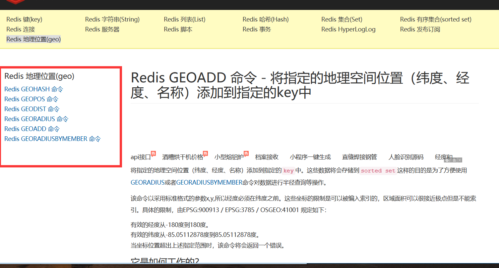
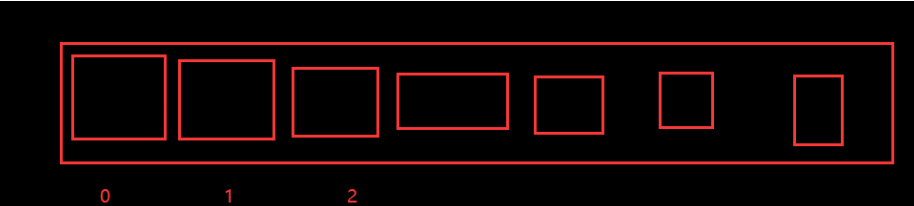

### **三种特殊数据类型**

---

### Geospatial 地理位置

朋友的定位，附近的人，打车距离计算？Redis 的 Geo 在Redis3.2 版本就推出了！ 这个功能可以推算地理位置的信息，两地之间的距离，方圆几里的人！

可以查询一些测试数据：http://www.jsons.cn/lngcodeinfo/0706D99C19A781A3/

只有 六个命令



官方文档：https://www.redis.net.cn/order/3685.html

#### geoadd：

```shell
# geoadd 添加地理位置
# 规则：两级无法直接添加，我们一般会下载城市数据，直接通过java程序一次性导入！
# 有效的经度从-180度到180度。
# 有效的纬度从-85.05112878度到85.05112878度。
# 当坐标位置超出上述指定范围时，该命令将会返回一个错误。
127.0.0.1:6379> geoadd china:city 116.40 39.90 beijing
(integer) 1
127.0.0.1:6379> geoadd china:city 121.47 31.23 shanghai
(integer) 1
127.0.0.1:6379> geoadd china:city 106.50 29.53 chongqing 114.05 22.52 shengzhen
(integer) 2
127.0.0.1:6379> geoadd china:city 120.16 30.24 hangzhou 108.96 34.26 xian
(integer) 2
```

#### geopos:

获取当前的定位：一定是坐标值！

```shell
127.0.0.1:6379> geopos china:city beijing# 获取指定的城市的经度和纬度！
1) 1) "116.39999896287918091"
   2) "39.90000009167092543"
127.0.0.1:6379> geopos china:city chongqing
1) 1) "106.49999767541885376"
   2) "29.52999957900659211"

```

##### GEODIST:

两人之间的距离！

单位：

- m表示单位为米。
- km表示单位为千米
- mi表示单位为英里
- ft表示单位为英尺

```shell
127.0.0.1:6379> GEODIST china:city beijing shanghai km #查看北京到上海的直线距离
"1067.3788"
127.0.0.1:6379> GEODIST china:city beijing chongqing km #查看北京到重庆的直线距离
"1464.0708"

```

#### georadius以给定的经度纬度为中心，找出某个半径内的元素

我附近的人？（获得所有辅警的人地址，定位！）通过半径进行查询！

获得指定数量的人 200

所有数据应该都录入：china：city，才会让结果更加请求！

```shell
#georadius 以给定的经纬度为中心， 找出某一半径内的元素
127.0.0.1:6379> GEORADIUS china:city 110 30 1000 km # 以110，30 这个经纬度为中心，寻
找方圆1000km内的城市
1) "chongqi"
2) "xian"
3) "shengzhen"
4) "hangzhou"
127.0.0.1:6379> GEORADIUS china:city 110 30 500 km
1) "chongqi"
2) "xian"
127.0.0.1:6379> GEORADIUS china:city 110 30 500 km withdist # 显示到中间距离的位置
1) 1) "chongqi"
   2) "341.9374"
2) 1) "xian"
   2) "483.8340"
127.0.0.1:6379> GEORADIUS china:city 110 30 500 km withcoord # 显示他人的定位信息
1) 1) "chongqi"
   2) 1) "106.49999767541885376"
      2) "29.52999957900659211"
2) 1) "xian"
   2) 1) "108.96000176668167114"
      2) "34.25999964418929977"
127.0.0.1:6379> GEORADIUS china:city 110 30 500 km withdist withcoord count 1 # 筛选出指定的结果！
1) 1) "chongqi"
   2) "341.9374"
   3) 1) "106.49999767541885376"
      2) "29.52999957900659211"
127.0.0.1:6379> GEORADIUS china:city 110 30 500 km withdist withcoord count 2
1) 1) "chongqi"
   2) "341.9374"
   3) 1) "106.49999767541885376"
      2) "29.52999957900659211"
2) 1) "xian"
   2) "483.8340"
   3) 1) "108.96000176668167114"
      2) "34.25999964418929977"
```

#### GEORADIUSBYMEMBER:

```shell
#查找出位于指定元素周围的其他元素
127.0.0.1:6379> GEORADIUSBYMEMBER china:city beijing 1000 km
1) "beijing"
2) "xian"
127.0.0.1:6379> GEORADIUSBYMEMBER china:city shanghai 400 km
1) "hangzhou"
2) "shanghai"

```

#### GEOHASH 命令 - 返回一个或多个位置元素的 Geohash 表示

改命令将返回11个字符的Geohash字符串

```shell
# 将二维的经纬度转换为一维的字符串，如果两个字符串越接近，那么则距离越近！
127.0.0.1:6379> geohash china:city beijing chongqi
1) "wx4fbxxfke0"
2) "wm5xzrybty0"
```

#### GEO 底层的实现原理其实就是 Zset！我们可以使用Zset命令来操作geo！ 

```shell
127.0.0.1:6379> ZRANGE china:city 0 -1 #查看地图中的全部元素
1) "chongqi"
2) "xian"
3) "shengzhen"
4) "hangzhou"
5) "shanghai"
6) "beijing" 
127.0.0.1:6379> zrem china:city beijing #移除指定的元素
(integer) 1
127.0.0.1:6379> ZRANGE china:city 0 -1
1) "chongqi"
2) "xian"
3) "shengzhen"
4) "hangzhou"
5) "shanghai"

```


### Hoperloglog：

什么是基数？

A {1,3,5,7,8,7}

B{1，3,5,7,8}

基数（不重复的元素） = 5，可以接受误差！

**简介：**

Redis 2.8.9 版本就更新了 Hyperloglog 数据结构！

Redis Hyperloglog 基数统计的算法！

**优点：**占用的内存是固定，2^64 不同的元素的技术，只需要废 12KB内存！如果要从内存角度来比较的

话 Hyperloglog 首选！

**网页的** **UV** **（一个人访问一个网站多次，但是还是算作一个人！）**

传统的方式， set 保存用户的id，然后就可以统计 set 中的元素数量作为标准判断 !

这个方式如果保存大量的用户id，就会比较麻烦！我们的目的是为了计数，而不是保存用户id；

0.81% 错误率！ 统计UV任务，可以忽略不计的！

```shell
127.0.0.1:6379> PFadd mykey a b c d e f g h i j # 创建第一组元素 mykey
(integer) 1
127.0.0.1:6379> PFCOUNT mykey # 统计 mykey 元素的基数数量
(integer) 10
127.0.0.1:6379> PFadd mykey2 i j z x c b n m # 创建第二组元素 mykey2
(integer) 1
127.0.0.1:6379> PFCOUNT mykey2
(integer) 8
127.0.0.1:6379> PFMERGE mykey3 mykey mykey2 # 合并两组 mykey mykey2 => mykey3 并集
OK
127.0.0.1:6379> PFCOUNT mykey3 # 看并集的数量！
(integer) 14

```

如果允许容错，那么一定可以使用 Hyperloglog ！

如果不允许容错，就使用 set 或者自己的数据类型即可！


#### **Bitmap**

位存储：

统计用户信息，活跃，不活跃！ 登录 、 未登录！ 打卡，365打卡！ 两个状态的，都可以使用Bitmaps！

Bitmap 位图，数据结构！ 都是操作二进制位来进行记录，就只有0 和 1 两个状态！

365 天 = 365 bit 1字节 = 8bit 46 个字节左右！




使用bitmap 来记录 周一到周日的打卡！

周一：1 周二：0 周三：0 周四：1 ......

```
127.0.0.1:6379> setbit sign 0 1
(integer) 0
127.0.0.1:6379> setbit sign 1 0
(integer) 0
127.0.0.1:6379> setbit sign 2 0
(integer) 0
127.0.0.1:6379> setbit sign 3 1
(integer) 0
127.0.0.1:6379> setbit sign 4 1
(integer) 0
127.0.0.1:6379> setbit sign 5 0
(integer) 0
127.0.0.1:6379> setbit sign 6 0
(integer) 0
```

查看某一天是否有打卡！

```
127.0.0.1:6379> getbit sign 3
(integer) 1
127.0.0.1:6379> getbit sign 5
(integer) 0
```

统计操作，统计打卡的天数！

```
127.0.0.1:6379> bitcount sign
(integer) 3
```

