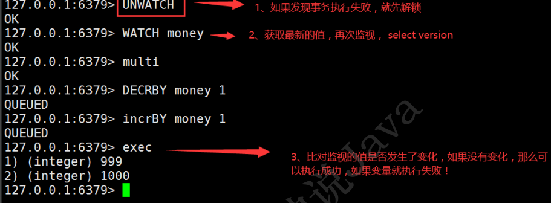
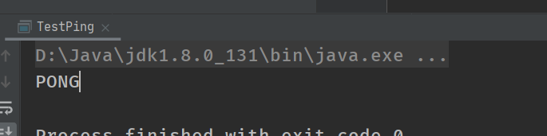
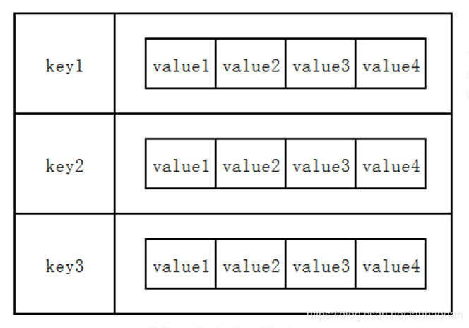
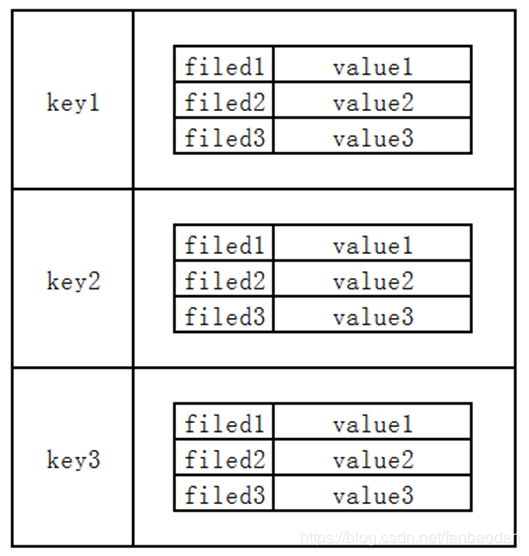
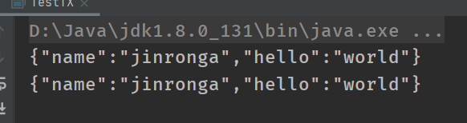
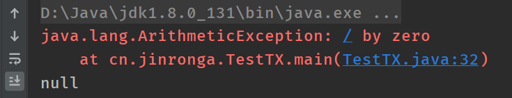

### redis事务：

----

Redis 事务本质：一组命令的集合！ 一个事务中的所有命令都会被序列化，在事务执行过程的中，会按照顺序执行！

一次性、顺序性、排他性！执行一些列的命令！

```
------ 队列 set set set 执行------
```

Redis事务没有没有隔离级别的概念！

所有的命令在事务中，并没有直接被执行！只有发起执行命令的时候才会执行！Exec

Redis单条命令式保存原子性的，但是事务不保证原子性！

redis的事务：

- 开启事务（multi）
- 命令入队（......）
- 执行事务（exec）

##### 正常的事务：

```shell
127.0.0.1:6379> multi #开启事务
OK
#命令入队
127.0.0.1:6379> set k1 v1
QUEUED
127.0.0.1:6379> set k2 v2
QUEUED
127.0.0.1:6379> get k2
QUEUED
127.0.0.1:6379> set k3 v3
QUEUED
127.0.0.1:6379> exec #执行事务
1) OK
2) OK
3) "v2"
4) OK
```

##### 放弃事务：

```shell
127.0.0.1:6379> multi #开启事务
OK
127.0.0.1:6379> set k1 v1
QUEUED
127.0.0.1:6379> set k2 v2
QUEUED
127.0.0.1:6379> set k4 v4
QUEUED
127.0.0.1:6379> DISCARD #取消事务
OK
127.0.0.1:6379> get k4 #事务队列中命令都不会执行！
(nil)

```

##### 编译型异常（代码有问题！ 命令有错！） ，事务中所有的命令都不会被执行！

```shell
127.0.0.1:6379> multi #开启事务
OK
127.0.0.1:6379> set k1 v1
QUEUED
127.0.0.1:6379> set k2 v2
QUEUED
127.0.0.1:6379> set k3 v3
QUEUED
127.0.0.1:6379> getset v3 #错误的命令
(error) ERR wrong number of arguments for 'getset' command
127.0.0.1:6379> set k4 v4
QUEUED
127.0.0.1:6379> set k5 v5
QUEUED
127.0.0.1:6379> exec #执行事务报错！
(error) EXECABORT Transaction discarded because of previous errors.
127.0.0.1:6379> get k5 #所有的命令都不会执行
(nil)
```

##### 运行时异常:

运行时异常（1/0）， 如果事务队列中存在语法性，那么执行命令的时候，其他命令是可以正常执行

的，错误命令抛出异常！

```shell
127.0.0.1:6379> set k1 "v1"
OK
127.0.0.1:6379> multi
OK
127.0.0.1:6379> incr k1 #会执行的时候失败
QUEUED
127.0.0.1:6379> set k2 v2
QUEUED
127.0.0.1:6379> set k3 v3
QUEUED
127.0.0.1:6379> get k3
QUEUED
127.0.0.1:6379> exec
1) (error) ERR value is not an integer or out of range #虽然第一条命令报错了，但是依旧正常执行了
2) OK
3) OK
4) "v3"
127.0.0.1:6379> get k2
"v2"
127.0.0.1:6379> get k3
"v3"
```

##### 监控！Watch（面试常常问）

##### **悲观锁：**

很悲观，认为什么时候都会出问题，无论做什么都会加锁！

顾名思义，就是很悲观，每次去拿数据的时候都认为别人会修改，所以每次在拿数据的时候都会上锁，这样别人想拿这个数据就会block直到它拿到锁。传统的关系型数据库里边就用到了很多这种锁机制，比如行锁，表锁等，读锁，写锁等，都是在做操作之前先上锁。它指的是对数据被外界（包括本系统当前的其他事务，以及来自外部系统的事务处理）修改持保守态度，因此，在整个数据处理过程中，将数据处于锁定状态。悲观锁的实现，往往依靠数据库提供的锁机制（也只有数据库层提供的锁机制才能真正保证数据访问的排他性，否则，即使在本系统中实现了加锁机制，也无法保证外部系统不会修改数据）。

##### **乐观锁：**

很乐观，认为什么时候都不会出问题，所以不会上锁！ 更新数据的时候去判断一下，在此期间是否  ，有人修改过这个数据，获取version ， 更新的时候比较  version

顾名思义，就是很乐观，每次去拿数据的时候都认为别人不会修改，所以不会上锁，但是在更新的时候会判断一下在此期间别人有没有去更新这个数据，可以使用版本号等机制。乐观锁适用于多读的应用类型，这样可以提高吞吐量，像数据库如果提供类似于write_condition机制的其实都是提供的乐观锁。

两种锁各有优缺点，不可认为一种好于另一种，像乐观锁适用于写比较少的情况下，即冲突真的很少发生的时候，这样可以省去了锁的开销，加大了系统的整个吞吐量。但如果经常产生冲突，上层应用会不断的进行retry，这样反倒是降低了性能，所以这种情况下用悲观锁就比较合适。本质上，数据库的乐观锁做法和悲观锁做法主要就是解决下面假设的场景，避免丢失更新问题：

**一个比较清楚的场景**

下面这个假设的实际场景可以比较清楚的帮助我们理解这个问题：假设当当网上用户下单买了本书，这时数据库中有条订单号为001的订单，其中有个status字段是’有效’,表示该订单是有效的；

后台管理人员查询到这条001的订单，并且看到状态是有效的用户发现下单的时候下错了，于是撤销订单，假设运行这样一条SQL: update order_table set status = ‘取消’ where order_id = 001;

后台管理人员由于在b这步看到状态有效的，这时，虽然用户在c这步已经撤销了订单，可是管理人员并未刷新界面，看到的订单状态还是有效的，于是点击”发货”按钮，将该订单发到物流部门，同时运行类似如下SQL，将订单状态改成已发货:update order_table set status = ‘已发货’ where order_id = 001


#### Redis测监视测试 watch

```shell
127.0.0.1:6379> set money 100
OK
127.0.0.1:6379> set out 0
OK
127.0.0.1:6379> watch money #监视money对象
OK
127.0.0.1:6379> multi #事务正常结束，数据期间没有发生变动，这个时候正常执行成功！
OK
127.0.0.1:6379> DECRBY money 20
QUEUED
127.0.0.1:6379> INCRBY out 20
QUEUED
127.0.0.1:6379> exec
1) (integer) 80
2) (integer) 20
```

测试多线程修改值，使用watch可以当做redis的乐观锁操作！(新开一个窗口连接Redis对money进行修改)

```
127.0.0.1:6379> watch money # 监视 money
OK
127.0.0.1:6379> multi
OK
127.0.0.1:6379> DECRBY money 10
QUEUED
127.0.0.1:6379> INCRBY out 20
QUEUED
127.0.0.1:6379> exec # 执行之前，另外一个线程，修改了我们的值，这个时候，就会导致事务执行失 败！
(nil)

```

如果修改失败，获取最新的值就好





### Jedis：

什么是Jedis是Redis官方推荐的java连接开发工具！使用java操作Redis的中间件！如果你要使用java操作Redis必须熟悉Jedis十分熟悉！！！

**测试：**

依赖：

```xml
    <!--导入jedis的包-->
    <dependency>
      <groupId>redis.clients</groupId>
      <artifactId>jedis</artifactId>
      <version>3.2.0</version>
    </dependency>
    <!--fastjson-->
    <dependency>
      <groupId>com.alibaba</groupId>
      <artifactId>fastjson</artifactId>
      <version>1.2.62</version>
    </dependency>
```

2、编码测试：

- 连接数据库
- 操作命令
- 断开连接！

```java
public class TestPing {

    public static void main(String[] args) {

        //1、new Jedis对象即可
        Jedis jedis=new Jedis("127.0.0.1",6379);
        // jedis 所有的命令就是我们之前学习的所有指令！所以之前的指令学习很重要！
        System.out.println(jedis.ping());
    }
}
```

结果：


##### 常用的API:

String

List

Set

Hash

Zset

### jedis语法总结

```
Jedis jedis = new Jedis(String ip , String port)
1
```

#### 1. jedis中对键通用的操作

| 方法                               | 描述                              | 返回值  /补充说明          |
| ---------------------------------- | --------------------------------- | -------------------------- |
| jedis.flush                        |                                   |                            |
| jedis.flushDB                      | 清空数据                          |                            |
| boolean jedis.exists(String key)   | 判断某个键是否存在                | true = 存在，false= 不存在 |
| jedis.set(String key,String value) | 新增键值对（key,value）           | 返回String类型的OK代表成功 |
| `Set<String> jedis.keys(*)`        | 获取所有key                       | 返回set 无序集合           |
| jedis.del(String key)              | 删除键为key的数据项               |                            |
| jedis.expire(String key,int i)     | 设置键为key的过期时间为i秒        |                            |
| int jedis.ttl(String key)          | 获取建委key数据项的剩余时间（秒） |                            |
| jedis.persist(String key)          | 移除键为key属性项的生存时间限制   |                            |
| jedis.type(String key)             | 查看键为key所对应value的数据类型  |                            |

#### 2. jedis中 字符串的操作

字符串类型是Redis中最为基础的数据存储类型，它在Redis中是二进制安全的，这	便意味着该类型可以接受任何格式的数据，如JPEG图像数据或Json对象描述信息等。	在Redis中字符串类型的Value最多可以容纳的数据长度是512M。

| 语法                                                  | 描述                                           |
| ----------------------------------------------------- | ---------------------------------------------- |
| jedis.set(String key,String value)                    | 增加（或覆盖）数据项                           |
| jedis.setnx(String key,String value)                  | 不覆盖增加数据项（重复的不插入）               |
| jedis.setex(String ,int t,String value)               | 增加数据项并设置有效时间                       |
| jedis.del(String key)                                 | 删除键为key的数据项                            |
| jedis.get(String key)                                 | 获取键为key对应的value                         |
| jedis.append(String key, String s)                    | 在key对应value 后边扩展字符串 s                |
| jedis.mset(String k1,String V1,String K2,String V2,…) | 增加多个键值对                                 |
| String[] jedis.mget(String K1,String K2,…)            | 获取多个key对应的value                         |
| `jedis.del(new String[](String K1,String K2,.... ))`  | 删除多个key对应的数据项                        |
| String jedis.getSet(String key,String value)          | 获取key对应value并更新value                    |
| String jedis.getrang(String key , int i, int j)       | 获取key对应value第i到j字符 ，从0开始，包头包尾 |

#### 3. jedis中对整数和浮点数操作

| 语法                             | 描述                  |
| -------------------------------- | --------------------- |
| jedis.incr(String key)           | 将key对应的value 加1  |
| jedis.incrBy(String key,int n)   | 将key对应的value 加 n |
| jedis.decr(String key)           | 将key对应的value 减1  |
| jedis.decrBy(String key , int n) | 将key对应的value 减 n |

#### 4. jedis中对列表（list）操作

在Redis中，List类型是按照插入顺序排序的字符串链表。和数据结构中的普通链表	 一样，我们可以在其头部(left)和尾部(right)添加新的元素。在插入时，如果该键并不存在，Redis将为该键创建一个新的链表。如果链表中所有的元素均被移除，那么该键也将会被从数据库中删除。List中可以包含的最大元素数量是 4294967295。
 从元素插入和删除的效率视角来看，如果我们是在链表的两头插入或删除元素，这将		会是非常高效的操作，即使链表中已经存储了百万条记录，该操作也可以在常量时间内完成。然而需要说明的是，如果元素插入或删除操作是作用于链表中间，那将会是非常低效的。



> list 元素的下表从0开始

| 语法                                                 | 描述                                                         |
| ---------------------------------------------------- | ------------------------------------------------------------ |
| `jedis.lpush(String key, String v1, String v2,....)` | 添加一个List , 注意：如果已经有该List对应的key, 则按顺序在左边追加  一个或多个 |
| jedis.rpush(String key , String vn)                  | key对应list右边插入元素                                      |
| jedis.lrange(String key,int i,int j)                 | 获取key对应list区间[i,j]的元素，注：从左边0开始，包头包尾    |
| jedis.lrem(String key,int n , String val)            | 删除list中 n个元素val                                        |
| jedis.ltrim(String key,int i,int j)                  | 删除list区间[i,j] 之外的元素                                 |
| jedis.lpop(String key)                               | key对应list ,左弹出栈一个元素                                |
| jedis.rpop(String key)                               | key对应list ,右弹出栈一个元素                                |
| jedis.lset(String key,int index,String val)          | 修改key对应的list指定下标index的元素                         |
| jedis.llen(String key)                               | 获取key对应list的长度                                        |
| jedis.lindex(String key,int index)                   | 获取key对应list下标为index的元素                             |
| jedis.sort(String key)                               | 把key对应list里边的元素从小到大排序  （后边详细介绍）        |

#### 5. jedis 集合set 操作

在Redis中，我们可以将Set类型看作为**没有排序的字符集合**，和List类型一样，也可以在该类型的数据值上执行添加、删除或判断某一元素是否存在等操作。需要	说明的是，这些操作的时间是常量时间。Set可包含的最大元素数是4294967295。
 和List类型不同的是，**Set集合中不允许出现重复的元素**。和List类型相比，Set类型在功能上还存在着一个非常重要的特性，即在服务器端完成多个Sets之间的聚合计 算操作，如unions、intersections和differences（就是交集并集那些了）。由于这些操作均在服务端完成，	 因此效率极高，而且也节省了大量的网络IO开销

> set 的方法都以s开头

| 语法                                              | 操作                            |
| ------------------------------------------------- | ------------------------------- |
| jedis.sadd(String key,String v1,String v2,…)      | 添加一个set                     |
| jedis.smenbers(String key)                        | 获取key对应set的所有元素        |
| jedis.srem(String key,String val)                 | 删除集合key中值为val的元素      |
| jedis.srem(String key, Sting v1, String v2,…)     | 删除值为v1, v2 , …的元素        |
| jedis.spop(String key)                            | 随机弹出栈set里的一个元素       |
| jedis.scared(String key)                          | 获取set元素个数                 |
| jedis.smove(String key1, String key2, String val) | 将元素val从集合key1中移到key2中 |
| jedis.sinter(String key1, String key2)            | 获取集合key1和集合key2的交集    |
| jedis.sunion(String key1, String key2)            | 获取集合key1和集合key2的并集    |
| jedis.sdiff(String key1, String key2)             | 获取集合key1和集合key2的差集    |

#### 6. jedis中 有序集合Zsort

Sorted-Sets和Sets类型极为相似，它们都是字符串的集合，都**不允许重复的成员出现在一个Set中**。它们之间的**主要差别是Sorted-Sets中的每一个成员都会有一个分数(score)与之关联**，Redis正是通过分数来为集合中的成员进行从小到大的排序。然	而需要额外指出的是，尽管Sorted-Sets中的成员必须是唯一的，但是分数(score)	却是可以重复的。
 在Sorted-Set中添加、删除或更新一个成员都是非常快速的操作，其时间复杂度为集合中成员数量的对数。由于Sorted-Sets中的成员在集合中的位置是有序的，因此，即便是访问位于集合中部的成员也仍然是非常高效的。事实上，Redis所具有的这一特征在很多其它类型的数据库中是很难实现的，换句话说，在该点上要想达到和Redis同样的高效，在其它数据库中进行建模是非常困难的。
 例如：游戏排名、微博热点话题等使用场景。

| 语法                                             | 描述                                            |
| ------------------------------------------------ | ----------------------------------------------- |
| jedis.zadd(String key,Map map)                   | 添加一个ZSet                                    |
| jedis.hset(String key,int score , int val)       | 往 ZSet插入一个元素（Score-Val）                |
| jedis.zrange(String key, int i , int j)          | 获取ZSet 里下表[i,j] 区间元素Val                |
| jedis. zrangeWithScore(String key,int i , int j) | 获取ZSet 里下表[i,j] 区间元素Score - Val        |
| jedis.zrangeByScore(String , int i , int j)      | 获取ZSet里score[i,j]分数区间的元素（Score-Val） |
| jeids.zscore(String key,String value)            | 获取ZSet里value元素的Score                      |
| jedis.zrank(String key,String value)             | 获取ZSet里value元素的score的排名                |
| jedis.zrem(String key,String value)              | 删除ZSet里的value元素                           |
| jedis.zcard(String key)                          | 获取ZSet的元素个数                              |
| jedis.zcount(String key , int  i ,int j)         | 获取ZSet总score在[i,j]区间的元素个数            |
| jedis.zincrby(String key,int n , String value)   | 把ZSet中value元素的score+=n                     |

#### 7. jedis中 哈希（Hash）操作

Redis中的Hashes类型可以看成具有String Key和String  Value的map容器。所以该类型非常适合于存储值对象的信息。如Username、Password和Age等。如果Hash中包含很少的字段，那么该类型的数据也将仅占用很少的磁盘空间。每一个Hash可以存储4294967295个键值对。
 

> 规律： 哈希的 方法 都以 h 开头，含有m字符的一般是多个的， （multiple： 多个的）

| 语法                                              | 描述                           |
| ------------------------------------------------- | ------------------------------ |
| jedis.hmset(String key,Map map)                   | 添加一个Hash                   |
| jedis.hset(String key , String key, String value) | 向Hash中插入一个元素（K-V）    |
| jedis.hgetAll(String key)                         | 获取Hash的所有（K-V） 元素     |
| jedis.hkeys（String key）                         | 获取Hash所有元素的key          |
| jedis.hvals(String key)                           | 获取Hash所有元素 的value       |
| jedis.hincrBy(String key , String k, int i)       | 把Hash中对应的k元素的值 val+=i |
| jedis.hdecrBy(String key,String k, int i)         | 把Hash中对应的k元素的值 val-=i |
| jedis.hdel(String key , String k1, String k2,…)   | 从Hash中删除一个或多个元素     |
| jedis.hlen(String key)                            | 获取Hash中元素的个数           |
| jedis.hexists(String key,String K1)               | 判断Hash中是否存在K1对应的元素 |
| jedis.hmget(String key,String K1,String K2)       | 获取Hash中一个或多个元素value  |

#### 8. 排序操作

使用排序， 首先需要生成一个排序对象

```
SortingParams  sortingParams =  new SortingParams();
1
```

| 语法                                          | 描述                 |
| --------------------------------------------- | -------------------- |
| jedis.sort(String key,sortingParams.alpha())  | 队列按首字母a-z 排序 |
| jedis.sort(String key, sortingParams.asc() )  | 队列按数字升序排列   |
| jedis.sort(String key , sortingParams.desc()) | 队列按数字降序排列   |

使用示例：

```
 Jedis jedis = JedisPoolUtils.getJedis();
 SortingParams sortingParams = new SortingParams();
 List<String> sort = jedis.sort("list02", sortingParams.desc());
```

##### 事务：

```
public class TestTX {
    public static void main(String[] args) {
        Jedis jedis=new Jedis("127.0.0.1",6379);

        jedis.flushDB();//清空
        JSONObject jsonObject=new JSONObject();
        jsonObject.put("hello","world");
        jsonObject.put("name","jinronga");

        //开启事务
        Transaction multi = jedis.multi();
        String result = jsonObject.toJSONString();

        try {
//            jedis.watch(result);//监听数据
            multi.set("user1",result);
            multi.set("user2",result);
      int i = 1/0 ; // 代码抛出异常事务，执行失败！
            multi.exec();//执行事务
        }catch (Exception e){
            multi.discard();//放弃事务
            e.printStackTrace();
        }finally {
            System.out.println(jedis.get("user1"));
            System.out.println(jedis.get("user2"));
            jedis.close();//关闭连接
        }
    }
}
```

成功：




失败：




