#### SPringBoot整合Redis与持久化

----------------------

SpringBoot 操作数据：spring-data jpa jdbc mongodb redis！

SpringData 也是和 SpringBoot 齐名的项目！

说明： 在 SpringBoot2.x 之后，原来使用的jedis 被替换为了 lettuce?

jedis : 采用的直连，多个线程操作的话，是不安全的，如果想要避免不安全的，使用 jedis pool 连接

池！ 更像 BIO 模式

lettuce : 采用netty，实例可以再多个线程中进行共享，不存在线程不安全的情况！可以减少线程数据

了，更像 NIO 模式

**源码分析：**

```java
@Configuration(proxyBeanMethods = false)
@ConditionalOnClass(RedisOperations.class)
@EnableConfigurationProperties(RedisProperties.class)
@Import({ LettuceConnectionConfiguration.class, JedisConnectionConfiguration.class })
public class RedisAutoConfiguration {

	@Bean
	@ConditionalOnMissingBean(name = "redisTemplate")//我们自己定义一个
	public RedisTemplate<Object, Object> redisTemplate(RedisConnectionFactory redisConnectionFactory)
			throws UnknownHostException {
			//默认的RedisTemplate没有过多的设置，redis对象都需要序列化！
			//两个泛型都是Object,object的类型，我们后使用需要强制转换<String,Object>
		RedisTemplate<Object, Object> template = new RedisTemplate<>();
		template.setConnectionFactory(redisConnectionFactory);
		return template;
	}

	@Bean
	@ConditionalOnMissingBean//由于String是Redis中最常用的类型，所以单独提出来一个bean!
	public StringRedisTemplate stringRedisTemplate(RedisConnectionFactory redisConnectionFactory)
			throws UnknownHostException {
		StringRedisTemplate template = new StringRedisTemplate();
		template.setConnectionFactory(redisConnectionFactory);
		return template;
	}

}
```

**整合测试**

1、导入依赖

```xml
<!--        操作redis-->
        <dependency>
            <groupId>org.springframework.boot</groupId>
            <artifactId>spring-boot-starter-data-redis</artifactId>
        </dependency>
```

2、配置连接：

```properties

spring.redis.host=127.0.0.1
spring.redis.port=6379
```


3、测试：

```java
@SpringBootTest
class SpringbootRedisApplicationTests {
    @Autowired
    private RedisTemplate redisTemplate;

    @Test
    void contextLoads() {
        
       //在企业开发中，我们百分之80的情况下，都不会使用这个原生的方法写
        // redisTemplate 操作不同的数据类型，api和我们的指令是一样的 
        // opsForValue 操作字符串 类似String 
        // opsForList 操作List 类似List 
        // opsForSet 
        // opsForHash 
        // opsForZSet 
        // opsForGeo 
        // opsForHyperLogLog 
        // 除了进本的操作，我们常用的方法都可以直接通过redisTemplate操作，比如事务，和基本的 CRUD 
        // 获取redis的连接对象 
        // RedisConnection connection = redisTemplate.getConnectionFactory().getConnection(); 
        // connection.flushDb(); //
        redisTemplate.opsForValue().set("mykey","我會好好學習Java的");
        System.out.println(redisTemplate.opsForValue().get("mykey"));
    }
}
```

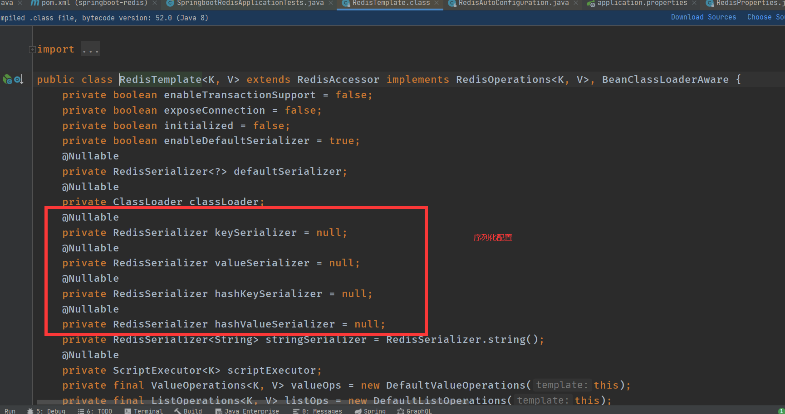

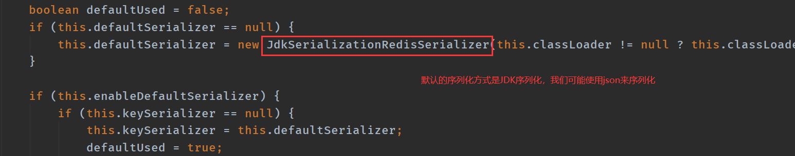

测试没有序列化产生的结果！

User：

```java
@Component
@Data
@AllArgsConstructor
@NoArgsConstructor
public class User {
    private String name;
    private int age;
}
```

测试：

```
    @Autowired
    private RedisTemplate redisTemplate;
   @Test
    void contextLoads1() {
        User user = new User("jinronga", 20);
        redisTemplate.opsForValue().set("user",user);
        System.out.println(redisTemplate.opsForValue().get("user"));

    }
}
```

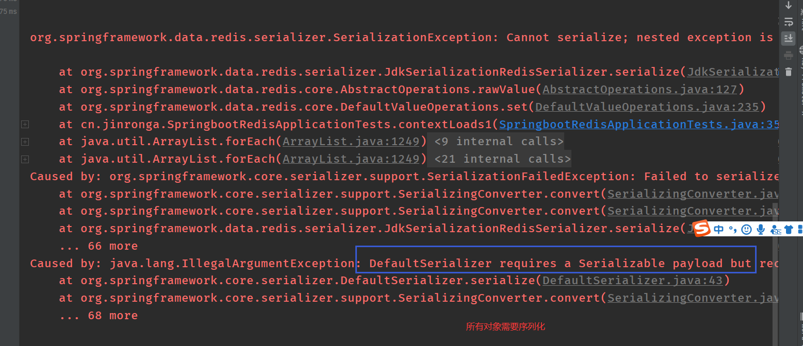

编写一个属于我们自己的RedisTemplate

```java
package cn.jinronga.config;

import com.fasterxml.jackson.annotation.JsonAutoDetect;
import com.fasterxml.jackson.annotation.PropertyAccessor;
import com.fasterxml.jackson.databind.ObjectMapper;

import org.springframework.context.annotation.Bean;
import org.springframework.context.annotation.Configuration;
import org.springframework.data.redis.connection.RedisConnectionFactory;
import org.springframework.data.redis.core.RedisTemplate;
import org.springframework.data.redis.serializer.Jackson2JsonRedisSerializer;
import org.springframework.data.redis.serializer.StringRedisSerializer;

@Configuration
public class RedisConfig {
    @Bean
    @SuppressWarnings("all")
    public RedisTemplate<String, Object> redisTemplate(RedisConnectionFactory factory) {
        // 我们为了自己开发方便，一般直接使用 <String, Object>
        RedisTemplate<String, Object> template = new RedisTemplate<String, Object>();
        template.setConnectionFactory(factory);
        // Json序列化配置
        Jackson2JsonRedisSerializer jackson2JsonRedisSerializer = new Jackson2JsonRedisSerializer(Object.class);
        ObjectMapper om = new ObjectMapper();
        om.setVisibility(PropertyAccessor.ALL, JsonAutoDetect.Visibility.ANY);
        om.enableDefaultTyping(ObjectMapper.DefaultTyping.NON_FINAL);
        jackson2JsonRedisSerializer.setObjectMapper(om);
        // String 的序列化
        StringRedisSerializer stringRedisSerializer = new StringRedisSerializer();
        // key采用String的序列化方式
        template.setKeySerializer(stringRedisSerializer);
        // hash的key也采用String的序列化方式
        template.setHashKeySerializer(stringRedisSerializer);
        // value序列化方式采用jackson
        template.setValueSerializer(jackson2JsonRedisSerializer);
        // hash的value序列化方式采用jackson
        template.setHashValueSerializer(jackson2JsonRedisSerializer);
        template.afterPropertiesSet();
        return template;
    }
}
```

测试：

```java
    @Autowired
    @Qualifier("redisTemplate")
    private RedisTemplate redisTemplate;

@Test
void contextLoads1() {
    User user = new User("jinronga", 20);
    redisTemplate.opsForValue().set("user",user);
    System.out.println(redisTemplate.opsForValue().get("user"));

}
```

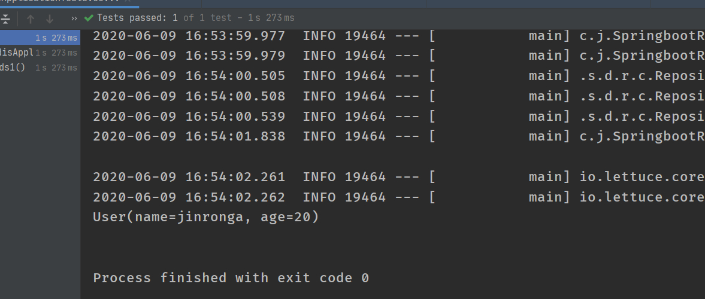

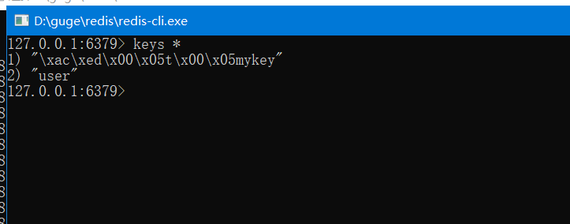

在企业开发中会使用自己编写的工具类：RedisUtil.java


### Redis.conf详解：

启动的时候，就通过配置文件来启动！

工作中，一些小小的配置，可以让你脱颖而出！

##### 单位：

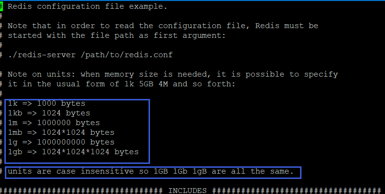

1、配置文件 unit单位 对大小写不敏感！

##### 包含：

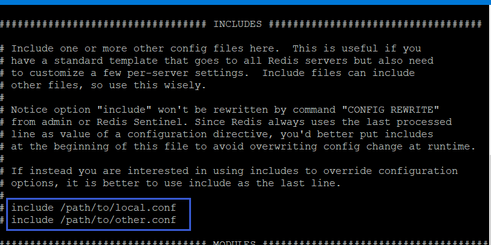

就是好比我们学习Spring、Improt， include

##### 网络：

```
bind 127.0.0.1 # 绑定的
ip protected-mode yes # 保护模式 
port 6379 # 端口设置
```

##### 通用 GENERAL:

```

daemonize yes # 以守护进程的方式运行，默认是 no，我们需要自己开启为yes！ pidfile /var/run/redis_6379.pid # 如果以后台的方式运行，我们就需要指定一个 pid 文件！
# 日志 
# Specify the server verbosity level.
# This can be one of:

# debug (a lot of information, useful for development/testing) 
# verbose (many rarely useful info, but not a mess like the debug level) 
# notice (moderately verbose, what you want in production probably) 生产环境 
# warning (only very important / critical messages are logged) loglevel notice logfile "" 
# 日志的文件位置名 databases 16
# 数据库的数量，默认是 16 个数据库 always-show-logo yes 
# 是否总是显示LOGO
```

##### 快照：

持久化，在规定时间内，执行了多少次操作，则会持久化到文件中.rdb.aof

redis 是内存数据库，如果没有持久化，那么数据断电及失！

```
# 如果900s内，如果至少有一个1 key进行了修改，我们及进行持久化操作
save 900 1 
# 如果300s内，如果至少10 key进行了修改，我们及进行持久化操作
save 300 10
# 如果60s内，如果至少10000 key进行了修改，我们及进行持久化操作 
save 60 10000 
# 我们之后学习持久化，会自己定义这个测试！ 
stop-writes-on-bgsave-error yes # 持久化如果出错，是否还需要继续工作！ rdbcompression yes # 是否压缩 rdb 文件，需要消耗一些cpu资源！ rdbchecksum yes # 保存rdb文件的时候，进行错误的检查校验！ 
dir ./ # rdb 文件保存的目录！
```


##### SECURITY 安全:

可以在这里设置redis的密码，默认是没有密码！

```
127.0.0.1:6379> ping
PONG
127.0.0.1:6379> config get requirepass #获取redis密码
1) "requirepass"
2) ""
127.0.0.1:6379> config set requirepass "123456" #设置redis密码
OK
127.0.0.1:6379> config get requirepass #发现所有的命令没有权限了
(error) NOAUTH Authentication required.
127.0.0.1:6379> ping
(error) NOAUTH Authentication required.
127.0.0.1:6379> auth 123456 #使用密码进行登录
OK
127.0.0.1:6379> config get requirepass
1) "requirepass"
2) "123456"
```

##### 限制 CLIENTS

```
maxclients 10000 # 设置能连接上redis的最大客户端的数量
maxmemory <bytes> # redis 配置最大的内存容量
maxmemory-policy noeviction # 内存到达上限之后的处理策略
    1、volatile-lru：只对设置了过期时间的key进行LRU（默认值）
    2、allkeys-lru ： 删除lru算法的key
    3、volatile-random：随机删除即将过期key
    4、allkeys-random：随机删除 
    5、volatile-ttl ： 删除即将过期的 
    6、noeviction ： 永不过期，返回错误
```

##### APPEND ONLY 模式 aof配置:

```
appendonly no # 默认是不开启aof模式的，默认是使用rdb方式持久化的，在大部分所有的情况下， rdb完全够用！ 
appendfilename "appendonly.aof" # 持久化的文件的名字 
# appendfsync always  # 每次修改都会 sync。消耗性能
appendfsync everysec  # 每秒执行一次 sync，可能会丢失这1s的数据！
# appendfsync no  # 不执行 sync，这个时候操作系统自己同步数据，速度最快！
```


### Redis持久化:

##### RDB（Redis DataBase）:

**什么是RDB？**

在主从复制中，rdb就是备用了！从机上面！

Redis 是内存数据库，如果不将内存中的数据库状态保存到磁盘，那么一旦服务器进程退出，服务器中的数据库状态也会消失。所以 Redis 提供了持久化功能！

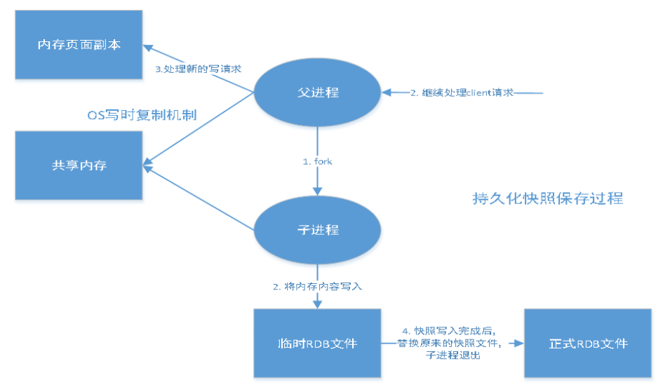


在指定的时间间隔内将内存中的数据集快照写入磁盘，也就是行话讲的Snapshot快照，它恢复时是将快

照文件直接读到内存里。

Redis会单独创建（fork）一个子进程来进行持久化，会先将数据写入到一个临时文件中，待持久化过程

都结束了，再用这个临时文件替换上次持久化好的文件。整个过程中，主进程是不进行任何IO操作的。

这就确保了极高的性能。如果需要进行大规模数据的恢复，且对于数据恢复的完整性不是非常敏感，那

RDB方式要比AOF方式更加的高效。RDB的缺点是最后一次持久化后的数据可能丢失。我们默认的就是

RDB，一般情况下不需要修改这个配置！有时候在生产环境我们会将这个文件进行备份!


rdb保存的文件是dump.rdb 都是在我们的配置文件中快照中进行配置的！


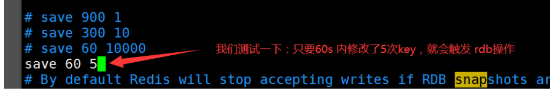

##### 触发机制：

1、save的规则满足的情况下，会自动触发rdb规则

2、执行 flflushall 命令，也会触发我们的rdb规则！

3、退出redis，也会产生 rdb 文件！

备份就自动生成一个 dump.rdb

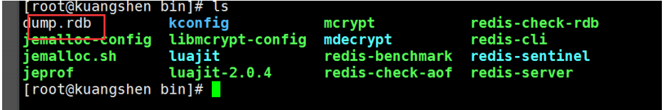

##### 如果恢复rdb文件！

1、只需要将rdb文件放在我们redis启动目录就可以，redis启动的时候会自动检查dump.rdb 恢复其中

的数据！

2、查看需要存在的位置

```
127.0.0.1:6379> config get dir 
1) "dir"
2) "/usr/local/bin" # 如果在这个目录下存在 dump.rdb 文件，启动就会自动恢复其中的数据
```

几乎就他自己默认的配置就够用了，但是我们还是需要去学习！

**优点：**

1、适合大规模的数据恢复！ 

2、对数据的完整性要不高！

**缺点：**

1、需要一定的时间间隔进程操作！如果redis意外宕机了，这个最后一次修改数据就没有的了！

2、fork进程的时候，会占用一定的内容空间!!!


### AOF（Append Only File）：

将我们的所有命令都记录下来，history，恢复的时候就把这个文件全部在执行一遍！

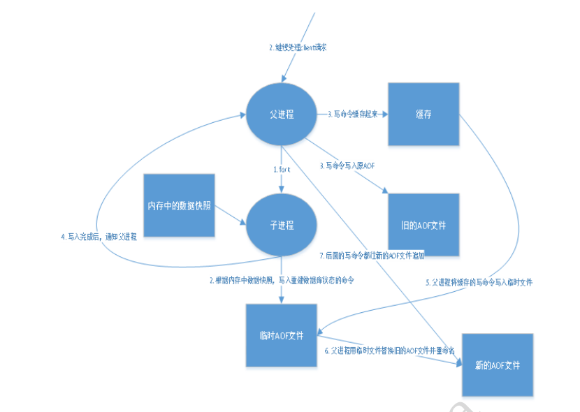

以日志的形式来记录每个写操作，将Redis执行过的所有指令记录下来（读操作不记录），只许追加文件

但不可以改写文件，redis启动之初会读取该文件重新构建数据，换言之，redis重启的话就根据日志文件

的内容将写指令从前到后执行一次以完成数据的恢复工作

Aof保存的是 appendonly.aof 文件

##### append：

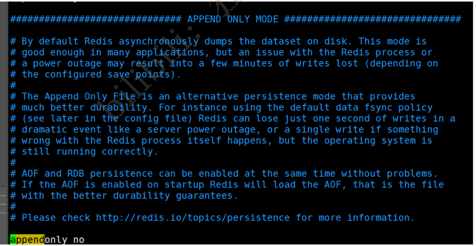

默认是不开启的，我们需要手动进行配置！我们只需要将 appendonly 改为yes就开启了 aof！

重启，redis 就可以生效了！

如果这个 aof 文件有错位，这时候 redis 是启动不起来的吗，我们需要修复这个aof文件

redis 给我们提供了一个工具 **redis-check-aof --fix** 

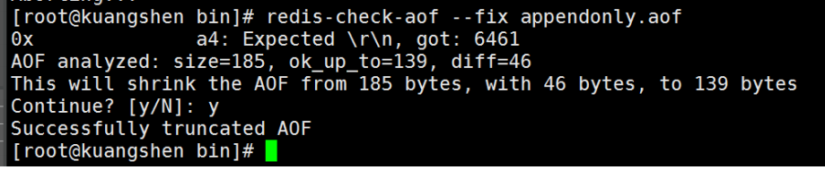

如果文件正常，重启就可以直接恢复了！

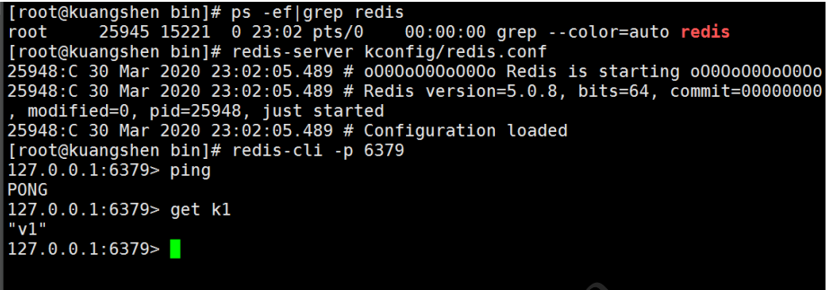

##### 重写规则说明

aof 默认就是文件的无限追加，文件会越来越大！

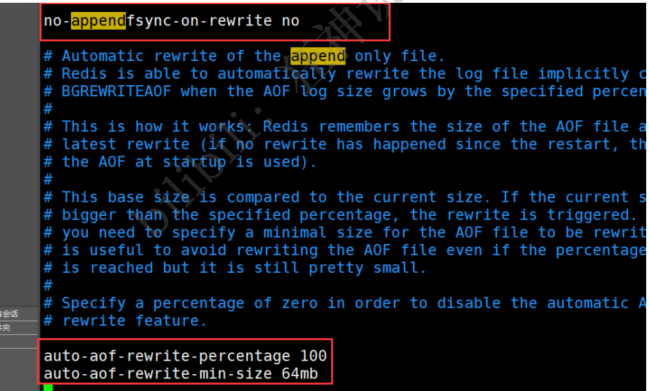

如果 aof 文件大于 64m，太大了！ fork一个新的进程来将我们的文件进行重写！


##### 优点和缺点！

```
appendonly no # 默认是不开启aof模式的，默认是使用rdb方式持久化的，在大部分所有的情况下， rdb完全够用！ 

appendfilename "appendonly.aof" # 持久化的文件的名字
# appendfsync always # 每次修改都会 sync。消耗性能 
appendfsync everysec # 每秒执行一次 sync，可能会丢失这1s的数据！
# appendfsync no # 不执行 sync，这个时候操作系统自己同步数据，速度最快！

# rewrite 重写，
```


##### 优点：

1、每一次修改都同步，文件的完整会更加好！

2、每秒同步一次，可能会丢失一秒的数据

3、从不同步，效率最高的！

##### 缺点：

1、相对于数据文件来说，aof远远大于 rdb，修复的速度也比 rdb慢！

2、Aof 运行效率也要比 rdb 慢，所以我们redis默认的配置就是rdb持久化!


**扩展：**

1、RDB 持久化方式能够在指定的时间间隔内对你的数据进行快照存储

2、AOF 持久化方式记录每次对服务器写的操作，当服务器重启的时候会重新执行这些命令来恢复原始

的数据，AOF命令以Redis 协议追加保存每次写的操作到文件末尾，Redis还能对AOF文件进行后台重

写，使得AOF文件的体积不至于过大。

3、只做缓存，如果你只希望你的数据在服务器运行的时候存在，你也可以不使用任何持久化

4、同时开启两种持久化方式

在这种情况下，当redis重启的时候会优先载入AOF文件来恢复原始的数据，因为在通常情况下AOF

文件保存的数据集要比RDB文件保存的数据集要完整。

RDB 的数据不实时，同时使用两者时服务器重启也只会找AOF文件，那要不要只使用AOF呢？作者

建议不要，因为RDB更适合用于备份数据库（AOF在不断变化不好备份），快速重启，而且不会有

AOF可能潜在的Bug，留着作为一个万一的手段。

5、性能建议

因为RDB文件只用作后备用途，建议只在Slave上持久化RDB文件，而且只要15分钟备份一次就够

了，只保留 save 900 1 这条规则。

如果Enable AOF ，好处是在最恶劣情况下也只会丢失不超过两秒数据，启动脚本较简单只load自

己的AOF文件就可以了，代价一是带来了持续的IO，二是AOF rewrite 的最后将 rewrite 过程中产

生的新数据写到新文件造成的阻塞几乎是不可避免的。只要硬盘许可，应该尽量减少AOF rewrite

的频率，AOF重写的基础大小默认值64M太小了，可以设到5G以上，默认超过原大小100%大小重

写可以改到适当的数值。

如果不Enable AOF ，仅靠 Master-Slave Repllcation 实现高可用性也可以，能省掉一大笔IO，也

减少了rewrite时带来的系统波动。代价是如果Master/Slave 同时倒掉，会丢失十几分钟的数据，

启动脚本也要比较两个 Master/Slave 中的 RDB文件，载入较新的那个，微博就是这种架构。


