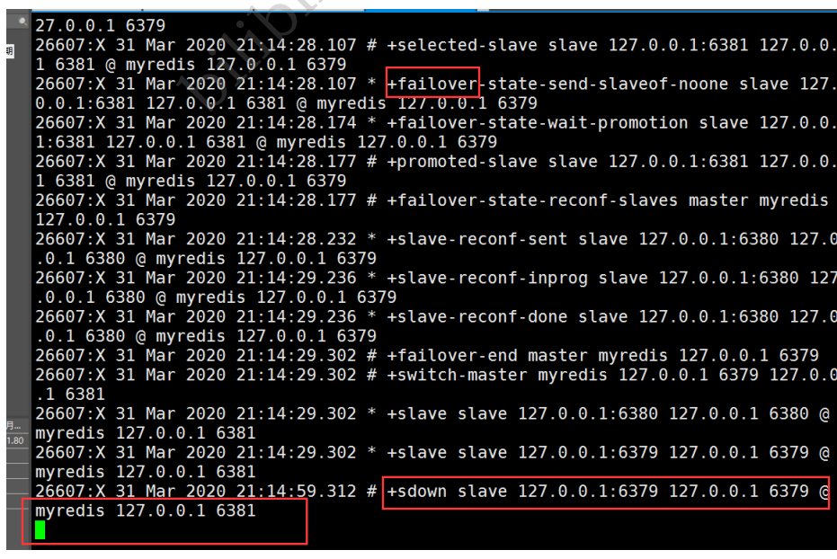

## Redis发布订阅

Redis 发布订阅(pub/sub)是一种**消息通信模式**：发送者(pub)发送消息，订阅者(sub)接收消息。微信、微博、关注系统！

Redis 客户端可以订阅任意数量的频道。

第一个：消息发送者， 第二个：频道 第三个：消息订阅者！


下图展示了频道 channel1 ， 以及订阅这个频道的三个客户端 —— client2 、 client5 和 client1 之间的

关系：


当有新消息通过 PUBLISH 命令发送给频道 channel1 时， 这个消息就会被发送给订阅它的三个客户端： 


##### 命令：

这些命令被广泛用于构建即时通信应用，比如网络聊天室(chatroom)和实时广播、实时提醒等。

下表列出了 redis 发布订阅常用命令：

| 序号 | 命令及描述                                                   |
| :--- | :----------------------------------------------------------- |
| 1    | [PSUBSCRIBE pattern [pattern ...\]](https://www.runoob.com/redis/pub-sub-psubscribe.html) 订阅一个或多个符合给定模式的频道。 |
| 2    | [PUBSUB subcommand [argument [argument ...\]]](https://www.runoob.com/redis/pub-sub-pubsub.html) 查看订阅与发布系统状态。 |
| 3    | [PUBLISH channel message](https://www.runoob.com/redis/pub-sub-publish.html) 将信息发送到指定的频道。 |
| 4    | [PUNSUBSCRIBE [pattern [pattern ...\]]](https://www.runoob.com/redis/pub-sub-punsubscribe.html) 退订所有给定模式的频道。 |
| 5    | [SUBSCRIBE channel [channel ...\]](https://www.runoob.com/redis/pub-sub-subscribe.html) 订阅给定的一个或多个频道的信息。 |
| 6    | [UNSUBSCRIBE [channel [channel ...\]]](https://www.runoob.com/redis/pub-sub-unsubscribe.html) 指退订给定的频道。 |

##### 订阅端：

```shell
redis 127.0.0.1:6379> SUBSCRIBE redisChat

Reading messages... (press Ctrl-C to quit)
1) "subscribe"
2) "redisChat"
3) (integer) 1
```

##### 发送端：

```shell
redis 127.0.0.1:6379> PUBLISH redisChat "Redis is a great caching technique"

(integer) 1

redis 127.0.0.1:6379> PUBLISH redisChat "Learn redis by runoob.com"

(integer) 1

# 订阅者的客户端会显示如下消息
1) "message"
2) "redisChat"
3) "Redis is a great caching technique"
1) "message"
2) "redisChat"
3) "Learn redis by runoob.com"
```

##### 原理：

Redis是使用C实现的，通过分析 Redis 源码里的 pubsub.c 文件，了解发布和订阅机制的底层实现，籍

此加深对 Redis 的理解。

Redis 通过 PUBLISH 、SUBSCRIBE 和 PSUBSCRIBE 等命令实现发布和订阅功能。

微信：

通过 SUBSCRIBE 命令订阅某频道后，redis-server 里维护了一个字典，字典的键就是一个个 频道！，

而字典的值则是一个链表，链表中保存了所有订阅这个 channel 的客户端。SUBSCRIBE 命令的关键，

就是将客户端添加到给定 channel 的订阅链表中。


通过 PUBLISH 命令向订阅者发送消息，redis-server 会使用给定的频道作为键，在它所维护的 channel

字典中查找记录了订阅这个频道的所有客户端的链表，遍历这个链表，将消息发布给所有订阅者。

Pub/Sub 从字面上理解就是发布（Publish）与订阅（Subscribe），在Redis中，你可以设定对某一个

key值进行消息发布及消息订阅，当一个key值上进行了消息发布后，所有订阅它的客户端都会收到相应

的消息。这一功能最明显的用法就是用作实时消息系统，比如普通的即时聊天，群聊等功能。

**使用场景：**

1、实时消息系统！

2、事实聊天！（频道当做聊天室，将信息回显给所有人即可！）

3、订阅，关注系统都是可以的！

稍微复杂的场景我们就会使用 消息中间件 MQ （）


### Redis主从复制：

**概念**

主从复制，是指将一台Redis服务器的数据，复制到其他的Redis服务器。前者称为主节点

(master/leader)，后者称为从节点(slave/follower)；数据的复制是单向的，只能由主节点到从节点。

Master以写为主，Slave 以读为主。

默认情况下，每台Redis服务器都是主节点；

且一个主节点可以有多个从节点(或没有从节点)，但一个从节点只能有一个主节点。（）

**主从复制的作用主要包括：**

1、数据冗余：主从复制实现了数据的热备份，是持久化之外的一种数据冗余方式。

2、故障恢复：当主节点出现问题时，可以由从节点提供服务，实现快速的故障恢复；实际上是一种服务

的冗余。

3、负载均衡：在主从复制的基础上，配合读写分离，可以由主节点提供写服务，由从节点提供读服务

（即写Redis数据时应用连接主节点，读Redis数据时应用连接从节点），分担服务器负载；尤其是在写

少读多的场景下，通过多个从节点分担读负载，可以大大提高Redis服务器的并发量。

4、高可用（集群）基石：除了上述作用以外，主从复制还是哨兵和集群能够实施的基础，因此说主从复

制是Redis高可用的基础。

一般来说，要将Redis运用于工程项目中，只使用一台Redis是万万不能的（宕机），原因如下：

1、从结构上，单个Redis服务器会发生单点故障，并且一台服务器需要处理所有的请求负载，压力较

大；

2、从容量上，单个Redis服务器内存容量有限，就算一台Redis服务器内存容量为256G，也不能将所有

内存用作Redis存储内存，一般来说，单台Redis最大使用内存不应该超过20G。

电商网站上的商品，一般都是一次上传，无数次浏览的，说专业点也就是"多读少写"。

对于这种场景，我们可以使如下这种架构：


#### **环境配置**

只配置从库，不用配置主库！

```shell
127.0.0.1:6379> info replication # 查看当前库的信息 

# Replication 

role:master # 角色 master 

connected_slaves:0 # 没有从机 

master_replid:b63c90e6c501143759cb0e7f450bd1eb0c70882a 

master_replid2:0000000000000000000000000000000000000000 

master_repl_offset:0 

second_repl_offset:-1 

repl_backlog_active:0 

repl_backlog_size:1048576 

repl_backlog_first_byte_offset:0 

repl_backlog_histlen:0
```

复制3个配置文件，然后修改对应的信息

1、端口

2、pid 名字

3、log文件名字

4、dump.rdb 名字

修改完毕之后，启动我们的3个redis服务器，可以通过进程信息查看！


**一主二从**

默认情况下，每台Redis服务器都是主节点； 我们一般情况下只用配置从机就好了！

认老大！ 一主 （79）二从（80，81） 

```shell
=======当前是6380端口的redis服务============
127.0.0.1:6380> SLAVEOF 127.0.0.1 6379 # SLAVEOF host 6379 找谁当自己的老大！ 

OK

127.0.0.1:6380> info replication 
# Replication 
role:slave # 当前角色是从机 

master_host:127.0.0.1 # 可以的看到主机的信息 

master_port:6379 
master_link_status:up 

master_last_io_seconds_ago:3 

master_sync_in_progress:0 

slave_repl_offset:14 

slave_priority:100 

slave_read_only:1 

connected_slaves:0 

master_replid:a81be8dd257636b2d3e7a9f595e69d73ff03774e 

master_replid2:0000000000000000000000000000000000000000 

master_repl_offset:14 

second_repl_offset:-1 

repl_backlog_active:1 

repl_backlog_size:1048576 

repl_backlog_first_byte_offset:1 

repl_backlog_histlen:14 


=======当前是6379端口的redis服务============

# 在主机中查看！ 

127.0.0.1:6379> info replication 

# Replication 

role:master 

connected_slaves:1 # 多了从机的配置 

slave0:ip=127.0.0.1,port=6380,state=online,offset=42,lag=1 # 多了从机的配置 

master_replid:a81be8dd257636b2d3e7a9f595e69d73ff03774e 

master_replid2:0000000000000000000000000000000000000000 

master_repl_offset:42 

second_repl_offset:-1 

repl_backlog_active:1 

repl_backlog_size:1048576 

repl_backlog_first_byte_offset:1 

repl_backlog_histlen:42 
```

如果两个都配置好了，有连个从机的


真实的从主配置应该在配置文件中配置，这样的话是永久的，我们这里使用的是命令，暂时的！

##### 细节：

主机可以写，从机不能写只能读！主机中的所有信息和数据，都会自动被从机保存！

主机写：


从机只能读取内容！


测试：主机断开连接，从机依旧连接到主机的，但是没有写操作，这个时候，主机如果回来了，从机依

旧可以直接获取到主机写的信息！

如果是使用命令行，来配置的主从，这个时候如果重启了，就会变回主机！只要变为从机，立马就会从

主机中获取值！

##### 复制原理：

Slave 启动成功连接到 master 后会发送一个sync同步命令

Master 接到命令，启动后台的存盘进程，同时收集所有接收到的用于修改数据集命令，在后台进程执行

完毕之后，**master将传送整个数据文件到slave**，并完成一次完全同步。

**全量复制：**而slave服务在接收到数据库文件数据后，将其存盘并加载到内存中。

**增量复制：**Master 继续将新的所有收集到的修改命令依次传给slave，完成同步

但是只要是重新连接master，一次完全同步（全量复制）将被自动执行！ 我们的数据一定可以在从机中

看到！

##### 层层链路：

上一个M链接下一个 S！


这时候也可以完成我们的主从复制！

如果主机宕机了，没有了老大这个时候能不能选择一个当老大呢？手动！

**谋朝篡位**

如果主机断开了连接，我们可以使用 SLAVEOF no one 让自己变成主机！其他的节点就可以手动连

接到最新的这个主节点（手动）！如果这个时候老大修复了，那就重新连接！

### **哨兵模式**

（自动选举老大的模式）

##### 概述：

主从切换技术的方法是：当主服务器宕机后，需要手动把一台从服务器切换为主服务器，这就需要人工

干预，费事费力，还会造成一段时间内服务不可用。这不是一种推荐的方式，更多时候，我们优先考虑

哨兵模式。Redis从2.8开始正式提供了Sentinel（哨兵） 架构来解决这个问题。

谋朝篡位的自动版，能够后台监控主机是否故障，如果故障了根据投票数**自动将从库转换为主库。**

哨兵模式是一种特殊的模式，首先Redis提供了哨兵的命令，哨兵是一个独立的进程，作为进程，它会独

立运行。其原理是**哨兵通过发送命令，等待Redis服务器响应，从而监控运行的多个Redis实例。**


这里的哨兵有两个作用

通过发送命令，让Redis服务器返回监控其运行状态，包括主服务器和从服务器。

当哨兵监测到master宕机，会自动将slave切换成master，然后通过**发布订阅模式**通知其他的从服

务器，修改配置文件，让它们切换主机。

然而一个哨兵进程对Redis服务器进行监控，可能会出现问题，为此，我们可以使用多个哨兵进行监控。

各个哨兵之间还会进行监控，这样就形成了多哨兵模式。


假设主服务器宕机，哨兵1先检测到这个结果，系统并不会马上进行failover过程，仅仅是哨兵1主观的认

为主服务器不可用，这个现象成为**主观下线**。当后面的哨兵也检测到主服务器不可用，并且数量达到一

定值时，那么哨兵之间就会进行一次投票，投票的结果由一个哨兵发起，进行failover[故障转移]操作。

切换成功后，就会通过发布订阅模式，让各个哨兵把自己监控的从服务器实现切换主机，这个过程称为

**客观下线**。

**测试！**

我们目前的状态是 一主二从！

1、配置哨兵配置文件 sentinel.conf

```
# sentinel monitor 被监控的名称 host port 1 
sentinel monitor myredis 127.0.0.1 6379 1
```

后面的这个数字1，代表主机挂了，slave投票看让谁接替成为主机，票数最多的，就会成为主机！

2、启动哨兵！


```shell
[root@kuangshen bin]# redis-sentinel kconfig/sentinel.conf 

26607:X 31 Mar 2020 21:13:10.027 # oO0OoO0OoO0Oo Redis is starting oO0OoO0OoO0Oo 

26607:X 31 Mar 2020 21:13:10.027 # Redis version=5.0.8, bits=64, 

commit=00000000, modified=0, pid=26607, just started 

26607:X 31 Mar 2020 21:13:10.027 # Configuration loaded 


26607:X 31 Mar 2020 21:13:10.029 # WARNING: The TCP backlog setting of 511 

cannot be enforced because /proc/sys/net/core/somaxconn is set to the lower value 

of 128. 

26607:X 31 Mar 2020 21:13:10.031 # Sentinel ID is 

4c780da7e22d2aebe3bc20c333746f202ce72996 

26607:X 31 Mar 2020 21:13:10.031 # +monitor master myredis 127.0.0.1 6379 quorum 

1

26607:X 31 Mar 2020 21:13:10.031 * +slave slave 127.0.0.1:6380 127.0.0.1 6380 @ 

myredis 127.0.0.1 6379 

26607:X 31 Mar 2020 21:13:10.033 * +slave slave 127.0.0.1:6381 127.0.0.1 6381 @ 

myredis 127.0.0.1 6379
```

如果Master 节点断开了，这个时候就会从从机中随机选择一个服务器！ （这里面有一个投票算法！）


哨兵日志！



如果主机此时回来了，只能归并到新的主机下，当做从机，这就是哨兵模式的规则！

#### 哨兵模式

##### **优点：**

1、哨兵集群，基于主从复制模式，所有的主从配置优点，它全有

2、 主从可以切换，故障可以转移，系统的可用性就会更好

3、哨兵模式就是主从模式的升级，手动到自动，更加健壮！

##### 缺点：

1、Redis 不好啊在线扩容的，集群容量一旦到达上限，在线扩容就十分麻烦！

2、实现哨兵模式的配置其实是很麻烦的，里面有很多选择！

#### 哨兵模式的全部配置

```shell
# Example sentinel.conf 

# 哨兵sentinel实例运行的端口 默认26379 

port 26379 

# 哨兵sentinel的工作目录 

dir /tmp 

# 哨兵sentinel监控的redis主节点的 ip port 
# master-name 可以自己命名的主节点名字 只能由字母A-z、数字0-9 、这三个字符".-_"组成。 

# quorum 配置多少个sentinel哨兵统一认为master主节点失联 那么这时客观上认为主节点失联了 

# sentinel monitor <master-name> <ip> <redis-port> <quorum> 

sentinel monitor mymaster 127.0.0.1 6379 2 

# 当在Redis实例中开启了requirepass foobared 授权密码 这样所有连接Redis实例的客户端都要提供 

密码

# 设置哨兵sentinel 连接主从的密码 注意必须为主从设置一样的验证密码 

# sentinel auth-pass <master-name> <password> 

sentinel auth-pass mymaster MySUPER--secret-0123passw0rd 

# 指定多少毫秒之后 主节点没有应答哨兵sentinel 此时 哨兵主观上认为主节点下线 默认30秒 

# sentinel down-after-milliseconds <master-name> <milliseconds> 

sentinel down-after-milliseconds mymaster 30000 

# 这个配置项指定了在发生failover主备切换时最多可以有多少个slave同时对新的master进行 同步， 

这个数字越小，完成failover所需的时间就越长， 

但是如果这个数字越大，就意味着越 多的slave因为replication而不可用。 

可以通过将这个值设为 1 来保证每次只有一个slave 处于不能处理命令请求的状态。 

# sentinel parallel-syncs <master-name> <numslaves> 

sentinel parallel-syncs mymaster 1 

# 故障转移的超时时间 failover-timeout 可以用在以下这些方面： 

#1. 同一个sentinel对同一个master两次failover之间的间隔时间。 

#2. 当一个slave从一个错误的master那里同步数据开始计算时间。直到slave被纠正为向正确的master那 

里同步数据时。 

#3.当想要取消一个正在进行的failover所需要的时间。 

#4.当进行failover时，配置所有slaves指向新的master所需的最大时间。不过，即使过了这个超时， 

slaves依然会被正确配置为指向master，但是就不按parallel-syncs所配置的规则来了 

# 默认三分钟 

# sentinel failover-timeout <master-name> <milliseconds> 

sentinel failover-timeout mymaster 180000 

# SCRIPTS EXECUTION 

#配置当某一事件发生时所需要执行的脚本，可以通过脚本来通知管理员，例如当系统运行不正常时发邮件通知 

相关人员。 

#对于脚本的运行结果有以下规则： 

#若脚本执行后返回1，那么该脚本稍后将会被再次执行，重复次数目前默认为10 

#若脚本执行后返回2，或者比2更高的一个返回值，脚本将不会重复执行。 

#如果脚本在执行过程中由于收到系统中断信号被终止了，则同返回值为1时的行为相同。 

#一个脚本的最大执行时间为60s，如果超过这个时间，脚本将会被一个SIGKILL信号终止，之后重新执行。 

#通知型脚本:当sentinel有任何警告级别的事件发生时（比如说redis实例的主观失效和客观失效等等）， 

将会去调用这个脚本，这时这个脚本应该通过邮件，SMS等方式去通知系统管理员关于系统不正常运行的信 

息。调用该脚本时，将传给脚本两个参数，一个是事件的类型，一个是事件的描述。如果sentinel.conf配 

置文件中配置了这个脚本路径，那么必须保证这个脚本存在于这个路径，并且是可执行的，否则sentinel无 

法正常启动成功。 

#通知脚本 

# shell编程 

# sentinel notification-script <master-name> <script-path> 

sentinel notification-script mymaster /var/redis/notify.sh 

# 客户端重新配置主节点参数脚本 

# 当一个master由于failover而发生改变时，这个脚本将会被调用，通知相关的客户端关于master地址已 

经发生改变的信息。 

# 以下参数将会在调用脚本时传给脚本: 

# <master-name> <role> <state> <from-ip> <from-port> <to-ip> <to-port> 

# 目前<state>总是“failover”, 

# <role>是“leader”或者“observer”中的一个。 

# 参数 from-ip, from-port, to-ip, to-port是用来和旧的master和新的master(即旧的slave)通 

信的

# 这个脚本应该是通用的，能被多次调用，不是针对性的。 

# sentinel client-reconfig-script <master-name> <script-path> 

sentinel client-reconfig-script mymaster /var/redis/reconfig.sh # 一般都是由运维来配 

置！ 
```


