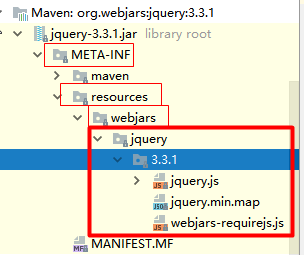
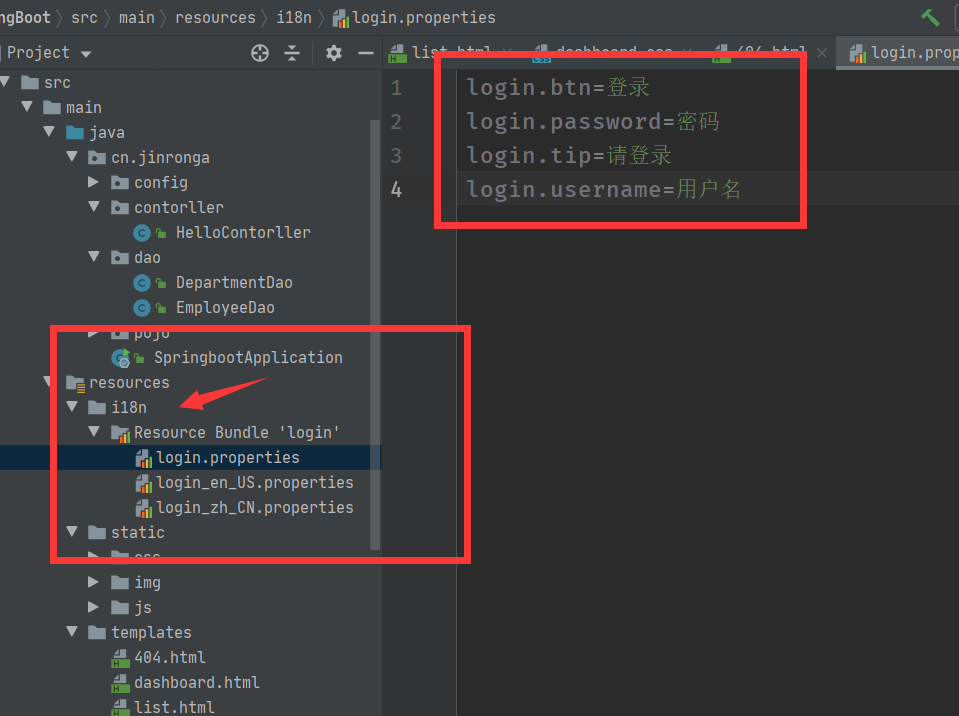

### 五、Web开发

---

使用SpringBoot；

**1）、创建SpringBoot应用，选中我们需要的模块；**

**2）、SpringBoot已经默认将这些场景配置好了，只需要在配置文件中指定少量配置就可以运行起来**

**3）、自己编写业务代码；**

```
xxxxAutoConfiguration：帮我们给容器中自动配置组件；
xxxxProperties:配置类来封装配置文件的内容；
```

### 2.springboot对静态资源的映射规则

```java
@ConfigurationProperties(prefix = "spring.resources", ignoreUnknownFields = false)
public class ResourceProperties implements ResourceLoaderAware {
  //可以设置和静态资源有关的参数，缓存时间等
    
    WebMvcAuotConfiguration：
		@Override
		public void addResourceHandlers(ResourceHandlerRegistry registry) {
			if (!this.resourceProperties.isAddMappings()) {
				logger.debug("Default resource handling disabled");
				return;
			}
			Integer cachePeriod = this.resourceProperties.getCachePeriod();
			if (!registry.hasMappingForPattern("/webjars/**")) {
				customizeResourceHandlerRegistration(
						registry.addResourceHandler("/webjars/**")
								.addResourceLocations(
										"classpath:/META-INF/resources/webjars/")
						.setCachePeriod(cachePeriod));
			}
			String staticPathPattern = this.mvcProperties.getStaticPathPattern();
          	//静态资源文件夹映射
			if (!registry.hasMappingForPattern(staticPathPattern)) {
				customizeResourceHandlerRegistration(
						registry.addResourceHandler(staticPathPattern)
								.addResourceLocations(
										this.resourceProperties.getStaticLocations())
						.setCachePeriod(cachePeriod));
			}
		}

        //配置欢迎页映射
		@Bean
		public WelcomePageHandlerMapping welcomePageHandlerMapping(
				ResourceProperties resourceProperties) {
			return new WelcomePageHandlerMapping(resourceProperties.getWelcomePage(),
					this.mvcProperties.getStaticPathPattern());
		}

       //配置喜欢的图标
		@Configuration
		@ConditionalOnProperty(value = "spring.mvc.favicon.enabled", matchIfMissing = true)
		public static class FaviconConfiguration {

			private final ResourceProperties resourceProperties;

			public FaviconConfiguration(ResourceProperties resourceProperties) {
				this.resourceProperties = resourceProperties;
			}

			@Bean
			public SimpleUrlHandlerMapping faviconHandlerMapping() {
				SimpleUrlHandlerMapping mapping = new SimpleUrlHandlerMapping();
				mapping.setOrder(Ordered.HIGHEST_PRECEDENCE + 1);
              	//所有  **/favicon.ico 
				mapping.setUrlMap(Collections.singletonMap("**/favicon.ico",
						faviconRequestHandler()));
				return mapping;
			}

			@Bean
			public ResourceHttpRequestHandler faviconRequestHandler() {
				ResourceHttpRequestHandler requestHandler = new ResourceHttpRequestHandler();
				requestHandler
						.setLocations(this.resourceProperties.getFaviconLocations());
				return requestHandler;
			}

		}

```

1、所有 /webjars/** ，都去 classpath:/META-INF/resources/webjars/ 找资源；

​	webjars：以jar包的方式引入静态资源；

http://www.webjars.org/




localhost:8080/webjars/jquery/3.3.1/jquery.js

```xml
<!--引入jquery-webjar-->在访问的时候只需要写webjars下面资源的名称即可
		<dependency>
			<groupId>org.webjars</groupId>
			<artifactId>jquery</artifactId>
			<version>3.3.1</version>
		</dependency>
```

2、"/**" 访问当前项目的任何资源，都去（静态资源的文件夹）找映射

```
"classpath:/META-INF/resources/", 
"classpath:/resources/",
"classpath:/static/", 
"classpath:/public/" 
"/"：当前项目的根路径
```

3、欢迎页； 静态资源文件夹下的所有index.html页面；被"/**"映射；

4、所有的 **/favicon.ico  都是在静态资源文件下找；


#### 3、模板引擎

JSP、Velocity、Freemarker、Thymeleaf


前端交给我们的页面，是html页面。如果是我们以前开发，我们需要把他们转成jsp页面，jsp好处就是当我们查出一些数据转发到JSP页面以后，我们可以用jsp轻松实现数据的显示，及交互等。

jsp支持非常强大的功能，包括能写Java代码，但是呢，我们现在的这种情况，SpringBoot这个项目首先是以jar的方式，不是war，像第二，我们用的还是嵌入式的Tomcat，所以呢，**他现在默认是不支持jsp的**。

那不支持jsp，如果我们直接用纯静态页面的方式，那给我们开发会带来非常大的麻烦，那怎么办呢？

**SpringBoot推荐你可以来使用模板引擎：**

模板引擎，我们其实大家听到很多，其实jsp就是一个模板引擎，还有用的比较多的freemarker，包括SpringBoot给我们推荐的Thymeleaf，模板引擎有非常多，但再多的模板引擎，他们的思想都是一样的，什么样一个思想呢我们来看一下这张图：


SpringBoot推荐的Thymeleaf；

语法更简单，功能更强大；

##### 1、引入thymeleaf；

```xml
		<dependency>
			<groupId>org.springframework.boot</groupId>
			<artifactId>spring-boot-starter-thymeleaf</artifactId>
          	2.1.6
		</dependency>
切换thymeleaf版本
<properties>
		<thymeleaf.version>3.0.9.RELEASE</thymeleaf.version>
		<!-- 布局功能的支持程序  thymeleaf3主程序  layout2以上版本 -->
		<!-- thymeleaf2   layout1-->
		<thymeleaf-layout-dialect.version>2.2.2</thymeleaf-layout-dialect.version>
  </properties>
```

##### 2、Thymeleaf使用

yml:

```yaml
spring:
  thymeleaf:
    #模板编码
    mode: LEGACYHTML5
    #是否缓存  别闹不缓存
    cache: false
    # 在构建URL时预先查看名称的前缀
    # 构建URL时附加查看名称的后缀.
    suffix: .html
```


SpringBoot给我们默认配置好了：

```java
@ConfigurationProperties(prefix = "spring.thymeleaf")
public class ThymeleafProperties {

	private static final Charset DEFAULT_ENCODING = Charset.forName("UTF-8");

	private static final MimeType DEFAULT_CONTENT_TYPE = MimeType.valueOf("text/html");

	public static final String DEFAULT_PREFIX = "classpath:/templates/";

	public static final String DEFAULT_SUFFIX = ".html";
```

只要我们把HTML页面放在classpath:/templates/，thymeleaf就能自动渲染；

使用：

1、我们要使用thymeleaf，需要在html文件中导入命名空间的约束，方便提示。

我们可以去官方文档的#3中看一下命名空间拿来过来：

```xml
<html lang="en" xmlns:th="http://www.thymeleaf.org">
```

控制器：

```java
@Controller
public class HelloController {

    @RequestMapping("/hello")
    public String hello(){
        return "hello";
    }

    //查出一些数据，在页面中显示
    @RequestMapping("/success")
    public String thymeleaf(Map<String,Object> map){
        //存入数据
        map.put("hello","你好");
         //classpath:/templates/success.html
        return "/success";
    }
}
```


2、使用thymeleaf语法；

```html
<!DOCTYPE html>
<html lang="en" xmlns:th="http://www.thymeleaf.org">
<head>
    <meta charset="UTF-8">
    <title>Title</title>
</head>
<body>
    <h1>成功！</h1>
    <!--th:text 将div里面的文本内容设置为 -->
    <div th:text="${hello}">这是显示欢迎信息</div>
</body>
</html>
```

### 3、语法规则

1）、th:text；改变当前元素里面的文本内容；

​	th：任意html属性；来替换原生属性的值


2、表达式

```xml
Simple expressions:（表达式语法）
    Variable Expressions: ${...}：获取变量值；OGNL；
    		1）、获取对象的属性、调用方法
    		2）、使用内置的基本对象：
    			#ctx : the context object.
    			#vars: the context variables.
                #locale : the context locale.
                #request : (only in Web Contexts) the HttpServletRequest object.
                #response : (only in Web Contexts) the HttpServletResponse object.
                #session : (only in Web Contexts) the HttpSession object.
                #servletContext : (only in Web Contexts) the ServletContext object.
                
                ${session.foo}
            3）、内置的一些工具对象：
#execInfo : information about the template being processed.
#messages : methods for obtaining externalized messages inside variables expressions, in the same way as they would be obtained using #{…} syntax.
#uris : methods for escaping parts of URLs/URIs
#conversions : methods for executing the configured conversion service (if any).
#dates : methods for java.util.Date objects: formatting, component extraction, etc.
#calendars : analogous to #dates , but for java.util.Calendar objects.
#numbers : methods for formatting numeric objects.
#strings : methods for String objects: contains, startsWith, prepending/appending, etc.
#objects : methods for objects in general.
#bools : methods for boolean evaluation.
#arrays : methods for arrays.
#lists : methods for lists.
#sets : methods for sets.
#maps : methods for maps.
#aggregates : methods for creating aggregates on arrays or collections.
#ids : methods for dealing with id attributes that might be repeated (for example, as a result of an iteration).

    Selection Variable Expressions: *{...}：选择表达式：和${}在功能上是一样；
    	补充：配合 th:object="${session.user}：
   <div th:object="${session.user}">
    <p>Name: <span th:text="*{firstName}">Sebastian</span>.</p>
    <p>Surname: <span th:text="*{lastName}">Pepper</span>.</p>
    <p>Nationality: <span th:text="*{nationality}">Saturn</span>.</p>
    </div>
    
    Message Expressions: #{...}：获取国际化内容
    Link URL Expressions: @{...}：定义URL；
    		@{/order/process(execId=${execId},execType='FAST')}
    Fragment Expressions: ~{...}：片段引用表达式
    		<div th:insert="~{commons :: main}">...</div>
    		
Literals（字面量）
      Text literals: 'one text' , 'Another one!' ,…
      Number literals: 0 , 34 , 3.0 , 12.3 ,…
      Boolean literals: true , false
      Null literal: null
      Literal tokens: one , sometext , main ,…
Text operations:（文本操作）
    String concatenation: +
    Literal substitutions: |The name is ${name}|
Arithmetic operations:（数学运算）
    Binary operators: + , - , * , / , %
    Minus sign (unary operator): -
Boolean operations:（布尔运算）
    Binary operators: and , or
    Boolean negation (unary operator): ! , not
Comparisons and equality:（比较运算）
    Comparators: > , < , >= , <= ( gt , lt , ge , le )
    Equality operators: == , != ( eq , ne )
Conditional operators:条件运算（三元运算符）
    If-then: (if) ? (then)
    If-then-else: (if) ? (then) : (else)
    Default: (value) ?: (defaultvalue)
Special tokens:
    No-Operation: _ 
```

**练习测试：**

1、 我们编写一个Controller，放一些数据

```java
@RequestMapping("/t2")
public String test2(Map<String,Object> map){
    //存入数据
    map.put("msg","<h1>Hello</h1>");
    map.put("users", Arrays.asList("qinjiang","kuangshen"));
    //classpath:/templates/test.html
    return "test";
}
```

2、测试页面取出数据

```html
<!DOCTYPE html>
<html lang="en" xmlns:th="http://www.thymeleaf.org">
<head>
    <meta charset="UTF-8">
    <title>测试</title>
</head>
<body>
<h1>测试页面</h1>

<div th:text="${msg}"></div>
<!--不转义-->
<div th:utext="${msg}"></div>

<!--遍历数据-->
<!--th:each每次遍历都会生成当前这个标签：官网#9-->
<h4 th:each="user :${users}" th:text="${user}"></h4>

<h4>
    <!--行内写法：官网#12-->
    <span th:each="user:${users}">[[${user}]]</span>
</h4>

</body>
</html>
```

### SpringMVC自动配置

### 1. Spring MVC auto-configuration

https://docs.spring.io/spring-boot/docs/1.5.10.RELEASE/reference/htmlsingle/#boot-features-developing-web-applications

Spring Boot 自动配置好了SpringMVC

以下是SpringBoot对SpringMVC的默认配置:**（WebMvcAutoConfiguration）**

- Inclusion of `ContentNegotiatingViewResolver` and `BeanNameViewResolver` beans.

  - 自动配置了ViewResolver（视图解析器：根据方法的返回值得到视图对象（View），视图对象决定如何渲染（转发？重定向？））
  - ContentNegotiatingViewResolver：组合所有的视图解析器的；
  - ==如何定制：我们可以自己给容器中添加一个视图解析器；自动的将其组合进来；==

- Support for serving static resources, including support for WebJars (see below).静态资源文件夹路径,webjars

- Static `index.html` support. 静态首页访问

- Custom `Favicon` support (see below).  favicon.ico

  

- 自动注册了 of `Converter`, `GenericConverter`, `Formatter` beans.

  - Converter：转换器；  public String hello(User user)：类型转换使用Converter
  - `Formatter`  格式化器；  2017.12.17===Date；

```java
		@Bean
		@ConditionalOnProperty(prefix = "spring.mvc", name = "date-format")//在文件中配置日期格式化的规则
		public Formatter<Date> dateFormatter() {
			return new DateFormatter(this.mvcProperties.getDateFormat());//日期格式化组件
		}
```

​	==自己添加的格式化器转换器，我们只需要放在容器中即可==

- Support for `HttpMessageConverters` (see below).

  - HttpMessageConverter：SpringMVC用来转换Http请求和响应的；User---Json；

  - `HttpMessageConverters` 是从容器中确定；获取所有的HttpMessageConverter；

    ==自己给容器中添加HttpMessageConverter，只需要将自己的组件注册容器中（@Bean,@Component）==

    

- Automatic registration of `MessageCodesResolver` (see below).定义错误代码生成规则

- Automatic use of a `ConfigurableWebBindingInitializer` bean (see below).

  ==我们可以配置一个ConfigurableWebBindingInitializer来替换默认的；（添加到容器）==

  ```
  初始化WebDataBinder；
  请求数据=====JavaBean；
  ```

**org.springframework.boot.autoconfigure.web：web的所有自动场景；**

If you want to keep Spring Boot MVC features, and you just want to add additional [MVC configuration](https://docs.spring.io/spring/docs/4.3.14.RELEASE/spring-framework-reference/htmlsingle#mvc) (interceptors, formatters, view controllers etc.) you can add your own `@Configuration` class of type `WebMvcConfigurerAdapter`, but **without** `@EnableWebMvc`. If you wish to provide custom instances of `RequestMappingHandlerMapping`, `RequestMappingHandlerAdapter` or `ExceptionHandlerExceptionResolver` you can declare a `WebMvcRegistrationsAdapter` instance providing such components.

If you want to take complete control of Spring MVC, you can add your own `@Configuration` annotated with `@EnableWebMvc`.

### 2、扩展SpringMVC

```xml
    <mvc:view-controller path="/hello" view-name="success"/>
    <mvc:interceptors>
        <mvc:interceptor>
            <mvc:mapping path="/hello"/>
            <bean></bean>
        </mvc:interceptor>
    </mvc:interceptors>
```

**==编写一个配置类（@Configuration），是WebMvcConfigurerAdapter类型；不能标注@EnableWebMvc==**;

既保留了所有的自动配置，也能用我们扩展的配置；

```java
//使用WebMvcConfigurerAdapter可以来扩展SpringMVC的功能
@Configuration
public class MyMvcConfig extends WebMvcConfigurerAdapter {

    @Override
    public void addViewControllers(ViewControllerRegistry registry) {
       // super.addViewControllers(registry);
        //浏览器发送 /login 请求来到 login
               registry.addViewController("/").setViewName("login");
        registry.addViewController("/login.html").setViewName("login.html");
    }
    }
}
```

原理：

​	1）、WebMvcAutoConfiguration是SpringMVC的自动配置类

​	2）、在做其他自动配置时会导入；@Import(**EnableWebMvcConfiguration**.class)

```java
    @Configuration
	public static class EnableWebMvcConfiguration extends DelegatingWebMvcConfiguration {
      private final WebMvcConfigurerComposite configurers = new WebMvcConfigurerComposite();

	 //从容器中获取所有的WebMvcConfigurer
      @Autowired(required = false)
      public void setConfigurers(List<WebMvcConfigurer> configurers) {
          if (!CollectionUtils.isEmpty(configurers)) {
              this.configurers.addWebMvcConfigurers(configurers);
            	//一个参考实现；将所有的WebMvcConfigurer相关配置都来一起调用；  
            	@Override
             // public void addViewControllers(ViewControllerRegistry registry) {
              //    for (WebMvcConfigurer delegate : this.delegates) {
               //       delegate.addViewControllers(registry);
               //   }
              }
          }
	}
```

​	3）、容器中所有的WebMvcConfigurer都会一起起作用；

​	4）、我们的配置类也会被调用；

​	效果：SpringMVC的自动配置和我们的扩展配置都会起作用；

### 3、全面接管SpringMVC；

SpringBoot对SpringMVC的自动配置不需要了，所有都是我们自己配置；所有的SpringMVC的自动配置都失效了

**我们需要在配置类中添加@EnableWebMvc即可；**

```java
//使用WebMvcConfigurerAdapter可以来扩展SpringMVC的功能
@EnableWebMvc
@Configuration
public class MyMvcConfig extends WebMvcConfigurerAdapter {

    @Override
    public void addViewControllers(ViewControllerRegistry registry) {
       // super.addViewControllers(registry);
        //浏览器发送 /atguigu 请求来到 success
        registry.addViewController("/atguigu").setViewName("success");
    }
}
```

原理：

为什么@EnableWebMvc自动配置就失效了；

1）@EnableWebMvc的核心

```java
@Import(DelegatingWebMvcConfiguration.class)
public @interface EnableWebMvc {
```

2）、

```java
@Configuration
public class DelegatingWebMvcConfiguration extends WebMvcConfigurationSupport {
```

3）、

```java
@Configuration
@ConditionalOnWebApplication
@ConditionalOnClass({ Servlet.class, DispatcherServlet.class,
		WebMvcConfigurerAdapter.class })
//容器中没有这个组件的时候，这个自动配置类才生效
@ConditionalOnMissingBean(WebMvcConfigurationSupport.class)
@AutoConfigureOrder(Ordered.HIGHEST_PRECEDENCE + 10)
@AutoConfigureAfter({ DispatcherServletAutoConfiguration.class,
		ValidationAutoConfiguration.class })
public class WebMvcAutoConfiguration {
```

4）、@EnableWebMvc将WebMvcConfigurationSupport组件导入进来；

5）、导入的WebMvcConfigurationSupport只是SpringMVC最基本的功能；


##### 如何修改SpringBoot的默认配置

模式：

​	1）、SpringBoot在自动配置很多组件的时候，先看容器中有没有用户自己配置的（@Bean、@Component）如果有就用用户配置的，如果没有，才自动配置；如果有些组件可以有多个（ViewResolver）将用户配置的和自己默认的组合起来；

​	2）、在SpringBoot中会有非常多的xxxConfigurer帮助我们进行扩展配置

​	3）、在SpringBoot中会有很多的xxxCustomizer帮助我们进行定制配置

## RestfulCRUD

### 1、默认访问首页

```java
//使用WebMvcConfigurerAdapter可以来扩展SpringMVC的功能
//@EnableWebMvc   不要接管SpringMVC
@Configuration
public class MyMvcConfig extends WebMvcConfigurerAdapter {

    @Override
    public void addViewControllers(ViewControllerRegistry registry) {
       // super.addViewControllers(registry);
        //浏览器发送 /atguigu 请求来到 success
        registry.addViewController("/atguigu").setViewName("success");
    }

    //所有的WebMvcConfigurerAdapter组件都会一起起作用
    @Bean //将组件注册在容器
    public WebMvcConfigurerAdapter webMvcConfigurerAdapter(){
        WebMvcConfigurerAdapter adapter = new WebMvcConfigurerAdapter() {
            @Override
            public void addViewControllers(ViewControllerRegistry registry) {
                registry.addViewController("/").setViewName("login");
                registry.addViewController("/index.html").setViewName("login");
            }
        };
        return adapter;
    }
}

```

### 2、国际化

**1）、编写国际化配置文件；**

2）、使用ResourceBundleMessageSource管理国际化资源文件

3）、在页面使用fmt:message取出国际化内容


步骤：

1）、编写国际化配置文件，抽取页面需要显示的国际化消息

2）、SpringBoot自动配置好了管理国际化资源文件的组件；

```java
@ConfigurationProperties(prefix = "spring.messages")
public class MessageSourceAutoConfiguration {
    
    /**
	 * Comma-separated list of basenames (essentially a fully-qualified classpath
	 * location), each following the ResourceBundle convention with relaxed support for
	 * slash based locations. If it doesn't contain a package qualifier (such as
	 * "org.mypackage"), it will be resolved from the classpath root.
	 */
	private String basename = "messages";  
    //我们的配置文件可以直接放在类路径下叫messages.properties；
    
    @Bean
	public MessageSource messageSource() {
		ResourceBundleMessageSource messageSource = new ResourceBundleMessageSource();
		if (StringUtils.hasText(this.basename)) {
            //设置国际化资源文件的基础名（去掉语言国家代码的）
			messageSource.setBasenames(StringUtils.commaDelimitedListToStringArray(
					StringUtils.trimAllWhitespace(this.basename)));
		}
		if (this.encoding != null) {
			messageSource.setDefaultEncoding(this.encoding.name());
		}
		messageSource.setFallbackToSystemLocale(this.fallbackToSystemLocale);
		messageSource.setCacheSeconds(this.cacheSeconds);
		messageSource.setAlwaysUseMessageFormat(this.alwaysUseMessageFormat);
		return messageSource;
	}
```


3）、去页面获取国际化的值；


```html
<!DOCTYPE html>
<html lang="en" xmlns:th="http://www.thymeleaf.org">
	<head>
		<meta http-equiv="Content-Type" content="text/html; charset=UTF-8">
		<meta name="viewport" content="width=device-width, initial-scale=1, shrink-to-fit=no">
		<meta name="description" content="">
		<meta name="author" content="">
		<title>Signin Template for Bootstrap</title>
		<!-- Bootstrap core CSS -->
		<link href="css/bootstrap.min.css" rel="stylesheet">
		<!-- Custom styles for this template -->
		<link href="css/signin.css" rel="stylesheet">
	</head>

	<body class="text-center">
		<form class="form-signin" action="dashboard.html">
			
			<h1 class="h3 mb-3 font-weight-normal" th:text="#{login.tip}">Please sign in</h1>
			<label class="sr-only" th:text="#{login.username}"></label>
			<input type="text" class="form-control" placeholder="Username" th:placeholder="#{login.username}" required="" autofocus="">
			<label class="sr-only" ></label>
			<input type="password" class="form-control" placeholder="Password" th:placeholder="#{login.password}" required="">
			<div class="checkbox mb-3">
				<label>
          <input type="checkbox" value="remember-me"> Remember me
        </label>
			</div>
			<button class="btn btn-lg btn-primary btn-block" type="submit" th:text="#{login.btn}">Sign in</button>
			<p class="mt-5 mb-3 text-muted">© 2017-2018</p>
			<a class="btn btn-sm">中文</a>
			<a class="btn btn-sm">English</a>
		</form>

	</body>

</html>
```

效果：根据浏览器语言设置的信息切换了国际化；


原理：

​	国际化Locale（区域信息对象）；LocaleResolver（获取区域信息对象）；

```java
		@Bean
		@ConditionalOnMissingBean
		@ConditionalOnProperty(prefix = "spring.mvc", name = "locale")
		public LocaleResolver localeResolver() {
			if (this.mvcProperties
					.getLocaleResolver() == WebMvcProperties.LocaleResolver.FIXED) {
				return new FixedLocaleResolver(this.mvcProperties.getLocale());
			}
			AcceptHeaderLocaleResolver localeResolver = new AcceptHeaderLocaleResolver();
			localeResolver.setDefaultLocale(this.mvcProperties.getLocale());
			return localeResolver;
		}
默认的就是根据请求头带来的区域信息获取Locale进行国际化
```

4）、点击链接切换国际化

```java
/**
 * 可以在连接上携带区域信息
 */
public class MyLocaleResolver implements LocaleResolver {
    
    @Override
    public Locale resolveLocale(HttpServletRequest request) {
        String l = request.getParameter("l");
        Locale locale = Locale.getDefault();//如果 l为空就使用默认的 
       
        if(!StringUtils.isEmpty(l)){
            //如果请求链接请求了国际化参数不为空
            String[] split = l.split("_");
            //国家地区
            locale = new Locale(split[0],split[1]);
        }
        return locale;
    }

    @Override
    public void setLocale(HttpServletRequest request, HttpServletResponse response, Locale locale) {

    }
}

}
 
```

切换国际化生效：

```java
//扩展springmvc
@Configuration
public class MyMvcConfig implements WebMvcConfigurer {

    @Override
    public void addViewControllers(ViewControllerRegistry registry) {
        registry.addViewController("/").setViewName("login");
        registry.addViewController("/login.html").setViewName("login.html");
    }

    //自定义的国际化组件就生效了！
    @Bean
    public LocaleResolver localeResolver(){
        return new MyLocaleResolver();
    }
}

```

