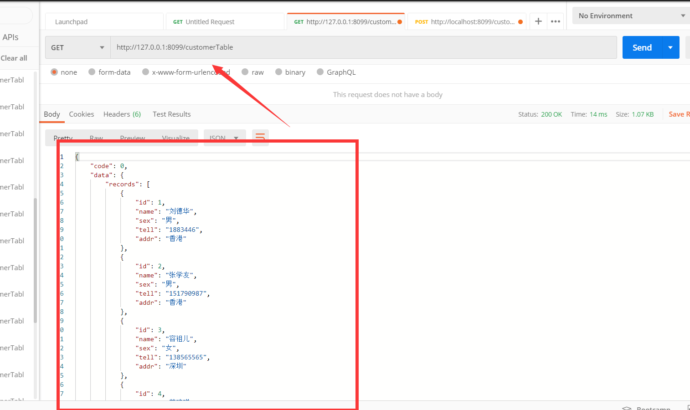
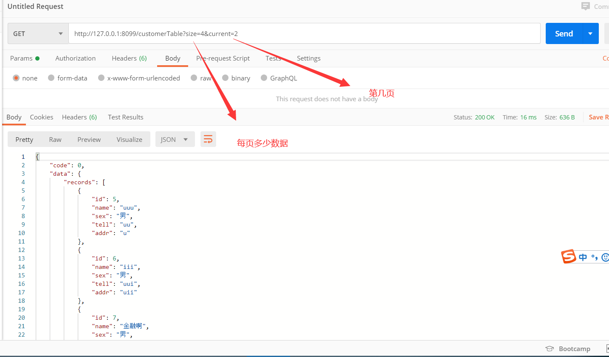
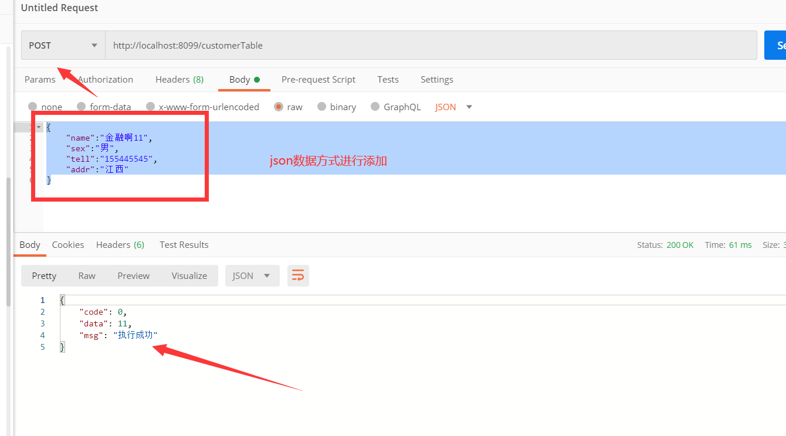

## Springboot-CRUD:

---

SpringBoot+ElementUI—客户信息展示的示例,这个示例使用 前后端分离的开发模式来完成.

**学习目的：** 了解前端、后端、相关工具使用，以及完整的项目实例，帮助新手快速入门。

#### 开发环境和相关工具：

- 前端：Element UI + VUE
- 后端：SpringBoot、MybatisPlus、Lombok、EasyCode代码生成器
- 后端开发工具：IDEA
- API测试工具：PostMan
- 前端开发工具：VSCode

### 创建一个后端项目

工具：IDEA。用快速创建方式创建一个SpringBoot项目

一、添加maven依赖

```xml
  <parent>
        <groupId>org.springframework.boot</groupId>
        <artifactId>spring-boot-starter-parent</artifactId>
        <version>2.1.9.RELEASE</version>
        <relativePath/> <!-- lookup parent from repository -->
    </parent>

 <dependencies>
       <!-- spring boot 启动器-->
    	  <dependency>
            <groupId>org.springframework.boot</groupId>
            <artifactId>spring-boot-starter</artifactId>
        </dependency>

        <!-- spring boot web 启动器-->
         <dependency>
            <groupId>org.springframework.boot</groupId>
            <artifactId>spring-boot-starter-web</artifactId>
        </dependency>

        <!-- spring boot test 启动器-->
        <dependency>
            <groupId>org.springframework.boot</groupId>
            <artifactId>spring-boot-starter-test</artifactId>
            <scope>test</scope>
        </dependency>

        <!-- lombok简化java代码 如果没有安装，先安装这个插件-->
        <dependency>
            <groupId>org.projectlombok</groupId>
            <artifactId>lombok</artifactId>
            <optional>true</optional>
        </dependency>

        <!-- mybatis-plus插件 -->
        <dependency>
          <groupId>com.baomidou</groupId>
          <artifactId>mybatis-plus-boot-starter</artifactId>
          <version>3.1.0</version>
				</dependency>

				<!-- mysql jdbc驱动 -->
		 		<dependency>
            <groupId>mysql</groupId>
            <artifactId>mysql-connector-java</artifactId>
            <scope>runtime</scope>
        </dependency>
  </dependencies>

<build>
        <plugins>
            <plugin>
                <groupId>org.springframework.boot</groupId>
                <artifactId>spring-boot-maven-plugin</artifactId>
            </plugin>
        </plugins>
    </build>
```

##### 二、yml文件

```yml
server:
  port: 8099
spring:
  datasource:
    #driver-class-name: com.mysql.cj.jdbc.Driver
    url: jdbc:mysql://localhost:3306/test?serverTimezone=GMT%2B8&useUnicode=true&characterEncoding=utf-8
    username: root
    password: 1460595002
mybatis-plus:
  #信息输出设置
  configuration:
    log-impl: org.apache.ibatis.logging.stdout.StdOutImpl
```

##### 三：数据库表：

```sql
DROP TABLE IF EXISTS `customer_table`;
CREATE TABLE `customer_table` (
  `id` int(8) NOT NULL AUTO_INCREMENT,
  `name` varchar(20) NOT NULL,
  `sex` varchar(5) DEFAULT NULL,
  `tell` varchar(15) DEFAULT NULL,
  `addr` varchar(50) DEFAULT NULL,
  PRIMARY KEY (`id`)
) ENGINE=InnoDB AUTO_INCREMENT=7 DEFAULT CHARSET=utf8;

-- ----------------------------
--  Records of `customer_table`
-- ----------------------------
BEGIN;
INSERT INTO `customer_table` VALUES ('1', '刘德华', '男', '1883446', '香港'), ('2', '张学友', '男', '151790987', '香港'), ('3', '容祖儿', '女', '138565565', '深圳'), ('4', '范玮琪', '女', '1688654467', '台湾'), ('5', 'uuu', '男', 'uu', 'u'), ('6', 'iii', '男', 'uui', 'uii');
COMMIT;
```

##### 四：编写API接口： 

实体类：

```java
@Data
@NoArgsConstructor
@SuppressWarnings("serial")
public class CustomerTable extends Model<CustomerTable> {

    @TableId(type = IdType.AUTO)
    private Integer id;
    private String name;
    private String sex;
    private String tell;
    private String addr;
}
```

dao层：

```java
public interface CustomerTableDao extends BaseMapper<CustomerTable> {
}
```

Service层：

```java
public interface CustomerTableService extends IService<CustomerTable> {

}
```

```java
@Service("customerTableService")
public class CustomerTableServiceImpl extends ServiceImpl<CustomerTableDao, CustomerTable> implements CustomerTableService {

}
```

Contorller层：

```java
@RestController
@RequestMapping("customerTable")
public class CustomerTableController {
  
    @Autowired
    CustomerTableService customerTableService;   
  
   /**
     * 分页查询所有数据
     *
     * @param page 分页对象
     * @param customerTable 查询实体
     * @return 所有数据
     */
    @GetMapping
    @CrossOrigin
    public R<IPage<CustomerTable>>  selectAll(Page<CustomerTable> page, CustomerTable customerTable) {
        return R.ok (this.customerTableService.page(page, new QueryWrapper<>(customerTable)));
    }

    /**
     * 通过主键查询单条数据
     *
     * @param id 主键
     * @return 单条数据
     */
    @GetMapping("{id}")
    @CrossOrigin
    public R<CustomerTable> selectOne(@PathVariable Serializable id) {
        return R.ok(this.customerTableService.getById(id));
    }

    /**
     * 新增数据
     *
     * @param customerTable 实体对象
     * @return 新增结果
     */
    @PostMapping
    @CrossOrigin
    public R<Integer> insert(@RequestBody CustomerTable customerTable) {
        boolean rs = this.customerTableService.save(customerTable);
        
        return R.ok(rs?customerTable.getId():0);
    }

    /**
     * 修改数据
     *
     * @param customerTable 实体对象
     * @return 修改结果
     */
    @PutMapping
    @CrossOrigin
    public R<Integer>  update(@RequestBody CustomerTable customerTable) {
        boolean rs = this.customerTableService.updateById(customerTable);
        return R.ok(customerTable.getId());
    }

    /**
     * 删除数据
     *
     * @param idList 主键结合
     * @return 删除结果
     */
    @DeleteMapping
    @CrossOrigin
    public R<Boolean> delete(@RequestParam("idList") List<Long> idList) {
        return R.ok(this.customerTableService.removeByIds(idList));
    }
}
```

**配置接口映射和分页插件的注册**

```java
//Spring boot方式
@EnableTransactionManagement
@Configuration
public class MybatisPlusConfig {
    @Bean
    public PaginationInterceptor paginationInterceptor() {
        PaginationInterceptor paginationInterceptor = new PaginationInterceptor();
        // 设置请求的页面大于最大页后操作， true调回到首页，false 继续请求  默认false
        // paginationInterceptor.setOverflow(false);
        // 设置最大单页限制数量，默认 500 条，-1 不受限制
        // paginationInterceptor.setLimit(500);
        return paginationInterceptor;
    }
}
```

**解决跨域问题：**

```java
/**
 * 解决跨域问题
 */
@Configuration
public class AccessControlAllowOriginFilter implements Filter {
    @Override
    public void doFilter(ServletRequest req, ServletResponse res, FilterChain chain)
            throws IOException, ServletException {
        HttpServletResponse response = (HttpServletResponse) res;
        response.setHeader("Access-Control-Allow-Origin", "*");
        response.setHeader("Access-Control-Allow-Methods",
                "POST, GET, OPTIONS, DELETE");
        response.setHeader("Access-Control-Allow-Credentials", "true");
        chain.doFilter(req, response);
    }
    public void init(FilterConfig filterConfig) {
        System.out.println ("初始化配置......");
    }
    public void destroy() {
        System.out.println ("销毁......");
    }
}
```

##### 五：启动后台项目，测试API接口：

开启 PostMan工具测试。get、post

查询数据库的数据：





添加数据到数据库：



后端测试完成！

----

### 前端

#### 创建一个前端项目，并新建页面

前端用：Element UI+VUE。手工简单创建项目（不使用vue-cli）

用vsCode工具编辑

引入资源：

```html
<!-- 开发环境版本，包含了有帮助的命令行警告 -->
<script src="https://cdn.jsdelivr.net/npm/vue/dist/vue.js"></script>
<!-- 引入组件库 -->
<script src="https://unpkg.com/element-ui/lib/index.js"></script>
     <!-- 官网提供的 axios 在线地址 -->
     <script src="https://unpkg.com/axios/dist/axios.min.js"></script>
    <!-- 引入样式 -->
    <link rel="stylesheet" href="https://unpkg.com/element-ui/lib/theme-chalk/index.css">
```

index.html:注释很详细

```html
<!DOCTYPE html>
<html lang="en">
<head>
    <meta charset="UTF-8">
    <meta name="viewport" content="width=device-width, initial-scale=1.0">
    <title>Document</title>

<!-- 开发环境版本，包含了有帮助的命令行警告 -->
<script src="https://cdn.jsdelivr.net/npm/vue/dist/vue.js"></script>
<!-- 引入组件库 -->
<script src="https://unpkg.com/element-ui/lib/index.js"></script>
     <!-- 官网提供的 axios 在线地址 -->
     <script src="https://unpkg.com/axios/dist/axios.min.js"></script>
    <!-- 引入样式 -->
    <link rel="stylesheet" href="https://unpkg.com/element-ui/lib/theme-chalk/index.css">

</head>
<body>
    <div id="app">
    
            <!-- 弹出表单 -->
            <el-dialog title="新增数据" :visible.sync="dialogFormVisible">
              <el-form ref="form" :model="form" label-width="80px">
                  <el-form-item label="客户名称">
                      <el-input v-model="form.name"></el-input>
                  </el-form-item>
                  <el-form-item label="性别">
                      <el-radio-group v-model="form.sex">
                          <el-radio label="男"></el-radio>
                          <el-radio label="女"></el-radio>
                      </el-radio-group>
                  </el-form-item>
  
                  <el-form-item label="联系电话">
                      <el-input v-model="form.tell"></el-input>
                  </el-form-item>
  
                  <el-form-item label="所在地址">
                      <el-input v-model="form.addr"></el-input>
                  </el-form-item>
  
                  <el-form-item>
                      <el-button type="primary" @click="onSubmit">保存</el-button>
                      <el-button>取消</el-button>
                  </el-form-item>
              </el-form>
          </el-dialog>
  

        <template>
            <el-table
             @selection-change="selectionChange"
              :data="tableData"
              style="width: 100%">
              <el-table-column type="selection" width="55"></el-table-column>
              <el-table-column
              prop="id"
              label="ID："
              width="100">
            </el-table-column>
              <el-table-column
                prop="name"
                label="姓名："
                width="180">
              </el-table-column>
              <el-table-column
                prop="sex"
                label="性别："
                width="180">
              </el-table-column>
              <el-table-column
                prop="tell"
                label="电话：">
              </el-table-column>
            </el-table>
          </template>
          <el-row>
            <el-button @click="open()" type="primary" icon="el-icon-edit" circle ></el-button>
            <!-- 如果idList大于零那就显示删除按钮 没有选中就隐藏-->
            <el-button type="danger" @click="dele" icon="el-icon-delete" 
            :disabled="idList.length > 0? false : true"   circle ></el-button>
          </el-row>
               <!-- 分页 -->
          <div>
            <el-pagination
             
              background
              layout="prev, pager, next"
              @current-change="currentChange"
              :total="page.total"
              :page-size="page.size"
           >
            </el-pagination>
            </div>
        </div>
        <script>
var Main = {
      data() {
        return {
            //查询的所有数据放这里
          tableData: [],
          //分页
          page:{
              total:12,
              size:6,
              current:1
            
          },
          idList: [],
                   // 表单相关
                   form: {
                    id:'',
                    name: '',
                    sex:'男',
                    tell:'',
                    addr:''
                },
                
                //默认隐藏添加表单窗口
                dialogFormVisible: false
        }
      },
      //页面初始化调用
      created(){ 
      this.getList();
      },
      methods:{
      
      
       getList:function(){
 

          let that=this;
          //查询用户并且分页
        axios.get("http://127.0.0.1:8099/customerTable?size="+that.page.size+"&current="+that.page.current).then(function(response){
           
      
             console.log(response.data);
            that.tableData=response.data.data.records;
           that.page.total=response.data.total;
            console.log(response.data);

            })
       },
       //分页效果点击的时候生效
       currentChange:function(current){
             this.page.current=current;
             //调用函数重新查询数据
             this.getList();
       },
       //用于选中批量删除或者单个删除 触发事件
       selectionChange:function(selection){
         this.idList = [];
        selection.forEach(element => {
          this.idList.push(element.id);
         
        });
    
  
       },

       //刪除数据
       dele:function(){

      if(this.idList.length>0){
        let that=this;
        let idList=  that.idList.toString();
   
        axios.delete("http://127.0.0.1:8099/customerTable?idList="+idList).then(function(response){
           
           if(response.data.code==0){

    //删除成功后刷新重新获取数据
         that.getList();
       
           }
             

            })
          }
       },
       
       //点击提交按钮添加用户
       onSubmit:function(){
        let that=this;
         let data=that.form;

        axios.post("http://127.0.0.1:8099/customerTable", data).then(function(response){
              
          if (rs.data.code == 0) {
                        //重新获取数据
                        that.getData();
                    }

            },function (err) {
                console.log(err);
            })
       },
                // 点击添加按钮打开窗体添加用户窗口
                open() {
                this.dialogFormVisible = true;
            },


      }
      
    }
var Ctor = Vue.extend(Main)
new Ctor().$mount('#app')
        </script>
</body>
</html>
```

**注：**可以批量选中进行删除数据，将要删的数据id放进数组中进行删除

