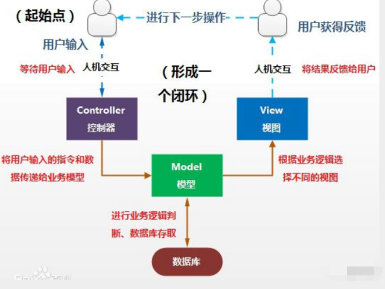
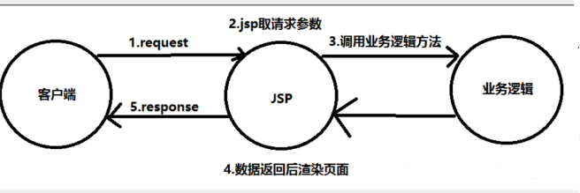
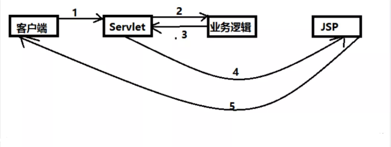
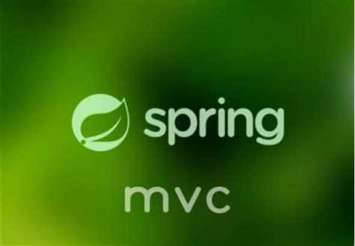
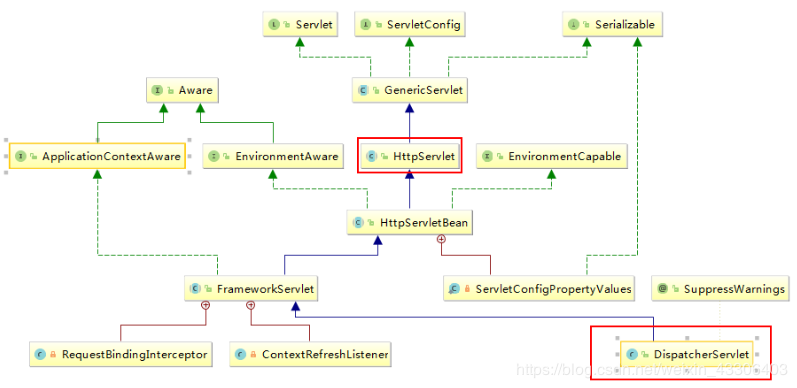
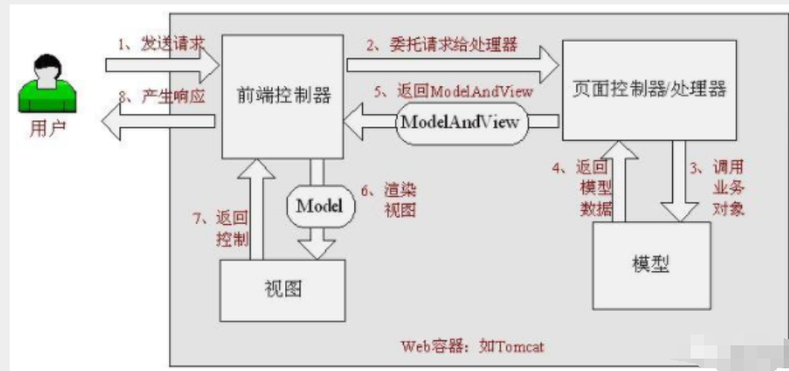

### 初始SpringMVC:

----

MVC:模型（mapper，service）视图（jsp） 控制器（Servlet） servlet：转发，重定向

前端  数据传输 实体类

实体类 ：用户名，密码，生日，爱好，

前端：用户名，密码

### 1.1、什么是MVC

- MVC是模型(Model)、视图(View)、控制器(Controller)的简写，是一种软件设计规范。
- 是将业务逻辑、数据、显示分离的方法来组织代码。
- MVC主要作用是**降低了视图与业务逻辑间的双向偶合**。
- MVC不是一种设计模式，**MVC是一种架构模式**。当然不同的MVC存在差异。

**Model（模型）：**数据模型，提供要展示的数据，因此包含数据和行为，可以认为是领域模型或JavaBean组件（包含数据和行为），不过现在一般都分离开来：Value Object（数据Dao） 和 服务层（行为Service）。也就是模型提供了模型数据查询和模型数据的状态更新等功能，包括数据和业务。

**View（视图）：**负责进行模型的展示，一般就是我们见到的用户界面，客户想看到的东西。

**Controller（控制器）：**接收用户请求，委托给模型进行处理（状态改变），处理完毕后把返回的模型数据返回给视图，由视图负责展示。也就是说控制器做了个调度员的工作。

**最典型的MVC就是JSP + servlet + javabean的模式。**



### 1.2、Model1时代

- 在web早期的开发中，通常采用的都是Model1。
- Model1中，主要分为两层，视图层和模型层。



Model1优点：架构简单，比较适合小型项目开发；

Model1缺点：JSP职责不单一，职责过重，不便于维护；

### 1.3、Model2时代

Model2把一个项目分成三部分，包括**视图、控制、模型。**



1. 用户发请求
2. Servlet接收请求数据，并调用对应的业务逻辑方法
3. 业务处理完毕，返回更新后的数据给servlet
4. servlet转向到JSP，由JSP来渲染页面
5. 响应给前端更新后的页面

**职责分析：**

**Controller：控制器**

1. 取得表单数据
2. 调用业务逻辑
3. 转向指定的页面

**Model：模型**

1. 业务逻辑
2. 保存数据的状态

**View：视图**

1. 显示页面

Model2这样不仅提高的代码的复用率与项目的扩展性，且大大降低了项目的维护成本。Model 1模式的实现比较简单，适用于快速开发小规模项目，Model1中JSP页面身兼View和Controller两种角色，将控制逻辑和表现逻辑混杂在一起，从而导致代码的重用性非常低，增加了应用的扩展性和维护的难度。Model2消除了Model1的缺点。

### 1.4、回顾Servlet

1. 新建一个Maven工程当做父工程！pom依赖！

```xml
<dependencies>
   <dependency>
       <groupId>junit</groupId>
       <artifactId>junit</artifactId>
       <version>4.12</version>
   </dependency>
   <dependency>
       <groupId>org.springframework</groupId>
       <artifactId>spring-webmvc</artifactId>
       <version>5.1.9.RELEASE</version>
   </dependency>
   <dependency>
       <groupId>javax.servlet</groupId>
       <artifactId>servlet-api</artifactId>
       <version>2.5</version>
   </dependency>
   <dependency>
       <groupId>javax.servlet.jsp</groupId>
       <artifactId>jsp-api</artifactId>
       <version>2.2</version>
   </dependency>
   <dependency>
       <groupId>javax.servlet</groupId>
       <artifactId>jstl</artifactId>
       <version>1.2</version>
   </dependency>
</dependencies>
```

1. 建立一个Moudle：springmvc-01-servlet ， 添加Web app的支持！
2. 导入servlet 和 jsp 的 jar 依赖

```xml
<dependency>
   <groupId>javax.servlet</groupId>
   <artifactId>servlet-api</artifactId>
   <version>2.5</version>
</dependency>
<dependency>
   <groupId>javax.servlet.jsp</groupId>
   <artifactId>jsp-api</artifactId>
   <version>2.2</version>
</dependency>
```

编写一个Servlet类，用来处理用户的请求

```xml
public class HelloServlet extends HttpServlet {

    //全栈：后台+前端+数据库+运维
    
    @Override
    protected void doGet(HttpServletRequest req, HttpServletResponse resp) throws ServletException, IOException {

        //1.获取前端参数
        String method = req.getParameter("method");

        if (method.equals("add")){
            req.getSession().setAttribute("msg","执行了add方法！");
        }
        if (method.equals("delete")){
            req.getSession().setAttribute("msg","执行了delete方法！");
        }
        //2.调用业务层
        //3.视图转发或者重定向

        req.getRequestDispatcher("/WEB-INF/jsp/test.jsp").forward(req,resp);
    }

    @Override
    protected void doPost(HttpServletRequest req, HttpServletResponse resp) throws ServletException, IOException {
       doGet(req, resp);
    }
}
```

编写hello.jsp，在WEB-INF目录下新建一个jsp的文件夹，新建hello.jsp

```xml
<%@ page contentType="text/html;charset=UTF-8" language="java" %>
<html>
<head>
    <title>Title</title>
</head>
<body>
${msg}
</body>
</html>
```

在web.xml中注册Servlet

```xml
<?xml version="1.0" encoding="UTF-8"?>
<web-app xmlns="http://xmlns.jcp.org/xml/ns/javaee"
         xmlns:xsi="http://www.w3.org/2001/XMLSchema-instance"
         xsi:schemaLocation="http://xmlns.jcp.org/xml/ns/javaee http://xmlns.jcp.org/xml/ns/javaee/web-app_4_0.xsd"
         version="4.0">
    
    <servlet>
        <servlet-name>hello</servlet-name>
        <servlet-class>cn.jinronga.servlet.HelloServlet</servlet-class>
    </servlet>
    
    <servlet-mapping>
        <servlet-name>hello</servlet-name>
        <url-pattern>/hello</url-pattern>
    </servlet-mapping>
<!--超时时间
    <session-config>
        <session-timeout>15</session-timeout>
    </session-config>-->
</web-app>
```

配置Tomcat，并启动测试

访问：

- http://localhost:8080/helloservlet/hello?method=delete
- http://localhost:8080/helloservlet/hello?method=add

**MVC框架要做哪些事情**

1. 将url映射到java类或java类的方法 .
2. 封装用户提交的数据 .
3. 处理请求--调用相关的业务处理--封装响应数据 .
4. 将响应的数据进行渲染 . jsp / html 等表示层数据 .

**说明：**

​	常见的服务器端MVC框架有：Struts、Spring MVC、ASP.NET MVC、Zend Framework、JSF；常见前端MVC框架：vue、angularjs、react、backbone；由MVC演化出了另外一些模式如：MVP、MVVM 等等....

## 2、什么是SpringMVC

### 2.1、概述

 

Spring MVC是Spring Framework 的一部分，是基于java实现的MVC轻量级web框架

查看官方文档：https://docs.spring.io/spring/docs/5.2.0.RELEASE/spring-framework-reference/web.html#spring-web

**我们为什么要学习SpringMVC呢?**

 Spring MVC的特点：

1. 轻量级，简单易学
2. 高效 , 基于请求响应的MVC框架
3. 与Spring兼容性好，无缝结合
4. 约定优于配置
5. 功能强大：RESTful、数据验证、格式化、本地化、主题等
6. 简洁灵活

Spring的web框架围绕**DispatcherServlet** [ 调度Servlet ] 设计。

DispatcherServlet的作用是将请求分发到不同的处理器。从Spring 2.5开始，使用Java 5或者以上版本的用户可以采用基于注解形式进行开发，十分简洁；

正因为SpringMVC好 , 简单 , 便捷 , 易学 , 天生和Spring无缝集成(使用SpringIoC和Aop) , 使用约定优于配置 . 能够进行简单的junit测试 . 支持Restful风格 .异常处理 , 本地化 , 国际化 , 数据验证 , 类型转换 , 拦截器 等等......所以我们要学习 .

**最重要的一点还是用的人多 , 使用的公司多 .** 

### 2.2、中心控制器

​	Spring的web框架围绕DispatcherServlet设计。DispatcherServlet的作用是将请求分发到不同的处理器。从Spring 2.5开始，使用Java 5或者以上版本的用户可以采用基于注解的controller声明方式。

​	Spring MVC框架像许多其他MVC框架一样, **以请求为驱动** , **围绕一个中心Servlet分派请求及提供其他功能**，**DispatcherServlet是一个实际的Servlet (它继承自HttpServlet 基类)**。

SpringMVC的原理如下图所示：

​	当发起请求时被前置的控制器拦截到请求，根据请求参数生成代理请求，找到请求对应的实际控制器，控制器处理请求，创建数据模型，访问数据库，将模型响应给中心控制器，控制器使用模型与视图渲染视图结果，将结果返回给中心控制器，再将结果返回给请求者。



### SpringMVC执行原理：


**步骤：**

⑴ 用户发送请求至前端控制器DispatcherServlet

⑵ DispatcherServlet收到请求调用HandlerMapping处理器映射器。

⑶ 处理器映射器根据请求url找到具体的处理器，生成处理器对象及处理器拦截器(如果有则生成)一并返回给DispatcherServlet。

⑷ DispatcherServlet通过HandlerAdapter处理器适配器调用处理器

⑸ 执行处理器(Controller，也叫后端控制器)。

⑹ Controller执行完成返回ModelAndView

⑺ HandlerAdapter将controller执行结果ModelAndView返回给DispatcherServlet

⑻ DispatcherServlet将ModelAndView传给ViewReslover视图解析器

⑼ ViewReslover解析后返回具体View

⑽ DispatcherServlet对View进行渲染视图（即将模型数据填充至视图中）。

 ⑾ DispatcherServlet响应用户。

**理解springMVC中的几个组件：**

前端控制器（DispatcherServlet）：接收请求，响应结果，相当于电脑的CPU。

处理器映射器（HandlerMapping）：根据URL去查找处理器

处理器（Handler）：（需要程序员去写代码处理逻辑的）

处理器适配器（HandlerAdapter）：会把处理器包装成适配器，这样就可以支持多种类型的处理器，类比笔记本的适配器（适配器模式的应用）

视图解析器（ViewResovler）：进行视图解析，多返回的字符串，进行处理，可以解析成对应的页面.

