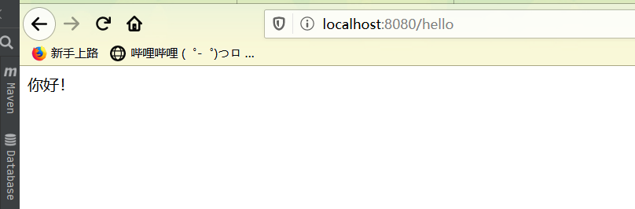
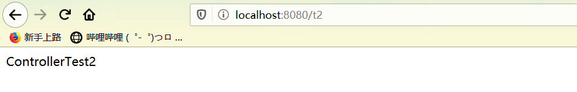
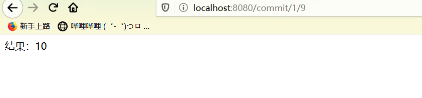
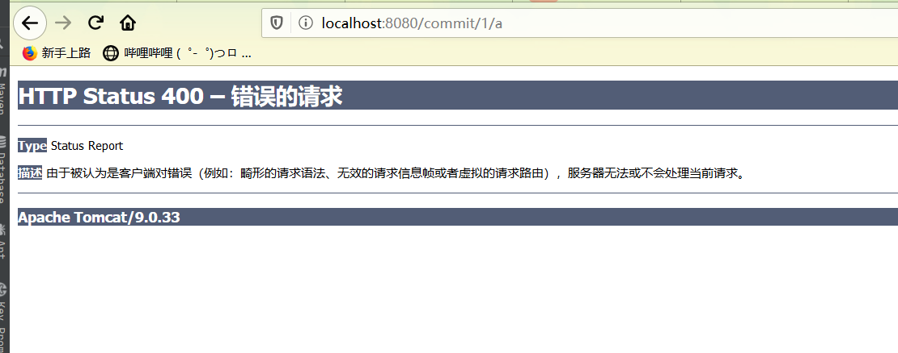
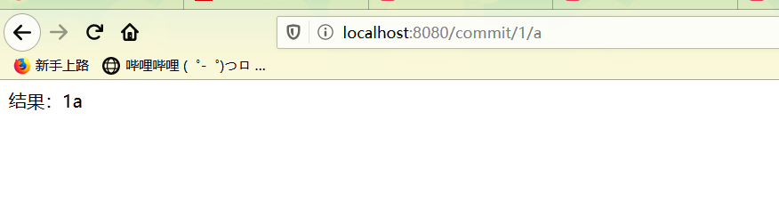
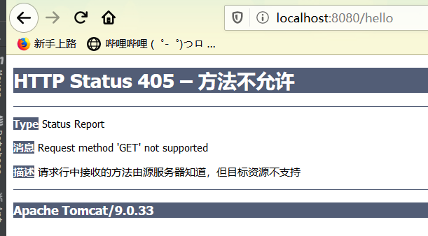

### SpringMVC中RestFul和控制器

---

#### SpringMVC里面的控制器和路径请求的具体内容

### 控制器Controller

控制器复杂提供访问应用程序的行为，通常通过接口定义或注解定义两种方式。

控制器负责解析用户的请求将其转换一个模型。

在SpringMVC中一个控制器可以包含多个方法

在springMVC中，对于Controller的配置很多种


#### 实现Controller接口Controlle

SpringMVC里面的控制器和路径请求的具体内容

#### 控制器Controller

- 控制器复杂提供访问应用程序的行为，通常通过接口定义或注解定义两种方式。

- 控制器负责解析用户的请求将其转换一个模型。

- 在SpringMVC中一个控制器可以包含多个方法

- 在springMVC中，对于Controller的配置很多种


实现Controller接口:

Controller是一个接口，在org.springframework.web.servlet.mvc包下，接口中只有一个方法；

```java
//实现该接口的类获得控制器功能
public interface Controller {
   //处理请求且返回一个模型与视图对象
   ModelAndView handleRequest(HttpServletRequest var1, HttpServletResponse var2) throws Exception;
}
```

**测试**

1. 新建一个Moudle，springmvc-04-controller 。HelloSpringMVC 拷贝一份, 我们进行操作！

2. - 删掉HelloController
   - mvc的配置文件只留下 视图解析器！

3. 编写一个Controller类，ControllerTest1

```xml
//定义控制器
//注意点：不要导错包，实现Controller接口，重写方法；
public class ControllerTest1 implements Controller {

   public ModelAndView handleRequest(HttpServletRequest httpServletRequest, HttpServletResponse httpServletResponse) throws Exception {
       //返回一个模型视图对象
       ModelAndView mv = new ModelAndView();
       mv.addObject("msg","Test1Controller");
       mv.setViewName("test");
       return mv;
  }
}
```

3.编写完毕后，去Spring配置文件中注册请求的bean；name对应请求路径，class对应处理请求的类

```xml
<bean name="/t1" class="cn.jinrona.controller.ControllerTest1"/>
```

4.编写前端test.jsp，注意在WEB-INF/jsp目录下编写，对应我们的视图解析器

```xml
<%@ page contentType="text/html;charset=UTF-8" language="java" %>
<html>
<head>
    <title>Title</title>
</head>
<body>
${msg}
</body>
</html>
```

5.配置Tomcat运行测试，我这里没有项目发布名配置的就是一个 / ，所以请求不用加项目名，OK！

**说明：**

- 实现接口Controller定义控制器是较老的办法
- 缺点是：一个控制器中只有一个方法，如果要多个方法则需要定义多个Controller；定义的方式比较麻烦；

### 使用注解@Controller

- @Controller注解类型用于声明Spring类的实例是一个控制器（在讲IOC时还提到了另外3个注解）；
- Spring可以使用扫描机制来找到应用程序中所有基于注解的控制器类，为了保证Spring能找到你的控制器，需要在配置文件中声明组件扫描。

```xml
   <!-- 自动扫描包，让指定包下的注解生效,由IOC容器统一管理 -->
    <context:component-scan base-package="cn.jinrona.controller"/>
```

增加一个ControllerTest2类，使用注解实现；

```java
@Controller
public class ControllerTest2 {

    //映射访问路径
    @RequestMapping("/t2")
    public  String index(Model model){
        model.addAttribute("msg","ControllerTest2");
        //返回视图的位置
        return "test";
    }
}
```



**可以发现，我们的两个请求都可以指向一个视图，但是页面结果的结果是不一样的，从这里可以看出视图是被复用的，而控制器与视图之间是弱偶合关系。**

**注解方式是平时使用的最多的方式！**

### RequestMapping

**@RequestMapping**

- @RequestMapping注解用于映射url到控制器类或一个特定的处理程序方法。可用于类或方法上。用于类上，表示类中的所有响应请求的方法都是以该地址作为父路径。
- 为了测试结论更加准确，我们可以加上一个项目名测试 myweb
- 只注解在方法上面

```java
@Controller
public class TestController {
   @RequestMapping("/h1")
   public String test(){
       return "test";
  }
}
```

访问路径：http://localhost:8080 / 项目名 / h1

同时注解类与方法

```xml
@Controller
@RequestMapping("/admin")
public class TestController {
   @RequestMapping("/h1")
   public String test(){
       return "test";
  }
}
```

访问路径：http://localhost:8080 / 项目名/ admin /h1  , 需要先指定类的路径再指定方法的路径；


### RestFul 风格

**概念：**

Restful就是一个资源定位及资源操作的风格。不是标准也不是协议，只是一种风格，只是风格设计的软件可以更简洁，更有层次，更易于实现缓存等机制。

**功能：**

资源：互联网所有的事物都可以抽象为资源

资源的操作：使用POST,DELETE,PUT,GET,使用不同的方法对资源进行操作。

分别对应添加、删除、修改、查询

传统的操作资源的方式：通过不同的参数实现不同的效果 ！方法单一，post和get

​	http://127.0.0.1/item/queryItem.action?id=1 查询,GET

​	http://127.0.0.1/item/saveItem.action 新增,POST

​	http://127.0.0.1/item/updateItem.action 更新,POST

​	http://127.0.0.1/item/deleteItem.action?id=1 删除,GET或POST

使用RESTful操作资源：可以通过不同的请求方式来实现不同的效果！如下：请求地址一样但是功能不一样！

​	http://127.0.0.1/item/1 查询,GET

​	http://127.0.0.1/item 新增,POST

​	http://127.0.0.1/item 更新,PUT

​	http://127.0.0.1/item/1 删除,DELETE

**执行的方法一样通过不同的请求方式执行不同的方法**

#### @PathVariable 注解

测试：**

1、在新建一个类 RestFulController

```java
@Controller
public class RestFulController {
}
```

2、在Spring MVC中可以使用  **@PathVariable 注解**，让方法参数的值对应绑定到一个URI模板变量上。

```java
@Controller
public class RestFulController {
    //映射访问路径
    @RequestMapping("commit/{p1}/{p2}")
    public String index(@PathVariable int p1,@PathVariable int p2 , Model model){

        int total=p1+p2;
        //Spring MVC会自动实例化一个Model对象用于向视图中传值
        model.addAttribute("msg","结果："+total);
        //返回视图位置
        return "test";
    }
}
```

结果：



4、使用路径变量的好处：

- 使路径变得更加简洁；
- 获得参数更加的方便，框架会自动进行类型的转换。
- 通过路径变量的类型可以约束访问的参数，如果类型不一样，则访问不到对应的请求方法，如果访问的路径是/commit/1/a，则路径与方法不匹配，而不会是参数转换失败。

因为两个变量都是int类型的所以失败：



5、我们修改下对应的参数类型进行测试：

```java
@Controller
public class RestFulController {
    //映射访问路径
    @RequestMapping("commit/{p1}/{p2}")
    public String index(@PathVariable int p1,@PathVariable String  p2 , Model model){

        String total=p1+p2;
        //Spring MVC会自动实例化一个Model对象用于向视图中传值
        model.addAttribute("msg","结果："+total);
        //返回视图位置
        return "test";
    }
}
```



#### **使用method属性指定请求类型**

用于约束请求的类型，可以收缩请求的范围。指定请求的谓词如GET, POST, HEAD, OPTIONS, PUT, PATCH, DELETE, TRACE等

测试：

 ```java
//映射访问路径,必须是POST请求
    @RequestMapping(value = "hello",method ={RequestMethod.POST})
    public String index(Model model){
        //Spring MVC会自动实例化一个Model对象用于向视图中传值
        model.addAttribute("msg","你好！");
        //返回视图位置
        return "test";
    }
}

//我们使用浏览器地址栏进行访问默认是Get请求，会报错405：
 ```



如果将POST修改为GET则正常了；

```java
//映射访问路径,必须是Get请求
@RequestMapping(value = "/hello",method = {RequestMethod.GET})
public String index2(Model model){
   model.addAttribute("msg", "hello!");
   return "test";
}
```


**小结：**

Spring MVC 的 @RequestMapping 注解能够处理 HTTP 请求的方法, 比如 GET, PUT, POST, DELETE 以及 PATCH。

**所有的地址栏请求默认都会是 HTTP GET 类型的。**

方法级别的注解变体有如下几个：组合注解

```java
@GetMapping
@PostMapping
@PutMapping
@DeleteMapping
@PatchMapping
```

@GetMapping 是一个组合注解，平时使用的会比较多！

它所扮演的是 @RequestMapping(method =RequestMethod.GET) 的一个快捷方式。

 