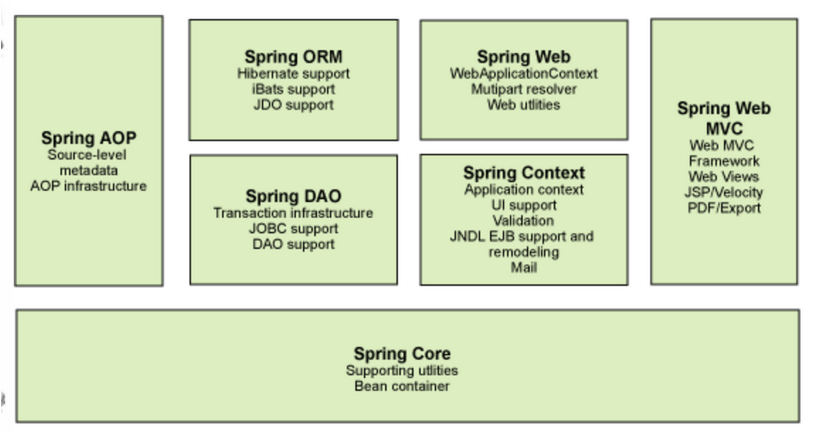

### 初识Spring及IOC理论推导：

---

#### 简介：

官网： https://spring.io/ 

 官方下载地址 : https://repo.spring.io/libs-release-local/org/springframework/spring/ 

 GitHub : https://github.com/spring-projects 

Spring：春天

2002年，Rod Jahnson首次推出了Spring框架雏形interface21框架。

2004年3月24日，Spring框架以interface21框架为基础，经过重新设计，发布了1.0正式版。

####  Spring Framework创始人 ：Rod Johnson( 罗宾·约翰逊 )

很难想象Rod Johnson的学历 , 他是悉尼大学的博士，然而他的专业不是计算机，而是音乐学。同时也是[JSR](https://baike.baidu.com/item/JSR)-154（[Servlet](https://baike.baidu.com/item/Servlet)2.4）和[JDO](https://baike.baidu.com/item/JDO)2.0的规范专家、[JCP](https://baike.baidu.com/item/JCP)的积极成员，是Java development community中的杰出人物。 

Spring理念 : 使现有技术更加实用 . 本身就是一个大杂烩 , 整合现有的框架技术

**Maven依赖：**

```xml
<!-- https://mvnrepository.com/artifact/org.springframework/spring-webmvc -->
<dependency>
    <groupId>org.springframework</groupId>
    <artifactId>spring-webmvc</artifactId>
    <version>5.2.0.RELEASE</version>
</dependency>
<!-- https://mvnrepository.com/artifact/org.springframework/spring-jdbc -->
<dependency>
    <groupId>org.springframework</groupId>
    <artifactId>spring-jdbc</artifactId>
    <version>5.2.0.RELEASE</version>
</dependency>
```

#### 优点：

1、Spring是一个开源免费的框架（容器）。

2、Spring是一个轻量级的框架，非侵入式的。

**3、控制反转IOC,面向切面AOP**

4、对事务的支持，对框架整合的支持

总之一句话：

Spring是一个轻量级的控制反转（ioc）和面向切面（AOP）的框架（容器）。

#### 组成：


 Spring 框架是一个分层架构，由 7 个定义良好的模块组成。Spring 模块构建在核心容器之上，核心容器定义了创建、配置和管理 bean 的方式 . 




##### 每个模块的功能：

   **核心容器**：核心容器提供 Spring 框架的基本功能。核心容器的主要组件是 BeanFactory，它是工厂模式的实现。BeanFactory 使用控制反转 （IOC）模式将应用程序的配置和依赖性规范与实际的应用程序代码分开。

   **Spring 上下文**：Spring 上下文是一个配置文件，向 Spring 框架提供上下文信息。Spring 上下文包括企业服务，例如 JNDI、EJB、电子邮件、国际化、校验和调度功能。

   **Spring AOP**：通过配置管理特性，Spring AOP 模块直接将面向方面的编程功能集成到了 Spring 框架中。所以，可以很容易地使 Spring 框架管理的任何对象支持  AOP。Spring AOP 模块为基于 Spring 的应用程序中的对象提供了事务管理服务。通过使用 Spring AOP，不用依赖 EJB  组件，就可以将声明性事务管理集成到应用程序中。

   **Spring DAO**：JDBC DAO  抽象层提供了有意义的异常层次结构，可用该结构来管理异常处理和不同数据库供应商抛出的错误消息。异常层次结构简化了错误处理，并且极大地降低了需要编写的异常代码数量（例如打开和关闭连接）。Spring DAO 的面向 JDBC 的异常遵从通用的 DAO 异常层次结构。

   **Spring ORM**：Spring 框架插入了若干个 ORM 框架，从而提供了 ORM 的对象关系工具，其中包括 JDO、Hibernate 和 iBatis SQL Map。所有这些都遵从 Spring 的通用事务和 DAO 异常层次结构。

   **Spring Web 模块**：Web 上下文模块建立在应用程序上下文模块之上，为基于 Web 的应用程序提供了上下文。所以，Spring 框架支持与 Jakarta Struts 的集成。Web 模块还简化了处理多部分请求以及将请求参数绑定到域对象的工作。

   **Spring MVC 框架**：MVC 框架是一个全功能的构建 Web 应用程序的 MVC 实现。通过策略接口，MVC 框架变成为高度可配置的，MVC 容纳了大量视图技术，其中包括 JSP、Velocity、Tiles、iText 和 POI。

#### 扩展：

**Spring Boot与Spring Cloud**

- Spring Boot 是 Spring 的一套快速配置脚手架，可以基于Spring Boot 快速开发单个微服务;

-  Spring Cloud是基于Spring Boot实现的； 

- Spring Boot使用了约束优于配置的理念，很多集成方案已经帮你选择好了，能不配置就不配置 , Spring Cloud很大的一部分是基于Spring Boot来实现，Spring Boot可以离开Spring Cloud独立使用开发项目，但是Spring Cloud离不开Spring Boot，属于依赖的关系。
- SpringBoot在SpringClound中起到了承上启下的作用，如果你要学习SpringCloud必须要学习SpringBoot。

#### 弊端：

由于发展太久了，违背了原来的理念！配置十分的繁琐，“配置地狱”。

#### IOC理论推导：

#### 案例：

1.UserMapper接口

```java
public interface UserMapper {

    void getUser();
}
```


2.UserMapperImpl实现类

```java
public class UserMapperImpl implements UserMapper{
    @Override
    public void getUser() {
        System.out.println("获取默认的数据！");
    }
}
```


3.UserService业务接口

```java
public interface UserService {

     void getUser();
}
```

4.UserServiceImpl业务实现类

```java
public class UserServiceImpl implements UserService{

    UserMapper userMapper = new UserMapperOracleImpl();
    @Override
    public void getUser() {
       userMapper.getUser();
    }
}
```

测试:

```java
public class MyTest {
    public static void main(String[] args) {
        UserService userService = new UserServiceImpl();

        //实际调用业务层，dao层他们不需要接触
        userService.getUser();
    }
}
```

 这是我们原来的方式 , 开始大家也都是这么去写的对吧 . 那我们现在修改一下 . 

 把UserMapper的实现类增加一个 : 

```java
public class UserMapperMysqlImpl implements UserMapper{
    @Override
    public void getUser() {
        System.out.println("连接Mysql");
    }
}
```

 紧接着我们要去使用MySql的话 , 我们就需要去service实现类里面修改对应的实现 

```java
public class UserServiceImpl implements UserService{

    UserMapper userMapper = new UserMapperMysqlImpl();
    @Override
    public void getUser() {
       userMapper.getUser();
    }
}
```

 假设还要多个这样的实现UserMapper的实现类就很累赘了...

```java
public class UserServiceImpl implements UserService{

    UserMapper userMapper = new UserMapperOracleImpl();
    @Override
    public void getUser() {
       userMapper.getUser();
    }
}
```

 那么我们要使用Oracle , 又需要去service实现类里面修改对应的实现 . 假设我们的这种需求非常大 , 这种方式就根本不适用了, 需求多了重复的代码还要重复的变动就要修改大量的代码了这种耦合太高了！如果程序代码量十分大，修改一次的成本代价十分昂贵的！

####  **那我们如何去解决呢 ?**  

 我们可以在需要用到他的地方 , 不去实现它 , 而是留出一个接口 , 利用set方法, 我们去代码里修改下 . 

```java 
public class UserServiceImpl implements UserService{

    private  UserMapper userMapper;

    public void SetUser(UserMapper userMapper) {
        this.userMapper = userMapper;
    }

    @Override
    public void getUser() {
      userMapper.getUser();
    }
}
```

测试：

```java
public class MyTest {
    public static void main(String[] args) {
        UserServiceImpl userService = new UserServiceImpl();
        userService.SetUser(new UserMapperOracleImpl());
        //实际调用业务层，dao层他们不需要接触
        userService.getUser();
    }
}
```

看起来没什么区别但是它们已经发生了根本性的变化很多地方都不一样了 . 仔细去思考一下 , 以前所有东西都是由程序去进行控制创建new对象 , 而现在是由我们自行控制创建对象 , 把主动权交给了调用者 . 程序不用去管怎么创建,怎么实现了 . 它只负责提供一个接口 .

这种思想 , 从本质上解决了问题 , 我们程序员不再去管理对象的创建了 , 更多的去关注业务的实现 . 耦合性大大降低 . 这也就是IOC的原型 !


#### IOC本质：

**ioc是一种设计思想，DI（依赖注入）是实现IoC的一种方式**，也有人认为DI只是IOC的另一种说法。没有IOC的程序，我们使用面向对象编程，对象的创建与对象间的依赖关系完全是硬编码在程序中，对象的创建由自己控制，控制反转后将对象创建转移给第三方。

- 没有IOC: 相当于你自己去菜市场new 了一只鸡，不过是生鸡，要自己拔毛，去内脏，再上花椒，酱油，烤制，经过各种工序之后，才可以食用。 
- 用IOC: 相当于去馆子(Spring)点了一只鸡，交到你手上的时候，已经五味俱全，你就只管吃就行了。 

**IoC是Spring框架的核心内容**，使用多种方式完美的实现了IoC，可以使用XML配置，也可以使用注解，还可以用javaConfig配置，新版本的Spring也可以零配置实现IoC。

Spring容器在初始化时先读取配置文件，根据配置文件或元数据创建与组织对象存入容器中，程序使用时再从Ioc容器中取出需要的对象。

 **控制反转是一种通过描述（XML或注解）并通过第三方去生产或获取特定对象的方式。在Spring中实现控制反转的是IoC容器，其实现方法是依赖注入（Dependency Injection,DI）。** 

