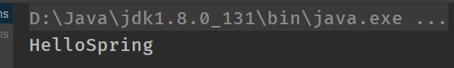

### HelloSpring：

---

1、Hello实体类：

```java
public class Hello {
 private    String name;

    public String getName() {
        return name;
    }

    public void setName(String name) {
        this.name = name;
    }

    public void show(){
        System.out.println("Hello"+name);
    }
}
```

 2、编写我们的spring文件 , 这里我们命名为beans.xml 

```xml
<?xml version="1.0" encoding="UTF-8"?>
<beans xmlns="http://www.springframework.org/schema/beans"
       xmlns:xsi="http://www.w3.org/2001/XMLSchema-instance"
       xsi:schemaLocation="http://www.springframework.org/schema/beans
       http://www.springframework.org/schema/beans/spring-beans.xsd">

<!--    bean就是java对象只不过交给Spring创建跟管理-->
    <bean id="hello" class="cn.jinronga.pojo.Hello">
<!--        给属性name赋值-->
        <property name="name" value="Spring"/>
    </bean>
</beans>
```

测试Test:

```java
public class MyTest {
    @Test
    public void helloSpring(){

        //解析beans.xml文件，生成管理相对应的Bean对象
        ApplicationContext context = new ClassPathXmlApplicationContext("beans.xml");
       //getBean()参数为spring配置文件中的bean中id
      Hello hello =  (Hello) context.getBean("hello");
      hello.show();

    }
}
```



#### 思考：

- Hello 对象是谁创建的 ?  

     hello 对象是由Spring创建的

- Hello 对象的属性是怎么设置的 ?

  ​    hello 对象的属性是由Spring容器设置的

这个过程就叫控制反转 :

- 控制 : 谁来控制对象的创建 , 传统应用程序的对象是由程序本身控制创建的 , 使用Spring后 , 对象是由Spring来创建的
- 反转 : 程序本身不创建对象 , 而变成被动的接收对象 .

依赖注入 : 就是利用set方法来进行注入的.

依赖注入的三种方式：构造函数方法注入、Setter方法注入与接口注入。

 **IOC是一种编程思想，由主动的编程变成被动的接收**

**可以通过newClassPathXmlApplicationContext去浏览一下底层源码 .**


#### 修改1.初识Spring及IOC理论推导中的案例

UserServiceImpl修改成：

```java
public class UserServiceImpl implements UserService{

    private  UserMapper userMapper;

    public void SetUser(UserMapper userMapper) {
        this.userMapper = userMapper;
    }

    @Override
    public void getUser() {
      userMapper.getUser();
    }
}
```


 我们在案例中， 新增一个Spring配置文件beans.xml 

```xml
<?xml version="1.0" encoding="UTF-8"?>
<beans xmlns="http://www.springframework.org/schema/beans"
       xmlns:xsi="http://www.w3.org/2001/XMLSchema-instance"
       xsi:schemaLocation="http://www.springframework.org/schema/beans
       http://www.springframework.org/schema/beans/spring-beans.xsd">

   <bean id="MysqlImpl" class="cn.jinronga.mapper.UserMapperMysqlImpl"/>
    <bean id="OracleImpl" class="cn.jinronga.mapper.UserMapperOracleImpl"/>

    <bean id="ServiceImpl" class="cn.jinronga.service.UserServiceImpl">
        <property name="userMapper" ref="MysqlImpl"/>
    </bean>
</beans>
```

Test测试：

```java 
public class MyTest {
    @Test
    public void helloSpring(){

        //解析beans.xml文件，生成管理相对应的Bean对象
        ApplicationContext context = new ClassPathXmlApplicationContext("beans.xml");
        UserServiceImpl serviceImpl = (UserServiceImpl) context.getBean("ServiceImpl");
        serviceImpl.getUser();

    }
}
```

现在 , 我们彻底不用再程序中去改动了 , 要实现不同的操作 , 只需要在xml配置文件中进行修改 , 所谓的IoC,一句话搞定 : 对象由Spring 来创建 , 管理 , 装配 ! 

#### IOC创建对象方式

通过无参构造方法来创建

1、User

```java
public class User {
    private String name;

    public User() {
        System.out.println("我已经被初始化了");
    }

    public String getName() {
        return name;
    }

    public void setName(String name) {
        this.name = name;
    }

    public void show(){
        System.out.println("用户名："+name);
    }
}
```

 2、beans.xml 

```xml
<?xml version="1.0" encoding="UTF-8"?>
<beans xmlns="http://www.springframework.org/schema/beans"
       xmlns:xsi="http://www.w3.org/2001/XMLSchema-instance"
       xsi:schemaLocation="http://www.springframework.org/schema/beans
       http://www.springframework.org/schema/beans/spring-beans.xsd">

    <!--    bean就是java对象只不过交给Spring创建跟管理-->
    <bean id="user" class="cn.jinronga.pojo.User">
        <property name="name" value="金融融融融果果"/>
    </bean>
</beans>
```

 3、测试类 Test:

```java
    @Test
    public void user(){
        ApplicationContext context = new ClassPathXmlApplicationContext("beans.xml");
        //在执行getBean的时候，user已经创建好了，通过无参构造
        User user =(User) context.getBean("user");
//        //调用对象的方法
//         user.show();
    }
```


 结果可以发现，在调用show方法之前，User对象已经通过无参构造初始化了！ 

通过有参构造方法创建：

 1、UserT . java 

```java
public class UserT {
    private  String name;

    public UserT(String name) {
        this.name = name;
    }

    public String getName() {
        return name;
    }

    public void setName(String name) {
        this.name = name;
    }

    public void show(){
        System.out.println("name="+ name );
    }
}
```

 2、beans.xml 有三种方式编写 

方式一：

```xml
<!-- 第一种根据参数名字设置 --> 
<bean id="userT" class="cn.jinronga.pojo.UserT">
     <!-- name指参数名 -->
        <constructor-arg name="name" value="金融融融融果果"/>
    </bean>
</beans>
```

方式二：

```xml
<!-- 第二种根据index参数下标设置 -->
<bean id="userT" class="cn.jinronga.pojo.UserT">
   <!-- index指构造方法 , 下标从0开始 -->
   <constructor-arg index="0" value="金融融融融果果"/>
</bean>
```

方式三：

```xml
!-- 第三种根据参数类型设置 -->
<bean id="userT" class="cn.jinronga.pojo.UserT">
   <constructor-arg type="java.lang.String" value="金融融融融果果"/>
</bean>
```

测试：

```java
    @Test
    public void userT(){
        ApplicationContext context = new ClassPathXmlApplicationContext("beans.xml");
        UserT userT = (UserT)context.getBean("userT");
        userT.show();

    }
```

 结论：在配置文件加载的时候。其中管理的对象都已经初始化了！ 

**所谓的IOC：对象由Spring来创建，管理装配！只需要在xml配置文件中进行修改**

#### Spring配置

#### 别名：

 alias 设置别名 , 为bean设置别名 , 可以设置多个别名 

```xml
<!--设置别名：在获取Bean的时候可以使用别名获取-->
<alias name="userT" alias="userNew"/>

    <bean id="userT" class="cn.jinronga.pojo.UserT">
        <constructor-arg name="name" value="金融融融融果果"/>
    </bean>
```

##### bean的配置：

name比alias更加高级！

```xml
<!--bean就是java对象,由Spring创建和管理-->

<!--
   id 是bean的标识符,要唯一,如果没有配置id,name就是默认标识符
   如果配置id,又配置了name,那么name是别名
   name可以设置多个别名,可以用逗号,分号,空格隔开
   如果不配置id和name,可以根据applicationContext.getBean(.class)获取对象;

class是bean的全限定名=包名+类名
-->
<bean id="hello" name="hello2 h2,h3;h4" class="com.jinronga.pojo.Hello">
   <property name="name" value="Spring"/>
</bean>
```


##### Import：

这个import，一般用于团队开发使用，它可以将多个配置文件，导入合并为一个

假如，一个项目有多个人开发，这三个人负责不同的类开发，不同的类需要注册在不同的bean中，我们可以用import将所有人的beans.xml合成一个总的！

- 张三
- 李四
- 王五
- applicationContext.xml

```xml
<import resource="beans1.xml"/>
<import resource="beans2.xml"/>
<import resource="beans3.xml"/>
```

