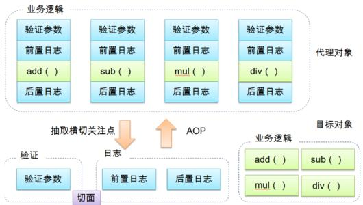
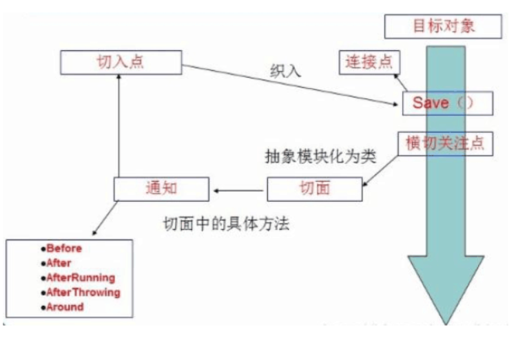
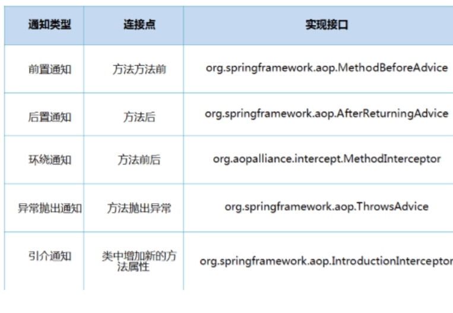

### AOP的实现方式：

----

AOP（Aspect Oriented Programming）意思为：面向切面编程，通过预编译方式和运行期动态代理实现程序功能的统一维护的一种技术。AOP是OOP的延续，是软件开发中一个热点，也是Spring框架的重要内容，是函数式编程的一种衍生规范。利用AOP可以对业务逻辑和各个部分进行隔离，从而使得业务逻辑各部分之间的耦合度降低，提高程序的重用性，提高开发的效率。



### AOP在Spring的作用：

**提供声明式事务；运行用户兹定于切面。**

**以下名词需要了解下：**

- 横切关注点：跨越应用程序多个模块的方法或功能。即是，与我们业务逻辑无关的，但是我们需要关注的部分，就是横切关注点。如日志 , 安全 , 缓存 , 事务等等 ....
- 切面（ASPECT）：横切关注点 被模块化 的特殊对象。即，它是一个类。
- 通知（Advice）：切面必须要完成的工作。即，它是类中的一个方法。
- 目标（Target）：被通知对象。
- 代理（Proxy）：向目标对象应用通知之后创建的对象。
- 切入点（PointCut）：切面通知 执行的 “地点”的定义。
- 连接点（JointPoint）：与切入点匹配的执行点。



##### SpringAOP中，通过Advice定义横切逻辑，Spring中支持5种类型的Advice:

1前置通知：先执行问方答面逻辑，再执行目标方法；
2后置通知：先执行目标方法，如果不出现异常，再执行方面逻辑；
3异常通知：先执行目标方法，如果出现异常，再执行方面逻辑；
4最终通知：先执行目标方法，有无异常都再执行方面逻辑；（类似于finally的作用）
5环绕通知：方法前后，先执行方面的前一部分，再执行目标方法，最后执行方面的剩余属部分。



即 Aop 在 不改变原有代码的情况下 , 去增加新的功能 .

#### 使用Spring实现Aop

使用AOP织入，需要导入一个依赖包！

```xml
<!-- https://mvnrepository.com/artifact/org.aspectj/aspectjweaver -->
<dependency>
   <groupId>org.aspectj</groupId>
   <artifactId>aspectjweaver</artifactId>
   <version>1.9.4</version>
</dependency>
```

**第一种方式**

**通过 Spring API 实现**

首先编写我们的业务接口和实现类

```java
//抽象角色：增删改查业务
public interface UserService {
     //增加
    void add();
    //修改
    void update();
    //删除
    void delete();
    //查询
    void query();
}
```

```java
public class UserServiceImpl implements UserService{
    public void add() {
        System.out.println("增加");
    }

    public void update() {
        System.out.println("更新");
    }

    public void delete() {
        System.out.println("删除");
    }

    public void query() {
        System.out.println("查询一个用户");
    }
}
```

然后去写我们的增强类 , 我们编写两个 , 一个前置增强 一个后置增强

```java
public class Log implements MethodBeforeAdvice {
    //method：要执行的目标对象的方法
    //objects:被调用方法的参数
    //target:目标对象
    @Override
    public void before(Method method, Object[] objects, Object target) throws Throwable {

        System.out.println(target.getClass().getName()+"的"+method.getName()+"方法被执行了");

    }
}
```

```java
public class AfterLog implements AfterReturningAdvice {
    //returnValue:返回值
    //method：调用的方法
    //args:被调用方法的对象参数
    //被调用的目标对象
    @Override
    public void afterReturning(Object returnValue, Method method, Object[] args, Object target) throws Throwable {
        System.out.println("执行了"+target.getClass().getName()+"的"+method.getName()+"方法 "+"返回值"+returnValue);
    }
}

```

最后去spring的文件中注册 , 并实现aop切入实现 , 注意导入约束 

```xml
<?xml version="1.0" encoding="UTF-8"?>
<beans xmlns="http://www.springframework.org/schema/beans"
       xmlns:xsi="http://www.w3.org/2001/XMLSchema-instance"
       xmlns:aop="http://www.springframework.org/schema/aop"
       xsi:schemaLocation="http://www.springframework.org/schema/beans
       http://www.springframework.org/schema/beans/spring-beans.xsd
       http://www.springframework.org/schema/aop
       http://www.springframework.org/schema/aop/spring-aop.xsd">

<!--    注册bean-->
     <bean id="userService" class="cn.jinronga.UserServiceImpl"/>
    <bean id="log" class="cn.jinronga.log.Log"/>
    <bean id="afterLog" class="cn.jinronga.log.AfterLog"/>

<!--    aop配置-->
    <aop:config>
        <!--pointcut:切入点
           expression:表达式要切入的点
            语法execution([类的修饰符] [类的全路径] [方法] [参数])
            -->
        <aop:pointcut id="piontcut" expression="execution(* cn.jinronga.UserServiceImpl.*(..))"/>

        <!--执行通知  增强
     pointcut-ref:在那个切入点执行增强-->
    <aop:advisor advice-ref="log" pointcut-ref="piontcut"/>
        <aop:advisor advice-ref="afterLog" pointcut-ref="piontcut"/>
    </aop:config>

</beans>
```

测试

```java
    @Test
    public void test(){
        ApplicationContext context =
                new ClassPathXmlApplicationContext("beans.xml");

        UserService userService = (UserService) context.getBean("userService");

        userService.add();


    }
}
```

Aop的重要性 : 很重要 . 一定要理解其中的思路 , 主要是思想的理解这一块 .

Spring的Aop就是将公共的业务 (日志、事务、安全等) 和领域业务结合起来 , 当执行领域业务时 , 将会把公共业务加进来 . 实现公共业务的重复利用 . **解耦**，本质还是动态代理。领域业务更纯粹 , 程序猿专注领域业务 , 其本质还是动态代理 . 

**第二种方式**

**自定义类来实现Aop**

目标业务类不变依旧是userServiceImpl

第一步 : 写我们自己的一个切入类

```java
public class DiyPointcut {

    public void before(){
        System.out.println("========方法执行前=======");
    }

    public void after(){
        System.out.println("========方法执行后=======");

    }
}
```

去spring中配置

```xml
<!--第二种方式自定义实现-->
<!--注册bean-->
    <bean id="diy" class="cn.jinronga.config.DiyPointcut"/>

<!--    aop配置-->
    <aop:config>
        <!--第二种方式：使用AOP的标签实现-->
        <aop:aspect ref="diy">
            <aop:pointcut id="diyPonitcut" expression="execution(* cn.jinronga.UserServiceImpl.*(..))"/>
            <aop:before method="before" pointcut-ref="diyPonitcut"/>
            <aop:after method="after" pointcut-ref="diyPonitcut"/>
         </aop:aspect>
    </aop:config>
```

测试：

```java
public class MyTest {
    @Test
    public void test(){
        ApplicationContext context =
                new ClassPathXmlApplicationContext("beans.xml");

        UserService userService = (UserService) context.getBean("userService");

        userService.add();
    }
}
```

**第三种方式**

**使用注解实现**

第一步：编写一个注解实现的增强类

```java
@Aspect //这是一个切面类
public class AnnotationPointcut {

    @Before("execution(* cn.jinronga.UserServiceImpl.*(..))")
    public void before(){
        System.out.println("========方法执行前=======");
    }
    @After("execution(* cn.jinronga.UserServiceImpl.*(..))")
    public void after(){
        System.out.println("========方法执行后=======");

    }
    //
    @Around("execution(* cn.jinronga.UserServiceImpl.*(..))")
    public void around(ProceedingJoinPoint jp) throws Throwable {
        System.out.println("环绕前");
        System.out.println("签名:"+jp.getSignature());
        //执行目标方法proceed
        Object proceed = jp.proceed();
        System.out.println("环绕后");
        System.out.println(proceed);
    }
}
```

第二步：在Spring配置文件中，注册bean，并增加支持注解的配置

```xml
<!--第三种方式:注解实现-->
  <bean id="apt" class="cn.jinronga.config.AnnotationPointcut"/>
    <aop:aspectj-autoproxy/>
```

aop:aspectj-autoproxy：开启注解的支持AOP的实现方式：

```xml
通过aop命名空间的<aop:aspectj-autoproxy />声明自动为spring容器中那些配置@aspectJ切面的bean创建代理，织入切面。当然，spring 在内部依旧采用AnnotationAwareAspectJAutoProxyCreator进行自动代理的创建工作，但具体实现的细节已经被<aop:aspectj-autoproxy />隐藏起来了

<aop:aspectj-autoproxy />有一个proxy-target-class属性，默认为false，表示使用jdk动态代理织入增强，当配为<aop:aspectj-autoproxy  poxy-target-class="true"/>时，表示使用CGLib动态代理技术织入增强。不过即使proxy-target-class设置为false，如果目标类没有声明接口，则spring将自动使用CGLib动态代理。
```