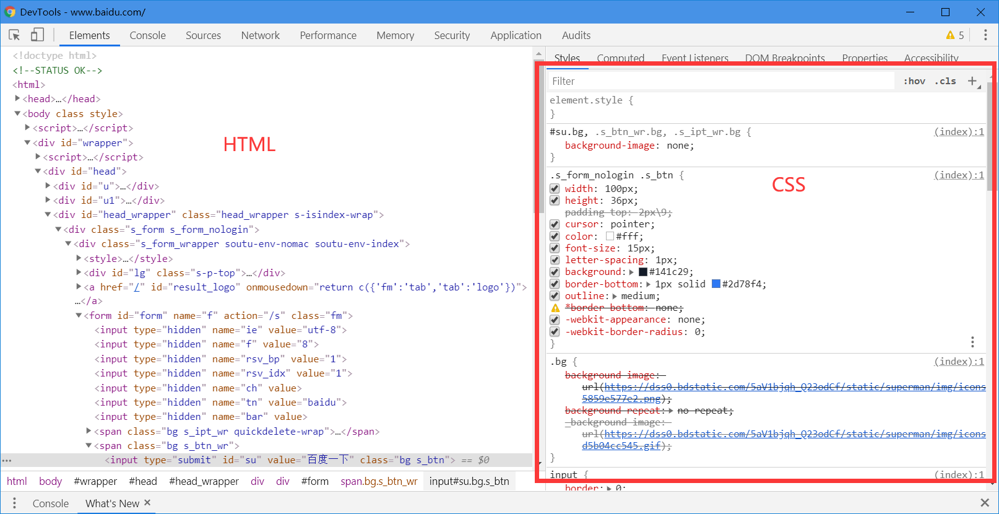
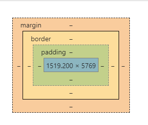

### 什么是css 

<hr>
推荐css学习文档：http://css.cuishifeng.cn/

1.css是什么？

2.css怎么用（快速入门）

3**.css选择器（重点加难点）**

4.美化网页（文字，阴影，超链接，列表，渐变。。。）

5.盒子模型

6.浮动

7.定位

8.网页动画（特效效果）

### 1.1，什么是css

Cascading Style Sheet 层叠级联样式表

CSS：表现（美化网页）

字体，颜色，边距，高度，宽度，背景图片，网页定位，网页浮动。。。




#### **1.2发展史**：

css1.0

css2.0 DIV(块)+CSS ,HTML与CSS机构分离的思想，网页变得简单

css2.1 浮动，定位

css3.0 圆角，阴影，动画，浏览器兼容器~


#### **1.3css快速入门**：

代码有注释说明耐心看：

```html

<!DOCTYPE html>

<html lang="en">
<head>
 <meta charset="UTF-8">
 <title>图片标签学习</title>
<!--  规范 <style> 可以编写css代码,
    每一个声明最好使用分号结尾
    语法：
    选择器{
        声明1;
         声明2;
          声明3;
           声明4;
    }
-->
<style>
  h1{
      color: blueviolet;
  }
</style>
</head>
<body>
    <h1>标题</h1>
</body>
</head>
```

**注：**建议把css建一个文件写css然后引入更加规范 可以实现复用 ：

<link rel="stylesheet" href="css/styke.css">

**css的优势：**

1. 内容和表现分离
2. 网页结构表现统一，可以实现复用
3. 样式十分的丰富
4. 建议使用独立于html的css文件
5. 利用SEO,容易被搜索引擎收录！

#### 1.4css的4种导入方式：

```html

<!DOCTYPE html>

<html lang="en">
<head>
 <meta charset="UTF-8">
 <title>css导入学习</title>
 <!-- 外部样式 -->
<link rel="stylesheet" href="css/style.css">
 
<!-- 内部样式 -->
<style>
    h1{
        color:darkcyan;
    }
</style>
</head>
<body>

    <!-- 优先级：就近原则 -->
    <!-- 行内样式：在标签元素中，编写一个style属性，编写样式即可 -->
<h1 style="color: burlywood;">我爱学习</h1>

</body>

</head>
```

扩展：外部样式两种写法

- 链接式：

```HTML
 <!-- 外部样式 -->
<link rel="stylesheet" href="css/style.css">
```

- 导入式：是CSS2.1（不建议使用大型网站会出现样式延迟）

```
<!-- 导入式 -->
<style>
    @import url("css/style.css");
</style>
```

首页link和import语法结构不同，前者<link>是[html标签](http://www.divcss5.com/html/h323.shtml)，只能放入[html源代码](http://www.divcss5.com/html/h26.shtml)中使用，后者可看作为[css样式](http://www.divcss5.com/rumen/r29.shtml)，作用是引入css样式功能。import在html使用时候需要<style type="text/css">标签，同时可以直接“@import url(CSS文件路径地址);”放如css文件或[css代码](http://www.divcss5.com/rumen/r95.shtml)里引入其它css文件。

本质上两者使用选择区别不大，但为了软件中编辑布局网页html代码，一般使用link较多，也推荐使用link。

###      2.选择器

> 作用：选择页面上得某一个或者某一类元素

**2.1基本选择器**

1. 标签选择器：选择一类标签  --标签{}

2. 类选择器class：选择所有的class属性一致的标签，跨标签 --.类名

3. id选择器：全局唯一的！#id名{}

   

   **优先级：**id>class>标签选择器

**2.2层次选择器**

1. 后代选择器   祖爷爷 爷爷 爸爸 你

   ```css
   /* 后台选择器 */
   body p{
       background: darkmagenta;
   }
   ```

2. 子选择器，一代，儿子

   ```css
   /* 后代选择器 */
   body >p{
       background: darkseagreen;
   }
   ```

   

3. 相邻兄弟选择器

   ```css
   /* 相邻兄弟选择器 */
    .active +p{
        background:rgb(70, 70, 230);
    }
   ```

   

4. 通用选择器

```css
 /* 通用选择器 当前选中元素的向下的所有兄弟元素 */
 .active ~p{
     background:rgb(230, 77, 204);
 }
```

**2.3结构伪类选择器**

伪类：


```css
/*  ul的第一个子元素*/
ul li:first-child{
    background: darkorange;
}

/* ul的最后一个元素 */
ul li:last-child{
    background: darkturquoise;
}

/* 选中p1:定位到父元素，选择当前第一个元素
选择当前p元素的父类元素，选中伏击元素的第一个，并且是当前元素才生效！，顺序
 */
 p:nth-child(2){
     background: darkorange;
 }
 /* 选中父元素下的p元素的第二个类型 */
 p:nth-of-type(1){
     background-color: darkslateblue;
 }

```

**2.4属性选择器（常用）**

```css
属性选择器（表单样式设计常用）
input[type=text]{
border-color: red;
}
```

**2.5字体样式**

​     font-family:字体
​     font-size: 字体大小;
​     font-weight: 字体粗细;
​     color:字体颜色

```css
 <style>
     /*   font-family:字体
       font-size: 字体大小;
      font-weight: 字体粗细;
      color:字体颜色
      */
      body{
          font-family: 'Gill Sans', 'Gill Sans MT', Calibri, 'Trebuchet MS', sans-serif;
          font-size: 50px;
          font-weight: bold;
          color:fuchsia;
      }
 </style>
```

**2.6文本样式：**

1. 颜色 color rgb rgba
2. **文本对齐方式  text-align=center**
3. **首行缩进 text-indent:2em**
4. **行高 line-height: 单行文字上下居中！ line-height=height**
5. 装饰 text-decoration：
6. 文本图片水平对齐：vertical-align:middle

```css
 <style>
     /*   font-family:字体
       font-size: 字体大小;
      font-weight: 字体粗细;
      color:字体颜色
      */
      body{
          font-family: 'Gill Sans', 'Gill Sans MT', Calibri, 'Trebuchet MS', sans-serif;
          font-size: 50px;
          font-weight: bold;
          color:fuchsia;
          text-align:center;
          height: 300px;
          line-height: 300px;
      }
          

      /* 
         颜色：单词  color
         RGB 0~F  
          RGBA  A:0~1
          排版：
    text-align: 排版居中
    text-indent:2em;段落首行缩进

       height: 300px;
          line-height: 300px;
          行高，和块的高度一致，就可以上下居中
          text-decoration：underline:下划线
          text-decoration：line-through :中划线
          text-decoration：overline :上划线

          水平对齐~，a，b
            img,span{
                vertical-align: middle;
            }
       */

 </style>
```

**2.7超链接伪类:**

```css
  /* 鼠标悬停颜色 */
  a:hover{
      color: goldenrod;
  }
  /* 鼠标按住未释放的状态  */
  a:active{
      color:firebrick;
  }

```

**2.8背景图片：**

```css
/* 背景图片 颜色，图片，图片位置，平铺方式*/
  background: red url("../images/d.gif") 270px 10px no-repeat;

 background-image: url("../images/r.git");
```

**2.9径向渐变，圆形渐变**

> 挑选渐变的网站： https://www.grabient.com/ 

```css
 /* 径向渐变，原型渐变 */
body{
background-color: #08AEEA;
background-image: linear-gradient(0deg, #08AEEA 0%, #2AF598 100%);

}
```

### 3.盒子模型

**4.1什么是盒子**



margin：外边距

padding：内边距

border：边框

**4.2边框**

1. 边框的粗细
2. 边框的样式
3. 边框的颜色

盒子计算公式有多大？

margin+border+padding+内容宽度

**4.3圆角边框**

四个角

```css
<!-- 
左上 右上 右下 左下，顺时针方向
 -->
 <!-- 
  圆角： 圆角=半径！

  -->

<style>
   div{
        width: 100px;
        height: 100px;
        border: 10px rgb(121, 115, 211);
        border-radius: 100px;
    }
</style>
```

> css Ui框架：

**Element：**https://element.eleme.cn/

阿里巴巴飞冰：https://ice.work/

layui：https://www.layui.com/


**4.4阴影**


### 4.浮动

块内元素：独占一行

> h1~h6 p div 列表

行内元素：不独占一行

> span a img strong 

行内元素可以包含在块级元素中，反之，不可以

**4.2 display**

```css
<!-- 

    block：块元素
    inline 行内元素
    inline-block 是块元素可以内联在一行
    none：消失
 -->
    div{
        width: 100px;
        height: 100px;
        border: 1px solid red;
        display: none;
    }
    
    span{
      width: 100px;
      height: 100px;
      border: 1px solid red;
      display: inline-block;
    }
```

1.这个也是一种实现行内元素排序的方式，但是我们很多情况用float

**4.3float**

1，左右浮动float

左浮动：

```css
.f{
  float:left;
}
```

右浮动：

```css
.f{
  float:right;
}
 
```

 不允许出现浮动元素

 如果p左边出现了浮动的元素，如此例，则设置clear:left 即达到不允许浮动元素出现在左边的效果 属性:clear
值: left right both none 

```css
.clearp{
    clear:right; /*右侧不允许有浮动元素*/
  clear:left; /*左侧不允许有浮动元素*/
    clear:none;/*两侧不允许有浮动元素*/
    
}
```


水平div：

 默认的div排列是会换行的，如果使用float就可以达到水平排列的效果，通常会用在菜单，导航栏等地方
如果超出了父容器，还会有自动换行的效果 

### 5父级边框塌陷问题

**2.overflow**

> 在父级元素中添加 overflow:hidden;

**3.添加一个伪类：after**

```
#father:after{
   content:'';
   display:block;
   clear:both;
}
```

**小结：**

1.浮动元素后面增加空div

简单，代码中尽量避免空div

2.设置父元素的高度

简单，元素假设有了固定的高度，就会被限制

3.overflow

简单，下拉一些场景避免使用

4.父类添加一个伪类：after（推荐）

写法稍微复杂，但是没有副作用**（推荐使用）**


**对比**

- display：

方向不可以控制

- float

浮动起来的话会脱离标准文档流，所以要解决伏击边框塌陷的问题

### 6定位

绝对定位：

 属性：position
值： absolute 

 设置了绝对定位的元素，相当于该元素被从原文档中删除了 

相对定位：

 属性：position
值： relative
与绝对定位不同的是，相对定位不会把该元素从原文档删除掉，而是在原文档的位置的基础上，移动一定的距离 

#### 用编程的方式写css

> http://lesscss.cn/


#### 动画网站源码：

> https://www.html5tricks.com/


酷炫的网站：

https://cybermap.kaspersky.com/