# dubbo基础知识

来自---尚硅谷 感谢！！！

#### 1、分布式基础理论

1.1）、什么是分布式系统？

《分布式系统原理与范型》定义：

**“分布式系统是若干独立计算机的集合，这些计算机对于用户来说就像单个相关系统”**

分布式系统（distributed system）是建立在网络之上的软件系统。

随着互联网的发展，网站应用的规模不断扩大，常规的垂直应用架构已无法应对，分布式服务架构以及流动计算架构势在必行，亟需**一个治理系统**确保架构有条不紊的演进。

#### 1.2）、发展演变

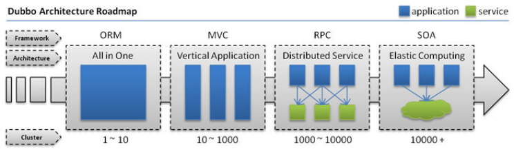

#### **单一应用架构**

当网站流量很小时，只需一个应用，将所有功能都部署在一起，以减少部署节点和成本。此时，用于简化增删改查工作量的数据访问框架(ORM)是关键。

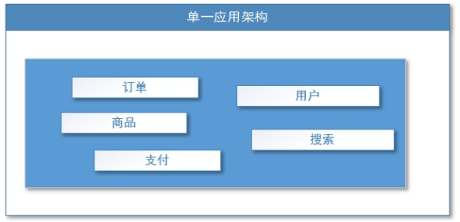 

适用于小型网站，小型管理系统，将所有功能都部署到一个功能里，简单易用。

缺点： 1、性能扩展比较难 

​    2、协同开发问题

​    3、不利于升级维护

 

#### **垂直应用架构**

当访问量逐渐增大，单一应用增加机器带来的加速度越来越小，将应用拆成互不相干的几个应用，以提升效率。此时，用于加速前端页面开发的Web框架(MVC)是关键。

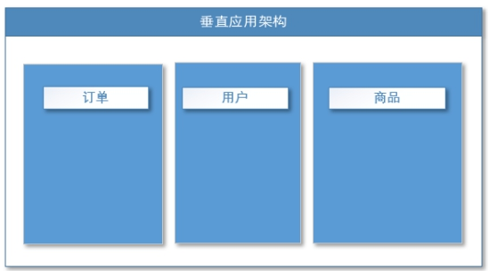 

通过切分业务来实现各个模块独立部署，降低了维护和部署的难度，团队各司其职更易管理，性能扩展也更方便，更有针对性。

缺点： 公用模块无法重复利用，开发性的浪费

#### **分布式服务架构**

当垂直应用越来越多，应用之间交互不可避免，将核心业务抽取出来，作为独立的服务，逐渐形成稳定的服务中心，使前端应用能更快速的响应多变的市场需求。此时，用于提高业务复用及整合的**分布式服务框架(RPC)**是关键。

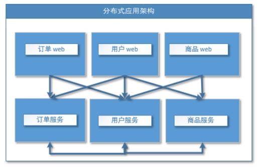 

 

#### **流动计算架构**

当服务越来越多，容量的评估，小服务资源的浪费等问题逐渐显现，此时需增加一个调度中心基于访问压力实时管理集群容量，提高集群利用率。此时，**用于提高机器利用率的资源调度和治理中心(SOA)[ Service Oriented Architecture]是关键。**

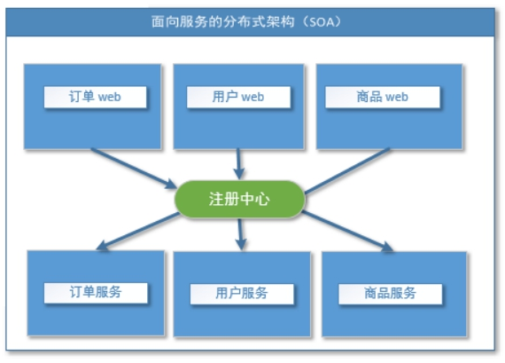 

 

 1.3）、RPC

#### **什么叫RPC**

RPC【Remote Procedure Call】是指远程过程调用，是一种进程间通信方式，他是一种技术的思想，而不是规范。它允许程序调用另一个地址空间（通常是共享网络的另一台机器上）的过程或函数，而不用程序员显式编码这个远程调用的细节。即程序员无论是调用本地的还是远程的函数，本质上编写的调用代码基本相同。

#### **RPC基本原理**

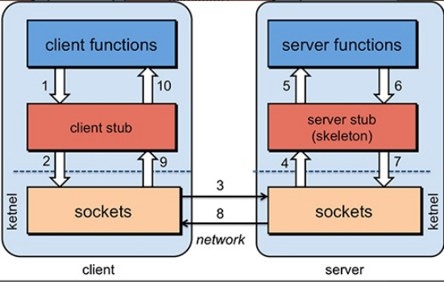 

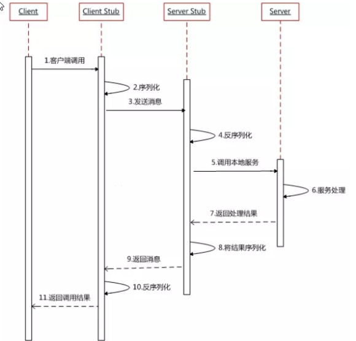 

RPC两个核心模块：通讯，序列化。

 

## 2、dubbo核心概念

### 2.1）、简介

Apache Dubbo (incubating) |ˈdʌbəʊ| 是一款高性能、轻量级的开源Java RPC框架，它提供了三大核心能力：面向接口的远程方法调用，智能容错和负载均衡，以及服务自动注册和发现。

官网：

http://dubbo.apache.org/

#### 2.2）架构

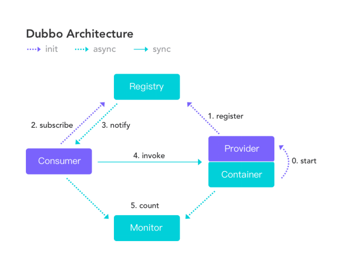

| 节点      | 角色说明                               |
| --------- | -------------------------------------- |
| Provider  | 暴露服务的服务提供方                   |
| Consumer  | 调用远程服务的服务消费方               |
| Registry  | 服务注册与发现的注册中心               |
| Monitor   | 统计服务的调用次数和调用时间的监控中心 |
| Container | 服务运行容器                           |

##### 调用关系说明

1. 服务容器负责启动，加载，运行服务提供者。
2. 服务提供者在启动时，向注册中心注册自己提供的服务。
3. 服务消费者在启动时，向注册中心订阅自己所需的服务。
4. 注册中心返回服务提供者地址列表给消费者，如果有变更，注册中心将基于长连接推送变更数据给消费者。
5. 服务消费者，从提供者地址列表中，基于软负载均衡算法，选一台提供者进行调用，如果调用失败，再选另一台调用。
6. 服务消费者和提供者，在内存中累计调用次数和调用时间，定时每分钟发送一次统计数据到监控中心。

Dubbo 架构具有以下几个特点，分别是连通性、健壮性、伸缩性、以及向未来架构的升级性。

## 连通性

- 注册中心负责服务地址的注册与查找，相当于目录服务，服务提供者和消费者只在启动时与注册中心交互，注册中心不转发请求，压力较小
- 监控中心负责统计各服务调用次数，调用时间等，统计先在内存汇总后每分钟一次发送到监控中心服务器，并以报表展示
- 服务提供者向注册中心注册其提供的服务，并汇报调用时间到监控中心，此时间不包含网络开销
- 服务消费者向注册中心获取服务提供者地址列表，并根据负载算法直接调用提供者，同时汇报调用时间到监控中心，此时间包含网络开销
- 注册中心，服务提供者，服务消费者三者之间均为长连接，监控中心除外
- 注册中心通过长连接感知服务提供者的存在，服务提供者宕机，注册中心将立即推送事件通知消费者
- 注册中心和监控中心全部宕机，不影响已运行的提供者和消费者，消费者在本地缓存了提供者列表
- 注册中心和监控中心都是可选的，服务消费者可以直连服务提供者

## 健壮性

- 监控中心宕掉不影响使用，只是丢失部分采样数据
- 数据库宕掉后，注册中心仍能通过缓存提供服务列表查询，但不能注册新服务
- 注册中心对等集群，任意一台宕掉后，将自动切换到另一台
- 注册中心全部宕掉后，服务提供者和服务消费者仍能通过本地缓存通讯
- 服务提供者无状态，任意一台宕掉后，不影响使用
- 服务提供者全部宕掉后，服务消费者应用将无法使用，并无限次重连等待服务提供者恢复

## 伸缩性

- 注册中心为对等集群，可动态增加机器部署实例，所有客户端将自动发现新的注册中心
- 服务提供者无状态，可动态增加机器部署实例，注册中心将推送新的服务提供者信息给消费者

## 升级性

当服务集群规模进一步扩大，带动IT治理结构进一步升级，需要实现动态部署，进行流动计算，现有分布式服务架构不会带来阻力。下图是未来可能的一种架构：


##### 节点角色说明

| 节点         | 角色说明                               |
| ------------ | -------------------------------------- |
| `Deployer`   | 自动部署服务的本地代理                 |
| `Repository` | 仓库用于存储服务应用发布包             |
| `Scheduler`  | 调度中心基于访问压力自动增减服务提供者 |
| `Admin`      | 统一管理控制台                         |
| `Registry`   | 服务注册与发现的注册中心               |
| `Monitor`    | 统计服务的调用次数和调用时间的监控中心 |

## 3、dubbo环境搭建

### 3.1）、【windows】-安装zookeeper

| 1、下载zookeeper网址 https://archive.apache.org/dist/zookeeper/zookeeper-3.4.13/ |
| ------------------------------------------------------------ |
| 2、解压zookeeper解压运行zkServer.cmd ，初次运行会报错，没有zoo.cfg配置文件 |
| 3、修改zoo.cfg配置文件将conf下的zoo_sample.cfg复制一份改名为zoo.cfg即可。注意几个重要位置：dataDir=./  临时数据存储的目录（可写相对路径）clientPort=2181  zookeeper的端口号修改完成后再次启动zookeeper |
| 4、使用zkCli.cmd测试ls /：列出zookeeper根下保存的所有节点create –e /atguigu 123：创建一个atguigu节点，值为123get /atguigu：获取/atguigu节点的值 |

 

### 3.2）、【windows】-安装dubbo-admin管理控制台

dubbo本身并不是一个服务软件。它其实就是一个jar包能够帮你的java程序连接到zookeeper，并利用zookeeper消费、提供服务。所以你不用在Linux上启动什么dubbo服务。

但是为了让用户更好的管理监控众多的dubbo服务，官方提供了一个可视化的监控程序，不过这个监控即使不装也不影响使用。

| 1、下载dubbo-adminhttps://github.com/apache/incubator-dubbo-ops 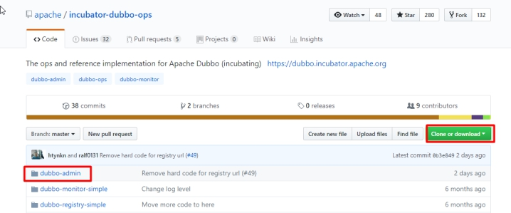 |
| ------------------------------------------------------------ |
| 2、进入目录，修改dubbo-admin配置修改 src\main\resources\application.properties 指定zookeeper地址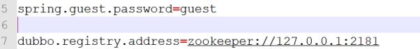 |
| 3、打包dubbo-adminmvn clean package -Dmaven.test.skip=true   |
| 4、运行dubbo-adminjava -jar dubbo-admin-0.0.1-SNAPSHOT.jar***\*注意\*******\*：【有可能控制台看着启动了，但是网页打不开，需要在控制台按下c\*******\*trl+c\*******\*即可】\****默认使用root/root 登陆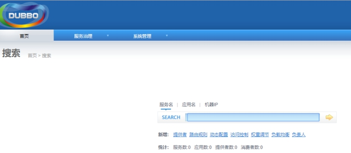 |

 

 

 **2、****安装****d****ubbo-admin**

dubbo本身并不是一个服务软件。它其实就是一个jar包能够帮你的java程序连接到zookeeper，并利用zookeeper消费、提供服务。所以你不用在Linux上启动什么dubbo服务。

但是为了让用户更好的管理监控众多的dubbo服务，官方提供了一个可视化的监控程序，不过这个监控即使不装也不影响使用。

| 1、下载dubbo-adminhttps://github.com/apache/incubator-dubbo-ops  |
| ------------------------------------------------------------ |
| 2、进入目录，修改dubbo-admin配置修改 src\main\resources\application.properties 指定zookeeper地址 |
| 3、打包dubbo-adminmvn clean package -Dmaven.test.skip=true   |
| 4、运行dubbo-adminjava -jar dubbo-admin-0.0.1-SNAPSHOT.jar默认使用root/root 登陆 |

 

 

 

 

## 4、dubbo-helloworld

### 4.1）、提出需求

某个电商系统，订单服务需要调用用户服务获取某个用户的所有地址；

我们现在 需要创建两个服务模块进行测试 

| 模块                | 功能           |
| ------------------- | -------------- |
| 订单服务web模块     | 创建订单等     |
| 用户服务service模块 | 查询用户地址等 |

测试预期结果：

​	订单服务web模块在A服务器，用户服务模块在B服务器，A可以远程调用B的功能。

### 4.2）、工程架构

根据 dubbo《服务化最佳实践》 

#### **1、分包**

建议将服务接口，服务模型，服务异常等均放在 API 包中，因为服务模型及异常也是 API 的一部分，同时，这样做也符合分包原则：重用发布等价原则(REP)，共同重用原则(CRP)。

如果需要，也可以考虑在 API 包中放置一份 spring 的引用配置，这样使用方，只需在 spring 加载过程中引用此配置即可，配置建议放在模块的包目录下，以免冲突，如：com/alibaba/china/xxx/dubbo-reference.xml。

#### **2、粒度**

服务接口尽可能大粒度，每个服务方法应代表一个功能，而不是某功能的一个步骤，否则将面临分布式事务问题，Dubbo 暂未提供分布式事务支持。

服务接口建议以业务场景为单位划分，并对相近业务做抽象，防止接口数量爆炸。

不建议使用过于抽象的通用接口，如：Map query(Map)，这样的接口没有明确语义，会给后期维护带来不便。

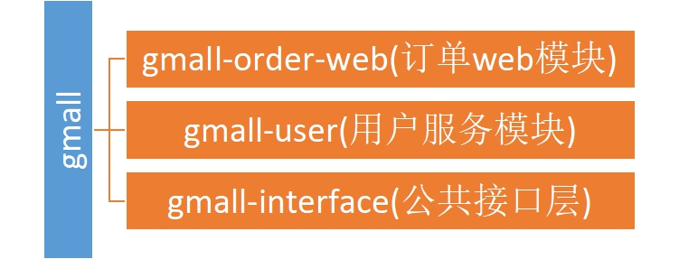 

### 4.3）、创建模块

#### 1、gmall-interface：公共接口层（model，service，exception）

作用：定义公共接口，也可以导入公共依赖

**1.Bean  用户地址：**

```java
public class UserAddress implements Serializable {
	
	private Integer id;
    private String userAddress; //用户地址
    private String userId; //用户id
    private String consignee; //收货人
    private String phoneNum; //电话号码
    private String isDefault; //是否为默认地址    Y-是     N-否
    
    public UserAddress() {
		super();
		// TODO Auto-generated constructor stub
	}
    
	public UserAddress(Integer id, String userAddress, String userId, String consignee, String phoneNum,
			String isDefault) {
		super();
		this.id = id;
		this.userAddress = userAddress;
		this.userId = userId;
		this.consignee = consignee;
		this.phoneNum = phoneNum;
		this.isDefault = isDefault;
	}
	
	public Integer getId() {
		return id;
	}
	public void setId(Integer id) {
		this.id = id;
	}
	public String getUserAddress() {
		return userAddress;
	}
	public void setUserAddress(String userAddress) {
		this.userAddress = userAddress;
	}
	public String getUserId() {
		return userId;
	}
	public void setUserId(String userId) {
		this.userId = userId;
	}
	public String getConsignee() {
		return consignee;
	}
	public void setConsignee(String consignee) {
		this.consignee = consignee;
	}
	public String getPhoneNum() {
		return phoneNum;
	}
	public void setPhoneNum(String phoneNum) {
		this.phoneNum = phoneNum;
	}
	public String getIsDefault() {
		return isDefault;
	}
	public void setIsDefault(String isDefault) {
		this.isDefault = isDefault;
	}

	@Override
	public String toString() {
		return "UserAddress{" +
				"id=" + id +
				", userAddress='" + userAddress + '\'' +
				", userId='" + userId + '\'' +
				", consignee='" + consignee + '\'' +
				", phoneNum='" + phoneNum + '\'' +
				", isDefault='" + isDefault + '\'' +
				'}';
	}
}

```

**2.Service接口**：

初始化订单

```java
public interface OrderService {
   
   /**
    * 初始化订单
    * @param userId
    */
   public List<UserAddress> initOrder(String userId);

}
```

用户服务

```java
public interface UserService {
	
	/**
	 * 按照用户id返回所有的收货地址
	 * @param userId
	 * @return
	 */
	public List<UserAddress> getUserAddressList(String userId);

}
```


#### 2、user-service-provider 用户模块

pom.xml

导入公共模块：

```
<dependency>
    <groupId>com.atguigu.gmall</groupId>
    <artifactId>gmall-interface</artifactId>
    <version>0.0.1-SNAPSHOT</version>
</dependency>
```

UserServiceImpl

```java
@Service//暴露服务 
@Component
public class UserServiceImpl implements UserService {

	@HystrixCommand
	@Override
	public List<UserAddress> getUserAddressList(String userId) {
		// TODO Auto-generated method stub
		System.out.println("UserServiceImpl..3.....");
		UserAddress address1 = new UserAddress(1, "北京市昌平区宏福科技园综合楼3层", "1", "李老师", "010-56253825", "Y");
		UserAddress address2 = new UserAddress(2, "深圳市宝安区西部硅谷大厦B座3层（深圳分校）", "1", "王老师", "010-56253825", "N");
//		try {
//			Thread.sleep(2000);
//		} catch (InterruptedException e) {
//			e.printStackTrace();
//		}
		if(Math.random()>0.5) {
			throw new RuntimeException();
		}
		return Arrays.asList(address1,address2);
	}
}
```

UserServiceImpl2

```java
public class UserServiceImpl2 implements UserService {

    @Override
    public List<UserAddress> getUserAddressList(String userId) {
        System.out.println("UserServiceImpl.....new...");
        // TODO Auto-generated method stub
        UserAddress address1 = new UserAddress(1, "北京市昌平区宏福科技园综合楼3层", "1", "李老师", "010-56253825", "Y");
        UserAddress address2 = new UserAddress(2, "深圳市宝安区西部硅谷大厦B座3层（深圳分校）", "1", "王老师", "010-56253825", "N");

        return Arrays.asList(address1,address2);
    }

}
```

config:

```java
@Configuration
public class MyDubboConfig {
   
   @Bean
   public ApplicationConfig applicationConfig() {
      ApplicationConfig applicationConfig = new ApplicationConfig();
      applicationConfig.setName("boot-user-service-provider");
      return applicationConfig;
   }
   
   //<dubbo:registry protocol="zookeeper" address="127.0.0.1:2181"></dubbo:registry>
   @Bean
   public RegistryConfig registryConfig() {
      RegistryConfig registryConfig = new RegistryConfig();
      registryConfig.setProtocol("zookeeper");
      registryConfig.setAddress("127.0.0.1:2181");
      return registryConfig;
   }
   
   //<dubbo:protocol name="dubbo" port="20882"></dubbo:protocol>
   @Bean
   public ProtocolConfig protocolConfig() {
      ProtocolConfig protocolConfig = new ProtocolConfig();
      protocolConfig.setName("dubbo");
      protocolConfig.setPort(20882);
      return protocolConfig;
   }
   
   /**
    *<dubbo:service interface="com.atguigu.gmall.service.UserService"
      ref="userServiceImpl01" timeout="1000" version="1.0.0">
      <dubbo:method name="getUserAddressList" timeout="1000"></dubbo:method>
   </dubbo:service>
    */
   @Bean
   public ServiceConfig<UserService> userServiceConfig(UserService userService){
      ServiceConfig<UserService> serviceConfig = new ServiceConfig<>();
      serviceConfig.setInterface(UserService.class);
      serviceConfig.setRef(userService);
      serviceConfig.setVersion("1.0.0");
      
      //配置每一个method的信息
      MethodConfig methodConfig = new MethodConfig();
      methodConfig.setName("getUserAddressList");
      methodConfig.setTimeout(1000);
      
      //将method的设置关联到service配置中
      List<MethodConfig> methods = new ArrayList<>();
      methods.add(methodConfig);
      serviceConfig.setMethods(methods);
      
      //ProviderConfig
      //MonitorConfig
      
      return serviceConfig;
   }

}
```

provider.xml

```xml
<?xml version="1.0" encoding="UTF-8"?>
<beans xmlns="http://www.springframework.org/schema/beans"
       xmlns:xsi="http://www.w3.org/2001/XMLSchema-instance" xmlns:dubbo="http://dubbo.apache.org/schema/dubbo"
       xsi:schemaLocation="http://www.springframework.org/schema/beans http://www.springframework.org/schema/beans/spring-beans.xsd http://dubbo.apache.org/schema/dubbo http://dubbo.apache.org/schema/dubbo/dubbo.xsd">

    <!-- 1.指定当前服务、应用的名字（同样名字相同，不要别的名字） -->
    <dubbo:application name="user-service-provider"  />

    <!-- 2.使用multicast广播注册中心暴露服务地址 -->
    <dubbo:registry address="zookeeper://127.0.0.1:2181" />
    <!--    或者
 <dubbo:registry protocol="zookeeper" address="127.0.0.1:2181" />
-->
<!--    Zookeeper 集群配置：
   <dubbo:registry address="zookeeper://10.20.153.10:2181?backup=10.20.153.11:2181,10.20.153.12:2181" />
-->
    <!--    3.指定通信规则-->
    <!-- 用dubbo协议在20880端口暴露服务 -->
    <dubbo:protocol name="dubbo" port="20882" />
    <!-- 4、暴露服务   ref：指向服务的真正的实现对象 -->
    <dubbo:service interface="com.atguigu.gmall.service.UserService"
                   ref="userServiceImpl01" timeout="1000" version="1.0.0">
        <dubbo:method name="getUserAddressList" timeout="1000"></dubbo:method>
    </dubbo:service>

    <!--统一设置服务提供方的规则  -->
    <dubbo:provider timeout="1000"></dubbo:provider>
    <!-- 服务的实现 -->
    <bean id="userServiceImpl01" class="cn.jinronga.gmall.service.impl.UserServiceImpl"></bean>

    <dubbo:service interface="com.atguigu.gmall.service.UserService"
                   ref="userServiceImpl02" timeout="1000" version="2.0.0">
        <dubbo:method name="getUserAddressList" timeout="1000"></dubbo:method>
    </dubbo:service>
    <bean id="userServiceImpl02" class="cn.jinronga.gmall.service.impl.UserServiceImpl2"></bean>

    <!-- 连接监控中心 -->
    <dubbo:monitor protocol="registry"></dubbo:monitor>
</beans>
```


Provider

```
public class Provider {
    public static void main(String[] args) throws Exception {
        ClassPathXmlApplicationContext context = new ClassPathXmlApplicationContext(new String[]{"provider.xml"});
        context.start();
        System.in.read(); // 按任意键退出
    }
}
```


#### 3、order-service-consumer订单模块：

pom.xml

导入公共模块：

```xml
    <dependency>
      <groupId>com.atguigu.gmall</groupId>
      <artifactId>gmall-interface</artifactId>
      <version>0.0.1-SNAPSHOT</version>
    </dependency>
```


OrderServiceImpl

```java
@Service
public class OrderServiceImpl implements OrderService {

   @Autowired
   UserService userService;
   @Override
   public List<UserAddress> initOrder(String userId) {
      // TODO Auto-generated method stub
      System.out.println("用户id："+userId);
      //1、查询用户的收货地址
      List<UserAddress> addressList = userService.getUserAddressList(userId);
      for (UserAddress userAddress : addressList) {
         System.out.println(userAddress.getUserAddress());
      }
      return addressList;
   }
}
```

MainApplication

```java
public class MainApplication {
   
   @SuppressWarnings("resource")
   public static void main(String[] args) throws IOException {
      ClassPathXmlApplicationContext applicationContext = new ClassPathXmlApplicationContext("consumer.xml");
      
      OrderService orderService = applicationContext.getBean(OrderService.class);
      
      orderService.initOrder("1");
      System.out.println("调用完成....");
      System.in.read();
   }

}
```

consumer.xml

```xml
<?xml version="1.0" encoding="UTF-8"?>
<beans xmlns="http://www.springframework.org/schema/beans"
       xmlns:xsi="http://www.w3.org/2001/XMLSchema-instance"
       xmlns:dubbo="http://dubbo.apache.org/schema/dubbo"
       xmlns:context="http://www.springframework.org/schema/context"
       xsi:schemaLocation="http://www.springframework.org/schema/beans http://www.springframework.org/schema/beans/spring-beans.xsd
      http://www.springframework.org/schema/context http://www.springframework.org/schema/context/spring-context-4.3.xsd
      http://dubbo.apache.org/schema/dubbo http://dubbo.apache.org/schema/dubbo/dubbo.xsd
      http://code.alibabatech.com/schema/dubbo http://code.alibabatech.com/schema/dubbo/dubbo.xsd">
    <context:component-scan base-package="cn.jinronga.gmall.service.impl"></context:component-scan>


    <dubbo:application name="order-service-consumer"></dubbo:application>

    <dubbo:registry address="zookeeper://127.0.0.1:2181"></dubbo:registry>

    <!--  配置本地存根-->

    <!--声明需要调用的远程服务的接口；生成远程服务代理  -->
    <!--
        1）、精确优先 (方法级优先，接口级次之，全局配置再次之)
        2）、消费者设置优先(如果级别一样，则消费方优先，提供方次之)
    -->
    <!-- timeout="0" 默认是1000ms-->
    <!-- retries="":重试次数，不包含第一次调用，0代表不重试-->
    <!-- 幂等（设置重试次数）【查询、删除、修改】、非幂等（不能设置重试次数）【新增】 -->
    <dubbo:reference interface="com.atguigu.gmall.service.UserService"
                     id="userService" timeout="5000" retries="3" version="*">
        <!-- <dubbo:method name="getUserAddressList" timeout="1000"></dubbo:method> -->
    </dubbo:reference>

    <!-- 配置当前消费者的统一规则：所有的服务都不检查 -->
    <dubbo:consumer check="false" timeout="5000"></dubbo:consumer>

    <dubbo:monitor protocol="registry"></dubbo:monitor>
    <!-- <dubbo:monitor address="127.0.0.1:7070"></dubbo:monitor> -->

</beans>
```

启动zookeeper dubbo-clent   dubbo-monitor-simple

运行：Provider.java ，MainApplication.java


