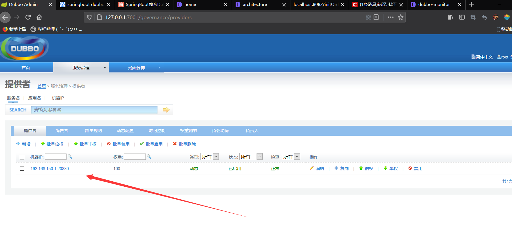
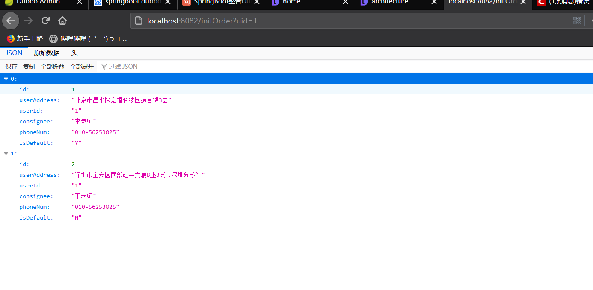

# SpringBoot整合Dubbo

## Dubbo简介

Dubbo是Alibaba开源的分布式服务框架，它最大的特点是按照分业务的架构，使用这种方式可以使各个业务之间解耦合（或者最大限度地松耦合）。

简单来说Dubbo:

1. 一款分布式服务框架
2. 高性能和透明化的RPC远程服务调用方案
3. SOA服务治理方案


**Provider**: 暴露服务的服务提供方。
 **Consumer**: 调用远程服务的服务消费方。
 **Registry**: 服务注册与发现的注册中心。
 **Monitor**: 统计服务的调用次数和调用时间的监控中心。

***调用流程\***

1. 服务容器负责启动，加载，运行服务提供者。
2. 服务提供者在启动时，向注册中心注册自己提供的服务。
3. 服务消费者在启动时，向注册中心订阅自己所需的服务。
4. 注册中心返回服务提供者地址列表给消费者，如果有变更，注册中心将基于长连接推送变更数据给消费者。
5. 服务消费者，从提供者地址列表中，基于软负载均衡算法，选一台提供者进行调用，如果调用失败，再选另一台调用。
6. 服务消费者和提供者，在内存中累计调用次数和调用时间，定时每分钟发送一次统计数据到监控中心。

## SpringBoot整合Dubbo


#### gmall-interface公共模块：

UserAddress

```java
package com.atguigu.gmall.bean;

import java.io.Serializable;

/**
 * 用户地址
 * @author lfy
 *
 */
public class UserAddress implements Serializable {
	
	private Integer id;
    private String userAddress; //用户地址
    private String userId; //用户id
    private String consignee; //收货人
    private String phoneNum; //电话号码
    private String isDefault; //是否为默认地址    Y-是     N-否
    
    public UserAddress() {
		super();
		// TODO Auto-generated constructor stub
	}
    
	public UserAddress(Integer id, String userAddress, String userId, String consignee, String phoneNum,
			String isDefault) {
		super();
		this.id = id;
		this.userAddress = userAddress;
		this.userId = userId;
		this.consignee = consignee;
		this.phoneNum = phoneNum;
		this.isDefault = isDefault;
	}
	
	public Integer getId() {
		return id;
	}
	public void setId(Integer id) {
		this.id = id;
	}
	public String getUserAddress() {
		return userAddress;
	}
	public void setUserAddress(String userAddress) {
		this.userAddress = userAddress;
	}
	public String getUserId() {
		return userId;
	}
	public void setUserId(String userId) {
		this.userId = userId;
	}
	public String getConsignee() {
		return consignee;
	}
	public void setConsignee(String consignee) {
		this.consignee = consignee;
	}
	public String getPhoneNum() {
		return phoneNum;
	}
	public void setPhoneNum(String phoneNum) {
		this.phoneNum = phoneNum;
	}
	public String getIsDefault() {
		return isDefault;
	}
	public void setIsDefault(String isDefault) {
		this.isDefault = isDefault;
	}

	@Override
	public String toString() {
		return "UserAddress{" +
				"id=" + id +
				", userAddress='" + userAddress + '\'' +
				", userId='" + userId + '\'' +
				", consignee='" + consignee + '\'' +
				", phoneNum='" + phoneNum + '\'' +
				", isDefault='" + isDefault + '\'' +
				'}';
	}
}
```

OrderService

```java
public interface OrderService {
	
	/**
	 * 初始化订单
	 * @param userId
	 */
	public List<UserAddress> initOrder(String userId);

}
```

UserService

```java
public interface OrderService {
   
   /**
    * 初始化订单
    * @param userId
    */
   public List<UserAddress> initOrder(String userId);

}
```

##### boot-user-service-provider 用户 提供方

pom.xml

```xml
<?xml version="1.0" encoding="UTF-8"?>

<project xmlns="http://maven.apache.org/POM/4.0.0" xmlns:xsi="http://www.w3.org/2001/XMLSchema-instance"
         xsi:schemaLocation="http://maven.apache.org/POM/4.0.0 http://maven.apache.org/xsd/maven-4.0.0.xsd">
    <parent>
        <groupId>org.springframework.boot</groupId>
        <artifactId>spring-boot-starter-parent</artifactId>
        <version>2.0.4.RELEASE</version>
        <relativePath /> <!-- lookup parent from repository -->
    </parent>
    <modelVersion>4.0.0</modelVersion>

    <artifactId>boot-user-service-provider</artifactId>
    <packaging>jar</packaging>

    <name>boot-user-service-provider</name>
    <!-- FIXME change it to the project's website -->
    <url>http://www.example.com</url>

    <properties>
        <project.build.sourceEncoding>UTF-8</project.build.sourceEncoding>
        <maven.compiler.source>1.8</maven.compiler.source>
        <maven.compiler.target>1.8</maven.compiler.target>
    </properties>

    <dependencies>
        <dependency>
            <groupId>org.springframework.boot</groupId>
            <artifactId>spring-boot-starter</artifactId>
        </dependency>


        <dependency>
            <groupId>com.atguigu.gmall</groupId>
            <artifactId>gmall-interface</artifactId>
            <version>0.0.1-SNAPSHOT</version>
        </dependency>
        <dependency>
            <groupId>com.alibaba.boot</groupId>
            <artifactId>dubbo-spring-boot-starter</artifactId>
            <version>0.2.0</version>
        </dependency>

        <dependency>
            <groupId>org.springframework.boot</groupId>
            <artifactId>spring-boot-starter-test</artifactId>
            <scope>test</scope>
        </dependency>


        <dependency>
            <groupId>org.springframework.cloud</groupId>
            <artifactId>
                spring-cloud-starter-netflix-hystrix
            </artifactId>
        </dependency>
    </dependencies>

    <build>
        <plugins>
            <plugin>
                <groupId>org.springframework.boot</groupId>
                <artifactId>spring-boot-maven-plugin</artifactId>
            </plugin>
        </plugins>
    </build>


    <dependencyManagement>
        <dependencies>
            <dependency>
                <groupId>org.springframework.cloud</groupId>
                <artifactId>spring-cloud-dependencies</artifactId>
                <version>Finchley.SR1</version>
                <type>pom</type>
                <scope>import</scope>
            </dependency>
        </dependencies>
    </dependencyManagement>
</project>
```

config

```java
@Configuration
public class MyDubboConfig {
   
   @Bean
   public ApplicationConfig applicationConfig() {
      ApplicationConfig applicationConfig = new ApplicationConfig();
      applicationConfig.setName("boot-user-service-provider");
      return applicationConfig;
   }
   
   //<dubbo:registry protocol="zookeeper" address="127.0.0.1:2181"></dubbo:registry>
   @Bean
   public RegistryConfig registryConfig() {
      RegistryConfig registryConfig = new RegistryConfig();
      registryConfig.setProtocol("zookeeper");
      registryConfig.setAddress("127.0.0.1:2181");
      return registryConfig;
   }
   
   //<dubbo:protocol name="dubbo" port="20882"></dubbo:protocol>
   @Bean
   public ProtocolConfig protocolConfig() {
      ProtocolConfig protocolConfig = new ProtocolConfig();
      protocolConfig.setName("dubbo");
      protocolConfig.setPort(20882);
      return protocolConfig;
   }
   
   /**
    *<dubbo:service interface="com.atguigu.gmall.service.UserService"
      ref="userServiceImpl01" timeout="1000" version="1.0.0">
      <dubbo:method name="getUserAddressList" timeout="1000"></dubbo:method>
   </dubbo:service>
    */
   @Bean
   public ServiceConfig<UserService> userServiceConfig(UserService userService){
      ServiceConfig<UserService> serviceConfig = new ServiceConfig<>();
      serviceConfig.setInterface(UserService.class);
      serviceConfig.setRef(userService);
      serviceConfig.setVersion("1.0.0");
      
      //配置每一个method的信息
      MethodConfig methodConfig = new MethodConfig();
      methodConfig.setName("getUserAddressList");
      methodConfig.setTimeout(1000);
      
      //将method的设置关联到service配置中
      List<MethodConfig> methods = new ArrayList<>();
      methods.add(methodConfig);
      serviceConfig.setMethods(methods);
      
      //ProviderConfig
      //MonitorConfig
      
      return serviceConfig;
   }

}
```

UserServiceImpl

```java
@Service//暴露服务 
@Component
public class UserServiceImpl implements UserService {

   @HystrixCommand
   @Override
   public List<UserAddress> getUserAddressList(String userId) {
      // TODO Auto-generated method stub
      System.out.println("UserServiceImpl..3.....");
      UserAddress address1 = new UserAddress(1, "北京市昌平区宏福科技园综合楼3层", "1", "李老师", "010-56253825", "Y");
      UserAddress address2 = new UserAddress(2, "深圳市宝安区西部硅谷大厦B座3层（深圳分校）", "1", "王老师", "010-56253825", "N");
//    try {
//       Thread.sleep(2000);
//    } catch (InterruptedException e) {
//       e.printStackTrace();
//    }
      if(Math.random()>0.5) {
         throw new RuntimeException();
      }
      return Arrays.asList(address1,address2);
   }

}
```

BootUserServiceProviderApplication

```java
/**
 * 1、导入依赖；
 *        1）、导入dubbo-starter
 *        2）、导入dubbo的其他依赖
 * @author lfy
 *
 * SpringBoot与dubbo整合的三种方式：
 * 1）、导入dubbo-starter，在application.properties配置属性，使用@Service【暴露服务】使用@Reference【引用服务】
 * 2）、保留dubbo xml配置文件;
 *        导入dubbo-starter，使用@ImportResource导入dubbo的配置文件即可
 * 3）、使用注解API的方式：
 *        将每一个组件手动创建到容器中,让dubbo来扫描其他的组件
 */
//@EnableDubbo //开启基于注解的dubbo功能
//@ImportResource(locations="classpath:provider.xml")
@EnableDubbo(scanBasePackages="cn.jinronga.gmall")
@EnableHystrix //开启服务容错
@SpringBootApplication
public class BootUserServiceProviderApplication {

   public static void main(String[] args) {
      SpringApplication.run(BootUserServiceProviderApplication.class, args);
   }
}
```

application.properties

```properties
dubbo.application.name=boot-user-service-provider
dubbo.registry.address=127.0.0.1:2181
dubbo.registry.protocol=zookeeper

dubbo.protocol.name=dubbo
dubbo.protocol.port=20880

#监控配置 去注册中心找地址
dubbo.monitor.protocol=registry
```

启动：BootUserServiceProviderApplication



##### boot-order-service-consumer订单 消费方：

pom.xml

```xml
<?xml version="1.0" encoding="UTF-8"?>
<project xmlns="http://maven.apache.org/POM/4.0.0" xmlns:xsi="http://www.w3.org/2001/XMLSchema-instance" xsi:schemaLocation="http://maven.apache.org/POM/4.0.0 http://maven.apache.org/maven-v4_0_0.xsd">

    <modelVersion>4.0.0</modelVersion>
    <packaging>jar</packaging>

    <name>boot-order-service-consumer</name>
    <groupId>org.example</groupId>
    <artifactId>boot-order-service-consumer</artifactId>
    <version>1.0-SNAPSHOT</version>

    <parent>
        <groupId>org.springframework.boot</groupId>
        <artifactId>spring-boot-starter-parent</artifactId>
        <version>2.0.4.RELEASE</version>
        <relativePath /> <!-- lookup parent from repository -->
    </parent>

    <properties>
        <project.build.sourceEncoding>UTF-8</project.build.sourceEncoding>
        <project.reporting.outputEncoding>UTF-8</project.reporting.outputEncoding>
        <java.version>1.8</java.version>
    </properties>

    <dependencies>
        <dependency>
            <groupId>org.springframework.boot</groupId>
            <artifactId>spring-boot-starter-web</artifactId>
        </dependency>

        <dependency>
            <groupId>com.alibaba.boot</groupId>
            <artifactId>dubbo-spring-boot-starter</artifactId>
            <version>0.2.0</version>
        </dependency>


        <dependency>
            <groupId>com.atguigu.gmall</groupId>
            <artifactId>gmall-interface</artifactId>
            <version>0.0.1-SNAPSHOT</version>
        </dependency>

        <dependency>
            <groupId>org.springframework.boot</groupId>
            <artifactId>spring-boot-starter-test</artifactId>
            <scope>test</scope>
        </dependency>

        <dependency>
            <groupId>org.springframework.cloud</groupId>
            <artifactId>
                spring-cloud-starter-netflix-hystrix
            </artifactId>
        </dependency>
    </dependencies>

    <build>
        <plugins>
            <plugin>
                <groupId>org.springframework.boot</groupId>
                <artifactId>spring-boot-maven-plugin</artifactId>
            </plugin>
        </plugins>
    </build>
    <dependencyManagement>
        <dependencies>
            <dependency>
                <groupId>org.springframework.cloud</groupId>
                <artifactId>spring-cloud-dependencies</artifactId>
                <version>Finchley.SR1</version>
                <type>pom</type>
                <scope>import</scope>
            </dependency>
        </dependencies>
    </dependencyManagement>
</project>
```

OrderServiceImpl

```
/**
 * 1、将服务提供者注册到注册中心（暴露服务）
 *        1）、导入dubbo依赖（2.6.2）\操作zookeeper的客户端(curator)
 *        2）、配置服务提供者
 * 
 * 2、让服务消费者去注册中心订阅服务提供者的服务地址
 * @author lfy
 *
 */
@Service
public class OrderServiceImpl implements OrderService {

   //@Autowired
   @Reference(loadbalance="random",timeout=1000) //dubbo直连
   UserService userService;
   
   @HystrixCommand(fallbackMethod="hello")
   @Override
   public List<UserAddress> initOrder(String userId) {
      // TODO Auto-generated method stub
      System.out.println("用户id："+userId);
      //1、查询用户的收货地址
      List<UserAddress> addressList = userService.getUserAddressList(userId);
      return addressList;
   }
   
   
   public List<UserAddress> hello(String userId) {
      // TODO Auto-generated method stub
   
      return Arrays.asList(new UserAddress(10, "测试地址", "1", "测试", "测试", "Y"));
   }
   

}
```


OrderController

```java
@Controller
public class OrderController {
   
   @Autowired
   OrderService orderService;
   
   @ResponseBody
   @RequestMapping("/initOrder")
   public List<UserAddress> initOrder(@RequestParam("uid")String userId) {
      return orderService.initOrder(userId);
   }

}
```

application.properties

```properties
server.port=8082
#注册中心配置
dubbo.application.name=boot-order-service-consumer
dubbo.registry.address=zookeeper://127.0.0.1:2181
dubbo.monitor.protocol=registry
```

启动：BootOrderServiceConsumerApplication

```java
@EnableDubbo
@EnableHystrix
@SpringBootApplication
public class BootOrderServiceConsumerApplication {

   public static void main(String[] args) {
      SpringApplication.run(BootOrderServiceConsumerApplication.class, args);
   }
}
```

访问：

```
http://localhost:8082/initOrder?uid=1
```



##### SpringBoot与dubbo整合的三种方式：

1）、导入dubbo-starter，在application.properties配置属性，使用@Service【暴露服务】使用@Reference【引用服务】
2）、保留dubbo xml配置文件;
    导入dubbo-starter，使用@ImportResource导入dubbo的配置文件即可
3）、使用注解API的方式：
   将每一个组件手动创建到容器中,让dubbo来扫描其他的组件

#### 二、高可用：

## 1、zookeeper宕机与dubbo直连

现象：zookeeper注册中心宕机，还可以消费dubbo暴露的服务。

原因：

健壮性l 监控中心宕掉不影响使用，只是丢失部分采样数据l 数据库宕掉后，注册中心仍能通过缓存提供服务列表查询，但不能注册新服务l 注册中心对等集群，任意一台宕掉后，将自动切换到另一台**l** ***\*注册中心全部宕掉后，服务提供者和服务消费者仍能通过本地缓存通讯\****l 服务提供者无状态，任意一台宕掉后，不影响使用l 服务提供者全部宕掉后，服务消费者应用将无法使用，并无限次重连等待服务提供者恢复 

高可用：通过设计，减少系统不能提供服务的时间；

## 2、集群下dubbo负载均衡配置

在集群负载均衡时，Dubbo 提供了多种均衡策略，缺省为 random 随机调用。

负载均衡策略

***\*Random LoadBalance\****随机，按权重设置随机概率。在一个截面上碰撞的概率高，但调用量越大分布越均匀，而且按概率使用权重后也比较均匀，有利于动态调整提供者权重。***\*RoundRobin LoadBalance\****轮循，按公约后的权重设置轮循比率。存在慢的提供者累积请求的问题，比如：第二台机器很慢，但没挂，当请求调到第二台时就卡在那，久而久之，所有请求都卡在调到第二台上。***\*LeastActive LoadBalance\****最少活跃调用数，相同活跃数的随机，活跃数指调用前后计数差。使慢的提供者收到更少请求，因为越慢的提供者的调用前后计数差会越大。***\*ConsistentHash LoadBalance\****一致性 Hash，相同参数的请求总是发到同一提供者。当某一台提供者挂时，原本发往该提供者的请求，基于虚拟节点，平摊到其它提供者，不会引起剧烈变动。算法参见：http://en.wikipedia.org/wiki/Consistent_hashing缺省只对第一个参数 Hash，如果要修改，请配置 <dubbo:parameter key="hash.arguments" value="0,1" />缺省用 160 份虚拟节点，如果要修改，请配置 <dubbo:parameter key="hash.nodes" value="320" />

 

## 3、整合hystrix，服务熔断与降级处理

### 1、服务降级

***\*什么是服务降级？\****

***\*当服务器压力剧增的情况下，根据实际业务情况及流量，对一些服务和页面有策略的不处理或换种简单的方式处理，从而释放服务器资源以保证核心交易正常运作或高效运作。\****

可以通过服务降级功能临时屏蔽某个出错的非关键服务，并定义降级后的返回策略。

向注册中心写入动态配置覆盖规则：


 ```java
RegistryFactory registryFactory = ExtensionLoader.getExtensionLoader(RegistryFactory.class).getAdaptiveExtension();Registry registry = registryFactory.getRegistry(URL.valueOf("zookeeper://10.20.153.10:2181"));registry.register(URL.valueOf("override://0.0.0.0/com.foo.BarService?category=configurators&dynamic=false&application=foo&mock=force:return+null"));
 ```


其中：

l mock=force:return+null 表示消费方对该服务的方法调用都直接返回 null 值，不发起远程调用。用来屏蔽不重要服务不可用时对调用方的影响。

l 还可以改为 mock=fail:return+null 表示消费方对该服务的方法调用在失败后，再返回 null 值，不抛异常。用来容忍不重要服务不稳定时对调用方的影响。

 

 

### 2、集群容错

在集群调用失败时，Dubbo 提供了多种容错方案，缺省为 failover 重试。

***\*集群容错模式\****

***\*Failover Cluster\****失败自动切换，当出现失败，重试其它服务器。通常用于读操作，但重试会带来更长延迟。可通过 retries="2" 来设置重试次数(不含第一次)。 重试次数配置如下：<dubbo:service retries="2" />或<dubbo:reference retries="2" />或<dubbo:reference>  <dubbo:method name="findFoo" retries="2" /></dubbo:reference> ***\*Failfast Cluster\****快速失败，只发起一次调用，失败立即报错。通常用于非幂等性的写操作，比如新增记录。 ***\*Failsafe Cluster\****失败安全，出现异常时，直接忽略。通常用于写入审计日志等操作。 ***\*Failback Cluster\****失败自动恢复，后台记录失败请求，定时重发。通常用于消息通知操作。 ***\*Forking Cluster\****并行调用多个服务器，只要一个成功即返回。通常用于实时性要求较高的读操作，但需要浪费更多服务资源。可通过 forks="2" 来设置最大并行数。 ***\*Broadcast Cluster\****广播调用所有提供者，逐个调用，任意一台报错则报错 [2]。通常用于通知所有提供者更新缓存或日志等本地资源信息。 ***\*集群模式配置\****按照以下示例在服务提供方和消费方配置集群模式<dubbo:service cluster="failsafe" />或<dubbo:reference cluster="failsafe" />

 

### 3、整合hystrix

Hystrix 旨在通过控制那些访问远程系统、服务和第三方库的节点，从而对延迟和故障提供更强大的容错能力。Hystrix具备拥有回退机制和断路器功能的线程和信号隔离，请求缓存和请求打包，以及监控和配置等功能

#### **1、配置spring-cloud-starter-netflix-hystrix**

spring boot官方提供了对hystrix的集成，直接在pom.xml里加入依赖：

```xml
    <dependency>      <groupId>org.springframework.cloud</groupId>      <artifactId>spring-cloud-starter-netflix-hystrix</artifactId>      <version>1.4.4.RELEASE</version>    </dependency>
```


 

然后在Application类上增加@EnableHystrix来启用hystrix starter：

@SpringBootApplication@EnableHystrixpublic class ProviderApplication { 

 

#### **2、配置Provider端**

在Dubbo的Provider上增加@HystrixCommand配置，这样子调用就会经过Hystrix代理。

```java
@Service(version = "1.0.0")public class HelloServiceImpl implements HelloService {  @HystrixCommand(commandProperties = {   @HystrixProperty(name = "circuitBreaker.requestVolumeThreshold", value = "10"),   @HystrixProperty(name = "execution.isolation.thread.timeoutInMilliseconds", value = "2000") })  @Override  public String sayHello(String name) {    // System.out.println("async provider received: " + name);    // return "annotation: hello, " + name;    throw new RuntimeException("Exception to show hystrix enabled.");  }}
```


 

#### **3、配置Consumer端**

对于Consumer端，则可以增加一层method调用，并在method上配置@HystrixCommand。当调用出错时，会走到fallbackMethod = "reliable"的调用里。

 

```java
  @Reference(version = "1.0.0")  private HelloService demoService;   @HystrixCommand(fallbackMethod = "reliable")  public String doSayHello(String name) {    return demoService.sayHello(name);  }  public String reliable(String name) {    return "hystrix fallback value";  }
```


 

 

 

 

