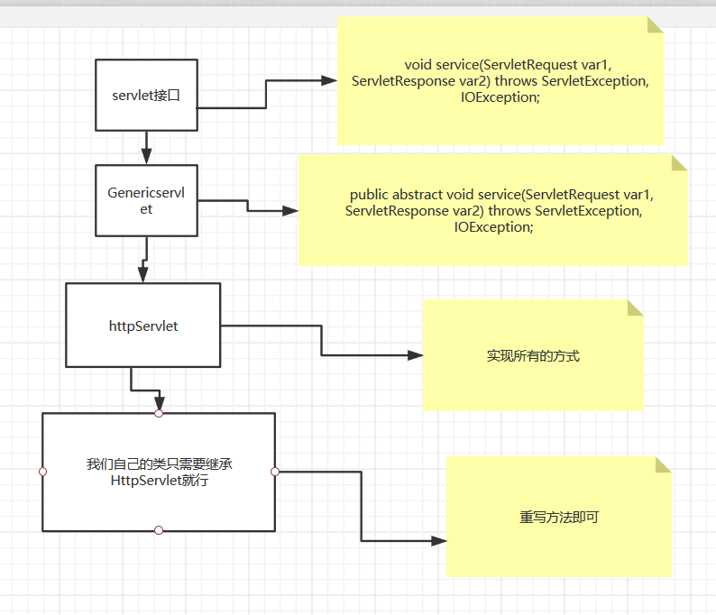

### Servlet

<hr>

#### 1.1 Servlet简介

servlet就是sun公司开发动态web的一门技术

Sun在这些API中提供一个接口叫做servlet，如果你想开发一个Servlet程序，只需要两个小的步骤：

编写一个类，实现Servlet接口

把开发好的java类部署到web服务器中。

把实现Servlet的java程序叫做servlet

#### 1.2HelloServlet

Servlet接口Sun公司有两个默认实现类：HttpServlet，GenericServlet


1.构建一个普通的Maven项目。删掉里面的src目录，以后我们的学习就在这个项目里面建立Moudel；这个空的工程就是Maven主工程；

2.关于Maven父子工程的理解：

父项目中会有

```xml
    <modules>
        <module>servlet-01</module>
    </modules>
```

子项目会有

```xml
    <parent>
        <artifactId>Maven</artifactId>
        <groupId>cn.jinronga</groupId>
        <version>1.0-SNAPSHOT</version>
    </parent>
```

父项目的java项目可以直接使用

```xml
son extends father
```



1. 编写一个普通类
2. 实现Servlet接口，这里我们直接继承HttpServlet

```java
package cn.jinronga.servlet;

import javax.servlet.ServletException;

import javax.servlet.http.HttpServlet;
import javax.servlet.http.HttpServletRequest;
import javax.servlet.http.HttpServletResponse;
import java.io.IOException;
import java.io.PrintWriter;

/**
 * Created with IntelliJ IDEA.
 * User: 郭金荣
 * Date: 2020/3/30 0030
 * Time: 14:37
 * E-mail:1460595002@qq.com
 * 类说明:
 */
public class HelloServlet extends HttpServlet {
    //由于get或者post只是请求实现的不同方式，可以相互调用，业务逻辑都是一样的
    @Override
    protected void doGet(HttpServletRequest req, HttpServletResponse resp) throws ServletException, IOException {


//        ServletOutputStream outputStream = resp.getOutputStream();
        PrintWriter writer=resp.getWriter();//响应流

        writer.print("Hello，servlet！");
    }

    @Override
    protected void doPost(HttpServletRequest req, HttpServletResponse resp) throws ServletException, IOException {
       doGet(req, resp);
    }
}

```

5.编写Servlet的映射

为什么要编写映射：

因为我们编写的是java程序，但是要通过浏览器进行访问，而浏览器需要连接web服务器，所以我们需要在web服务器中注册我们的servlet，还需要给他一个访问的路径；

```xml
           <!-- 注册servlet       -->
       <servlet>
         <servlet-name>hello</servlet-name>
         <servlet-class>cn.jinronga.servlet.HelloServlet</servlet-class>
       </servlet>

<!--  servlet的请求路劲-->
       <servlet-mapping>
         <servlet-name>hello</servlet-name>
         <url-pattern>/hello</url-pattern>
       </servlet-mapping>
```

6.配置Tomcat

注意：项目配置的路径

