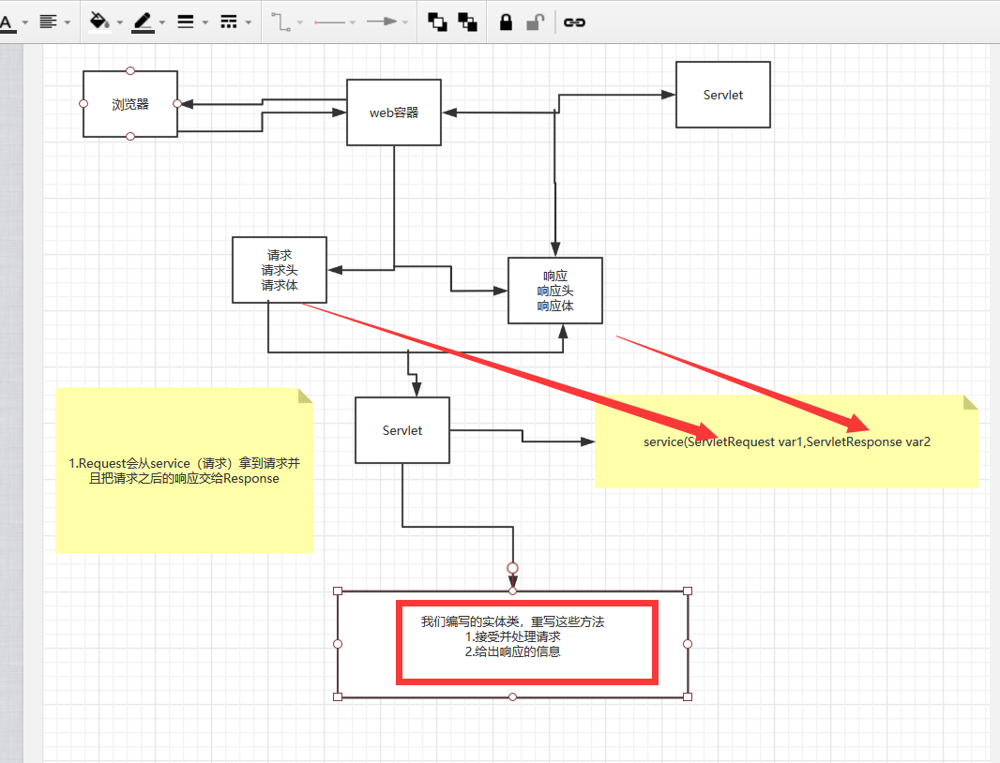
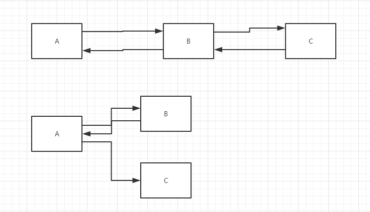
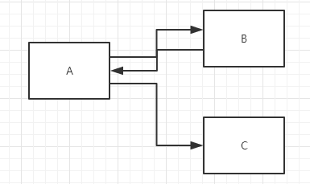

### 1.servlet原理

Servlet有web服务器调用，web服务器在收到浏览器请求之后，会：



### 2.Mapping问题

1. 一个Servlet可以指定多个映射路径

   ```xml
       <servlet-mapping>
           <servlet-name>hello</servlet-name>
           <url-pattern>/hello</url-pattern>
       </servlet-mapping>
       <servlet-mapping>
           <servlet-name>hello</servlet-name>
           <url-pattern>/hello2</url-pattern>
       </servlet-mapping>
       <servlet-mapping>
           <servlet-name>hello</servlet-name>
           <url-pattern>/hello3</url-pattern>
       </servlet-mapping>
       <servlet-mapping>
           <servlet-name>hello</servlet-name>
           <url-pattern>/hello4</url-pattern>
       </servlet-mapping>
       <servlet-mapping>
           <servlet-name>hello</servlet-name>
           <url-pattern>/hello5</url-pattern>
       </servlet-mapping>
   
   ```

2. 一个Servlet可以指定通用映射路径

   ```xml
       <servlet-mapping>
           <servlet-name>hello</servlet-name>
           <url-pattern>/hello/*</url-pattern>
       </servlet-mapping>
   ```

3. 默认请求路径

   ```xml
       <!--默认请求路径-->
       <servlet-mapping>
           <servlet-name>hello</servlet-name>
           <url-pattern>/*</url-pattern>
       </servlet-mapping>
   ```

4. 默认请求路径

   ```xml
       <!--默认请求路径-->
       <servlet-mapping>
           <servlet-name>hello</servlet-name>
           <url-pattern>/*</url-pattern>
       </servlet-mapping>
   ```

5. 指定一些后缀或者前缀等等….

   ```xml
   <!--可以自定义后缀实现请求映射
       注意点，*前面不能加项目映射的路径
       hello/sajdlkajda.qinjiang
       -->
   <servlet-mapping>
       <servlet-name>hello</servlet-name>
       <url-pattern>*.qinjiang</url-pattern>
   </servlet-mapping>
   ```

6. 优先级问题
   指定了固有的映射路径优先级最高，如果找不到就会走默认的处理请求；

   ```xml
   <!--404-->
   <servlet>
       <servlet-name>error</servlet-name>
       <servlet-class>com.kuang.servlet.ErrorServlet</servlet-class>
   </servlet>
   <servlet-mapping>
       <servlet-name>error</servlet-name>
       <url-pattern>/*</url-pattern>
   </servlet-mapping>
   
   ```

   ### 3.ServletContext

web容器在启动的时候，它会为每个web程序都创建对应的ServletContext对象，它代表了当前web应用。

#### 1、共享数据

我们这个Servlet保存数据的，可以在另一个servlet获取到

```Java
package cn.jinronga;

import javax.servlet.ServletContext;
import javax.servlet.ServletException;
import javax.servlet.http.HttpServlet;
import javax.servlet.http.HttpServletRequest;
import javax.servlet.http.HttpServletResponse;
import java.io.IOException;

/**
 * Created with IntelliJ IDEA.
 * User: 郭金荣
 * Date: 2020/3/30 0030
 * Time: 22:23
 * E-mail:1460595002@qq.com
 * 类说明:
 */
public class HelloServlet extends HttpServlet {
    @Override
    protected void doGet(HttpServletRequest req, HttpServletResponse resp) throws ServletException, IOException {

//       this.getInitParameter() //初始化参数
//        this.getServletConfig() //Servlet配置
//        this.getServletContext() //Servlet上下文
         ServletContext context = this.getServletContext();

         String name="jinrong";  //数据
         context.setAttribute("name",name);//将一个数据保存在了一个ServletContext中，名字是name 值是name

        resp.setContentType("text/html");
        resp.setCharacterEncoding("utf-8");
        System.out.println("你好");
        resp.getWriter().print("保存数据成功！");
    }
}

```

获取数据的servlet

```Java
package cn.jinronga;

import javax.servlet.ServletContext;
import javax.servlet.ServletException;
import javax.servlet.http.HttpServlet;
import javax.servlet.http.HttpServletRequest;
import javax.servlet.http.HttpServletResponse;
import java.io.IOException;

/**
 * Created with IntelliJ IDEA.
 * User: 郭金荣
 * Date: 2020/3/30 0030
 * Time: 23:12
 * E-mail:1460595002@qq.com
 * 类说明:
 */
public class GetServlet extends HttpServlet {
    @Override
    protected void doGet(HttpServletRequest req, HttpServletResponse resp) throws ServletException, IOException {

        ServletContext context = this.getServletContext();

        String name = (String) context.getAttribute("name");


        resp.setContentType("text/html");
        resp.setCharacterEncoding("utf-8");

        resp.getWriter().print("名字11："+name);

    }

    @Override
    protected void doPost(HttpServletRequest req, HttpServletResponse resp) throws ServletException, IOException {
      doGet(req,resp);
    }
}

```

xml配置：

```xml
    <servlet>
      <servlet-name>hello</servlet-name>
      <servlet-class>cn.jinronga.HelloServlet</servlet-class>
    </servlet>
   <servlet-mapping>
     <servlet-name>hello</servlet-name>
     <url-pattern>/hello</url-pattern>
   </servlet-mapping>

    <servlet>
        <servlet-name>getc</servlet-name>
        <servlet-class>cn.jinronga.GetServlet</servlet-class>
    </servlet>
    <servlet-mapping>
        <servlet-name>getc</servlet-name>
        <url-pattern>/getc</url-pattern>
    </servlet-mapping>
```

先放访问：http://localhost:8080/servlet02/hello

在访问：http://localhost:8080/servlet02/getc

### 2、获取初始化参数

```xml
<!--    配置web应用初始化参数-->
      <context-param>
          <param-name>url</param-name>
          <param-value>jdbc:mysql://localhost:3306/mybatis</param-value>
      </context-param>
```

```

    @Override
    protected void doGet(HttpServletRequest req, HttpServletResponse resp) throws ServletException, IOException {

        ServletContext context = this.getServletContext();
                  //getInitParameter();获取初始化参数
       String url = context.getInitParameter("url");


        resp.getWriter().print("url："+url);

    }
```

### 3.请求转发

```xml
   <servlet>
        <servlet-name>sd4</servlet-name>
        <servlet-class>cn.jinronga.ServletDemo04</servlet-class>
    </servlet>
    <servlet-mapping>
        <servlet-name>sd4</servlet-name>
        <url-pattern>/sd4</url-pattern>
    </servlet-mapping>
```


```Java
    @Override
    protected void doGet(HttpServletRequest req, HttpServletResponse resp) throws ServletException, IOException {

        ServletContext context = this.getServletContext();
        //请求转发到gc路径
        RequestDispatcher requestDispatcher = context.getRequestDispatcher("/gp");
          //请求转发
        requestDispatcher.forward(req,resp);//调用forward实现请求转发

    }
```



#### 4、读取资源文件

Properties

- 在java目录下新建properties
- 在resources目录下新建properties

发现：都被打包到了同一个路径下：classes，我们俗称这个路径为classpath:

思路：需要一个文件流；

```properties
username=root12312
password=zxczxczxc
```

```java
public class ServletDemo05 extends HttpServlet {
    @Override
    protected void doGet(HttpServletRequest req, HttpServletResponse resp) throws ServletException, IOException {

        InputStream is = this.getServletContext().getResourceAsStream("/WEB-INF/classes/com/kuang/servlet/aa.properties");

        Properties prop = new Properties();
        prop.load(is);
        String user = prop.getProperty("username");
        String pwd = prop.getProperty("password");

        resp.getWriter().print(user+":"+pwd);

    }

    @Override
    protected void doPost(HttpServletRequest req, HttpServletResponse resp) throws ServletException, IOException {
        doGet(req, resp);
    }
}

```

访问测试即可ok； 

### 5.HttpServletResponse

web服务器接收到客户端的http请求，针对这个请求，分别创建一个代表请求的HttpServletRequest，代表响应的一个HttpServletResponse；

- 如果要获取客户端请求过来的参数：找HttpServletRequest
- 如果要给客户端响应一些信息：找HttpServletResponse

#### 1、简单的分类

负责向浏览器发送数据的方法

```java
ServletOutputStream getOutputStream() throws IOException;
PrintWriter getWriter() throws IOException;
```

负责向浏览器发送响应头的方法

```java
    void setCharacterEncoding(String var1);

    void setContentLength(int var1);

    void setContentLengthLong(long var1);

    void setContentType(String var1);

    void setDateHeader(String var1, long var2);

    void addDateHeader(String var1, long var2);

    void setHeader(String var1, String var2);

    void addHeader(String var1, String var2);

    void setIntHeader(String var1, int var2);

    void addIntHeader(String var1, int var2);
```

响应的状态码

```java
    int SC_CONTINUE = 100;
    int SC_SWITCHING_PROTOCOLS = 101;
    int SC_OK = 200;
    int SC_CREATED = 201;
    int SC_ACCEPTED = 202;
    int SC_NON_AUTHORITATIVE_INFORMATION = 203;
    int SC_NO_CONTENT = 204;
    int SC_RESET_CONTENT = 205;
    int SC_PARTIAL_CONTENT = 206;
    int SC_MULTIPLE_CHOICES = 300;
    int SC_MOVED_PERMANENTLY = 301;
    int SC_MOVED_TEMPORARILY = 302;
    int SC_FOUND = 302;
    int SC_SEE_OTHER = 303;
    int SC_NOT_MODIFIED = 304;
    int SC_USE_PROXY = 305;
    int SC_TEMPORARY_REDIRECT = 307;
    int SC_BAD_REQUEST = 400;
    int SC_UNAUTHORIZED = 401;
    int SC_PAYMENT_REQUIRED = 402;
    int SC_FORBIDDEN = 403;
    int SC_NOT_FOUND = 404;
    int SC_METHOD_NOT_ALLOWED = 405;
    int SC_NOT_ACCEPTABLE = 406;
    int SC_PROXY_AUTHENTICATION_REQUIRED = 407;
    int SC_REQUEST_TIMEOUT = 408;
    int SC_CONFLICT = 409;
    int SC_GONE = 410;
    int SC_LENGTH_REQUIRED = 411;
    int SC_PRECONDITION_FAILED = 412;
    int SC_REQUEST_ENTITY_TOO_LARGE = 413;
    int SC_REQUEST_URI_TOO_LONG = 414;
    int SC_UNSUPPORTED_MEDIA_TYPE = 415;
    int SC_REQUESTED_RANGE_NOT_SATISFIABLE = 416;
    int SC_EXPECTATION_FAILED = 417;
    int SC_INTERNAL_SERVER_ERROR = 500;
    int SC_NOT_IMPLEMENTED = 501;
    int SC_BAD_GATEWAY = 502;
    int SC_SERVICE_UNAVAILABLE = 503;
    int SC_GATEWAY_TIMEOUT = 504;
    int SC_HTTP_VERSION_NOT_SUPPORTED = 505;
```

#### 2、下载文件

下载文件

1. 获取下载文件的路径
2. 下载的文件名是什么
3. 设置想办法让浏览器能够支持下载我们需要的东西
4. 获取下载文件的输入流
5. 创建缓存区
6. 获取OutputStream对象
7. 将FileOutputStream流写入到buffer缓冲区
8. 使用OutputStream将缓存区中的数据输出客户端！

```xml

     <servlet>
       <servlet-name>file</servlet-name>
        <servlet-class>FileResonse</servlet-class>
     </servlet>
  
   
  
    <servlet-mapping>
      <servlet-name>file</servlet-name>
      <url-pattern>/file</url-pattern>
    </servlet-mapping>
```

```
    @Override
    protected void doGet(HttpServletRequest req, HttpServletResponse resp) throws ServletException, IOException {
                // 1. 获取下载文件的路径
               String realPath="E:\\图片\\周杰伦小时候照片\\ia_700000006.png";
        System.out.println("下载问价你的路径："+realPath);
                // 2. 下载的文件名是什么
              String filename=realPath.substring(realPath.lastIndexOf("\\")+1);
                // 3.  设置想办法让浏览器能够支持(Content-Disposition)下载我们需要的东西,中文文件名URLEncoder.encode编码，否则有可能乱码
        resp.setHeader("Content-Disposition","attachment;filename="+ URLEncoder.encode(filename,"UTF-8"));

                // 4. 获取下载文件的输入流
        FileInputStream  in =new FileInputStream(realPath);
                // 5. 创建缓存区
              int len=0;
              byte[]buffer=new byte[1024];
                // 6. 获取OutputStream对象
        ServletOutputStream out=resp.getOutputStream();
                // 7. 将FileOutputStream流写入到buffer缓冲区
        while ((len=in.read(buffer))>0){
            out.write(buffer,0,len);
        }
                // 8. 使用OutputStream将缓存区中的数据输出客户端！

        in.close();
        out.close();

    }
```

#### 3.验证码的功能


验证码怎么实现的？

前端实现的

后端实现的，需要用到java图片类，生产一个图片


```xml
    <servlet>
        <servlet-name>image</servlet-name>
        <servlet-class>ImageServlet</servlet-class>
    </servlet>


    <servlet-mapping>
        <servlet-name>image</servlet-name>
        <url-pattern>/image</url-pattern>
    </servlet-mapping>
```


```java
import javax.imageio.ImageIO;
import javax.servlet.ServletException;
        import javax.servlet.http.HttpServlet;
        import javax.servlet.http.HttpServletRequest;
        import javax.servlet.http.HttpServletResponse;
        import java.awt.*;
        import java.awt.image.BufferedImage;
        import java.io.IOException;
import java.util.Random;

/**
 * Created with IntelliJ IDEA.
 * User: 郭金荣
 * Date: 2020/3/31 0031
 * Time: 20:05
 * E-mail:1460595002@qq.com
 * 类说明:
 */
public class ImageServlet extends HttpServlet {

    @Override
    protected void doGet(HttpServletRequest req, HttpServletResponse resp) throws ServletException, IOException {

        //让浏览器3秒自动刷新一次
        resp.setHeader("refresh","3");

        //在内存中创建一个图片
        BufferedImage image=new BufferedImage(80,20,BufferedImage.TYPE_INT_RGB);
        //得到图片
        Graphics2D graphics = (Graphics2D) image.getGraphics();//笔

        //设置图片的背景
        graphics.setColor(Color.white);
        graphics.fillRect(0,0,80,20);

        //给图片写数据
        graphics.setColor(Color.blue);
        //字体大小
        graphics.setFont(new Font(null,Font.BOLD,20));

        graphics.drawString(makeNum(),0,20);


        //告诉浏览器这个请求用图片的形式打开
        resp.setContentType("image/jpeg");

        //文件存在缓存，不让浏览器缓存
        resp.setDateHeader("expires",-1);
        resp.setHeader("Cache-Control","no-cache");
        resp.setHeader("Pragma","no-cache");

        //把图片写给浏览器
        ImageIO.write(image,"jpg",resp.getOutputStream());


    }
    //生成随机数
    private String makeNum(){
        Random random=new Random();

        String num = random.nextInt(9999999) + " ";

        StringBuffer sb=new StringBuffer();
        for (int i = 0; i <7-num.length() ; i++) {
            sb.append("0");

        }
        num=sb.toString()+num;
        return num;
    }
    @Override
    protected void doPost(HttpServletRequest req, HttpServletResponse resp) throws ServletException, IOException {
        doGet(req, resp);
    }
}

```

#### 4.实现重定向



B一个web资源收到客户端A请求后，B他会通知A客户端去访问另外一个web资源C，这个过程叫重定向

常见场景：

- 用户登录

```java
void sendRedirect(String var1) throws IOException;
```

测试：

```java
@Override
protected void doGet(HttpServletRequest req, HttpServletResponse resp) throws ServletException, IOException {

    /*
        resp.setHeader("Location","/r/img");
        resp.setStatus(302);
         */
    resp.sendRedirect("/r/img");//重定向
}
```


#### Servlet 的⽣命周期
1、当浏览器访问 Servlet 的时候，Tomcat 会查询当前 Servlet 的实例化对象是否存在，如果不存在，
则通过反射机制动态创建对象，如果存在，直接执⾏第 3 步。

2、调⽤ init ⽅法完成初始化操作。

3、调⽤ service ⽅法完成业务逻辑操作。

4、关闭 Tomcat 时，会调⽤ destory ⽅法，释放当前对象所占⽤的资源。

Servlet 的⽣命周期⽅法：⽆参构造函数、init、service、destory

1、⽆参构造函数只调⽤⼀次，创建对象。

2、init 只调⽤⼀次，初始化对象。

3、service 调⽤ N 次，执⾏业务⽅法。

4、destory 只调⽤⼀次，卸载对象。

面试题：请你聊聊重定向和转发的区别？

**相同点**

- 页面都会实现页面的跳转

**不同点：**

- 请求转发的时候url，不会发生变化
- 重定向的时候，url会发生变化；


### 

