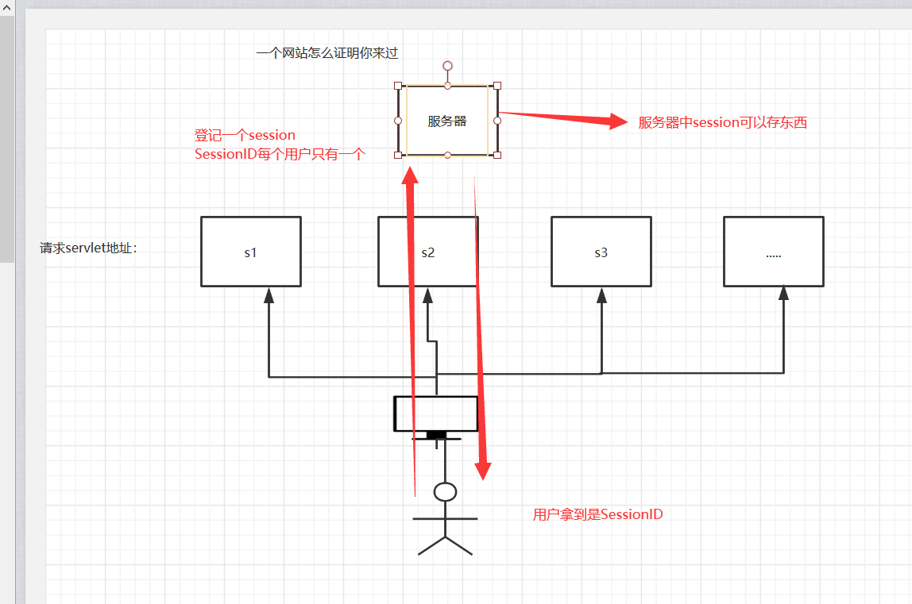

## 1、Cookie、Session

### 1.1、会话

**会话**：用户打开一个浏览器，点击了很多超链接，访问多个web资源，关闭浏览器，这个过程可以称之为会话；

**有状态会话**：一个同学来过教室，下次再来教室，我们会知道这个同学，曾经来过，称之为有状态会话；

**你能怎么证明你是西开的学生？**

你              西开

1. 发票                西开给你发票
2. 学校登记        西开标记你来过了

**一个网站，怎么证明你来过？**

客户端              服务端

1. 服务端给客户端一个 信件，客户端下次访问服务端带上信件就可以了； cookie
2. 服务器登记你来过了，下次你来的时候我来匹配你； seesion


### 1.2、保存会话的两种技术

**cookie**

- 客户端技术   （响应，请求）

**session**

- 服务器技术，利用这个技术，可以保存用户的会话信息？ 我们可以把信息或者数据放在Session中！


常见常见：网站登录之后，你下次不用再登录了，第二次访问直接就上去了！

### 1.3、Cookie


1. 从请求中拿到cookie信息
2. 服务器响应给客户端cookie

```java
Cookie[] cookies = req.getCookies(); //获得Cookie
cookie.getName(); //获得cookie中的key
cookie.getValue(); //获得cookie中的vlaue
new Cookie("lastLoginTime", System.currentTimeMillis()+""); //新建一个cookie
cookie.setMaxAge(24*60*60); //设置cookie的有效期
resp.addCookie(cookie); //响应给客户端一个cookie
```

**cookie：一般会保存在本地的 用户目录下 appdata；**


一个网站cookie是否存在上限！**聊聊细节问题**

- 一个Cookie只能保存一个信息；
- 一个web站点可以给浏览器发送多个cookie，最多存放20个cookie；
- Cookie大小有限制4kb；
- 300个cookie浏览器上限


**删除Cookie；**

- 不设置有效期，关闭浏览器，自动失效；
- 设置有效期时间为 0 ；


**编码解码：**

```java
URLEncoder.encode("秦疆","utf-8")
URLDecoder.decode(cookie.getValue(),"UTF-8")
```

### 1.4、Session（重点）


****


什么是session：服务器给每个用户（浏览器）创建一个 session对象；

一个session独占一个浏览器，只要浏览器没有关闭，这个session就存在；

用户登录之后，整个网站都可以访问！-->保存用户信息；保存购物车的功能...


使用**session**

```
package pojo;

/**
 * Created with IntelliJ IDEA.
 * User: 郭金荣
 * Date: 2020/4/1 0001
 * Time: 10:48
 * E-mail:1460595002@qq.com
 * 类说明:
 */
public class Person {

    String name;
    String gender;

    public Person(String name, String gender) {
        this.name = name;
        this.gender = gender;
    }

    public Person() {

    }


    @Override
    public String toString() {
        return "Person{" +
                "name='" + name + '\'' +
                ", gender='" + gender + '\'' +
                '}';
    }
}

```


```java
import pojo.Person;

import javax.servlet.ServletException;
import javax.servlet.http.HttpServlet;
import javax.servlet.http.HttpServletRequest;
import javax.servlet.http.HttpServletResponse;
import javax.servlet.http.HttpSession;
import java.io.IOException;

/**
 * Created with IntelliJ IDEA.
 * User: 郭金荣
 * Date: 2020/4/1 0001
 * Time: 10:17
 * E-mail:1460595002@qq.com
 * 类说明:
 */
public class SessionDemo extends HttpServlet {
    @Override
    protected void doGet(HttpServletRequest req, HttpServletResponse resp) throws ServletException, IOException {
        //解决乱码的问题
        req.setCharacterEncoding("UTF-8");
        resp.setCharacterEncoding("UTF-8");
        //浏览器支持的格式
        resp.setContentType("text/html;charset=utf-8");

          //得到session
        HttpSession session = req.getSession();

        //往serssion放东西
        session.setAttribute("name","nicai");

        //往serssion放东西
        session.setAttribute("person",new Person("金融啊","男"));

        //获取session的id
        String sessionId = session.getId();
        //判断session是否创建
        if (session.isNew()){
            resp.getWriter().print("创建session它的id是："+sessionId);
        }else {
            resp.getWriter().print("session的id是："+sessionId);
        }

        //Session创建的时候做了什么事情；
//        Cookie cookie = new Cookie("JSESSIONID",sessionId);
//        resp.addCookie(cookie);

    }

    @Override
    protected void doPost(HttpServletRequest req, HttpServletResponse resp) throws ServletException, IOException {
        doGet(req, resp);
    }
}

```

**获取Session的person**

```java
import pojo.Person;

import javax.servlet.ServletException;
import javax.servlet.http.HttpServlet;
import javax.servlet.http.HttpServletRequest;
import javax.servlet.http.HttpServletResponse;
import javax.servlet.http.HttpSession;
import java.io.IOException;

/**
 * Created with IntelliJ IDEA.
 * User: 郭金荣
 * Date: 2020/4/1 0001
 * Time: 10:47
 * E-mail:1460595002@qq.com
 * 类说明:
 */
public class SessionDemo02 extends HttpServlet {
    @Override
    protected void doGet(HttpServletRequest req, HttpServletResponse resp) throws ServletException, IOException {
        //解决乱码的问题
        req.setCharacterEncoding("UTF-8");
        resp.setCharacterEncoding("UTF-8");
        //浏览器支持的格式
        resp.setContentType("text/html;charset=utf-8");

        //得到session
         HttpSession session = req.getSession();


        //获取name
        Person person = (Person) session.getAttribute("person");

        System.out.println(person.toString());


    }

    @Override
    protected void doPost(HttpServletRequest req, HttpServletResponse resp) throws ServletException, IOException {
        doGet(req, resp);
    }
}

```

**摧毁session： ** 手动注销Session

```java
import javax.servlet.ServletException;
import javax.servlet.http.HttpServlet;
import javax.servlet.http.HttpServletRequest;
import javax.servlet.http.HttpServletResponse;
import javax.servlet.http.HttpSession;
import java.io.IOException;

/**
 * Created with IntelliJ IDEA.
 * User: 郭金荣
 * Date: 2020/4/1 0001
 * Time: 11:11
 * E-mail:1460595002@qq.com
 * 类说明:
 */
public class SessionDemo03 extends HttpServlet {

    @Override
    protected void doGet(HttpServletRequest req, HttpServletResponse resp) throws ServletException, IOException {
        //解决乱码的问题
        req.setCharacterEncoding("UTF-8");
        resp.setCharacterEncoding("UTF-8");
        //浏览器支持的格式
        resp.setContentType("text/html;charset=utf-8");

        //得到session
        HttpSession session = req.getSession();
            session.removeAttribute("person");

            //手动注销Session
            session.invalidate();


    }

    @Override
    protected void doPost(HttpServletRequest req, HttpServletResponse resp) throws ServletException, IOException {
      doGet(req, resp);
    }
}

```

**设置Session的默认失效时间**

Session会自动的过期：web.xml配置

```java
<!--    设置session默认的失效世间-->
    <session-config>
<!--        1分钟失效以分钟为单位-->
        <session-timeout>1</session-timeout>
    </session-config>
```

