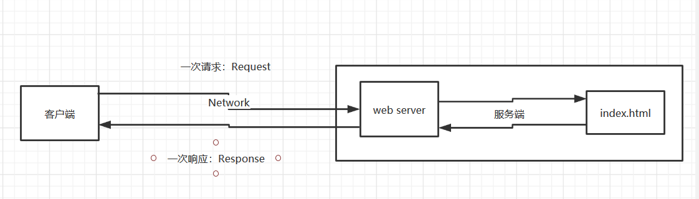
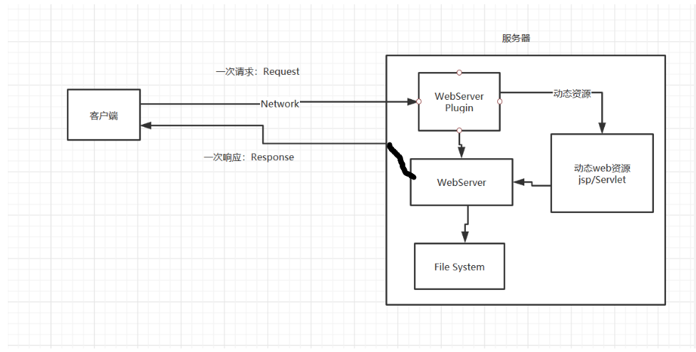
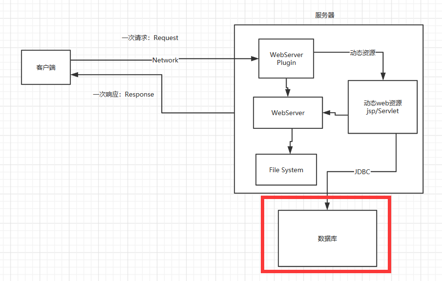
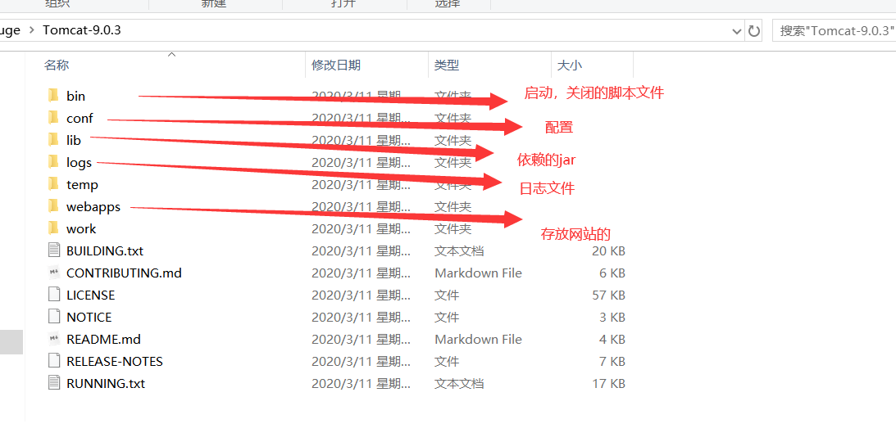
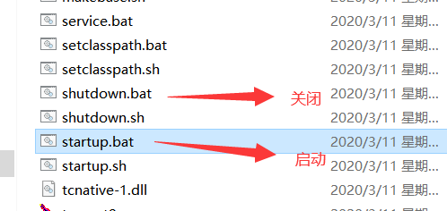
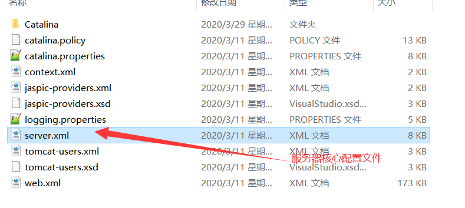
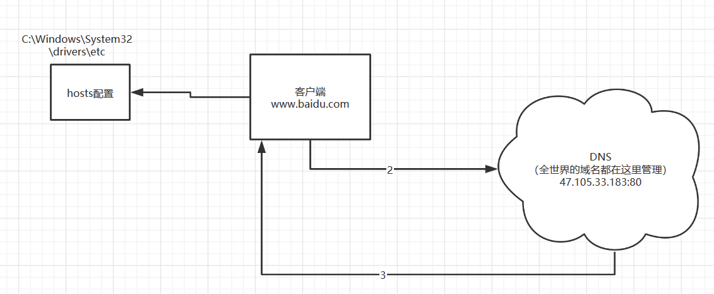

## JavaWeb

<hr>

### 1.基本概念

**web开发：**

- web，网页的意思，www.baidu.com

- 静态web

- html css


提供所有人看的**数据始终不会发生改变**！

- 动态web

- 淘宝，几乎所有的网站都是！

- 提供给所有人看的数据数据始终都会发生变化，每个人每个时间段不同的数据，不同地点看到的信息各不一样！
- 技术栈:Servlet/jsp,asp,php等

在java中，动态web资源开发的技术统称为javaweb；

#### 1.2web应用程序

- web应用程序：可以提供浏览器访问的程序
- a.html、b.html...多个web资源，这些web资源可以被外键访问，对外界提供服务；
- 我们能访问到的任何一个页面或者资源，都存在于这个时间的某一角落的计算机上。
- URL
- 这个统一的web资源都会放在统一文件夹下，web应用程序--->Tomcat:服务器
- 一个web应用有多个部分组成（静态web、动态web）

1. html,css,js
2. **jsp,servlet**
3. java程序
4. jar包
5. 配置文件(properties)


web应用编写完之后，若让外界访问：需要一个服务器来统一管理

#### 1.3、静态web

- *.htm、*html,这些都是网页的后缀，如果服务器上一直存在这些东西，我们就可以读取。联络；

  

- #### 静态web存在的缺点

  1.Web页面无法动态更新，所有用户看到都是同一个页面

  轮播图，点击特效：伪动态

  javascript [实际开发运用最多]

​      VBscript    

​      2.无法跟数据库交互（数据无法持久化，用户无法交互）

### 1.4.动态web

页面会动态展示：



缺点：

加入服务器的动态web资源出现了错误，我们需要重新编写我们的**后台程序**，重新发布

停机维护

优点：

- 1.Web页面可以动态更新，所有用户看到的都不是同一个页面

​      2.可以跟数据库交互

​     3.它可以与数据库交互（数据持久化：注册，商品信息，用户信息......）



分析原理，看源码。

### 2.web服务器

##### 2.1技术讲解

- ASP:
- 微软：国内最早流行的就是asp；
- 在HTML中嵌入了VB的脚本，ASP+COM;
- 在ASP开发中，基本一个页面都有几千行代码，页面及其混乱
- 维护成本高！
- IIS


php

PHP开发速度很快（python更快），功能强大，跨平台，代码简单（70%，WP）

无法承载大访问量的情况（局限）


jsp/Servlet：

B/S：浏览器和服务器

C/S:客户端跟服务器

- sun公司主推的B/S架构
- 基于java语言的（所有打公司，或者一些开源的组件，都是java写的）
- 可以承载三高问题带来的影响；
- 语法想ASP. ASP-->JSP.加强市场强度


#### 2.2web服务器


服务器是一种被动的操作，用来处理用户的一些请求给用户响应的信息


**IIS**

微软的；ASP....windows自带


### **3.Tomcat**


#### 3.1面向百度编程：

Tomcat是Apache 软件基金会（Apache Software Foundation）的Jakarta 项目中的一个核心项目，最新的Servlet 和JSP 规范总是能在Tomcat  中得到体现，因为Tomcat  技术先进、性能稳定，而且**免费**，因而深受Java 爱好者的喜爱并得到了部分软件开发商的认可，成为目前比较流行的Web 应用服务器。

Tomcat 服务器是一个免费的开放源代码的Web 应用服务器，属于轻量级应用[服务器](https://baike.baidu.com/item/服务器)，在中小型系统和并发访问用户不是很多的场合下被普遍使用，是开发和调试JSP 程序的首选。对于一个java初学web的人来说，它是最佳可选

Tomcat 实际上运行JSP 页面和Servlet。


**工作3-5年之后，可以尝试手写Tomcat服务器：**

1. 下载Tomcat：
2. 安装or解压
3. 了解配置文件及目录结构
4. 这个东西的作用

#### 3.2 Tomcat的配置信息：



启动，关闭tomcat



访问地址：http://localhost:8080/

可能遇到的问题：

1.java环境变量没有配置

2.闪退问题（环境不兼容）

3.乱码问题：配置文件

### 3.3配置



可以配置启动的端口号

Tomcat默认端口号8080

```xml
    <Connector port="8080" protocol="HTTP/1.1"
               connectionTimeout="20000"
               redirectPort="8443" />
```

可以配置主机名字

默认主机的名为：localhost =127.0.0.1

默认网站应用存放的位置为：webapps

```xml
    <Host name="localhost"  appBase="webapps"
            unpackWARs="true" autoDeploy="true">

```

### 高难度面试题：

**请你谈谈网站是如何进行访问的！**

1.输入域名

2.检查本机C:\Windows\System32\drivers\etc\hosts配置有没有这个域名的映射

​         1.有：直接返回对应的ip地址

```
127.0.0.1       localhost
```

​         2.没有去DNS服务器进行访问，找到就返回，找不到就返回找不到




4.可以配置环境变量

### 3.4发布一个web网站

不会就模仿

将自己写的网站，放到服务器上（Tomcat）中指定的Web应用的文件夹(webapps)下，就可以了

网站应该有的结构

```java
--webapss:Tomcat服务器web目录
     --ROOT
     --myDemo：网站的，目录名
         -classes：Java程序
         -web应用所依赖的jar包
         -web.xml:网站配置文件
         -index.html 默认的首页
         -static
             -css
                 -style.css
             -js
             -img
```

