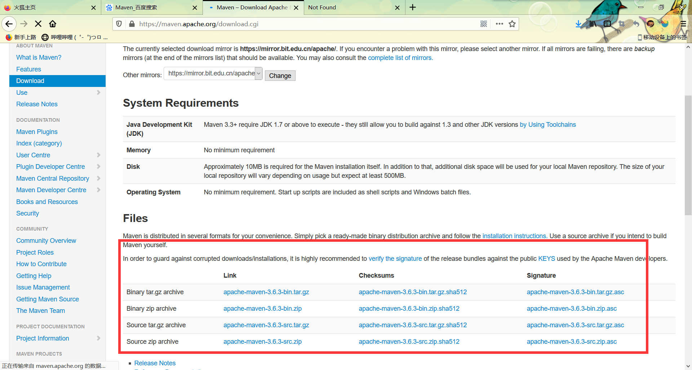
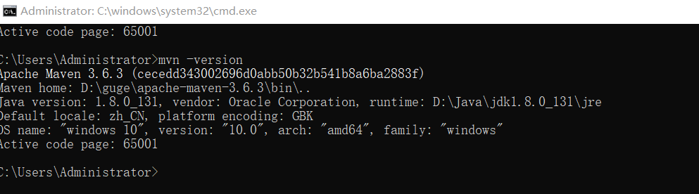
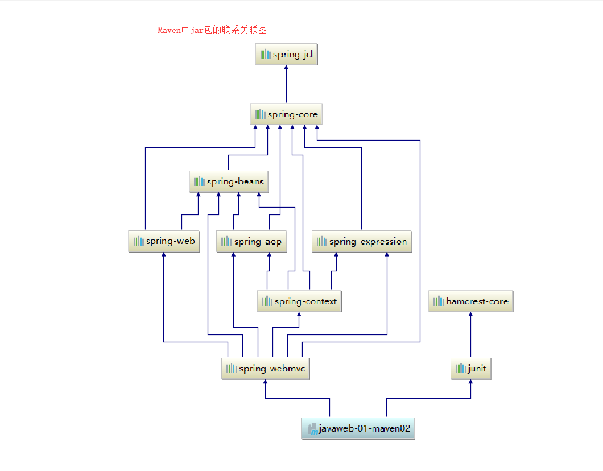

### Maven：

1.在javaweb开发中，需要使用大量的jar包，我们手动导入；

2.如何能够让一个东西自动帮我们导入和配置这个jar包。

由此，Maven诞生了！

### 1.1Maven项目架构的管理工具

我们目前用来就是方便导入jar包的！

Maven的核心思想：**约定大于配置**

有约束，不要去违反。

Maven会规定好你如何去编写我们的Java代码。必须安照这个规范来

https://maven.apache.org/download.cgi



下载完成后解压即可；

建议：电脑上所有的环境放在一个文件夹下，方便管理；

#### 5.3配置环境变量

M2_HOME   maven目录下的bin目录

MAVEN_HAME   maven的目录

在系统path中配置%

测试Mavenue是否成功，保证必须配置完毕！

#### 5.4阿里云镜像

镜像：mirrors

作用加速我们的下载

国内建议使用阿里云的镜像

```xml
<mirror>
    <id>nexus-aliyun</id>  
    <mirrorOf>*,!jeecg,!jeecg-snapshots</mirrorOf>  
    <name>Nexus aliyun</name>  
    <url>http://maven.aliyun.com/nexus/content/groups/public</url> 
</mirror>
```

#### 5.5本地仓库

在本地的仓库，远程仓库；

**建立一个仓库：** localRepository 

```xml
   <localRepository>D:\guge\repository</localRepository>
```


#### Maven项目的pom.xml文件：

```xml
<?xml version="1.0" encoding="UTF-8"?>
<!--Maven版本和版本号-->
<project xmlns="http://maven.apache.org/POM/4.0.0" xmlns:xsi="http://www.w3.org/2001/XMLSchema-instance"
  xsi:schemaLocation="http://maven.apache.org/POM/4.0.0 http://maven.apache.org/xsd/maven-4.0.0.xsd">
  <modelVersion>4.0.0</modelVersion>

      <!--这里是我们配置的GAV  -->
  <groupId>cn.jinronga</groupId>
  <artifactId>Maven</artifactId>
  <version>1.0-SNAPSHOT</version>
<!--  package:项目打包方式
 jar：java应用
 war：javaweb应用
-->
  <packaging>war</packaging>

<!--配置-->
  <properties>
<!--    项目的默认构建编码-->
    <project.build.sourceEncoding>UTF-8</project.build.sourceEncoding>
<!--    编码版本-->
    <maven.compiler.source>1.8</maven.compiler.source>
    <maven.compiler.target>1.8</maven.compiler.target>
  </properties>
<!--   项目依赖-->
  <dependencies>
<!--    具体依赖的jar包配置文件-->
    <dependency>
      <groupId>junit</groupId>
      <artifactId>junit</artifactId>
      <version>4.11</version>
      <scope>test</scope>
    </dependency>
  </dependencies>

<!--  项目构建要用的东西-->
  <build>
    <finalName>Maven</finalName>
    <pluginManagement><!-- lock down plugins versions to avoid using Maven defaults (may be moved to parent pom) -->
      <plugins>
        <plugin>
          <artifactId>maven-clean-plugin</artifactId>
          <version>3.1.0</version>
        </plugin>
        <!-- see http://maven.apache.org/ref/current/maven-core/default-bindings.html#Plugin_bindings_for_war_packaging -->
        <plugin>
          <artifactId>maven-resources-plugin</artifactId>
          <version>3.0.2</version>
        </plugin>
        <plugin>
          <artifactId>maven-compiler-plugin</artifactId>
          <version>3.8.0</version>
        </plugin>
        <plugin>
          <artifactId>maven-surefire-plugin</artifactId>
          <version>2.22.1</version>
        </plugin>
        <plugin>
          <artifactId>maven-war-plugin</artifactId>
          <version>3.2.2</version>
        </plugin>
        <plugin>
          <artifactId>maven-install-plugin</artifactId>
          <version>2.5.2</version>
        </plugin>
        <plugin>
          <artifactId>maven-deploy-plugin</artifactId>
          <version>2.8.2</version>
        </plugin>
      </plugins>
    </pluginManagement>
  </build>
</project>

```

maven由于他的约定大于配置，我们之后可以能遇到我们写的配置文件，无法被导出或者生效的问题，解决方案：

```xml
<!--在build中配置resources，来防止我们资源导出失败的问题-->
<build>
    <resources>
        <resource>
            <directory>src/main/resources</directory>
            <includes>
                <include>**/*.properties</include>
                <include>**/*.xml</include>
            </includes>
            <filtering>true</filtering>
        </resource>
        <resource>
            <directory>src/main/java</directory>
            <includes>
                <include>**/*.properties</include>
                <include>**/*.xml</include>
            </includes>
            <filtering>true</filtering>
        </resource>
    </resources>
</build>
```



Maven仓库的使用

地址：https://mvnrepository.com/

