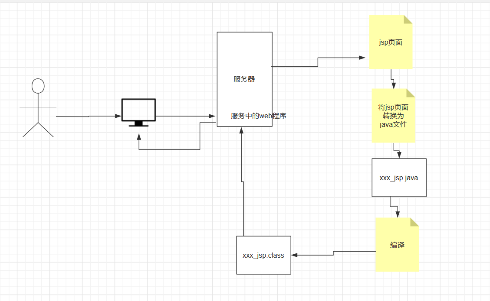
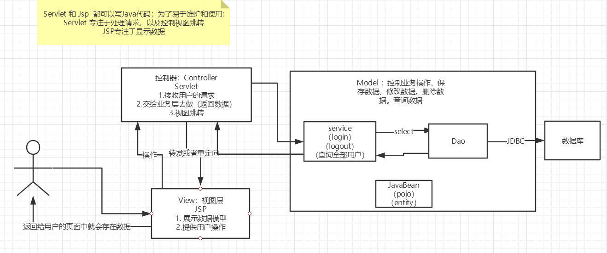

### 1.jsp

1.1、什么是jsp

Java   Server  Pages：Java服务器页面，也和Servlet一样，用于动态web技术！

最大的特点：

写jsp就像写html

区别：

Html只给用户提供静态的页面数据

Jsp页面可以嵌入JAVA代码，为用户提供动态的数据；


### 1.2、Jsp原理

思路:JSP到底是怎么运行的！

服务器内部工作

Tomcat有个work目录；

IDEA使用Tomcat的会在IDEA的tomcat生产一个work目录


发现页面转变成了Java程序！


**浏览器想服务器发送 请求不管什么请求什么资源，都是访问servlet！**

Jsp最终也会转换成为一个java类

**Jsp本质上就是servlet**

```
//初始化
  public void _jspInit() {
      
  }
//销毁
  public void _jspDestroy() {
  }
//JSPService
  public void _jspService(.HttpServletRequest request,HttpServletResponse response)
```

1.判断请求

#### 内置一些对象（jsp九大内置对象）

```java
final javax.servlet.jsp.PageContext pageContext;  //页面上下文
javax.servlet.http.HttpSession session = null;    //session
final javax.servlet.ServletContext application;   //applicationContext
final javax.servlet.ServletConfig config;         //config
javax.servlet.jsp.JspWriter out = null;           //out
final java.lang.Object page = this;               //page：当前
HttpServletRequest request                        //请求
HttpServletResponse response                      //响应
```

2.输出页面前增加的代码

```java
response.setContentType("text/html");       //设置响应的页面类型
pageContext = _jspxFactory.getPageContext(this, request, response,
                                          null, true, 8192, true);
_jspx_page_context = pageContext;
application = pageContext.getServletContext();
config = pageContext.getServletConfig();
session = pageContext.getSession();
out = pageContext.getOut();
_jspx_out = out;
```

3.以上的这些对象我们可以在jsp页面中直接访问使用！

****


在JSP页面中；

只要是 JAVA代码就会原封不动的输出；

如果是HTML代码，就会被转换为：

```java
out.write("<html>\r\n");
```

这样的格式，输出到前端！

### 1.3Jsp基础语法

任何语言都有自己的语法，JAVA中有,。 JSP 作为java技术的一种应用，它拥有一些自己扩充的语法（了解，知道即可！），Java所有语法都支持！

#### **JSP表达式**

```jsp
  <%--JSP表达式
  作用：用来将程序的输出，输出到客户端
  <%= 变量或者表达式%>
  --%>
  <%= new java.util.Date()%>
```


#### **jsp脚本片段**

```jsp
  <%--jsp脚本片段--%>
  <%
    int sum = 0;
    for (int i = 1; i <=100 ; i++) {
      sum+=i;
    }
    out.println("<h1>Sum="+sum+"</h1>");
  %>

```


**脚本片段的再实现**

```jsp
  <%
    int x = 10;
    out.println(x);
  %>
  <p>这是一个JSP文档</p>
  <%
    int y = 2;
    out.println(y);
  %>

  <hr>


  <%--在代码嵌入HTML元素--%>
  <%
    for (int i = 0; i < 5; i++) {
  %>
    <h1>Hello,World  <%=i%> </h1>
  <%
    }
  %>
```


#### JSP声明

```jsp
  <%!
    static {
      System.out.println("Loading Servlet!");
    }

    private int globalVar = 0;

    public void kuang(){
      System.out.println("进入了方法Kuang！");
    }
  %>
```


JSP声明：会被编译到JSP生成Java的类中！其他的，就会被生成到_jspService方法中！

在JSP，嵌入Java代码即可！

```jsp
<%%>
<%=%>
<%!%>

<%--注释--%>
```

JSP的注释，不会在客户端显示，HTML就会！


### 1.4、JSP指令

```jsp
<%@page args.... %>
<%@include file=""%>

<%--@include会将两个页面合二为一--%>

<%@include file="common/header.jsp"%>
<h1>网页主体</h1>

<%@include file="common/footer.jsp"%>

<hr>


<%--jSP标签
    jsp:include：拼接页面，本质还是三个
    --%>
<jsp:include page="/common/header.jsp"/>
<h1>网页主体</h1>
<jsp:include page="/common/footer.jsp"/>

```


### 1.5、9大内置对象

- PageContext    存东西
- Request     存东西
- Response
- Session      存东西
- Application   【SerlvetContext】   存东西
- config    【SerlvetConfig】
- out
- page ，不用了解
- exception

#### ⽹站访问量统计

```java
<%
 Integer count = (Integer) application.getAttribute("count");
 if(count == null){
 count = 1;
 application.setAttribute("count",count);
 }else{
 count++;
 application.setAttribute("count",count);
 }
%>
您是当前的第<%=count%>位访客
```

```java
pageContext.setAttribute("name1","金融1号"); //保存的数据只在一个页面中有效
request.setAttribute("name2","金融2号"); //保存的数据只在一次请求中有效，请求转发会携带这个数据
session.setAttribute("name3","金融3号"); //保存的数据只在一次会话中有效，从打开浏览器到关闭浏览器
application.setAttribute("name4","金融4号");  //保存的数据只在服务器中有效，从打开服务器到关闭服务器
```

request：客户端向服务器发送请求，产生的数据，用户看完就没用了，比如：新闻，用户看完没用的！

session：客户端向服务器发送请求，产生的数据，用户用完一会还有用，比如：购物车；

application：客户端向服务器发送请求，产生的数据，一个用户用完了，其他用户还可能使用，比如：聊天数据；

### 1.6、JSP标签、JSTL标签、EL表达式

```xml
<!-- JSTL表达式的依赖 -->
<dependency>
    <groupId>javax.servlet.jsp.jstl</groupId>
    <artifactId>jstl-api</artifactId>
    <version>1.2</version>
</dependency>
<!-- standard标签库 -->
<dependency>
    <groupId>taglibs</groupId>
    <artifactId>standard</artifactId>
    <version>1.1.2</version>
</dependency>

```
### EL 表达式
Expression Language 表达式语⾔，替代 JSP ⻚⾯中数据访问时的复杂编码，可以⾮常便捷地取出域对
象（pageContext、request、session、application）中保存的数据，前提是⼀定要先 setAttribute，
EL 就相当于在简化 getAttribute

${变量名} 变量名就是 setAttribute 对应的 key 值。

1、EL 对于 4 种域对象的默认查找顺序：
pageContext -》request-〉session-》application

按照上述的顺序进⾏查找，找到⽴即返回，在 application 中也⽆法找到，则返回 null

EL表达式：  ${ }

pageContext：${pageScope.name}

request：${requestScope.name}

session：${sessionScope.name}

application：${applicationScope.name}数据级联

数据级联：

```java
<%
// pageContext.setAttribute("name","page");
// request.setAttribute("name","request");
// session.setAttribute("name","session");
// application.setAttribute("name","application");
 User user = new User(1,"张三",86.5,new Address(1,"⼩寨"));
 System.out.println(user.toString());
 pageContext.setAttribute("user",user);
 %>
 <table>
 <tr>
 <th>编号</th>
 <th>姓名</th>
 <th>成绩</th>
 <th>地址</th>
 </tr>
 <tr>
 <td>${user.id}</td>
 <td>${user.name}</td>
 <td>${user.score}</td>
 <td>${user.address}</td>
 </tr>
 </table>
```
#### EL 执⾏表达式:

```jsp
${num1&&num2}
&& || ! < > <= <= ==
&& and
|| or
! not
== eq
!= ne
< lt
> gt
<= le
>= ge
empty 变量为 null，⻓度为0的String，size为0的集合
```

- **获取数据**
- **执行运算**
- **获取web开发的常用对象**


**JSP标签**

```jsp
<%--jsp:include--%>

<%--
http://localhost:8080/jsptag.jsp?name=kuangshen&age=12
--%>

<jsp:forward page="/jsptag2.jsp">
    <jsp:param name="name" value="kuangshen"></jsp:param>
    <jsp:param name="age" value="12"></jsp:param>
</jsp:forward>
```


**JSTL表达式**

JSTL标签库的使用就是为了弥补HTML标签的不足；它自定义许多标签，可以供我们使用，标签的功能和Java代码一样！
JSP Standard Tag Library JSP 标准标签库，JSP 为开发者提供的⼀系列的标签，使⽤这些标签可以完成⼀些逻辑处理，⽐如循环遍历集合，让代码更加简洁，不再出现 JSP 脚本穿插的情况。实际开发中 EL 和 JSTL 结合起来使⽤，JSTL 侧重于逻辑处理，EL 负责展示数据。
**格式化标签**

**SQL标签**

**XML 标签**

**核心标签** （掌握部分）


**JSTL标签库使用步骤**

- 引入对应的 taglib
```jsp
<%@ taglib prefix="c" uri="http://java.sun.com/jsp/jstl/core" %>
```
- 使用其中的方法
- **在Tomcat 也需要引入 jstl的包，否则会报错：JSTL解析错误**

c：if

```jsp
<head>
    <title>Title</title>
</head>
<body>


<h4>if测试</h4>

<hr>

<form action="coreif.jsp" method="get">
    <%--
    EL表达式获取表单中的数据
    ${param.参数名}
    --%>
    <input type="text" name="username" value="${param.username}">
    <input type="submit" value="登录">
</form>

<%--判断如果提交的用户名是管理员，则登录成功--%>
<c:if test="${param.username=='admin'}" var="isAdmin">
    <c:out value="管理员欢迎您！"/>
</c:if>

<%--自闭合标签--%>
<c:out value="${isAdmin}"/>

</body>
```

c:choose   c:when

```jsp
<body>

<%--定义一个变量score，值为85--%>
<c:set var="score" value="55"/>

<c:choose>
    <c:when test="${score>=90}">
        你的成绩为优秀
    </c:when>
    <c:when test="${score>=80}">
        你的成绩为一般
    </c:when>
    <c:when test="${score>=70}">
        你的成绩为良好
    </c:when>
    <c:when test="${score<=60}">
        你的成绩为不及格
    </c:when>
</c:choose>

</body>
```

c:forEach

```jsp
<%

    ArrayList<String> people = new ArrayList<>();
    people.add(0,"张三");
    people.add(1,"李四");
    people.add(2,"王五");
    people.add(3,"赵六");
    people.add(4,"田六");
    request.setAttribute("list",people);
%>


<%--
var , 每一次遍历出来的变量
items, 要遍历的对象
begin,   哪里开始
end,     到哪里
step,   步长
--%>
<c:forEach var="people" items="${list}">
    <c:out value="${people}"/> <br>
</c:forEach>

<c:forEach items="${list}" var="user">
 <tr>
 <td>${user.id}</td>
 <td>${user.name}</td>
 <td>${user.score}</td>
 <td>${user.address.value}</td>
 </tr>
</c:forEach>
<hr>

<c:forEach var="people" items="${list}" begin="1" end="3" step="1" >
    <c:out value="${people}"/> <br>
</c:forEach>

```
JSTL 优点：

1、提供了统⼀的标签

2、可以⽤于编写各种动态功能


## 2、JavaBean

实体类

javaBean有特定的写法

必须有一个无参构造

必须属性私有化

必须有对应的get/set方法；

一般用来和数据库的字段做映射ORM;

ORM:对象关系映射

表----类

字段--属性名

行记录---对象

**people表：**

| id   | name    | age  | address |
| ---- | ------- | ---- | ------- |
| 1    | 金融1号 | 1    | 江西    |
| 2    | 金融2号 | 20   | 江西    |
| 3    | 金融3号 | 100  | 江西    |

```
class people{
    private int id;
    private String name;
    private int id;
    private String address;

}

Class A{
       new People(1,"秦疆1号",3，"西安");
       new People(2,"秦疆2号",3，"西安");
       new People(3,"秦疆3号",3，"西安");   
}
```

### 2.2、MVC三层架构




Model

- 业务处理 ：业务逻辑（Service）
- 数据持久层：CRUD   （Dao）

View

- 展示数据
- 提供链接发起Servlet请求 （a，form，img…）

Controller  （Servlet）

- 接收用户的请求 ：（req：请求参数、Session信息….）

- 交给业务层处理对应的代码 

- 控制视图的跳转  

  ```java
  登录--->接收用户的登录请求--->处理用户的请求（获取用户登录的参数，username，password）---->交给业务层处理登录业务（判断用户名密码是否正确：事务）--->Dao层查询用户名和密码是否正确-->数据库
  ```

