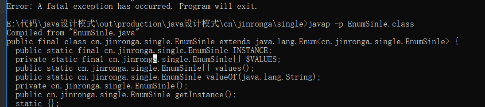

###  单例设计模式

**单例模式**（Singleton Pattern）是java最简单的设计者模式之一，这种设计模式属于创建型模式，它提供了创建对象最佳的方式，在JVM|中只有一个实例存在 


#### 饿汉式设计模式：

这种方式比较常用但是容易产生垃圾
**优点：**没有加锁执行效率会提高
**缺点：**类加载时就进行初始化，浪费内存。
它基于classloader机制避免了多线程同步的问题在单例模式中大多数都是调用 gian 方法， 但是也不能确定有其他的方式（或者其他的静态方法）导致类装载，这时候初始化 giantDragon 显然没有达到 lazy loading 的效果。

```java
public class Hungry {
    //可能会浪费空间
    private byte[] date1=new byte[1024*1024];
    private byte[] date2=new byte[1024*1024];
    private byte[] date3=new byte[1024*1024];
    private byte[] date4=new byte[1024*1024];
    //构造方法私有化
    private Hungry(){

    }
    //对象私有化
    private final static Hungry hungry=new Hungry();

    //提供对外调用的方法
    public static Hungry getInstance(){

        return hungry;
    }

}
```

#### 1.懒汉式1，多线程下线程不安全

调用的时候就将实例进行初始化
这种方式是最基本的实现方式，这种实现最大的问题就是不支持多线程。因为没有加锁 synchronized，所以严格意义上它并不算单例模式。
这种方式 lazy loading 很明显，不要求线程安全，在多线程不能正常工作。

```java
public class LazyMan {

    private LazyMan(){

    }

    //对象私有化
    private static LazyMan lazyMan;
    //当时使用的时候进行初始化减少资源的浪费
    public static LazyMan getLazyMan(){

        if (lazyMan==null){
            lazyMan=new LazyMan();
        }
        return lazyMan;
    }
}
```

#### 懒汉式2，给它加锁（双重监测模式）

加锁：双重进行判断：synchronized

**注意**volatile关键字的作用，保证了变量的可见性（visibility）。被volatile修饰的变量，如果值发生变化，其他线程立马可见避免脏读的现象

```java
public class LazyMan {


    private LazyMan(){

    }

    //volatile关键字的作用，保证了变量的可见性（visibility）。被volatile修饰的变量，如果值发生变化，其他线程立马可见避免脏读的现象
    private volatile static LazyMan lazyMan;//保证同一个原子性操作


    //双重监测锁模式的懒汉式 单例 DCL单例模式
    public static LazyMan getLazyMan(){
        if(lazyMan==null){
            synchronized (LazyMan.class){
                if (lazyMan==null){
                    lazyMan=new LazyMan();  //不是一个原子性操作

                    /*
                     调用这个方法的时候，完成以下的操作
                    * 1.分配内存的空间
                    * 2.执行构造方法，初始化对象
                    * 3.把这个对象指向这个空间
                    *
                    *123
                    * 132 A
                    *    B //此时lazeMAN还没有完成构造
                    * */
                }
            }
        }
        return lazyMan;
    }
}
```

#### 反射会破坏上面例子中的（双重监测模式）导致单例被破坏

```java
public class LazyMan {

    private LazyMan(){

    }

    //volatile关键字的作用，保证了变量的可见性（visibility）。被volatile修饰的变量，如果值发生变化，其他线程立马可见避免脏读的现象
    private volatile static LazyMan lazyMan;


    //双重监测锁模式的懒汉式 单例 DCL单例模式
    public static LazyMan getLazyMan(){
        if(lazyMan==null){
            synchronized (LazyMan.class){
                if (lazyMan==null){
                    lazyMan=new LazyMan();  //不是一个原子性操作


                }
            }

        }

        return lazyMan;
    }

    //反射
    public static void main(String[] args) throws NoSuchMethodException, IllegalAccessException, InvocationTargetException, InstantiationException {

        LazyMan instance=LazyMan.getLazyMan();
        //通过反射获取构造器
        Constructor<LazyMan> declaredConstructor = LazyMan.class.getDeclaredConstructor();
        //无视他的私有的方法
        declaredConstructor.setAccessible(true);
        //创建新的单例
        LazyMan instance2 = declaredConstructor.newInstance();

        System.out.println(instance);
        System.out.println(instance2);

        //可以看出他们已经不相同了
        System.out.println(instance==instance2); //false
        //说明反射是可以破坏这种单例的

    }
}
```


通过反射获取构造器并且把他的私有化关掉declaredConstructor.setAccessible(true);导致创键新的单例数据不一致

#### 解决办法：在构造方法上面加synchronized

```java
    private LazyMan(){
        synchronized (LazyMan.class){
            if(lazyMan!=null){
                throw new RuntimeException("不要试图用反射破坏我！");
            }
        }

    }
```

#### 3.内部类调用

```java
//静态的内部类
public class Holder {

    private Holder(){

    }
     //使用静态内部类进行调用
    public static Holder getInstance(){
        return  InnerClass.holder;
    }

    public static class InnerClass{

        private static final Holder holder=new Holder();
    }
}
```


#### 单例不安全转枚举：


```java
//枚举是jdk1.5引进来的，枚举本身就是一个class类
public enum EnumSinle {

    INSTANCE;


    public EnumSinle getInstance(){
        return INSTANCE;
    }

}

class Test{
    public static void main(String[] args) throws NoSuchMethodException, IllegalAccessException, InvocationTargetException, InstantiationException {

        EnumSinle instance = EnumSinle.INSTANCE;
        //获取构造方法
        Constructor<EnumSinle> declaredConstructor = EnumSinle.class.getDeclaredConstructor(String.class,int.class);
        //无视私有化
        declaredConstructor.setAccessible(true);
        //创建一个新的实例对象
        EnumSinle instance2 = declaredConstructor.newInstance();

        System.out.println(instance);
        System.out.println(instance2);

    }

}
```



