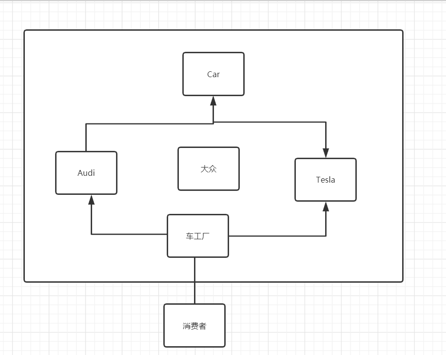
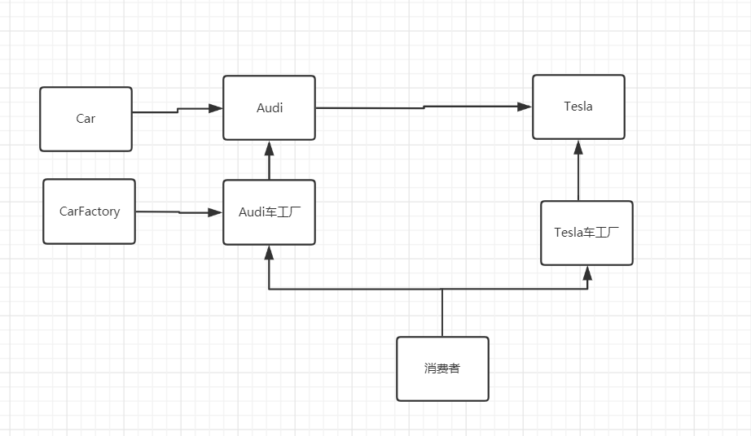

### 工厂模式：

#### 作用：实现了创建者调用者分离

详细分类：简单工厂模式，工厂方法模式，抽象工厂模式

#### OOP七大原则：

- **开闭原则：**一个软件的实体应当对扩展开放，对修改关闭
- **依赖倒转原则：**针对接口编程，不要针对实现编程
- **迪米特法则：**只与你直接朋友通信，而避免和陌生人通信

#### 核心本质：

 实例化对象不使用new，用工厂方法代替

将选择实现类，创建对象统一管理起来和控制，从而将调用者跟我们实现类解耦。


三种模式：

简单工厂模式：（静态工厂）

用来生产同一个等级结构中的任意的产品（对于增加新的产品，需要球盖已经有的代码）



工厂方法模式：

用于生产同一个等级结构中固有的产品（支持增加任意产品）



抽象工厂模式：

围绕一个超级工厂创建其他工厂。该超级工厂又称为其他工厂的工厂

案例：

#### 简单工厂：

接口：

Car：

```java
public interface Car {
    //方法
    void name();
}
```

具体的品牌Car：

奥迪

```java
public class Audi implements Car{
    @Override
    public void name() {
        System.out.println("奥迪！");
    }
}

```

特斯拉：

```java
public class Tesla implements Car{
    @Override
    public void name() {
        System.out.println("特斯拉！");
    }
}

```

车工厂CarFactory

```java
//静态工厂模式
//增加一个新的产品，如果你不修改代码，做不到！

//开闭原则
public class CarFactory {

    public static Car getCar(String car){
        if(car.equals("奥迪！")){
            return new Audi();
        }else if (car.equals("特斯拉！")){
           return new Tesla();
        }else {
            return null;
        }
    }

    //方式二：
    public static  Car getAudi(){

        return new Audi();
    }

    public static Car getTesla(){
        return new Tesla();
    }
}
```

消费者：

```java
public class Consumer {

    public static void main(String[] args) {

        Car audi = new Audi();
        Car tesla = new Tesla();
        audi.name();
        tesla.name();

    }
}
```

```
结果：
奥迪！
特斯拉！
```

#### 工厂方法模式：

Car：

```java
public interface Car {
    //方法
    void name();
}
```

CarFactory：

```java
public interface CarFactory {   
Car getcar();
}
```

Audi：

```java
public class Audi implements Car {
    @Override
    public void name() {
        System.out.println("奥迪！");
    }
}
```

AudiFactory：

```java
public class AudiFactory implements CarFactory {

    @Override
    public Car getcar() {
        return new Audi();
    }
}
```

Tesla：

```java
public class Tesla implements Car {
    @Override
    public void name() {
        System.out.println("特斯拉！");
    }
}
```

TelaFactory

```java
public class TeslaFactory implements CarFactory {

    @Override
    public Car getcar() {
        return new Tesla();
    }
}
```

Consumer：

```java
public class Consumer {

    public static void main(String[] args) {
        Car tesla = new TeslaFactory().getcar();
        Car audi = new AudiFactory().getcar();
        Car getcar = new ModikeFactory().getcar();

        tesla.name();
        audi.name();
        getcar.name();


    }

    /*
    * 简单工厂模式跟工厂方法模式对比
    * 结构那个更不复杂：简单工厂
    * 代码那个更不复杂：简单工厂
    * 编程更不复杂度：简单工厂
    * 管理上的更不复杂度：简单工厂
    *
    * 根据设计的原则：工厂方法模式！
    * 根据业务的原则：简单工厂模式！
    *
    * */
}

```

