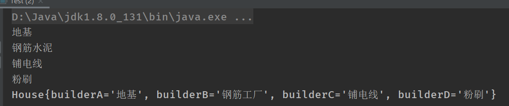
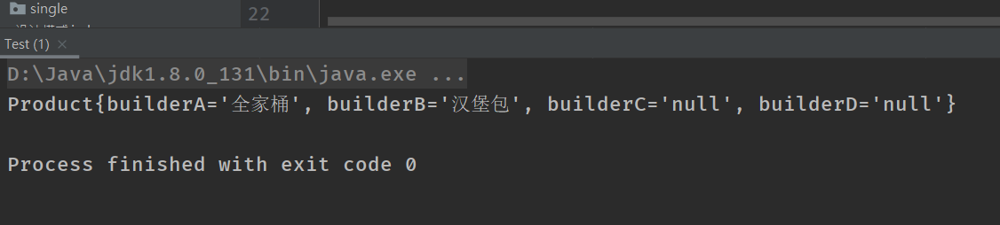

### 建造者模式：

建造者模式也是一种创建模式，它提供了一种创建对象的最佳的方式。


**定义**将一个复杂的对象的构建与他表示分离，使得同样的构建构成可以创建不同的表示

**主要作用**在用户不知道对象的建造过程和细节的情况下就可以直接创建复杂的对象


**如何使用**用户只需要给定指定的复杂的对象类型和内容，建造者模式负责按顺序创建复杂的对象（把内部的构建过程和细节隐藏起来）

例子：

工厂（建造者模式）：负责制造汽车（组装过程和细节在工厂内）

汽车购买者（用户）：只需要说出你需要的型号（对象的类型和内容），然后直接购买就可以使用了（不需要知道汽车是怎么组装的（车轮、车门、发动机方向盘等等）

#### 优点：

1.产品的建造和表示分离，实现了解耦。

2.将复杂的产品的创建步骤分解在不同的方法中，是的创建过程更加的清晰

3.增加新的具体建造者无需修改原有的类库的代码，易于扩展，符合“开闭原则”；

#### 缺点：

1、产品必须有共同点，限制了使用范围。

2、如内部变化复杂，会有很多的建造类，难以维护。

#### 案例一：

建造者：Builder

```Java
//抽象的建造者：方法
public abstract class Builder {

    abstract void builderA();//地基
    abstract void builderB();//钢筋工厂
    abstract void builderC();//铺电线
    abstract void builderD();//粉刷

    //完工：房子
    abstract House getHouse();
}
```

房子:House

```java
//房子
public class House {

       private String builderA;
       private String builderB;
       private String builderC;
       private String builderD;

    public String getBuilderA() {
        return builderA;
    }

    public void setBuilderA(String builderA) {
        this.builderA = builderA;
    }

    public String getBuilderB() {
        return builderB;
    }

    public void setBuilderB(String builderB) {
        this.builderB = builderB;
    }

    public String getBuilderC() {
        return builderC;
    }

    public void setBuilderC(String builderC) {
        this.builderC = builderC;
    }

    public String getBuilderD() {
        return builderD;
    }

    public void setBuilderD(String builderD) {
        this.builderD = builderD;
    }

    @Override
    public String toString() {
        return "House{" +
                "builderA='" + builderA + '\'' +
                ", builderB='" + builderB + '\'' +
                ", builderC='" + builderC + '\'' +
                ", builderD='" + builderD + '\'' +
                '}';
    }
}

```

具体建造则工人：Worker

```Java
//工人
public class Worker extends  Builder{

    House house;
    public Worker(){
      house=new House();
    }

    @Override
    void builderA() {
       house.setBuilderA("地基");
        System.out.println("地基");
    }

    @Override
    void builderB() {
   house.setBuilderB("钢筋工厂");
        System.out.println("钢筋水泥");
    }

    @Override
    void builderC() {
        house.setBuilderC("铺电线");
        System.out.println("铺电线");
    }

    @Override
    void builderD() {
       house.setBuilderD("粉刷");
        System.out.println("粉刷");
    }

    @Override
    House getHouse() {
        return house;
    }
}
```

指挥者：Director

```Java
//指挥：核心。负责指挥构建一个工程，工程如何构建，由它决定的
public class Director {

    //指挥工人造房子
    public House builder(Worker worker){
        worker.builderA();
        worker.builderB();
        worker.builderC();
        worker.builderD();

        return worker.getHouse();
    }
}
```

测试类：Test

```
public class Test {
    public static void main(String[] args) {

        Director director=new Director();
        House builder = director.builder(new Worker());

        System.out.println(builder.toString());

    }
}
```

结果：



#### 案例二： 通过静态内部类方式实现零件无序装配话构造： 

 这种方式使用更加灵活，更符合定义。内部有复杂对象的默认实现，使用时可以根据用户需求自由定义更改内容，并且无需改变具体的构造方式。就可以生产出不同复杂产品 

### （1）主要有三个角色：抽象建造者、具体建造者、产品

比第一种方式少了指挥者，主要是因为第二种方式把指挥者交给用户来操作，使得产品的创建更加简单灵活。

### （2）举个例子

比如麦当劳的套餐，服务员（具体建造者）可以随意搭配任意几种产品（零件）组成一款套餐（产品），然后出售给客户。

### （3）具体步骤

> 1、创建建造者定义麦当劳的产品
>
> 2、创建服务员实现具体产品
>
> 3、服务员随意搭配套餐出售给客户

建造者Builder

```Java
//建造者
public abstract class Builder {


    abstract Builder builderA(String msg);//可乐
    abstract Builder builderB(String msg);//汉堡堡
    abstract Builder builderC(String msg);//薯条
    abstract Builder builderD(String msg);//甜品

    abstract Product getProduct();
}
```

产品套餐：Product

```java 
//产品：套餐
public class Product {

    private String builderA;//可乐
    private String builderB;//汉堡
    private String builderC;//薯条
    private String builderD;//甜品


    public String getBuilderA() {
        return builderA;
    }

    public void setBuilderA(String builderA) {
        this.builderA = builderA;
    }

    public String getBuilderB() {
        return builderB;
    }

    public void setBuilderB(String builderB) {
        this.builderB = builderB;
    }

    public String getBuilderC() {
        return builderC;
    }

    public void setBuilderC(String builderC) {
        this.builderC = builderC;
    }

    public String getBuilderD() {
        return builderD;
    }

    public void setBuilderD(String builderD) {
        this.builderD = builderD;
    }

    @Override
    public String toString() {
        return "Product{" +
                "builderA='" + builderA + '\'' +
                ", builderB='" + builderB + '\'' +
                ", builderC='" + builderC + '\'' +
                ", builderD='" + builderD + '\'' +
                '}';
    }
}
```

具体的建造者：

```Java
//服务员
public class Worker extends Builder{

    //产品套餐
    Product product;

    public Worker(){
        product=new Product();
    }
    @Override
    Builder    builderA(String msg) {
        product.setBuilderA(msg);
        return this;
    }

    @Override
    Builder builderB(String msg) {
        product.setBuilderB(msg);
        return this;
    }

    @Override
    Builder builderC(String msg) {
        product.setBuilderC(msg);
        return this;
    }

    @Override
    Builder builderD(String msg) {
        product.setBuilderD(msg);
        return this;
    }

    @Override
    Product getProduct() {
        return product;
    }
}
```

测试类：Test

```Java
public class Test {

    public static void main(String[] args) {

        //服务员
        Worker worker=new Worker();
        Product product = worker.builderA("全家桶").builderB("汉堡包").getProduct();

        System.out.println(product.toString());
    }
}
```

