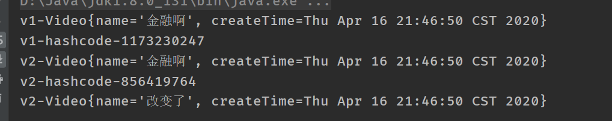

### 原型模式：

**原型模式属于对象的创建模式。通过给出一个原型对象来指明所有创建的对象的类型，然后用复制这个原型对象的办法创建出更多同类型的对象。这就是选型模式的用意。**

#### 原型模式的结构：

　原型模式要求对象实现一个可以“克隆”自身的接口，这样就可以通过复制一个实例对象本身来创建一个新的实例。这样一来，通过原型实例创建新的对象，就不再需要关心这个实例本身的类型，只要实现了克隆自身的方法，就可以通过这个方法来获取新的对象，而无须再去通过new来创建。

原型模式有两种表现形式：（1）简单形式、（2）登记形式，这两种表现形式仅仅是原型模式的不同实现。

#### 案例：

视频Video：

```Java
/**
 *1.实现一个接口Cloneable
 * 2.重写一个方法 clone()
 *视频
 */
public class Video implements Cloneable{
    private String name;
    private Date createTime;

    @Override
    protected Object clone() throws CloneNotSupportedException {
        return super.clone();
    }

    public Video() {
    }

    public Video(String name, Date createTime) {
        this.name = name;
        this.createTime = createTime;
    }

    public String getName() {
        return name;
    }

    public void setName(String name) {
        this.name = name;
    }

    public Date getCreateTime() {
        return createTime;
    }

    public void setCreateTime(Date createTime) {
        this.createTime = createTime;
    }

    @Override
    public String toString() {
        return "Video{" +
                "name='" + name + '\'' +
                ", createTime=" + createTime +
                '}';
    }
}
```

客户端：Client

```Java
//客户端 实现克隆
public class Client {
    public static void main(String[] args) throws CloneNotSupportedException {
        //原型对象 v1
        Date date = new Date();
        Video  v1= new Video("金融啊",date);
        System.out.println("v1-"+v1);
        System.out.println("v1-hashcode-"+v1.hashCode());

        //通过v1克隆出v2
        Video v2 = (Video) v1.clone();//克隆出来的对象和原来是一模一样的
        System.out.println("v2-"+v2);
        System.out.println("v2-hashcode-"+v2.hashCode());
        v2.setName("改变了");
        System.out.println("v2-"+v2);//发现v2的值已经发送了改变
       
    }
}
```




####  **浅拷贝**（Shallow Copy）：

①对于数据类型是基本数据类型的成员变量，浅拷贝会直接进行值传递，也就是将该属性值复制一份给新的对象。因为是两份不同的数据，所以对其中一个对象的该成员变量值进行修改，不会影响另一个对象拷贝得到的数据。②对于数据类型是引用数据类型的成员变量，比如说成员变量是某个数组、某个类的对象等，那么浅拷贝会进行引用传递，**也就是只是将该成员变量的引用值（内存地址）复制一份给新的对象。因为实际上两个对象的该成员变量都指向同一个实例。在这种情况下，在一个对象中修改该成员变量会影响到另一个对象的该成员变量值。** 

改变V2的date  v1也改变了因为他们引用变量

```Java
date.setTime(111115454);
```


为了解决这种情况最简单的方式我们需要把每个属性进行克隆Clone

#### **深克隆：**

 相对于浅拷贝而言，对于引用类型的修改，并不会影响到对应的克隆clone对象的值。每一层的每个对象都进行浅拷贝=深拷贝。 

```Java
/**
 *1.实现一个接口Cloneable
 * 2.重写一个方法 clone()
 *视频
 */
public class Video implements Cloneable{
    private String name;
    private Date createTime;

    @Override
    protected Object clone() throws CloneNotSupportedException {

        //实现深克隆
        Object obj=super.clone();

        Video video=(Video)obj;
        video.createTime= (Date) this.createTime.clone();//将这个对象的属性也进行克隆


        return obj;
    }

    public Video() {
    }

    public Video(String name, Date createTime) {
        this.name = name;
        this.createTime = createTime;
    }

    public String getName() {
        return name;
    }

    public void setName(String name) {
        this.name = name;
    }

    public Date getCreateTime() {
        return createTime;
    }

    public void setCreateTime(Date createTime) {
        this.createTime = createTime;
    }
    @Override
    public String toString() {
        return "Video{" +
                "name='" + name + '\'' +
                ", createTime=" + createTime +
                '}';
    }
}
```


可以发现v1v2时间就不一样了