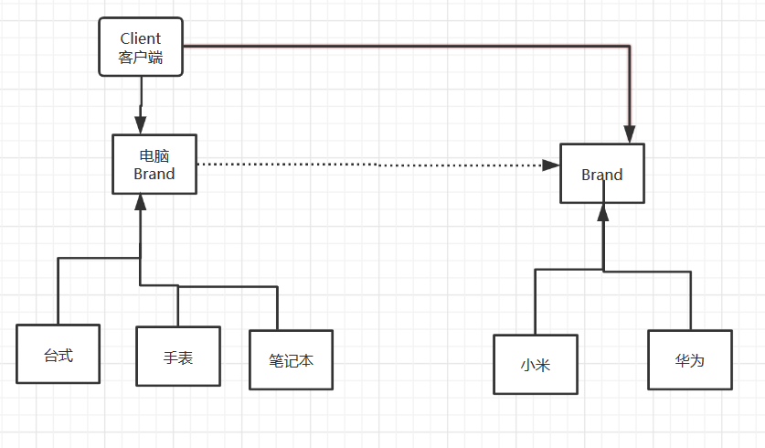

###  桥接模式

桥接（Bridge）是用于把抽象化与实现化解耦，使得二者可以独立变化。这种类型的设计模式属于结构型模式，它通过提供抽象化和实现化之间的桥接结构，来实现二者的解耦。

这种模式涉及到一个作为桥接的接口，使得实体类的功能独立于接口实现类。这两种类型的类可被结构化改变而互不影响。

**桥接模式**类似于多重继承方案，但是多重继承方案往往违背了类得单一职责原则，其复用性比较差，**桥接模式 是比多重继承更好的替代方案。** 

#### 优点：

1、抽象和实现的分离。 2、优秀的扩展能力。 3、实现细节对客户透明。

#### 缺点：

桥接模式的引入会增加系统的理解与设计难度，由于聚合关联关系建立在抽象层，要求开发者针对抽象进行设计与编程，更加的抽象化。


案例:客户需要电脑、手机，提供什么品牌的手机电脑：



品牌接口：Brand

```Java
//品牌
public interface Brand {

    void info();
}
```

华为品牌Huewei：

```Java
//华为品牌
public class Huewei implements Brand{
    @Override
    public void info() {
        System.out.print("华为");
    }
}
```

小米品牌Huewei：

```
//华为品牌
public class Huewei implements Brand{
    @Override
    public void info() {
        System.out.print("华为");
    }
}
```

电脑Computer：

```Java
//电脑
public class Computer {

    //组合
    protected  Brand brand;

    public Computer(Brand brand) {
        this.brand = brand;
    }

    public void info(){
        brand.info();
    }
}

//台式电脑
class Desktop extends Computer{

    public Desktop(Brand brand) {
        super(brand);
    }

    @Override
    public void info() {
        super.info();
        System.out.println("台式电脑");
    }
}

class Laptop extends Computer{
    public Laptop(Brand brand) {
        super(brand);
    }

    @Override
    public void info() {
        super.info();
        System.out.print("笔记本电脑");
    }
}
```

测试类：Test

```Java
public class Test {

    public static void main(String[] args) {

        //小米笔记本
        Laptop miLaptop =new Laptop(new MI());
        miLaptop.info();
        //华为台式
        Desktop midesktop=new Desktop(new MI());
        midesktop.info();

        Laptop huaLaptop =new Laptop(new HuaWei());
        huaLaptop.info();
        //华为台式
        Desktop huaDesktop=new Desktop(new HuaWei());
           huaDesktop.info();
    }
}
```


